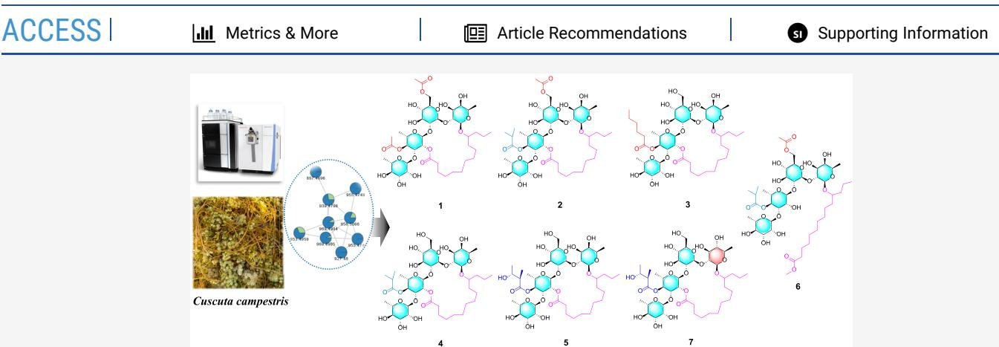
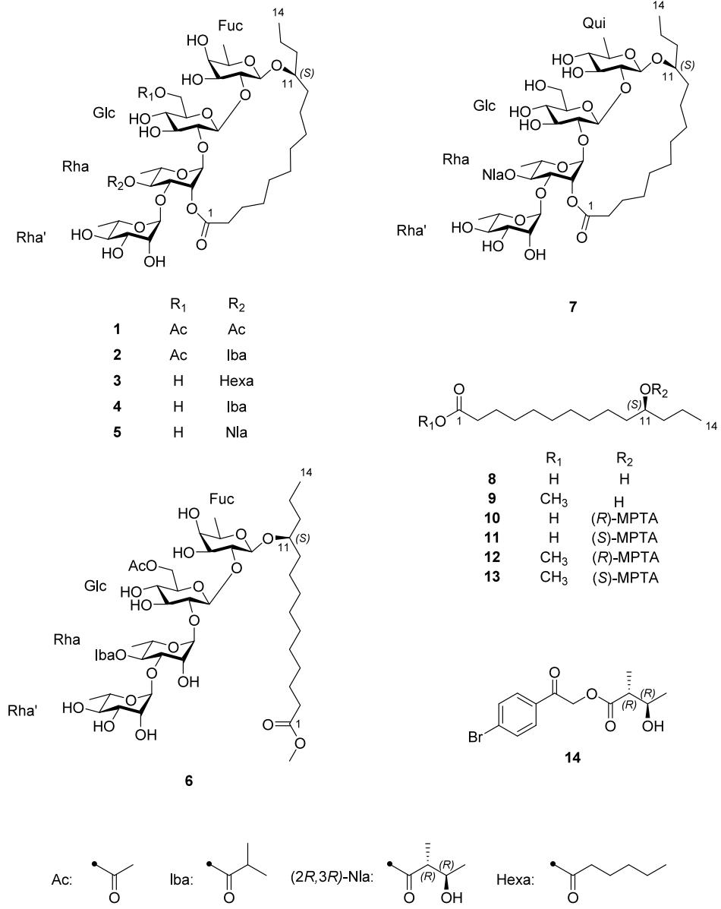
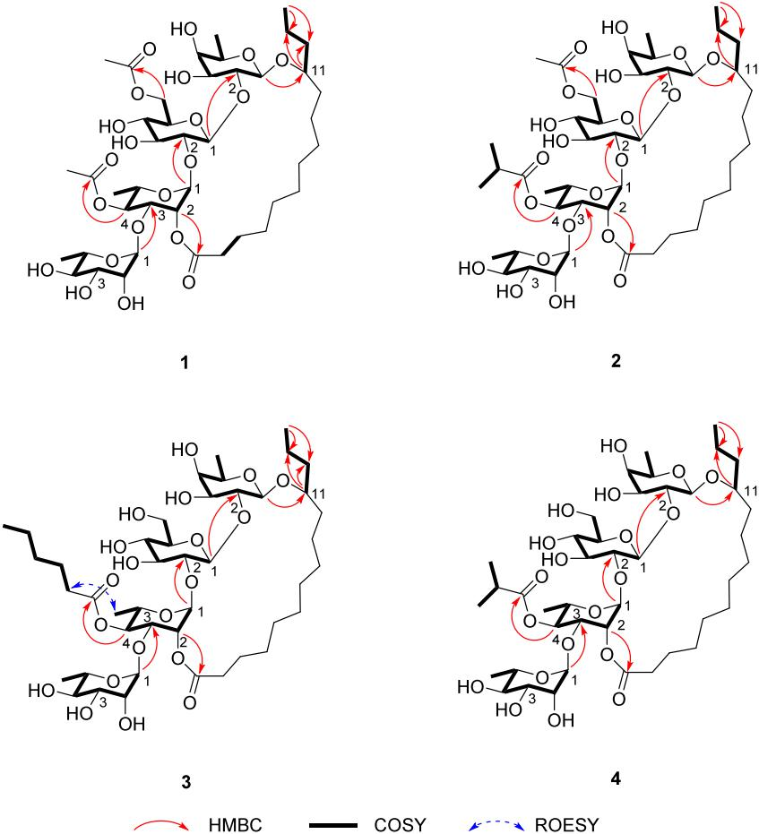
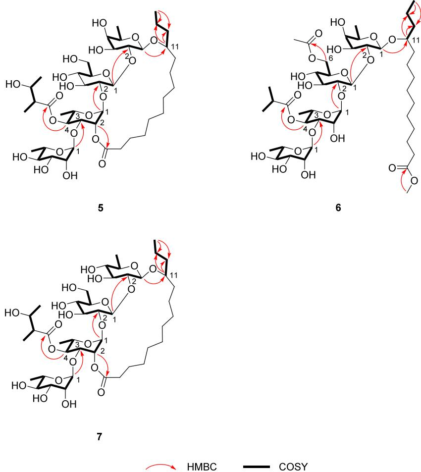

# Tetrasaccharide Resin Glycosides with Nitric Oxide Production Inhibitory Activity from Cuscuta campestris

Jae Sang Han, Jun Gu Kim, Yong Beom Cho, Joon Su Jang, Vu Quan Dang, Dongho Lee, Mi Kyeong Lee, Jin Woo Lee, and Bang Yeon Hwang\*

# Cite This: J. Nat. Prod.2025,88, 2117-2126

# Read Online

  
ABSTRACT: LC-HRMS/MS-based molecular-network-guided chemical investigation ofCuscuta campestris led tothe isolation of seven undescribed tetrasaccharide-type resin glycosides $\left( 1 - 7 \right)$ . Their structures were elucidated using 1D and 2D NMR and HRESIMS analysis.Isolatedresin glycosides werecomprisedof -glucose，D-fucose,D-quinovoseandL-rhamnose,and these monosaccharides were partially acylated with acetyl, isobutyryl, $n$ -hexanoyl, and niloyl organic acids. The absolute configuration of aglycones were determinedasS-configurationusing Mosher'smethodafteracid hydrolysis ofresinglycosidefractio.Allcompouds were evaluated fortheir inibitoryactivityagainst theproductionof nitric oxide inRAW264.7cels.Compounds 2and3exhibited inhibitory activity, with $\mathrm { I C } _ { 5 0 }$ values of 14.3 and $1 0 . 4 ~ \mu \mathrm { M }$ ， respectively.

Cuscuta campestris Yunck.(Convolvulaceae） is a holoparasitic annual plant native to North America and widely distributed across the globe. This species is characterized by a degenerated root system and leaves reduced to minute,alternate scales,and it exhibits low host specificity,enabling it to parasitize a diverse range of plant species. Despite the biological significance of genus Cuscuta,² comprehensive phytochemical and bioactivity investigations of C.campestris remain scarce.Ethnopharmacological studies,along with a limited number of bioactivity assessments， have highlighted itsanti-inflammatory3,4 and hepatoprotective properties.However, phytochemical analyses conducted to date have only led to the isolation and identification of flavonoids，lignans，caffeic acid derivatives, and triterpenoids.5-7

The family Convolvulaceae is well-known for its production of structurally diverse resin glycosides,89 whichareamong the most characteristic metabolites of this family.These compounds are composed of mono- to heptasaccharides acylated with various $\mathrm { C } _ { 1 0 }$ to $\mathrm { C } _ { 1 8 }$ fatty acids,and their dimeric forms have also been identified.Resin glycosides have been reported to exhibit a broad spectrum of bioactivities，including the reversal of multidrug resistance in bacterial pathogens and human cancer cells,10,11 as well as anti-inflammatory， cytotoxic,12 antidiabetic,13antial4droprotecie. 16

To investigate the identification of bioactive resin glycosides in C.campestris, LC-MS-based molecular networking $( \mathrm { M N } ) ^ { 1 7 }$ and bioactivity evaluation were employed. In the network,a cluster of resin glycoside nodes was identified through spectral library matching and the Node Annotation Propagation (NAP) tool.18 Based on the MN results， nonchromophoric resin glycosides were confirmed to be distributed in the ethyl acetate (EtOAc)-soluble fraction, which exhibited the highest inhibitory activity against nitric oxide(NO） production in LPS-induced RAW 264.7 cells among the solvent fractions.Utilizing the node information from the MN, these compounds were successfully trackedand isolated.

Asa result of isolation guided by MN and bioactivity evaluation，a total of seven previously undescribed resin glycosides，named campestridins A-G，were isolated from C.campestris.Their structures were elucidated using 1D and 2D NMR spectroscopy and HRESIMS,and the absolute configurations of monosaccharides,aglycones,and nilic acid were determined following acidic or alkaline hydrolysis of the resin glycoside fraction.Furthermore，the inhibitory effects of all isolated compounds on the NO production in RAW 264.7 macrophages were evaluated.

# RESULTS AND DISCUSSION

In the LC-MS molecular networking analysis of $n$ -hexane, $\mathrm { C H } _ { 2 } \mathrm { C l } _ { 2 }$ and EtOAc-soluble fractions, the GNPS spectral library search and NAP tool results predicted that the nodes in cluster 1 with $m / z$ values ranging from 800 to 1oo0 corresponded to resin glycosides. However, none of the nodes matched any existing library.To further support this prediction，positive-ion HRESIMS tandem mass analysis was conducted on node 1 (Figure S2),for which the molecular formula was determined as $\mathrm { C } _ { 4 4 } \mathrm { H } _ { 7 4 } \mathrm { O } _ { 2 1 }$ based on the $m / z$ value of 939.480. The following fragment ions were identified: $m / z$ 793.422 $\mathrm { \small { } [ C _ { 3 8 } H _ { 6 5 } O _ { 1 7 } { } ^ { + } }$ $\left( 9 \bar { 3 } 9 . 4 8 0 { - } \mathrm { C } _ { 6 } \mathrm { H } _ { 1 0 } \mathrm { O } _ { 4 } \right) ^ { + } ]$ ，647.364 ${ \bigl [ } \mathbf { C } _ { 3 2 } \mathbf { H } _ { 5 5 } \mathbf { O } _ { 1 3 } { } ^ { + }$ ， $( 7 9 3 . 4 2 2 -$ $\mathrm { C } _ { 6 } \mathrm { H } _ { 1 0 } \mathrm { O } _ { 4 } ) ^ { + } ]$ ，589.358 ${ [ \mathrm { C } _ { 3 0 } \mathrm { H } _ { 5 3 } \mathrm { O } _ { 1 1 } } ^ { + }$ ， $\left( 7 9 3 . 4 2 2 - \mathrm { C _ { 8 } H _ { 1 2 } O _ { 6 } } \right) ^ { + } ] .$ 443.300 $\left[ \mathrm { C } _ { 2 4 } \mathrm { H } _ { 4 3 } \mathrm { O } _ { 7 } ^ { + } \right.$ ， $\left( 5 8 9 . 3 5 8 - \mathrm { C } _ { 6 } \mathrm { H } _ { 1 0 } \mathrm { O } _ { 4 } \right) ^ { + } ] _ { ! }$ and 337.236 $\mathrm { [ C _ { 2 0 } H _ { 3 3 } O _ { 4 } ^ { + } }$ ， $\left( 4 2 5 . 2 8 9 - \mathrm { C } _ { 4 } \mathrm { H } _ { 8 } \mathrm { O } _ { 2 } \right) ^ { + } ]$ . These fragment ions are consistent with the structural characteristics of resin glycosides, which are composed of hexo- and deoxyhexose units.These resin glycosides，mainly distributed in the EtOAc-soluble fraction,were targeted and isolated based on the chromatographic information in MN, leading to the efficient isolation of seven previously undescribed tetrasaccharide resin glycosides (1-7).

Compound 1 was obtained as a white amorphous powder, and its HRESIMS data $\left( m / z \ 9 1 1 . 4 4 8 3 \left[ \mathrm { M } + \mathrm { H } \right] ^ { \mp } \right.$ , calcd. 911.4482) established its molecular formula as $\mathrm { C } _ { 4 2 } \mathrm { H } _ { 7 0 } \mathrm { O } _ { 2 1 }$ .Analysis of the 1D NMR and HSQC data revealed four anomeric protons $[ \delta _ { \mathrm { H } }$ 4.71 (Fuc H-1, $\mathrm { d } , J = 7 . 8 \mathrm { H z }$ ),5.76 (Glc H-1, $\mathrm { d } , J = 7 . 8 \mathrm { H z }$ ,5.68 (Rha H-1,br s),5.40 $( \operatorname { R h a } ^ { \prime } \operatorname { H - 1 } , \operatorname { b r } s ) ]$ , two acetyl groups $[ \delta _ { \mathrm { H } }$ 1.82 (Ac H-2, s), 1.92 $\left( \operatorname { A c } ^ { \prime } \operatorname { H } \mathrm { - } 2 , s \right) ]$ , as well as one methyl group $\left[ \delta _ { \mathrm { H } } 0 . 8 8 \ : \left( \mathrm { A g l y \ : H \mathrm { - } 1 4 } , \ : \mathrm { t } , \ : J = 6 . 7 \ : \mathrm { H z } \right) \right.$ ]and oxygenated methine protons $: [ \delta _ { \mathrm { H } } 3 . 8 6 ( \mathrm { A g l y ~ H { - } 1 1 , ~ m } ) ]$ of a tetradecanoyl moiety (Tables 1and 2).The HRESIMS and NMR data indicated that compound 1 is a resin glycoside composed of four hexose units, two acetyl groups,and a tetradecanoyl group.In the COSY data, the proton spin systems of each monosaccharide were traced based on their respective anomeric protons. The aglycone was identified as 11-hydroxytetradecanoic acid based on the HMBC correlation from Fuc H-1 $\left( \delta _ { \mathrm { H } } \ 4 . 7 1 \right)$ to Agly C-11 $( \delta _ { \mathrm { C } } 7 8 . 6 )$ ， along with the COSY correlations of $\mathrm { H } _ { 3 } – 1 4 / \mathrm { H } _ { 2 } – 1 3 / \mathrm { H } _ { 2 } – 1 2 / \mathrm { H } _ { 1 } –$ 11 and HMBC correlations shown in Figure 1. The sugar connectivity was determined through HMBC correlations (Figures 1 and S8) from Glc H-1 $( \bar { \delta _ { \mathrm { H } } } ~ 5 . 7 6 )$ to Fuc C-2 ( $\mathrm { \Omega } _ { \cdot } \delta _ { \mathrm { C } }$ 75.0), from Rha H-1 $( \delta _ { \mathrm { H } } 5 . 6 8 )$ to Glc C-2 $( \delta _ { \mathrm { C } } 8 5 . 1 )$ ,and from Rha'H-1 $( \delta _ { \mathrm { H } } \ 5 . 4 0 )$ to Rha C-3( $\langle \delta _ { \mathrm { C } } ~ 7 6 . 5 )$ .The HMBC correlations of Glc H-6 $\left( \delta _ { \mathrm { H } } 4 . 5 2 \right)$ with Ac C-1 $\left( \delta _ { \mathrm { C } } 1 7 0 . 8 \right)$ and Rha H-4 $( \delta _ { \mathrm { H } } ~ 5 . 7 0 )$ with $\mathrm { { A c ^ { \prime } \ C ^ { - 1 } } }$ $\left( \delta _ { \mathrm { C } } \ 1 7 0 . 4 \right)$ established the positions of the acetyl groups. Additionally, the linkage of the aglycone was confirmed by HMBC correlations from Rha H-2 $( \bar { \delta } _ { \mathrm { H } } 6 . 1 6 )$ to Agly C-1 $\left( \delta _ { \mathrm { C } } 1 7 3 . 2 \right)$ and from Fuc H-1 $\left( \delta _ { \mathrm { H } } 4 . 7 1 \right)$ to Agly C-11 $( \bar { \delta } _ { \mathrm { C } } ~ 7 8 . 6 )$ ，demonstrating the formation of a macrolactone ring with the tetradecanoyl residue (Figure 1). The anomeric configurations of monosaccharides were determined from the magnitude of the $^ { 3 } J _ { 1 , 2 }$ coupling constants observed in the $^ 1 \mathrm { H }$ NMR spectrum (Table 1). The doublet signals at $\delta _ { \mathrm { H } } 4 . 7 1$ $\left( \mathrm { F u c H - 1 } , J = 7 . 8 \mathrm { H z } \right)$ and $\delta _ { \mathrm { H } } 5 . 7 6 \left( \mathrm { G l c } \mathrm { H } \mathrm { - } 1 , J = \right.$ $7 . 8 ~ \mathrm { H z }$ ）indicated $\beta \mathrm { . }$ -configurations for the fucose and glucose units,respectively.While the broad singlet signals at $\delta _ { \mathrm { H } } ~ 5 . 6 8$ (Rha H-1) and $\delta _ { \mathrm { H } } \ : 5 . 4 0 $ $\mathrm { ^ { \prime } R h a ^ { \prime } H - 1 } \mathrm { ^ { \prime } }$ ）suggested $\alpha$ -configurations for the rhamnose units,which was further supported by the characteristic chemical shift observed at the C-5 positions (Table 2).19-21 The absolute configuration of monosacharide including D-Glc, D-Fuc,and $_ \mathrm { L }$ -Rha were established after acidic hydrolysis,chemical derivatization,and UPLC-HRMS analysis (Figure S103).

Table 1. ${ \mathbf { \omega } } ^ { 1 } \mathbf { H }$ NMR Spectroscopic Data for Compounds 1-4 in Pyridine- $\mathbf { \nabla } \cdot d _ { 5 }$   

<table><tr><td rowspan="2"></td><td colspan="4"></td></tr><tr><td>1a</td><td>2b</td><td>3a</td><td>4a</td></tr><tr><td>Position</td><td>δH (J in Hz)</td><td>δH (J in Hz)</td><td>δH (J in Hz)</td><td>δH (J in Hz)</td></tr><tr><td>Fuc-1</td><td>4.71,d (7.8)</td><td>4.71,d (7.8)</td><td>4.71, d (7.8)</td><td>4.74, d (7.8)</td></tr><tr><td>2</td><td>4.71,m</td><td>4.71,m</td><td>4.78,dd (7.8,</td><td>4.78,dd (7.8,</td></tr><tr><td>3</td><td>4.21, m</td><td>4.21,m</td><td>9.2) 4.22, m</td><td>8.8) 4.22, dd (1.9,</td></tr><tr><td></td><td></td><td></td><td></td><td>8.8)</td></tr><tr><td>4 5</td><td>3.94, br s</td><td>3.99, br s</td><td>3.97, br s</td><td>4.00, br s</td></tr><tr><td>6</td><td>3.78,q (6.4) 1.53, d (6.4)</td><td>3.81,q (6.3) 1.54, d (6.3)</td><td>3.82, q (6.3)</td><td>3.82, q (6.3)</td></tr><tr><td>Glc-1</td><td>5.76,d (7.8)</td><td>5.76, d (7.8)</td><td>1.57, d (6.3) 5.82,d (7.8)</td><td>1.56, d (6.3) 5.81, d (7.7)</td></tr><tr><td>2</td><td>3.90,dd (7.8,</td><td>3.91,dd (7.8,</td><td>3.94,dd (7.8,</td><td>3.93,dd (7.7,</td></tr><tr><td></td><td>8.8)</td><td>8.9)</td><td>8.9)</td><td>8.6)</td></tr><tr><td>3</td><td>4.08,br t (8.8)</td><td>4.09,br t (8.9)</td><td>4.11, br t (8.9)</td><td>4.11,dd (8.6, 8.9）</td></tr><tr><td>4</td><td>3.95,m</td><td>3.95,m</td><td>4.09,m</td><td>4.09,m</td></tr><tr><td>5</td><td>3.62,m</td><td>3.61,m</td><td>3.55,m</td><td>3.56,dt (4.1,</td></tr><tr><td>6a</td><td>4.52,m</td><td>4.55,m</td><td></td><td>9.1) 4.09, m</td></tr><tr><td>6b</td><td>4.56,m</td><td>4.55,m</td><td>4.06, m 4.09,m</td><td>4.09,m</td></tr><tr><td>Rha-1</td><td>5.68,br s</td><td>5.70, br s</td><td>5.72,br s</td><td>5.72,br s</td></tr><tr><td>2</td><td>6.16, br s</td><td>6.16,br s</td><td>6.17, br s</td><td>6.16, br s</td></tr><tr><td>3</td><td>4.65,dd (3.3, 9.9)</td><td>4.71,m</td><td>4.71,dd (3.3,</td><td>4.71,dd (3.3,</td></tr><tr><td>4</td><td>5.70, t (9.9)</td><td>5.70, t (9.9)</td><td>9.8) 5.74, t (9.8)</td><td>9.9) 5.70, t (9.9)</td></tr><tr><td>5</td><td>4.89,dq (6.2,</td><td>4.91,dq (6.2,</td><td>4.95, m</td><td>4.93,dq (6.2,</td></tr><tr><td>6</td><td>9.9)</td><td>9.9)</td><td></td><td>9.9)</td></tr><tr><td>Rha&#x27;-1</td><td>1.65, d (6.2)</td><td>1.62,d (6.2)</td><td>1.67, d (6.2)</td><td>1.62,d (6.2)</td></tr><tr><td>2</td><td>5.40,br s</td><td>5.39, br s</td><td>5.43,br s</td><td>5.39, br s</td></tr><tr><td></td><td>4.49, br s</td><td>4.48, br s</td><td>4.51, br s</td><td>4.48, br s</td></tr><tr><td>3 4</td><td>4.52,m</td><td>4.50,m</td><td>4.51, m</td><td>4.49,m</td></tr><tr><td></td><td>4.25, br t (9.1)</td><td>4.25, br t (9.2)</td><td>4.25,br t (9.3)</td><td>4.25,dd (9.0, 9.4)</td></tr><tr><td>5</td><td>4.37,dq (6.3,</td><td>4.37,dq (6.3,</td><td>4.38,dq (9.3,</td><td>4.37,dq (6.3,</td></tr><tr><td>6</td><td>9.1) 1.62, d (6.3)</td><td>9.2) 1.63,d (6.3)</td><td>6.2) 1.62, d (6.2)</td><td>9.4) 1.62,d (6.3)</td></tr><tr><td>Agly-2a</td><td>2.22, ddd (3.6,</td><td>2.22,ddd (3.6,</td><td>2.21,ddd (3.6,</td><td>2.21, ddd (3.6,</td></tr><tr><td>2b</td><td>9.2,14.0)</td><td>8.8,13.6)</td><td>9.3,13.5)</td><td>9.3,13.5)</td></tr><tr><td></td><td>2.31, ddd (3.6, 8.1,14.0)</td><td>2.30,ddd (3.6, 7.6,13.6)</td><td>2.30,m</td><td>2.30,ddd (3.6, 8.3,13.5)</td></tr><tr><td>3a</td><td>1.50, m</td><td>1.50,m</td><td>1.49, m</td><td>1.50,m</td></tr><tr><td>3b</td><td>1.62, m</td><td>1.61, m</td><td>1.62,m</td><td>1.61,m</td></tr><tr><td>4a</td><td>1.26, m</td><td>1.28,m</td><td>1.26,m</td><td>1.26, m</td></tr><tr><td>4b</td><td>1.40, m</td><td>1.40,m</td><td>1.40, m</td><td>1.39,m</td></tr><tr><td>11</td><td>3.86,m</td><td>3.88,m</td><td>3.89,m</td><td>3.89,m</td></tr><tr><td>12a</td><td>1.52,m</td><td>1.52,m</td><td>1.51, m</td><td>1.52,m</td></tr><tr><td>12b</td><td>1.72, m</td><td>1.72, m</td><td>1.71, m</td><td>1.72, m</td></tr><tr><td>13</td><td>1.50,m</td><td>1.51,m</td><td>1.49, m</td><td>1.50,m</td></tr><tr><td>14</td><td>0.88, t (6.7)</td><td>0.89,t (6.9)</td><td>0.86,t (7.0)</td><td>0.86,t (7.0)</td></tr><tr><td>Ac-2</td><td>1.82, s</td><td>1.82, s</td><td></td><td></td></tr><tr><td>Ac&#x27;-2</td><td>1.92, s</td><td></td><td></td><td></td></tr><tr><td>Iba-2</td><td></td><td>2.50, h (7.0)</td><td></td><td>2.51, h (7.0)</td></tr><tr><td>3</td><td></td><td>1.11, d (7.0)</td><td></td><td>1.12, d (7.0)</td></tr><tr><td>4</td><td></td><td>1.11, d (7.0)</td><td></td><td>1.11,d (7.0)</td></tr><tr><td>Hexa-2</td><td></td><td></td><td>2.27,m</td><td></td></tr><tr><td>3</td><td></td><td></td><td>1.60,m</td><td></td></tr><tr><td>4</td><td></td><td></td><td>1.16, m</td><td></td></tr><tr><td>5</td><td></td><td></td><td>1.16,m</td><td></td></tr><tr><td>6</td><td></td><td></td><td>0.77,t (7.0)</td><td></td></tr></table>

^Recorded at $9 0 0 ~ \mathrm { M H z }$

Table 2. $^ { 1 3 } \mathbf { C }$ NMR Spectroscopic Data for Compounds 1-4 in Pyridine- $\mathbf { \nabla } \cdot d _ { 5 }$   

<table><tr><td></td><td>1a</td><td>2b</td><td>3a</td><td>4a</td></tr><tr><td>Position</td><td> δc, type</td><td> δc, type</td><td> δc, type</td><td> δc, type</td></tr><tr><td>Fuc-1</td><td>102.0, CH</td><td>101.9, CH</td><td>102.2, CH</td><td>102.2, CH</td></tr><tr><td>2</td><td>75.0, CH</td><td>75.2,CH</td><td>74.7, CH</td><td>74.9, CH</td></tr><tr><td>3</td><td>76.7, CH</td><td>76.8, CH</td><td>76.7, CH</td><td>76.7,CH</td></tr><tr><td>4</td><td>73.4, CH</td><td>73.5, CH</td><td>73.4, CH</td><td>73.4, CH</td></tr><tr><td>5</td><td>71.2, CH</td><td>71.2, CH</td><td>71.3, CH</td><td>71.3,CH</td></tr><tr><td>6</td><td>17.3, CH</td><td>17.3, CH</td><td>17.3,CH</td><td>17.3, CH</td></tr><tr><td>Glc-1</td><td>100.8, CH</td><td>100.9, CH</td><td>100.6, CH</td><td>100.7, CH</td></tr><tr><td>2</td><td>85.1, CH</td><td>84.9, CH</td><td>85.1, CH</td><td>85.0,CH</td></tr><tr><td>3</td><td>77.6, CH</td><td>77.6, CH</td><td>77.8, CH</td><td>77.8,CH</td></tr><tr><td>4</td><td>71.8, CH</td><td>71.8, CH</td><td>72.3,CH</td><td>72.3, CH</td></tr><tr><td>5</td><td>74.4, CH</td><td>74.5,CH</td><td>77.0, CH</td><td>77.0, CH</td></tr><tr><td>6</td><td>64.3, CH</td><td>64.3, CH</td><td>62.5,CH</td><td>62.5, CH</td></tr><tr><td>Rha-1</td><td>100.4, CH</td><td>100.2, CH</td><td>100.2, CH</td><td>100.2, CH</td></tr><tr><td>2</td><td>72.8, CH</td><td>72.8, CH</td><td>72.8, CH</td><td>72.8, CH</td></tr><tr><td>3</td><td>76.5, CH</td><td>76.4, CH</td><td>76.5, CH</td><td>76.4, CH</td></tr><tr><td>4</td><td>73.9, CH</td><td>73.5, CH</td><td>73.7, CH</td><td>73.6, CH</td></tr><tr><td>5</td><td>66.8,CH</td><td>66.9, CH</td><td>66.9, CH</td><td>66.9, CH</td></tr><tr><td>6</td><td>18.7, CH</td><td>18.8, CH</td><td>18.9, CH</td><td>18.8, CH</td></tr><tr><td>Rha&#x27;-1</td><td>104.0, CH</td><td>104.0, CH</td><td>104.0, CH</td><td>104.0, CH</td></tr><tr><td>2</td><td>72.7, CH</td><td>72.5, CH</td><td>72.6, CH</td><td>72.5, CH</td></tr><tr><td>3</td><td>72.6, CH</td><td>72.6, CH</td><td>72.6, CH</td><td>72.6, CH</td></tr><tr><td>4</td><td>73.8, CH</td><td>73.8, CH</td><td>73.9, CH</td><td>73.8, CH</td></tr><tr><td>5</td><td>70.8, CH</td><td>70.7, CH</td><td>70.7, CH</td><td>70.7,CH</td></tr><tr><td>6</td><td>18.6,CH</td><td>18.6, CH</td><td>18.6, CH</td><td>18.6,CH</td></tr><tr><td>Agly-1</td><td>173.2, C</td><td>173.2, C</td><td>173.2, C</td><td>173.2, C</td></tr><tr><td>2</td><td>35.0, CH²</td><td>34.9, CH</td><td>35.0, CH</td><td>34.9, CH</td></tr><tr><td>3</td><td>26.0, CH²</td><td>26.0, CH</td><td>26.1, CH</td><td>26.0, CH</td></tr><tr><td>4</td><td>28.3, CH²</td><td>28.3,CH</td><td>28.3, CH</td><td>28.3, CH</td></tr><tr><td>11</td><td>78.6, CH</td><td>78.6,CH</td><td>78.9, CH</td><td>78.9, CH</td></tr><tr><td>12</td><td>37.9, CH²</td><td>37.9, CH</td><td>37.9,CH</td><td>37.9, CH</td></tr><tr><td>13</td><td>19.1, CH²</td><td>19.2, CH</td><td>19.2, CH</td><td>19.1, CH</td></tr><tr><td>14</td><td>14.4, CH</td><td>14.4, CH</td><td>14.4, CH</td><td>14.4, CH</td></tr><tr><td>Ac-1</td><td>170.8, C</td><td>170.8, C</td><td></td><td></td></tr><tr><td>2</td><td>20.6, CH</td><td>20.6, CH</td><td></td><td></td></tr><tr><td>Ac&#x27;-1</td><td>170.4, C</td><td></td><td></td><td></td></tr><tr><td>2</td><td>20.7, CH</td><td></td><td></td><td></td></tr><tr><td>Iba-1</td><td></td><td>176.3, C</td><td></td><td>176.4, C</td></tr><tr><td>2</td><td></td><td>34.4, CH</td><td></td><td>34.4, CH</td></tr><tr><td>3</td><td></td><td>19.1, CH</td><td></td><td>19.2, CH</td></tr><tr><td>4</td><td></td><td>19.1, CH</td><td></td><td>19.2, CH</td></tr><tr><td>Hexa-1</td><td></td><td></td><td>173.2, C</td><td></td></tr><tr><td>2</td><td></td><td></td><td>34.5, CH</td><td></td></tr><tr><td>3</td><td></td><td></td><td>25.1, CH</td><td></td></tr><tr><td>4</td><td></td><td></td><td>31.4, CH</td><td></td></tr><tr><td>5</td><td></td><td></td><td>22.5,CH</td><td></td></tr><tr><td>6</td><td></td><td></td><td>14.0,CH</td><td></td></tr><tr><td colspan="2"></td><td></td><td></td><td></td></tr></table>

  
Figure 1. Key HMBC and COSY correlations of compounds $\mathbf { 1 - 4 }$

To determine the absolute configuration at the aglycone's chiral center $^ { \prime } \delta _ { \mathrm { H } } ~ 3 . 8 6 ,$ Agly H-11)，Mosher's method was employed.After acidic hydrolysis of the resin glycoside fraction (Fr.F)，purified 11-hydroxytetradecanoic acid was separately esterified with $S \ – \left( + \right)$ -MTPA-Cl and $R \mathrm { - } \big ( - \big )$ -MTPA-Cl. Subsequent $^ 1 \mathrm { H }$ NMR $\left( 4 0 0 ~ \mathrm { \ M H z } \right)$ ）analysisrevealeda $\Delta \delta$ $( \delta _ { S \mathrm { - e s t e r } } { - \delta _ { R \mathrm { - e s t e r } } } )$ value of $- 0 . 0 7 \mathrm { p p m }$ $\left( - 2 7 . 4 \mathrm { H z } \right)$ for the methyl protons, indicating that the C-1l center has the S-configuration (Figures S94 and S95),consistent with reported data for 11Sconvolvulinolic acid in the literature.22" Consequently， the structure of compound 1 was established as (11S)-convolvulinolic acid 11-O $\alpha$ -L-rhamnopyranosyl- $( 1  3 )$ )-O-(4-O-acetyl)- $\alpha$ -L-rhamnopyranosyl- $( 1  2 )$ )-0-(6-0-acetyl) $\boldsymbol { \cdot } \beta$ -D-glucopyranosyl-( $\cdot 1 {  } 2$ )-0 $\beta$ -D-fucopyranoside,intramolecular $1 , 2 ^ { \prime \prime \prime }$ -ester and named campestridin A.

Compound 2 was isolated as a white amorphous powder, and its HRESIMS data $\left( m / z 9 3 9 . 4 7 9 5 \left[ \mathrm { M } + \mathrm { H } \right] ^ { \overline { { + } } } \right.$ , calcd. 939.4795) established the molecular formula as $\mathrm { C } _ { 4 4 } \mathrm { H } _ { 7 4 } \mathrm { O } _ { 2 1 }$ .The $\mathrm { ^ { 1 } H N M R }$ spectrum revealed an isobutyryl group $[ \delta _ { \mathrm { H } } 2 . 5 0 $ (Iba ${ \mathrm { H } } { - } 2 , { \mathrm { h } } , J =$ $7 . 0 \mathrm { H z } )$ ,1.11 (Iba H-3, d $, J = 7 . 0 \ : \mathrm { H z }$ ,1.11 $\left( \mathrm { I b a ~ H } { - } 4 , \mathrm { d } , J = 7 . 0 \right.$ $\mathrm { H z }$ ] and an acetyl group at $\delta _ { \mathrm { H } } 1 . 8 2 $ (Ac H-2,s) (Table 1).Based on the mass difference $\left( \Delta m / z 2 8 \right)$ compared to compound 1, it was inferred that one of the acetyl groups in Compound 1 was replaced by an isobutyryl group in compound 2.By examination of HMBC correlations from Glc H-6 $\left( \delta _ { \mathrm { { H } } } 4 . 5 5 \right)$ to Ac C-1 ( $\mathrm { \Omega } _ { \cdot } \delta _ { \mathrm { C } }$ 170.8)and from Rha H-4 $( \delta _ { \mathrm { H } } 5 . 7 0 )$ to Iba C-1 $( \delta _ { \mathrm { C } } 1 7 6 . 3 )$ ,the positions of the acetyl and isobutyryl groups were confrmed (Figure 1). The absolute configurations of the monosaccharide units were determined in the same manner as for compound 1. On the basis of these results,compound 2 was identified as (11S)-convolvulinolic acid 11-O $_ \alpha$ -L-rhamnopyranosyl- $( 1  3 )$ ！ O-(4-O-isobutyryl) $_ \alpha$ -L-rhamnopyranosyl- $( 1  2 )$ -0-(6-0-acetyl) $\boldsymbol { \beta }$ -D-glucopyranosyl- $( 1  2 )$ -0 $\boldsymbol { \cdot } \beta$ -D-fucopyranoside，intramolecular $1 , 2 ^ { \prime \prime \prime }$ ester and named campestridin B.

Compound 3 was purified as a white amorphous powder,and its molecular formula was determined to be $\mathrm { C } _ { 4 4 } \mathrm { H } _ { 7 6 } \mathrm { O } _ { 2 0 }$ based on HRESIMS data $\left( m / z 9 2 5 . 5 0 0 4 [ \mathrm { M } + \mathrm { H } ] ^ { + } \right.$ ,calcd. 925.5002). Its 1D NMR spectra closely resembled those of compound 1. However, the key difference is that the $^ 1 \mathrm { H }$ NMR data of compound 3 displayed a methyl signal corresponding to a hexanoyl moiety $\left[ \delta _ { \mathrm { H } } 0 . 7 7 \left( \mathrm { H e x a } \mathrm { H } . 6 , \dot { \mathrm { t } } , J = 7 . 0 \mathrm { H z } \right) \right]$ , in contrast to the two methyl signals attributed to the two acetyl groups in compound 1 (Table 1).HMBC analysis was insufficient to determine the linkage sites of the hexanoyl group and the aglycone on the Rha moiety due to the overlapped signals at $\delta _ { \mathrm { C } }$ 173.2 (Hexa C-1 and Agly C-1) in the $^ { 1 3 } \mathrm { C }$ NMR spectrum. Therefore, the exact position of the hexanoyl group at Rha C-4 was further confirmed by a ROESY correlation between Rha $\mathrm { H } _ { 3 } .$ $6 \left( \delta _ { \mathrm { H } } 1 . 6 7 \right)$ and Hexa $\mathrm { H } _ { 2 ^ { - 2 } }$ $( \delta _ { \mathrm { H } } 2 . 2 7 )$ (Figures 1 and S39). The absolute configurations of the monosaccharides and aglycone were established by using the same protocols applied for compound 1. These combined data supported the structural assignment of compound 3 as (11S)-convolvulinolic acid 11-O$\alpha$ -L-rhamnopyranosyl-( $( 1  3 )$ )-O-(4-O-hexanoyl) $_ \alpha$ -L-rhamnopyranosyl- $( 1  2 )$ -0 $\beta$ -D-glucopyranosyl- $( 1  2 )$ -0 $\boldsymbol { \beta }$ -D-fucopyranoside,intramolecular $1 , 2 ^ { \prime \prime \prime }$ -ester and named as campestridin C.

Compound 4 was isolated as a white,amorphous powder. Molecular formula of compound 4 was determined as $\mathrm { C } _ { 4 2 } \mathrm { H } _ { 7 2 } \mathrm { O } _ { 2 0 }$ from HRESIMS data $\left( m / z \ 8 9 7 . 4 6 8 7 \ [ \mathrm { M } \ + \ \mathrm { H } ] ^ { + } ; \right.$ calcd. 897.4690). The $^ 1 \mathrm { H }$ NMR spectrum of compound 4 closely resembled that of compound 2,except for the absence of the signal assignable to the acetyl group.The presence of the isobutyryl group was supported by the signals at $\delta _ { \mathrm { H } } 2 . 5 1$ (Iba H$2 , \mathrm { h } , J = 7 . 0 \mathrm { H z } ,$ ）， $\delta _ { \mathrm { H } } ~ 1 . 1 2$ (Iba H-3,d, $J = 7 . 0 \ \mathrm { H z }$ ，and $\delta _ { \mathrm { H } } ~ 1 . 1 1$ $\left( \mathrm { I b a } \mathrm { H } \mathrm { - } 4 , \mathrm { d } , J = 7 . 0 \mathrm { H z } \right)$ (Table 1).The location of the isobutyryl substituent was established through an HMBC correlation from Rha H-4 $( \delta _ { \mathrm { H } } 5 . 7 0 )$ to Iba C-1 $( \delta _ { \mathrm { C } } 1 7 6 . 4 )$ (Figure 1). After acid hydrolysis and derivatization as performed for compound 1, the absolute configurations of the sugars and aglycon's C-11 position were determined.Based on these results,the structure of compound 4 was elucidated as (11S)-convolvulinolic acid 11- 0 $_ { \alpha }$ -L-rhamnopyranosyl- $( 1  3 )$ -O-(4-O-isobutyryl) $_ \alpha$ -L-rhamnopyranosyl-( $( 1 \to 2 )$ )-0 $\beta$ -D-glucopyranosyl- $( 1 \to 2 )$ )-0- $\beta$ -D-fucopyranoside, intramolecular $1 , 2 ^ { \prime \prime \prime }$ -ester and named campestridin D.

Compound 5 was obtained as a white,amorphous powder. HRESIMS data $( m / z ~ 9 2 7 . 4 7 9 4 ~ [ \mathrm { M } ~ + ~ \mathrm { H } ] ^ { + }$ ； calcd. 927.4795) established its molecular formula as $\mathrm { C } _ { 4 3 } \mathrm { H } _ { 7 4 } \mathrm { O } _ { 2 1 }$ . The $^ 1 \mathrm { H }$ NMR spectrum was highly similar to that of compound 4. The key difference between compounds 4 and 5 was the replacement of the isobutyryl group in compound 4 with a niloyl group in compound 5,as suggested by the presence of two methyl signals $\left[ \delta _ { \mathrm { H } } 1 . 2 0 \left( \mathrm { N l a H - 5 , d } , J = 7 . 2 \mathrm { H z } \right) \right.$ ,1.28 $\left( \mathrm { N l a } \mathrm { H } \mathrm { - } 4 , \mathrm { d } , J = 6 . 2 \mathrm { \bar { H } z } \right)$ 一 and an oxygenated methine proton $\left[ \delta _ { \mathrm { H } } \ 4 . 2 3 \ \left( \mathrm { N l a \ H } . 3 , \ \mathrm { m } \right) \right]$ (Table 3). This assumption was further supported by the COSY correlations of Nla $\mathrm { H } { - } 3 / \mathrm { H } { - } 4 / \mathrm { H } { - } 5$ as well as by the mass difference $\left( \Delta m / z 3 0 \right)$ relative to that of the isobutyryl group in compound 4 (Figure 2). The position of the niloyl group was established byan HMBC correlation from Rha H-4 $( \delta _ { \mathrm { H } } 5 . 8 2 )$ to Nla C-1 $\left( \delta _ { \mathrm { C } } 1 7 5 . 5 \right)$ (Figure 2).The absolute configuration of the niloyl group was determined through alkaline hydrolysis of resin glycoside fraction (Fr.F),followed by comparison of the 1D NMR data and the specific rotation value of the resulting 4- bromophenacyl nilate. Consequently，the structure of compound 5 was determined to be (11S)-convolvulinolic acid 11-O$\alpha$ -L-rhamnopyranosyl-( $( 1  3 )$ )-O-[4-O-(2R,3R)-niloyl] $_ \alpha$ -Lrhamnopyranosyl- $( 1  2 )$ -0 $\beta$ -D-glucopyranosyl-( $( 1  2 )$ -0 $\boldsymbol { \cdot } \beta$ -Dfucopyranoside，intramolecular $1 , 2 ^ { \prime \prime \prime }$ -ester and named as campestridin E.

Compound 6 was isolated as a white amorphous powder,and its HRESIMS data $\left( m / z \ 9 7 1 . 5 0 4 9 \left[ \mathrm { M } + \mathrm { H } \right] ^ { \mp } \right.$ , calcd. 971.5057) established the molecular formula as $\mathrm { C } _ { 4 5 } \mathrm { H } _ { 7 8 } \mathrm { O } _ { 2 2 }$ . In the $\mathrm { ^ { 1 } H N M R }$ spectrum, the presence of one isobutyryl group $[ \delta _ { \mathrm { H } } 2 . 6 4 $ (Iba H$2 , \mathrm { h } , J = 7 . 0 \mathrm { H z }$ ,1.19 $\left( { \mathrm { I b a ~ H } } { - } 3 , \mathrm { d } , J { = } 7 . 0 { \mathrm { ~ i f } } { \mathrm { z } } \right)$ ,1.19 (IbaH-4,d,J $= 7 . 0 ~ \mathrm { H z } ,$ ]and an acetyl group $\left[ \delta _ { \mathrm { H } } \ 1 . 9 5 \ \left( \mathrm { A c \ H - 2 , \ s } \right) \right]$ was confirmed (Table 3).Additionally, the positions of the acetyl and isobutyryl groups were determined through HMBC correlations from Glc H-6 $\left( \delta _ { \mathrm { H } } 4 . 6 9 \right)$ to Ac C-1 $\left( \delta _ { \mathrm { C } } 1 7 0 . 8 \right)$ and from Rha H-4 $\left( \delta _ { \mathrm { { H } } } \ 5 . 9 9 \right)$ to Iba C-1 $\left( \delta _ { \mathrm { C } } ~ 1 7 6 . 1 \right)$ ，respectively (Figure 2). In compound 6, the $^ 1 \mathrm { H }$ NMR spectrum showed a merged signal for the methylene protons at $\delta _ { \mathrm { H } } 2 . 3 4$ (Agly H-2, t, $J = 7 . 4 ~ \mathrm { H z }$ ),in contrast to the diastereotopic Agly H-2 signals observed in compounds $\mathbf { 1 } - \mathsf { 5 }$ and 7,suggesting that compound 6 likely has a nonmacrolactone structure. This assumption was further supported by the absence of an HMBC correlation between the oligosaccharide and aglycone via an ester linkage, whereas a clear HMBC correlation from Fuc H-1 ( $\delta _ { \mathrm { H } } = 4 . 7 6 )$ to Agly C-11( $\langle \delta _ { \mathrm { C } } = 7 9 . 8 )$ was observed. The structure of the aglycone was determined to be 1l-hydroxytetradecanoic acid methyl ester based on the COSY correlations of $\mathrm { H } _ { 3 ^ { - } } \mathrm { 1 } 4 / \mathrm { H } _ { 2 ^ { - } } \mathrm { 1 } 3 /$ $\mathrm { H } _ { 2 ^ { - 1 2 } } / \mathrm { H } _ { 1 ^ { - 1 1 } }$ ，along with the HMBC correlation from $\mathrm { O C H } _ { 3 }$ $\left( \delta _ { \mathrm { H } } \ 3 . 6 3 \right)$ to Agly C-1 $\left( \delta _ { \mathrm { C } } \ 1 7 4 . 0 \right)$ (Figure 2).The absolute configurations of the monosaccharide units were determined as in compound 1,and the S configuration at aglycone C-1l was confirmed by Mosher's method.Based on these results,the structure of compound 6 was elucidated as (11S)-convolvulinolic acid 11-O $_ { \alpha }$ -L-rhamnopyranosyl- $( 1  3 )$ -0-(4-0-niloyl)- $\alpha$ -L-rhamnopyranosyl- $( 1  2 )$ -0 $\beta$ -D-glucopyranosyl- $( 1  2 )$ -0- $\beta$ -D-fucopyranoside methyl ester, named campestridin F.

Table 3. $^ 1 \mathbf { H }$ NMR Spectroscopic Data for Compounds $s \mathrm { - } 7$ in Pyridine- $\mathbf { \nabla } \cdot d _ { 5 }$   

<table><tr><td colspan="2"></td><td rowspan="2">6b</td><td rowspan="2">76</td></tr><tr><td></td><td>5a</td></tr><tr><td>Position</td><td>δH (J in Hz)</td><td>δH (J in Hz)</td><td>δH (J in Hz)</td></tr><tr><td>Fuc-1</td><td>4.71, d (7.8)</td><td>4.76, d (7.7)</td><td></td></tr><tr><td>2</td><td>4.76, dd (7.8,9.2)</td><td>4.50, dd (7.7,9.2)</td><td></td></tr><tr><td>3</td><td>4.23,m</td><td>4.36,m</td><td></td></tr><tr><td>4</td><td>3.92,br s</td><td>4.09, br s</td><td></td></tr><tr><td>5</td><td>3.75,q (6.3)</td><td>3.90,m</td><td></td></tr><tr><td>6</td><td>1.50, d (6.3)</td><td>1.58, d (6.5)</td><td></td></tr><tr><td>Qui-1</td><td></td><td></td><td>4.80, d (7.8)</td></tr><tr><td>2</td><td></td><td></td><td>4.53,m</td></tr><tr><td>3</td><td></td><td></td><td>4.29,m</td></tr><tr><td>4</td><td></td><td></td><td>3.57,dd (8.6,8.6)</td></tr><tr><td>5</td><td></td><td></td><td>3.66, dq (6.1, 8.6)</td></tr><tr><td>6</td><td></td><td></td><td>1.56, d (6.1)</td></tr><tr><td>Glc-1</td><td>5.83, d (7.7)</td><td>5.53, d (7.7)</td><td>6.02, d (7.4)</td></tr><tr><td>2</td><td>3.94,dd (7.7, 8.6)</td><td>4.20, dd (7.7, 9.2)</td><td>3.97,dd (7.4, 8.6)</td></tr><tr><td>3</td><td>4.12,m</td><td>4.13, br t (9.2)</td><td>4.16,m</td></tr><tr><td>4</td><td>4.08,m</td><td>3.97, br t (9.2)</td><td>4.06,m</td></tr><tr><td>5</td><td>3.57, dt (4.1, 9.2)</td><td>3.63,m</td><td>3.86,m</td></tr><tr><td>6a</td><td>4.08,m</td><td>4.69,m</td><td>4.21,m</td></tr><tr><td>6b</td><td>4.08,m</td><td>4.69,m</td><td>4.36,m</td></tr><tr><td>Rha-1</td><td>5.73,br s</td><td>6.36,br s</td><td>5.76,br s</td></tr><tr><td>2</td><td>6.16, br s</td><td>4.97, br s</td><td>6.12, br s</td></tr><tr><td>3</td><td>4.78, dd (3.3,9.8)</td><td>5.02,dd (3.2,9.9)</td><td>4.71,dd (3.2,9.7)</td></tr><tr><td>4</td><td>5.82, t (9.8)</td><td>5.99, t (9.9)</td><td>5.74, t (9.7)</td></tr><tr><td>5</td><td>4.98,m</td><td>5.20, dq (6.2,9.9)</td><td>4.97,m</td></tr><tr><td>6</td><td>1.75, d(6.2)</td><td>1.59, d (6.2)</td><td>1.71, d(6.3)</td></tr><tr><td>Rha&#x27;-1</td><td>5.46, br s</td><td>5.69,br s</td><td>5.45, br s</td></tr><tr><td>2</td><td>4.58, br s</td><td>4.58, br s</td><td>4.55, br s</td></tr><tr><td>3</td><td>4.53, dd (3.1,9.4)</td><td>4.54, dd (3.4, 9.3)</td><td>4.51,m</td></tr><tr><td>4</td><td>4.26, br t (9.4)</td><td>4.24, t (9.3)</td><td>4.26,m</td></tr><tr><td>5</td><td>4.40, dq (6.2, 9.4)</td><td>4.69,m</td><td>4.38,m</td></tr><tr><td>6</td><td>1.62, d (6.2)</td><td>1.52, d (6.2)</td><td>1.62,d (6.2)</td></tr><tr><td>Agly-2a</td><td>2.21,ddd (3.6,9.4,13.8)</td><td>2.34, t (7.4)</td><td>2.20,m</td></tr><tr><td>2b</td><td>2.31,ddd (3.6,8.1,13.8)</td><td></td><td>2.30, m</td></tr><tr><td>3a</td><td>1.49, m</td><td>1.63,m</td><td>1.48, m</td></tr><tr><td>3b</td><td>1.62, m</td><td></td><td>1.61,m</td></tr><tr><td>4a</td><td>1.26, m</td><td>1.30,m</td><td>1.26, m</td></tr><tr><td>4b</td><td>1.40, m</td><td></td><td>1.40,m</td></tr><tr><td>11</td><td>3.85,m</td><td>3.90, m</td><td>3.86,m</td></tr><tr><td>12a</td><td>1.50, m</td><td>1.64,m</td><td>1.51,m</td></tr><tr><td>12b</td><td>1.70, m</td><td>1.80, m</td><td>1.73, m</td></tr><tr><td>13</td><td>1.48,m</td><td>1.58, m</td><td>1.51,m</td></tr><tr><td>14</td><td>0.85, t (7.2)</td><td>0.94, t (7.3)</td><td>0.87,t (7.0)</td></tr><tr><td>Nla-2</td><td>2.66, p (7.2)</td><td></td><td>2.50, p (7.2)</td></tr><tr><td>3</td><td>4.23,m</td><td></td><td>4.16, m</td></tr><tr><td>4</td><td>1.28, d (6.2)</td><td></td><td>1.29, d (6.2)</td></tr><tr><td>5</td><td></td><td></td><td>1.13, d (7.2)</td></tr><tr><td>Iba-2</td><td>1.20, d (7.2)</td><td>2.64, h (7.0)</td><td></td></tr><tr><td>3</td><td></td><td>1.19, d (7.0)</td><td></td></tr><tr><td>4</td><td></td><td>1.19, d (7.0)</td><td></td></tr><tr><td>Ac-2</td><td></td><td>1.95,s</td><td></td></tr><tr><td>OCH</td><td></td><td>3.63, s</td><td></td></tr><tr><td></td><td></td><td>bRecorded at 900 MHz</td><td></td></tr></table>

  
Figure 2. Key HMBC and COSY correlations of compounds $^ { 5 - 7 }$

Compound 7 was isolated as a white,amorphous powder. The molecular formula was determined to be $\mathrm { C } _ { 4 3 } \mathrm { H } _ { 7 4 } \mathrm { O } _ { 2 1 }$ based on HRESIMS data $\left( m / z \ 9 2 7 . 4 7 9 0 \ \big [ \mathrm { M } + \mathrm { H } \big ] ^ { + } \right.$ ，calcd. 927.4795), which is identical with that of compound 5.Moreover, its $^ 1 \mathrm { H }$ and $^ { 1 3 } \mathrm { C }$ NMR spectra closely resembled those of compound 5, except for the presence of quinovose in place of fucose (Tables 3 and 4).

The position of the niloyl and corresponding monosaccharide units were further confirmed through analysis of HSQC, HMBC,and COSY NMR data (Figure 2). The presence of quinovose was determined by a proton signal at $\delta _ { \mathrm { H } } 3 . 5 7$ (Qui H3,dd, $J = 8 . 6 , 8 . 6 \mathrm { H z } )$ and its coupling constants $( J )$ ,which was further confirmed by comparison with authentic standards in the LC-MS analysis after acid hydrolysis and subsequent derivatization (Figure S103). Consequently, the structure of compound 7 was established as (11S)-convolvulinolic acid 11-O-α-Lrhamnopyranosyl-( $\left( 1 \to 3 \right)$ )-O-[4-O-(2R,3R)-niloyl] $_ \alpha$ -L-rhamnopyranosyl-( $\cdot \to 2$ )-0 $\boldsymbol { \beta }$ -D-glucopyranosyl-( $\left( 1 \to 2 \right)$ -0 $\boldsymbol { \cdot } \beta$ -D-quinopyranoside,intramolecular $1 , 2 ^ { \prime \prime \prime }$ -ester and named as campestridin G.

All isolated compounds (1-7）were assessed for their inhibitory activity against NO production in LPS-induced RAW 264.7 cels. None of the compounds were cytotoxic to RAW264.7 cells at their effective concentrations. Compounds 2 and 3 exhibited significant inhibitory effects with $\mathrm { I C } _ { 5 0 }$ values of 14.3 and $1 0 . 4 ~ \mu \mathrm { M } ,$ ，respectively (the $\mathrm { I C } _ { 5 0 }$ value of aminoguanidine as a positive control was $1 7 . 2 \ \mu \mathrm { M } $ ）(Table5).The structure-activity relationship of compounds isolated from C.campestris was analyzed based on their inhibition of nitric oxide production. Compound 6,which lacks the macrolactone bridge between the aglycone and Rha compared to compound 2, exhibited reduced activity,highlighting the structural importance of this linkage.Furthermore,among compounds $_ { 3 - 5 }$ ,the presence of an $n$ -hexanoyl substituent at the C-4 position of rhamnose in compound 3 conferred the strongest inhibitory activity $\big ( \mathrm { I C } _ { 5 0 } = 1 0 . 4 \mu \mathrm { M } \big )$ 0.These findings suggest that variations in lipophilicity, driven by carbon chain substitutions, play a key role in modulating the inhibitory efects of these compounds.

Table 4. $^ { 1 3 } \mathbf { C }$ NMR Spectroscopic Data for Compounds 5-7 in Pyridine- $\mathbf { \nabla } \cdot \mathbf { d } _ { 5 }$   

<table><tr><td colspan="4"></td></tr><tr><td></td><td>5a</td><td>6b</td><td>76</td></tr><tr><td>Position</td><td> δc, type</td><td>δc, type</td><td> δc, type</td></tr><tr><td>Fuc-1</td><td>102.2, CH</td><td>102.4, CH</td><td></td></tr><tr><td>2</td><td>74.8, CH</td><td>78.7, CH</td><td></td></tr><tr><td>3</td><td>76.6, CH</td><td>76.5, CH</td><td></td></tr><tr><td>4</td><td>73.3, CH</td><td>73.2, CH</td><td></td></tr><tr><td>5</td><td>71.2, CH</td><td>71.2, CH</td><td></td></tr><tr><td>6</td><td>17.3, CH</td><td>17.4, CH</td><td></td></tr><tr><td>Qui-1</td><td></td><td></td><td>101.9, CH</td></tr><tr><td>2</td><td></td><td></td><td>76.8, CH</td></tr><tr><td>3</td><td></td><td></td><td>79.3, CH</td></tr><tr><td>4</td><td></td><td></td><td>77.3, CH</td></tr><tr><td>5</td><td></td><td></td><td>72.6, CH</td></tr><tr><td>6</td><td></td><td></td><td>18.6, CH</td></tr><tr><td>Glc-1</td><td>100.7, CH</td><td>102.4, CH</td><td>100.5, CH</td></tr><tr><td>2</td><td>84.9,CH</td><td>77.9, CH</td><td>84.6,CH</td></tr><tr><td>3</td><td>77.8, CH</td><td>79.0, CH</td><td>78.0, CH</td></tr><tr><td>4 5</td><td>72.4, CH</td><td>71.6, CH</td><td>72.5, CH</td></tr><tr><td>6</td><td>77.0, CH 62.5,CH</td><td>74.5, CH</td><td>77.7, CH</td></tr><tr><td>Rha-1</td><td></td><td>64.6, CH</td><td>62.9, CH</td></tr><tr><td>2</td><td>100.1, CH</td><td>101.8, CH</td><td>99.8,CH</td></tr><tr><td>3</td><td>72.9, CH 76.2, CH</td><td>71.9, CH</td><td>72.9, CH</td></tr><tr><td>4</td><td></td><td>78.7, CH</td><td>75.9, CH</td></tr><tr><td>5</td><td>73.7, CH</td><td>74.1, CH</td><td>73.9, CH</td></tr><tr><td>6</td><td>67.2,CH</td><td>67.1, CH</td><td>67.0, CH</td></tr><tr><td>Rha&#x27;-1</td><td>18.9, CH</td><td>18.3, CH</td><td>19.0, CH</td></tr><tr><td>2</td><td>104.0, CH</td><td>104.4, CH</td><td>103.9, CH</td></tr><tr><td>3</td><td>72.5, CH</td><td>72.7, CH</td><td>72.5, CH</td></tr><tr><td></td><td>72.6, CH</td><td>72.6, CH</td><td>72.6, CH</td></tr><tr><td>4</td><td>73.9, CH</td><td>74.0, CH</td><td>73.9, CH</td></tr><tr><td>5</td><td>70.7, CH</td><td>70.1, CH</td><td>70.7, CH</td></tr><tr><td>6</td><td>18.6, CH</td><td>18.6, CH</td><td>18.6, CH</td></tr><tr><td>Agly-1</td><td>173.2,C</td><td>174.0, C</td><td>173.2, C</td></tr><tr><td>2</td><td>35.0,CH</td><td>34.2,CH</td><td>35.0, CH</td></tr><tr><td>3</td><td>26.1, CH</td><td>25.3, CH</td><td>26.2, CH</td></tr><tr><td>4</td><td>28.3, CH</td><td>29.5, CH</td><td>28.3, CH</td></tr><tr><td>11</td><td>78.9, CH</td><td>79.8, CH</td><td>79.0, CH</td></tr><tr><td>12</td><td>37.8, CH</td><td>37.6,CH</td><td>37.8, CH</td></tr><tr><td>13</td><td>19.2, CH</td><td>18.9, CH</td><td>19.2,CH</td></tr><tr><td>14</td><td>14.4, CH</td><td>14.5, CH</td><td>14.3, CH</td></tr><tr><td>Nla-1</td><td>175.5, C</td><td></td><td>175.5, C</td></tr><tr><td>2</td><td>48.7, CH</td><td></td><td>48.7, CH</td></tr><tr><td>3</td><td>69.3, CH</td><td></td><td>69.5, CH</td></tr><tr><td>4</td><td>21.4, CH</td><td></td><td>21.4, CH</td></tr><tr><td>5</td><td>14.2, CH</td><td></td><td>14.1, CH</td></tr><tr><td>Iba-1</td><td></td><td>176.1, C</td><td></td></tr><tr><td>2</td><td></td><td>34.7, CH</td><td></td></tr><tr><td>3</td><td></td><td>19.2, CH</td><td></td></tr><tr><td>4</td><td></td><td>19.2, CH</td><td></td></tr><tr><td>Ac-1</td><td></td><td>170.8, C</td><td></td></tr><tr><td>2</td><td></td><td>20.8,CH</td><td></td></tr><tr><td>OCH3</td><td>br</td><td>51.3, CH</td><td></td></tr></table>

"Recorded at $2 0 0 ~ \mathrm { M H z }$ bRecorded at 225 MHz.

# ■ CONCLUSION

In conclusion, seven previously undescribed resin glycosides (Campestridin A-G） were isolated and characterized from C.campestris，guided by LC-HRMS/MS-based molecular networking. Structural elucidation using 1D and 2D NMR, combined with HRESIMS,revealed that these compounds possess tetrasaccharide moieties consisting of D-glucose， Dfucose, D-quinovose,and L-rhamnose, each bearing various acyl modifications.These oligosaccharide cores match those of the previously reported tricolorins $\mathrm { A - E } ,$ which are the major resin glycosides of Ipomoea tricolor.23 The absolute configurations of their aglycones were determined by Mosher's method following acid hydrolysis.The bioactivity evaluation demonstrated that among the isolates,compounds 2 and 3 significantly inhibited NO production in LPS-induced RAW 264.7 cells, with $\mathrm { I C } _ { 5 0 }$ values of 14.3 and $1 0 . 4 ~ \mu \mathrm { M }$ ，respectively. Structure-activity relationship analysis suggested that the presence of acyl groups, such as an $n$ -hexanoyl group at the C-4 position of rhamnose, may enhance the inhibitory activity.These findings highlight the bioactive potential of resin glycosides of C. campestris and support the continued investigation of natural products within the Convolvulaceae family.

Table 5.Inhibitory Effects of Compounds 1-7 on NO Production in LPS-Induced RAW 264.7 Cells   

<table><tr><td> Compounds</td><td> (μM)a</td><td>Compounds</td><td>(μM)a</td></tr><tr><td>1</td><td>35.4 ± 0.8</td><td>5</td><td>&gt;50</td></tr><tr><td>2</td><td>14.3 ± 0.7</td><td>6</td><td>31.7 ± 2.4</td></tr><tr><td>3</td><td>10.4± 0.2</td><td>7</td><td>&gt;50</td></tr><tr><td>4</td><td>23.4 ± 2.8</td><td>PCb</td><td>17.2 ± 0.5</td></tr></table>

aResults were indicated as the mean $\mathrm { I C } _ { 5 0 } \pm \mathrm { S D }$ values in $\mu \mathbf { M }$ from triplicated experiments. bPositive control: aminoguanidine.

Overall, this study demonstrated the effectiveness of LC-MSbased molecular networking as a targeted strategy for the discovery of novel natural products with promising bioactivity. Further studies, including mechanistic and in vivo evaluations, are needed to assess the therapeutic potential of these newly identified compounds in inflammatory-related disorders.

# EXPERIMENTALSECTION

General Experimental Procedures. Optical rotations and UV spectra were recorded using a JASCO DIP-1ooo polarimeter and JASCO UV-550 spectrophotometer (JASCO,Tokyo,Japan),respectively.1D and 2D NMR spectra were recorded using Bruker AVANCE 400,800,and $9 0 0 \mathrm { M H z }$ spectrometers (Bruker,MA, USA).HRESIMS and LC-HRMS/MS analyses were performed by using an Orbitrap Exploris $1 2 0 \mathrm { \ m a s s }$ spectrometer coupled with a Vanquish UHPLC system and a diode array detector (Thermo Fisher Scientific,MA, USA).MPLC was performed using a Biotage Isolera Prime chromatography system and a Selekt Flash Purification System. Semipreparative HPLC was performed on a Waters HPLC system equipped with two Waters 515 pumps and a 2996 photodiode-array detector using YMC J'sphere ODS-H80 ( $4 \mu \mathrm { m } , 2 5 0 \times 2 0 \mathrm { m m }$ ,i.d., flow rate $1 0 \mathrm { m L } / \mathrm { m i n }$ )andJ'sphere ODS-H80 $\left( 4 \mu \mathrm { m } , 1 5 0 \times 2 0 \mathrm { m m } \right)$ ,i.d.,flow rate $6 ~ \mathrm { m L / m i n }$ ). TLC was performed on precoated silica gel $6 0 ~ \mathrm { F } _ { 2 5 4 }$ 0 $0 . 2 5 \mathrm { \ m m }$ ，Merck）plates，and spots were visualized using a $10 \%$ vanillin- ${ \mathrm { . H } } _ { 2 } { \mathrm { S O } } _ { 4 } /$ water spray reagent.

Plant Materials.The whole plants_ of Cuscuta campestris (Convolvulaceae） were colected in Yeongdong-gun, Chungcheongbuk-do,Republic of Korea in October 2023,and authenticated by Prof. Bang Yeon Hwang.The voucher specimen has been deposited at the Herbarium of the College of Pharmacy, Chungbuk National University, Republic of Korea.

Extraction and Isolation.Whole plants of dried C.campestris (1.0 $\mathrm { k g } )$ were extracted with MeOH $( 2 \times 1 0 \mathrm { L } )$ by maceration for 3 days at room temperature to obtain the MeOH extracts $\left( 5 6 . 0 ~ \mathrm { g } \right)$ . the MeOH extracts was resuspended in water and successively partitioned with $n$ hexane $( 2 \times 1 \mathrm { L } )$ ,dichloromethane $( 2 \times 1 \mathrm { L } )$ , and EtOAc $( 2 \times 1 \mathrm { L } )$ ：

The EtOAc-soluble fraction $\left( 3 . 9 ~ \mathrm { g } \right)$ was subjected to RP MPLC using a $\mathrm { M e O H { - } H _ { 2 } O }$ step gradient system (10:90 to 100:0) to obtain nine subfractions (Fr.A-Fr.I).Fr.F $5 8 3 . 5 ~ \mathrm { m g }$ ）was further separated using Sephadex LH-20 open column chromatography with $1 0 0 \%$ MeOHto yield six subfractions (Fr.F.1-Fr.F.6).Fr.F.4 $\mathrm { ~ \widetilde { \Omega } 1 0 0 . 3 ~ m g } )$ was separated by RP MPLC using a $\mathrm { M e O H { - } H _ { 2 } O }$ step gradient system (60:40 to 10o:0),resulting in eight subfractions (Fr.F.4.A-Fr.F.4.H). Fr.F.4.C $\left( 5 2 . 9 \mathrm { m g } \right)$ was subjected to preparative HPLC with a $\mathrm { C H } _ { 3 } \mathrm { C N } .$ $\mathrm { H } _ { 2 } \mathrm { O }$ isocratic elution system (S0:50 to 100:0,flow rate of $1 0 . 0 ~ \mathrm { m L } /$ min) to isolate compounds 5 $( 2 . 3 \mathrm { m g } )$ and 7 $\mathrm { ( 4 . 7 ~ m g ) }$ . Fr.F.4.D (28.8 $\mathrm { m g } )$ was separated by preparative HPLC $\big ( \mathrm { C H } _ { 3 } \mathrm { C N - H } _ { 2 } \mathrm { O } ,$ 55:45 to 100:0, flow rate $1 0 . 0 \ \mathrm { \ m L / m i n } \mathrm { ) }$ ）to obtain compound 6（ $\left( 1 . 8 \mathrm { \ m g } \right)$ ： Fr.F.4.F $\left( 2 9 . 0 \mathrm { m g } \right)$ was processed by preparative HPLC $\mathrm { ' C H _ { 3 } C N  – H _ { 2 } O }$ 60:40 to 100:0,flow rate $\mathrm { 1 0 . 0 ~ m L / m i n }$ ）to isolate compound 4(1.8 $\mathrm { m g } )$ .Fr.F.4.H $( 1 6 . 5 \mathrm { m g } )$ was subjected to preparative HPLC ( $\mathrm { \ C H } _ { 3 } \mathrm { C N } .$ $\mathrm { H } _ { 2 } \mathrm { O } ,$ 60:40 to 100:0,flow rate of $1 0 . 0 \mathrm { m L / m i n } \rangle$ to obtain compound 3 $\mathrm { ( 1 . 1 ~ m g ) }$ .Fr.F.5 $\cdot 1 4 2 . 4 \mathrm { m g }$ was also separated by preparative HPLC $\mathrm { ( C H _ { 3 } C N \mathrm { - } H _ { 2 } O _ { \it \cdot } }$ 60:40 to 100:0,flow rate $\mathrm { 1 0 . 0 ~ \ m L / m i n } \mathrm { , }$ ）toisolate compounds 1 ( $\mathrm { ( 1 . 1 ~ m g ) }$ and2 $\left( 3 . 4 \mathrm { m g } \right)$ ). The purity of each compound was confirmed by using TLC.

Campestridin A (1). White amorphous powder; $[ \alpha ] _ { \mathrm { D } } ^ { 2 5 } - 2 2 . 6$ (c 0.6, MeOH); $^ { 1 } \mathrm { H }$ NMR ${ \bf \zeta } 9 0 0 { \bf M H z } _ { \mathrm { \ell } }$ pyridine- $d _ { \varsigma }$ and $^ { 1 3 } \mathrm { C }$ NMR ( $2 2 5 \mathrm { M H z } ,$ pyridine- $d _ { 5 }$ ),see Tables1and2,respectively;HRESIM $m / z$ 911.4483 $[ \mathbf { M } + \mathbf { H } ] ^ { + }$ (calcd for $\mathrm { C } _ { 4 2 } \mathrm { H } _ { 7 1 } \mathrm { O } _ { 2 1 } { } ^ { + }$ ,911.4482).

Campestridin B (2). White amorphous powder; $[ \alpha ] _ { \mathrm { D } } ^ { 2 5 } - 8 6 . 0$ (c 2.9, $\scriptstyle \mathrm { M e O H } )$ $^ { 1 } \mathrm { H }$ NMR $\bf { \Psi } ^ { \prime } 4 0 0 \ M H z ,$ pyridine- $d _ { 5 }$ and $^ { 1 3 } \mathrm { C }$ NMR ( $\bf { 1 0 0 M H z } ,$ pyridine- $d _ { 5 }$ ),see Tables1and2,respectively; HRESIMS $m / z$ 939.4795 $[ \mathbf { M } + \mathbf { H } ] ^ { + }$ (calcd for $\mathrm { C } _ { 4 4 } \mathrm { H } _ { 7 5 } \mathrm { O } _ { 2 1 } { } ^ { + }$ ,939.4795).

Campestridin C (3). White amorphous powder; $\left[ \alpha \right] _ { \mathrm { D } } { } ^ { 2 5 } - 3 1 . 7$ (c0.6, $\scriptstyle \mathrm { M e O H } )$ ; $^ { 1 } \mathrm { H }$ NMR $\bf { 9 0 0 M H z } ,$ pyridine- $d _ { \varsigma }$ and $^ { 1 3 } \mathrm { C }$ NMR $( 2 2 5 \mathrm { M H z } ,$ pyridine- $d _ { 5 , }$ ),see Tables 1and 2,respectively; HRESIMS $m / z 9 2 5 . 5 0 0 4$ $[ \mathbf { M } + \mathbf { H } ] ^ { + }$ (calcd for $\mathrm { C } _ { 4 4 } \mathrm { H } _ { 7 7 } \mathrm { O } _ { 2 0 } { } ^ { + }$ ,925.5002).

Campestridin $D$ (4). White amorphous powder; $\left[ \alpha \right] _ { \mathrm { D } } { } ^ { 2 5 } - 3 7 . 2$ (c 1.3, $\scriptstyle \mathrm { M e O H } )$ $^ { 1 } \mathrm { H }$ NMR ( ${ 9 0 0 } \mathrm { M H z } , $ pyridine- $d _ { \varsigma }$ and $^ { 1 3 } \mathrm { C }$ NMR( $2 2 5 \mathrm { M H z } ,$ pyridine- $d _ { 5 }$ ),see Tables 1and2,respectively; HRESIMS $m / z$ 897.4687 $[ \mathbf { M } + \mathbf { H } ] ^ { + }$ (calcd for $\mathrm { C } _ { 4 2 } \mathrm { H } _ { 7 3 } \mathrm { O } _ { 2 0 } { } ^ { + }$ ,897.4690).

Campestridin E (5).White amorphous powder; $[ \alpha ] _ { \mathrm { D } } ^ { 2 5 } - 4 0 . 2$ (c 1.8, MeOH); $^ { 1 } \mathrm { H }$ NMR $\mathbf { \widetilde { 8 0 0 } M H z }$ pyridine- $d _ { \varsigma }$ and $^ { 1 3 } \bar { \mathrm { C } }$ NMR ( ${ \bf \Gamma } 2 0 0 { \bf M } { \bf H } { \bf z } ,$ pyridine- $d _ { 5 . }$ ),see Tables 3and4, respectively; HRESIMS $m / z 9 2 7 . 4 7 9 4$ $[ \mathbf { M } + \mathbf { H } ] ^ { + }$ (calcd for $\mathrm { C } _ { 4 3 } \mathrm { H } _ { 7 5 } \mathrm { O } _ { 2 1 } { } ^ { + }$ 927.4795).

Campestridin $F$ (6). White amorphous powder; $\left[ \alpha \right] _ { \mathrm { D } } { } ^ { 2 5 } - 9 0 . 8$ (c 1.3, $\scriptstyle \mathrm { M e O H } )$ $^ { 1 } \mathrm { H }$ NMR ( $\mathsf { 9 0 0 M H z }$ pyridine- $d _ { 5 }$ and $^ { 1 3 } \mathrm { C }$ NMR ( $2 2 5 \mathrm { M H z } ,$ pyridine- $d _ { 5 }$ ),see Tables 3and4, respectively; HRESIMS $n / z 9 7 1 . 5 0 4 9$ $[ \mathbf { M } + \mathbf { H } ] ^ { + }$ (calcd for $\mathrm { C } _ { 4 5 } \mathrm { H } _ { 7 9 } \mathrm { O } _ { 2 2 } { } ^ { + }$ ,971.5057).

Campestridin $G$ (7). White amorphous powder; $\left[ \alpha \right] _ { \mathrm { D } } { } ^ { 2 5 } - 4 6 . 7$ (c 2.1, $\scriptstyle \mathrm { M e O H } )$ ; $^ { 1 } \mathrm { H }$ NMR ( $\bf { 9 0 0 M H z } ,$ pyridine- $d _ { \varsigma }$ and $^ { 1 3 } \mathrm { C }$ NMR ( $2 2 5 \mathrm { M H z } ,$ pyridine- $d _ { 5 . }$ ),see Tables 3and4,respectively; HRESIMS $m / z$ $/ z 9 2 7 . 4 7 9 0$ $[ \mathbf { M } + \mathbf { H } ] ^ { + }$ (calcd for ${ \mathrm { C } } _ { 4 3 } { \mathrm { H } } _ { 7 5 } { \mathrm { O } } _ { 2 1 } { } ^ { + } ,$ 927.4795).

UHPLC-HRMS/MS Analysis and Molecular Networking. UHPLC-HRMS/MS analysis was carried out using an Orbitrap Exploris 120 mass spectrometer integrated with a Vanquish UHPLC system and a diode array detector.The $n$ -hexane,dichloromethane,and EtOAc-soluble fractions were analyzed via LC-MS/MS using a YMCTriart C18 column ( $\mathrm { 1 0 0 } \times 2 . 1 \mathrm { m m } ,$ （24号 $1 . 9 \mu \mathrm { m } \mathrm { \overrightarrow { \Omega } }$ ).A gradient elution system was employed,transitioning from 90:10 (A:B) to 0:100 over $1 1 \mathrm { m i n }$ ata flow rate of $0 . 3 ~ \mathrm { m L / m i n }$ . The mobile phase consisted of $_ \mathrm { H } _ { 2 } \mathrm { O }$ (A) and $\mathrm { C H } _ { 3 } \mathrm { C N }$ (B),each containing $0 . 1 \%$ formic acid.The sample injection volume was maintained at $2 \mu \mathrm { L } ,$ while the column temperature was set to $3 0 ~ ^ { \circ } \mathrm { C } ,$ Mass detection was conducted within an $m / z$ range of $^ { 1 0 0 - }$ 2000,with the Orbitrap analyzer operating at a resolution of 60,0oo for full MS scans and 15,ooo for data-dependent MSn scans.The HESI source parameters were configured as follows: spray voltage of $3 . 5 \mathrm { k V } ,$ vaporizer temperature of $2 7 5 ^ { \circ } \mathrm { C } ,$ ion transfer tube temperature of 320 ${ } ^ { \circ } \mathrm { C } ,$ sheath gas flow rate of $5 0 \mathrm { L } / \mathrm { m i n } ,$ auxiliary gas flow rate of $1 5 \mathrm { L } / \mathrm { m i n } ,$ and sweep gas flow rate of $1 \mathrm { L } / \mathrm { m i n }$ .Ion fragmentation was performed using a normalized HCD energy of $3 0 \%$ .To ensure efficient spectral acquisition, the data-dependent MSn mode was applied, capturing the MS2 spectra for the four most abundant ions.A dynamic exclusion window of 2.5 s was implemented to prevent redundant ion fragmentation.The LC-HRMS/MS raw data were first converted into an mzXML format using MSConvert software,followed by data processing in MZmine 4.2.Spectral clustering and molecular networking were conducted through the Global Natural Products

Social Molecular Networking (GNPS） platform,utilizing an analytical workflow with a cosine similarity threshold of O.7 and a minimum requirement of five matched peaks for clustering. The generated molecular networks were subsequently visualized by using Cytoscape software (version 3.10.0).

Sugar Analysis.A mixture of compounds $\mathbf { 1 } - \mathbf { 6 }$ (0.05 mg each) and compound 7 $( 0 . 3 \mathrm { m g } )$ were hydrolyzed in $1 \mathrm { m L }$ of 3 NHClunder reflux at $9 0 ^ { \circ } \mathrm { C }$ for $^ { 2 \mathrm { h } }$ The reaction mixtures were then concentrated in vacuo to obtain the sugar fraction.The hydrolysates were dissolved in $1 \mathrm { m L }$ of anhydrous pyridine along with L-cysteine methyl ester hydrochloride (1 $\mathrm { m g } )$ ）and incubated at ${ \bar { 6 } } 0 \ { } ^ { \circ } { \mathrm { C } }$ for $^ \mathrm { ~ 1 ~ h ~ }$ .Afterward, $1 0 ~ \mu \mathrm { L }$ of phenyl isothiocyanate was added,and the reaction was further incubated at 60 $^ \circ \mathrm { C }$ for $1 \mathrm { { h } }$ 24-26Thederivatizedsugarsampleswereanalzedbyusinga UHPLC-HRESIMS system.The separation was performed on a YMCTriart $\mathrm { C } _ { 1 8 }$ column ( $\mathrm { 1 0 0 } \times 2 . 1 \mathrm { m m } ,$ $1 . 9 \mu \mathrm { m } \mathrm { \stackrel { . } { } }$ at $3 0 ^ { \circ } \mathrm { C }$ The mobile phase consisted of $_ \mathrm { H } _ { 2 } \mathrm { O }$ (A) and $\mathrm { C H } _ { 3 } \mathrm { C N }$ (B),both containing $0 . 1 \%$ formic acid, with a gradient elution system (A:B,80:20 to 70:30 over $1 6 \mathrm { { m i n } }$ ）. The flow rate was set to $0 . 3 ~ \mathrm { m L / m i n } ,$ and the sample injection volume was $2 \mu \mathrm { L }$ .The retention times of derivatized D-glucose $( t _ { \mathrm { R } } 8 . 2 \ : \mathrm { m i n } , m / z$ 433.1096), D-fucose $\left( t _ { \mathrm { R } } 1 0 . 4 \operatorname* { m i n } , m / z 4 1 7 . 1 1 4 9 \right)$ ,D-quinovose ( $t _ { \mathrm { R } } 1 1 . 4$ $\operatorname* { m i n } , m / z 4 1 7 . 1 1 4 7 )$ ,and L-rhamnose $( t _ { \mathrm { R } } 1 2 . 3 \operatorname* { m i n } , m / z$ 417.1147) were determined using authenticated standards (Figure S1O3),which were subjected to the same derivatization and UHPLC-MS analysis conditions as the samples for accurate comparison.

Identification of Aglycones.The resin glycoside fraction (Fr.F, $6 0 . 0 \mathrm { m g } )$ was hydrolyzed in $1 0 \mathrm { m L }$ of $3 \mathrm { N H C l }$ under reflux at $9 0 ~ ^ { \circ } \mathrm { C }$ for $^ { 2 } \mathrm { h } ,$ The hydrolysate was cooled to room temperature and extracted with EtOAc( $\mathrm { \Omega } ^ { \prime } 1 0 \ \mathrm { m L } \times 2 \mathrm { \Omega } ,$ to obtain a mixture of aglycones $\left( 1 7 . 3 ~ \mathrm { m g } \right)$ The organic layer was then subjected to prep-HPLC (J'sphere ODSH80, $4 \mu \mathrm { m } ,$ $2 5 0 \times 2 0 \mathrm { m m }$ ,i.d., flow rate $1 0 ~ \mathrm { m L / m i n }$ ）usinga gradient elution of $_ \mathrm { H _ { 2 } O : C H _ { 3 } C N }$ （70:30 to 0:100）to yield 11-hydroxytetradecanoic acid $\left( 4 . 3 ~ \mathrm { m g } \right)$ and 11-hydroxytetradecanoic acid methyl ester $\left( 1 . 5 \mathrm { m g } \right)$ (Figure S89). A $4 ~ \mathrm { m L }$ vial containing obtained hydroxy fatty acids ( $\mathrm { . 0 . 1 ~ m g }$ each)and anhydrous pyridine $( \bar { 1 } \mu \mathrm { L } )$ in $1 0 0 \mu \mathrm { L }$ of $\mathrm { C D C l } _ { 3 }$ was treated with (S)- $( + ) { - } \alpha \cdot$ methoxy- $_ \alpha$ -trifluoromethylphenylacetyl chloride (S- $\left( + \right)$ -MTPA-Cl, $2 \mu \mathrm { L }$ ）at room temperature for $^ { 2 \mathrm { ~ h ~ } }$ The reaction with $R \mathfrak { - } \big ( - \big )$ -MTPA-Cl was conducted identically. Subsequent $^ { 1 } \mathrm { H }$ NMR $( 4 0 0 ~ \mathrm { M H z } )$ analysis of the resulting Mosher esters revealed a $\Delta \delta$ $\mathit { \Delta } _ { \delta _ { S } }$ ester- $\delta _ { R }$ -ester）value of $- 0 . 0 7 \ \mathrm { p p m }$ 0 $- 2 7 . 4$ $\mathrm { H z }$ )for the methyl protons,indicating that the C-1l center of both 11- hydroxytetradecanoic acid and 11-hydroxytetradecanoic acid methyl ester has the S-configuration.22

(S)-11-Hydroxytetradecanoic Acid (8).Colorless oil; $^ { 1 } \mathrm { H }$ NMR (400 ${ \mathrm { M H z } } ,$ Pyridine- $d _ { 5 }$ ） $\delta _ { \mathrm { H } } 3 . 8 4 $ (1H $, \mathrm { m } , \mathrm { H } { - } 1 1 \mathrm { \Omega }$ 2.53 $\left( 2 \mathrm { H } , \mathrm { t } , J = 7 . 4 \mathrm { H z } , \mathrm { H } { - 2 } \right)$ ， 0.9 $7 \ : ( 3 \mathrm { H } , \mathrm { t } , J = 7 . 0 \ : \mathrm { H z } , \mathrm { H } { - 1 4 } )$ $^ { 1 3 } \mathrm { C }$ NMR ( $\bf { 1 0 0 \ M H z } ,$ Pyridine- $\cdot d _ { 5 }$ ） $\delta _ { \mathrm { C } }$ 175.1,70.6,40.7,38.6,35.0,30.2,30.0,29.8,29.7,29.6,26.4,25.7,19.5, 14.6; HRESIMS $m / z ~ 2 6 7 . 1 9 3 1$ $[ \mathbf { M } + \mathbf { N a } ] ^ { + }$ (Calcd for $\mathrm { C _ { 1 4 } H _ { 2 8 } O _ { 3 } N a ^ { + } }$ 267.1931), see Figures S90 and S91.

(S)-11-Hydroxytetradecanoic Acid Methyl Ester (9). Colorless oil;$\mathrm { ^ { 1 } H N M R }$ $\bf { \Psi } ^ { \prime } 4 0 0 M H z ,$ Pyridine- $d _ { \varsigma }$ ） $\delta _ { \mathrm { H } } 3 . 8 4$ $\mathrm { ' 1 H , m , H { - } 1 1 } \mathrm { ) }$ ,3.64( $3 \mathrm { H } , \mathbf { s } ,$ $\mathrm { O C H } _ { 3 } ,$ 2.33 (2H $\mathrm { I } , \mathrm { t } , J = 7 . 4 \mathrm { H z } ,$ H-2),0 $9 7 \ \left( 3 \mathrm { H } , \mathrm { t } , J = 7 . 0 \ \mathrm { H z } , \mathrm { H } . 1 4 \right)$ $^ { 1 3 } \mathrm { C }$ NMR( ${ 1 0 0 } \mathrm { M H z }$ Pyridine- $d _ { 5 }$ $\delta _ { \mathrm { C } } 1 7 3 . 9 , 7 0 . 6 , 5 1 . 3 , 4 0 . 7 , 3 8 . 6 , 3 4 . 1$ 、，30.2,30.0,29.7,29.6,29.4,26.4,25.3,19.5，14.6；HRESIMS $m / z$ 281.2087 $[ \mathbf { M } + \mathbf { N a } ] ^ { + }$ (Calcd for $\mathrm { C _ { 1 5 } H _ { 3 0 } O _ { 3 } N a ^ { + } } 2 8 1 . 2 0 8 7 \mathrm { 7 }$ ， see FiguresS92 and S93.

ldentification of Nilic Acid. The resin glycoside fraction (Fr.F, $6 0 . 0 \mathrm { m g } ,$ was hydrolyzed in $1 0 \mathrm { m L }$ of $5 \%$ KOH under reflux at $9 5 ^ { \circ } \mathrm { C }$ for $3 \mathrm { ~ h ~ }$ 、The reaction mixture was acidified to $\mathrm { p H } 4 . 0$ with $1 \mathrm { \Delta N }$ HCl and extracted with EtOAc $\left( 1 0 \mathrm { m L } \times 2 \right)$ to obtain a mixture of organic acids $\left( 1 0 . 5 \mathrm { m g } \right)$ .The organic layer evaporated and treated with triethylamine $( 2 0 ~ \mu \mathrm { L } )$ and 4-bromophenacyl bromide( $\mathbf { \chi } _ { 1 0 \ m g } )$ in dried acetone (S mL）at room temperature for $^ \mathrm { ~ 2 ~ h ~ }$ ：The reaction mixture was concentrated, diluted with $_ \mathrm { H } _ { 2 } \mathrm { O }$ $\langle s \mathrm { m L } \rangle$ ,and extracted with $\mathrm { E t } _ { 2 } \mathrm { O }$ (5 $\mathrm { m L } \times 2 \AA ,$ ). The resulting residue was subjected to prep-HPLC (J'sphere ODS-H80, $4 ~ \mu \mathrm { m } ,$ $1 5 0 \times 2 0 ~ \mathrm { m m }$ ,i.d.,flowrate $6 ~ \mathrm { m L } / \mathrm { m i n }$ ）withan isocratic elution of $_ \mathrm { H _ { 2 } O : C H _ { 3 } C N }$ (50:50) to give a 4-bromophenacyl nilate ( $\begin{array} { r } { t _ { \mathrm { R } } 1 7 \ \mathrm { \ m i n } , } \end{array}$ $1 . 1 ~ \mathrm { \ m g }$ ).The configuration of nilic acid was determined as (2R,3R) by comparing the 1D NMR spectra and the specific rotation value of the 4-bromophenacyl ester with data reported in the literature.27,28

4-Bromophenacyl-(2R,3R)-nilate (14).White amorphous powder; $[ \alpha ] _ { \mathrm { D } } { } ^ { 2 5 } \mathrm { - } 7 . 5 \left( c 0 . 1 , \dot { \mathrm { C H C l } } _ { 3 } \right)$ $^ 1 \mathrm { H }$ NMR ${ \bf \Psi } ^ { ' } 4 0 0 \bf { M H z }$ $\mathrm { C D C l } _ { 3 }$ ） $\delta _ { \mathrm { H } } 7 . 7 8$ $\mathrm { ( 2 H , }$ br $\mathrm { d } , J = 8 . 5 \ : \mathrm { H z }$ ,7.65 $\mathrm { 2 H } ,$ br $1 , J = 8 . 5 \ : \mathrm { H z }$ ,5.33 $\mathrm { ' } 1 \mathrm { H } , \mathrm { d } , J = 1 6 . 6 \mathrm { H z } )$ 、， 5.44 $\mathrm { ' } 1 \mathrm { H } , \mathrm { d } , J = 1 6 . 6 \mathrm { H z } )$ ,3.97( $\prime _ { 1 \mathrm { H } , \mathrm { m } , \mathrm { H } - 3 } \mathrm { \Omega }$ ),2.62 (1H,m,H-2),1.30 $\left( 3 \mathrm { H } , \mathrm { d } , J = 6 . 3 \mathrm { H z } , \mathrm { H } . 4 \right)$ ,1.25 $\left( 3 \mathrm { H } , \mathrm { d } , J = 7 . 0 \mathrm { H z } , \mathrm { H } . 5 \right)$ , see Figures S101 and S102；HRESIMS $m / z$ 337.0046 $[ \boldsymbol { \textbf { M } } + \boldsymbol { \textbf { N a } } ] ^ { + }$ (Calcd for $\mathrm { C _ { 1 3 } H _ { 1 5 } B r O _ { 4 } N a ^ { + } } 3 3 7 . 0 0 5 1 \mathrm { \Omega }$ ）

Inhibition of Nitric Oxide Production and Cell Toxicity. RAW 264.7 cells，originally sourced from the American Type Culture Collection (ATCC，Manassas，VA，USA)，were maintained in Dulbecco's Modifed Eagle's Medium (DMEM；Gibco-BRL，St. Louis,MO,USA) supplemented with $5 \%$ heat-inactivated fetal bovine serum, along with $1 0 0 ~ \mathrm { U / m L }$ penicillin and $1 0 0 \ : \mu \mathrm { g / m L }$ streptomycin. The cultures were incubated under controlled conditions at $3 7 ~ ^ { \circ } \mathrm { C }$ under a humidified atmosphere containing $5 \% \mathrm { C O } _ { 2 }$ . Cells were seeded at a density of $2 \times 1 0 ^ { 5 }$ cells per well in a 96-well plate and allowed to adhere for $^ { 6 \mathrm { h } }$ before treatment.The test compounds and extracts were initially dissolved in dimethyl sulfoxide (DMsO）and subsequently diluted in DMEM to obtain the required working concentrations: methanol extracts and fractions $\left( 0 . 4 { - } 1 0 \ \mu \mathbf { g } / \mathrm { m L } \right)$ ，aminoguanidine $( 0 . 5 \mathrm { - } 1 0 ~ \mu \mathrm { M } )$ ,and isolated compounds $\left( 2 - 2 0 \mu \mathbf { M } \right)$ . To induce nitric oxide (NO) production, lipopolysaccharide (LPS) was introduced at a final concentration of $1 0 0 \mathrm { n g }$ per well. After $2 4 \mathrm { h }$ of incubation at $3 7 ^ { \circ } \mathrm { C } ,$ nitrite accumulation in the culture supernatant was quantified using the Griess reaction.In this assay, $1 0 0 ~ \mu \mathrm { L }$ of the cell-free supernatant was mixed with $1 0 0 ~ \mu \mathrm { L }$ of Griess reagent，composed of $2 \% \mathrm { ( w / v ) }$ sulfanilamide in $5 \% \mathrm { ~ ( w / v ) ~ }$ phosphoric acid and $0 . 2 \%$ (w/v) N-(1- naphthyl) ethylenediamine dihydrochloride in equal proportions.The absorbance was measured at $5 5 0 \mathrm { n m }$ ,and the nitrite concentration was calculated using a standard curve generated with sodium nitrite solutions.To assess cell viability,the remaining adherent cells were subjected to the MTT assay using 3-(4,5-dimethylthiazol-2-yl)-2,5- diphenyltetrazolium bromide (MTT) reagent (Sigma Chemical Co, St. Louis,MO,USA),and absorbance was measured at $5 7 0 ~ \mathrm { n m }$ ：

# ASSOCIATED CONTENT

# Data Availability Statement

The raw NMR data for campestridins A-G (1-7) have been deposited in the Natural Products Magnetic Resonance Database (NP-MRD;www.np-mrd.org) and can be found at NP0351463 (campestridin A), NP0351464 (campestridin B), NP0351465 (campestridin C), NP0351466 (campestridin D), NP0351467 (campestridin E), NP0351468 (campestridin F), and NP0351469 (campestridin G).

# $\bullet$ Supporting Information

The Supporting Information is available free of charge at https://pubs.acs.org/doi/10.1021/acs.jnatprod.Sc00713.

Molecular networking analysis;1D and 2D NMR,and HRESIMS data for compounds 1-14 (PDF)

# AUTHOR INFORMATION

Corresponding Author Bang Yeon Hwang- College of Pharmacy, Chungbuk National University,Cheongju 28160,Republic of Korea; $\circledast$ orcid.org/ 0000-0002-4148-6751; Email: byhwang@chungbuk.ac.kr

# Authors

Jae Sang Han- Colege of Pharmacy， Chungbuk National University, Cheongju 28160,Republic of Korea Jun Gu Kim - College of Pharmacy, Chungbuk National University, Cheongju 28160,Republic of Korea Yong Beom Cho - Colege of Pharmacy, Chungbuk National University, Cheongju 28160,Republic of Korea Joon Su Jang- Colege of Pharmacy， Chungbuk National University, Cheongju 28160,Republic of Korea

Vu Quan Dang- College of Pharmacy， Chungbuk National University, Cheongju 28160,Republic of Korea   
Dongho Lee-Department of Plant Biotechnology，College of Life Sciences and Biotechnology,Korea University,Seoul 02841, Republic of Korea; $\textcircled { 1 0 }$ orcid.org/0000-0003-4379- 814X   
Mi Kyeong Lee - College of Pharmacy, Chungbuk National University, Cheongju 28160,Republic of Korea; @ orcid.org/ 0000-0001-5814-2720   
Jin Woo Lee - Department of AI Drug Discovery, Duksung Women's University, Seoul O1369,Republic of Korea; D orcid.0rg/0000-0002-0573-0884

Complete contact information is available at: https://pubs.acs.org/10.1021/acs.jnatprod.5c00713

# Author Contributions

B.Y.H.conceived and designed the experiments; J.S.H.and Y. B. C.isolated,identified,and purified the resin glycosides.J. S.J. and V. $\mathrm { Q } .$ D.evaluated the NO production inhibitory activity of the crude extracts and isolated compounds; J. G.K.,D.L., M.K. L.,and J.W.L.analyzed the NMR and MS data; and J.S.H.and B.Y.H. wrote the manuscript. All authors have read and approved the final version of this manuscript.

# Notes

The authors declare no competing financial interest.

# ACKNOWLEDGMENTS

This research was supported by the National Research Foundation of Korea (NRF）grant funded by the Korea government (MSIT） (RS-2024-00440614 and RS-2025- 02273102).

# REFERENCES

(1) Jakovljevic,V.D.; Vrvic,M.M.; Vrbnicanin, S.; Saric-Krsmanovic,M. Chem. Biodivers.2018,15,No.e1800174.  
(2）Ahmad,A.；Tandon, S.； Xuan, T.D.；Nooreen, Z.Biomed.Pharmacother.2017,92,772-795.  
(3) Lee,M.-S.; Chen,C.-J.; Wan,L.; Koizumi,A.; Chang,W.-T.;Yang,M.-J.;Lin,W.-H.； Tsai,F.-J.; Lin,M.-K.Process Biochem.2011,46,2248-2254.  
(4)Agha,A.M.; Sattar,E.A.; Galal, A.Phytother.Res.1996,10,117-120.  
(S) Selvi, E. K.; Turumtay,H.; Demir,A.; Turumtay,E.A. Anal. Lett.2018, 51, 1464-1478.  
(6) Hribova,P.; Zemlicka, M.；Bartl, T.； Svajdlenka,E. Chem.Listy2009,103,243-245.  
(7)Loffler,C.; Czygan,F.-C.; Proksch,P.Biochem.Syst.Ecol.1997,25,297-303.  
(8）Pereda-Miranda,R.；Rosas-Ramirez,D.； Castaneda-Gómez, J.Resin glycosides from the morning glory family.In Fortschritte derChemie organischer Naturstoffe/Progress in the Chemistry of OrganicNatural Products；Kinghorn，A.D.； Falk，H.；Kobayashi，J.,Eds.;Springer: Vienna,2010; Vol.92,pp 77-153.  
(9) Fan, B.Y.; Jiang, X.; Li, Y. X; Wang,W.L.; Yang,M.; Li,J.L.;Wang,A.D.; Chen, G.T.Med.Res.Rev.2022,42 (6),2025-2066.(10)Lira-Ricardez,J.;Pereda-Miranda,R Phytochem.Rev.2020,19(5),1211-1229.  
(11) Govindarajan,M.Eur.J.Med.Chem.2018,143,1208-1253.(12) Cao,S.; NorisA; Wsse,J.H.; Miller,J.S.; EvansR; KintonD.G. Nat. Prod. Res.2007,21 (10),872-876.  
(13）Rosas-Ramirez,D.； Escandon-Rivera,S.；Pereda-Miranda,R.Phytochemistry 2018,148,39-47.  
(14) Ono,M.; Takigawa,A.; Muto,H.; Kabata,K.; Okawa,M.; Kinjo,J.；Yokomizo,K.；Yoshimitsu,H.；Nohara，T.Chem.Pharm.Bull.(Tokyo) 2015,63 (8),641-648.(15） Ono,M.； Kanemaru, Y.； Yasuda， S.；Okawa,M.；Kinjo,J.;Miyashita,H.; Yokomizo,K.; Yoshimitsu,H.; Nohara,T.Nat.Prod.Res.2017,31 (22),2660-2664.  
(16）Leon-Rivera，I.；Villeda-Hernandez,J.；Campos-Pena，V.;Aguirre-Moreno,A.； Estrada-Soto,S.；Navarrete-Vazquez,G.； Rios,M.Y.; Aguilar-Guadarrama, B.; Castillo-Espana,P.; Rivera-Leyva, J. C.Bioorg.Med.Chem.Lett.2014,24(15),3541-3545.  
(17) Wang,M.; Carver,J.J; Phelan, V.V.; Sanchez,L.M.; Garg, N.;Peng,Y.; Nguyen,D.D.; Watrous,J.; Kapono, C.A.; Luzzatto-Knan,T.; et al. Nat.Biotechnol.2016,34 (8),828-837.  
(18)da Silva,R R; Wang,M.; Nothias,L.F.; van der Hooft,J J.J;Caraballo-Rodriguez,A.M.； Fox,E.； Balunas,M.J.；Klassen,J.L.;Lopes,N. P.； Dorrestein,P. C. PLoS Comput. Biol. 2018,14(4),No.e1006089.  
(19) Seo,S.; Tomita, Y.; Tori, K.; Yoshimura, Y.J.Am. Chem. Soc.1978,100 (11),3331-3339.  
(20) Xu,J.-Y.; He, Y.; Zhang,A-W.; Lu,Y.; Chen, G.-T.; Yang,M.;Fan,B.-Y.Nat.Prod.Res.2021,35 (21),3766-3771.  
(21)Li,Y.-X.; He,X.-J.; Chen,Y.; Gu,J.-P.; Qi, T.-Z.; Gu,H.; Zhu,X-Y.; Yang,M.; Gu,Y.-C.; Ling,B.; et al.J. Nat.Prod.2025,88 (2),415-426.  
(22) Ono, M. J. Nat. Med. 2017,71 (4),591-604.  
(23) Bah,M.; Pereda-Miranda,R. Tetrahedron1996,52 (41),13063-13080.  
(24) Tanaka,T.; Nakashima,T.; Ueda,T.; Tomii, K.; Kouno,I. Chem.Pharm. Bull.2007,55 (6),899-901.  
(25) Kim,J. G.; Lee,J. W.; Le,T.P.L.; Han,J. S.; Cho,Y.B.; Kwon,H.; Lee,D.; Lee,M.K.; Hwang, B.Y.J. Nat. Prod.2021,84 (3),562-569.  
(26）Castaneda-Gómez, J.F.； Leitao，S.G.； Pereda-Miranda，R.Phytochemistry 2023,211,113689.  
(27)Fan,B.Y.; Luo,J. G.; Gu,Y.C.; Kong,L.Y. Tetrahedron 2014,70(11),2003-2014.  
(28) Cruz-Morales,S.; Castaneda-G6mez,J.; Figueroa-Gonzalez,G.;Mendoza-Garcia,A.D.; Lorence,A.; Pereda-Miranda,R.J.Nat.Prod.2012,75 (9),1603-1611.

CASBIOFINDERDISCOVERY PLATFORMTM

# PRECISION DATA FOR FASTER DRUG DISCOVERY

CAS BioFinder helps you identify targets,oksd

Unlock insights