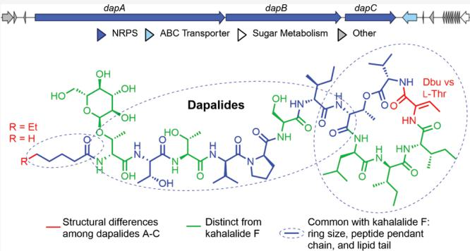
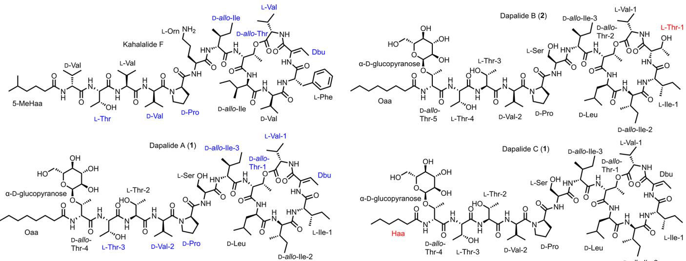
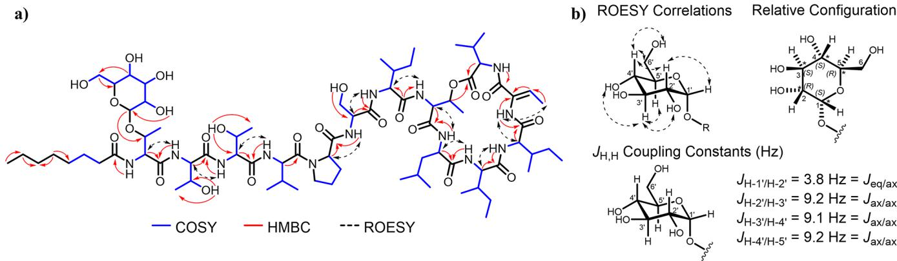
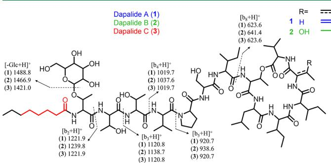
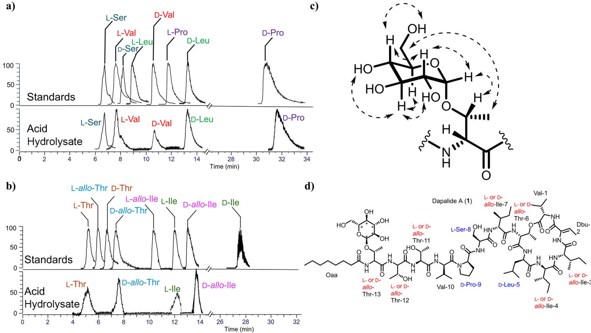
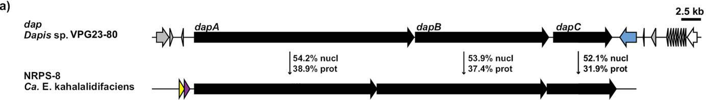
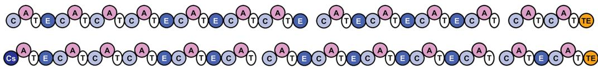
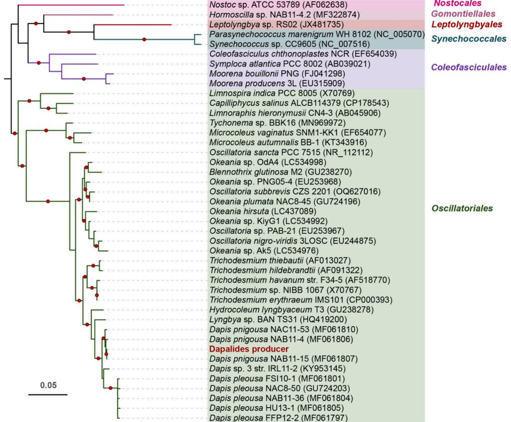
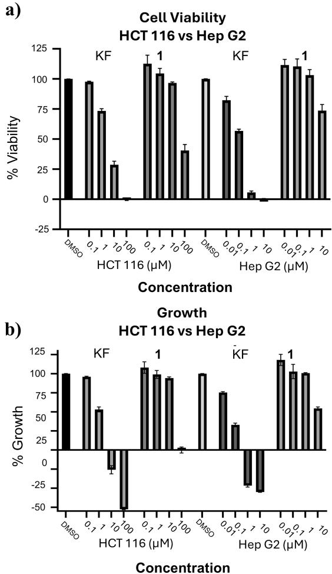

# Structure Determination and Biosynthesis of Dapalides A-C, Glycosylated Kahalalide F Analogues from the Marine Cyanobacterium Dapis sp

Emma K. Elis, Laura P.Ióca, Jie Liu, Manyun Chen, Steven D.Bruner, Yousong Ding, Valerie J.Paul Mohamed S. Donia,\* and Hendrik Luesch\*

Cite This: J. Nat. Prod.2025,88,2138-2150

# ACCESS |

ll Metrics & More 回Article Recommendations

ABSTRACT: Kahalalides were originally isolated from the marine mollsk Elysia rufescens and its green algal diet Bryopsis sp. but the true producer was revealed as the obligate bacterial symbiont Candidatus Endobryopsis kahalalidefaciens,residing within Bryopsis sp.The most notable is kahalalide F，a broad-spectrum antitumor depsipeptide that entered the clinic but failed from lack of efficacy. We have isolated three new glycosylated analogues of kahalalide F, termed dapalides A-C (1-3)， from a marine cyanobacterium，Dapis sp.，collected from Guam. The planar structures were determined by extensive NMR coupled with mass spectrometry. Acid hydrolysis of 1 using amino acid analysis revealed the absolute configuration of singlet and a mixture of duplicate amino acids. Metagenomic analysis unveiled a biosynthetic gene cluster (BGC) with a nonribosomal peptide synthetase (NRPS) system and downstream glycosylation enzymes, whichassisted theconfgurational asignment through epimerization domainanalysis.The discovered BGC,termed dap，was assigned to a highquality metagenome-asembled genome of theDapis sp.Dapalide A (1) was subjected to phenotypic bioassays and exhibited weakanticancercytotoxicityThisdiscovery expandsthechemical diversityofthekahalalideFfamilysugestseir broad ecological role across diverse organisms,and presents an intriguing case of natural product biosynthesis evolution.

arine organisms produce specialized metabolites with activity. Decades of explorations of marine micro- and macroorganisms have culminated into the discovery of over 40,000 marine natural products (MNPs) and the development of 15 FDA approved drugs for various indications.1,² Some of the most structurally remarkable and biologically active metabolites are those produced by marine cyanobacteria, which can create polyketides,polyketide-peptide hybrids, fatty acid amides,terpenes,alkaloids,and modified peptides from their biosynthetic gene clusters (BGCs)，which have been reviewed extensively over the years.3-5 Genome mining and metabolomic analysis have become the forefront in determining the biosynthetic potential and chemical diversity produced from a given species.67 Notably, there is a rise in the number of previously isolated metabolites from collected sources that are biosynthesized in a cyanobacterial/bacterial metabolic source living in symbiosis within the host or in the surrounding area.6,8 Cyanobacteria are an ancient and rich source of diverse specialized metabolites that possess activity in different biological contexts,and these metabolites have been shown to move through food webs.Notable examples are the anticancer dolastatins such as dolastatin l0,originally isolated from the marine sea hare Dolabella auricularia. Their true producer was found to be a food source of the sea hare, the cyanobacterium Caldora penicillata.9-12 Swinholide A, a potent actin cytoskeleton disrupter, represents another example that was isolated from the marine sponge Theonella swinhoei; the true producer was later found to be an“Entotheonella sponge symbiont.13,14 Notably, the same family of compounds were also isolated from marine cyanobacteria.15,16 Similar examples also exist beyond the cyanobacteria. The kahalalides were originally isolated from an herbivorous sacoglossan mollusk Elysia rufescens17 and later discovered within the diet of the molusk，the green alga Bryopsis sp.18However，further investigative work through metagenomic analysis， revealed the true producer of the kahalalides to be Candidatus

  
Figure1.StructuresofalalideFanddapadsA-C(-3)withthminoacidsiilaritiofdapalideA()andaaalideFbeueand thestructural diferencesofdapalidesB(2)andC(3）comparedtodapalideA(1)labeledred.Allotherunitsare labeledblack.

Endobryopsis kahalalidefaciens，an intracellular bacterial symbiont of Bryopsis sp.19

The kahalalides are a distinct class of depsipeptides, containing both L-， D-，and modified amino acid building blocks,and fatty acid tails with varying substitutions at the $N \cdot$ terminus of the compounds.Successful synthetic efforts toward various analogues for structure-activity relationship (SAR) studies have been conducted using solid phase peptide synthesis (SPPS).20-24 The kahalalideshavebeen extensively reviewed over the years25,26 and compounds are continuing to be reisolated and discovered from marine sources around the world.18,27 Nine of the 24 isolated kahalalides show significant biological activity， including anticancer，antifungal,antiviral, antileishmanial，and antimalarial activity，in_addition to immune suppressiveand lymphaticactivity.25,27,28 Themost notably cytotoxic analogue is kahalalide F (KF),the endocyclic depsipeptide with the modified amino acid dehydrobutyrine (Dbu or Dhb),an ornithine residue $\left( \mathrm { O r n } \right)$ ， and at 5-methylhexanoic acid (5-MeHaa） fatty acid tail.17 KF showed significant activity against various human solid tumor cell lines and revealed diminished inhibitory activity against nontumor cell lines,indicating the possibility of an in vivo therapeutic window.17,29 Thisdiscovery led to KF entering clinical trials as a prime candidate for various indications,30-32 but the trials were eventually terminated due to lack of effects on tumor growth.25,33 A synthetic analogue of KF, elisidepsin (PM02734； Irvalec)，also entered clinical trials as a potent cytotoxin against solid tumors.34 Despite a successful phase 1 study to determine dose/dose-limiting toxicities,the phase II trial was terminated due tolack of efficacy，thus removing kahalalides or analogous from clinical trials entirely.35,36

In our ongoing research efforts to aid in the discovery of new bioactive molecules from marine cyanobacteria， we report three new kahalalide F analogues,dapalides A-C(1-3), that have been isolated and characterized through traditional isolation chemistry, structural determination,and verification by NMR and LC/MS mass fragmentation from a marine filamentous cyanobacterial mat (Figure 1). Through assembling long-read metagenomic sequencing data from the sample, the biosynthetic gene cluster(BGC）responsible for the production of the dapalides was discovered in the genome of a Dapis sp.,and the epimerization domains located within the

BGC were used to establish the absolute stereochemistry of the repeat amino acids. This discovery broadens the taxonomic origins of the kahalalide structural class as well as the chemical diversity between producers.

# RESULTS AND DISCUSSION

The marine cyanobacterial sample VPG23-80 was collected from patch reefs inside Cocos Lagoon, Guam. The freeze-ried sample was extracted with 1:1 EtOAc:MeOH, then subjected to solvent-solvent partitioning, silica gel chromatography, and reversed-phase HPLC,yielding dapalide A(1）as the major compound along with two minor metabolites, dapalide B (2) and dapalide C (3). The structures were elucidated via a combination of NMR analysis using $^ 1 \mathrm { H }$ NMR, $\mathrm { ^ { 1 } H - ^ { 1 } H }$ COSY, TOCSY,HSQC,HMBC,and ROESY (acquired in DMSO$d _ { 6 } )$ ,and mass fragmentation analysis using LC-MS/MS.

Dapalide A（1） was isolated as a white powder with the molecular formula $\mathrm { C _ { 7 6 } H _ { 1 3 1 } N _ { 1 3 } O _ { 2 4 } }$ as determined by HRESIMS data ${ ( m / z }$ for $[ \mathrm { M } + \mathrm { H } ] ^ { + } 1 6 1 0 . 9 4 9 0 )$ coupled with NMR data. The degrees of unsaturation deduced from this formula were 18.Initial inspection of the $^ 1 \mathrm { H }$ NMR,HSQC,and HMBC data revealed the structure class was a peptide with indicative $\alpha$ protons $( \delta _ { H } ~ \sim ~ 3 . 8 \mathrm { - } 4 . 8 ~ \mathrm { p p m } )$ ，amide carbonyls and exchangeable protons $( \delta _ { C } \sim 1 6 8 - 1 7 3 ~ \mathrm { p p m }$ $\delta _ { H } \sim 6 . 7 5 \mathrm { - } 8 . 1 4$ ppm),decorated with a sugar unit $\left( \delta _ { H / C } ~ 4 . 9 5 / 9 9 . 0 4 \right)$ ，and a fatty acid tail $( \delta _ { C } 1 7 3 . 0 9 ; \delta _ { H / C } 2 . 1 9 / 3 4 . 9 0 )$ (Table l; acquired in $\mathrm { D M S O \it - d _ { 6 , \cdot } }$ ).Briefly, $\mathrm { ^ { 1 } H - ^ { 1 } H }$ COSY correlations paired with the TOCSY correlations established 12 spin systems of standard amino acids: four threonine $\left( \mathrm { T h r } \right)$ units，three isoleucine (Ile） units，two valine $\mathrm { ( V a l ) }$ units，one leucine (Leu)，one serine (Ser)，and one proline $\left( \mathrm { P r o } \right)$ (Table 1, Figure 2a).Additionally, a separate spin system ascertained by the COSY/TOCSY correlations contained multiple exchangeable OH protons and a hemiacetal functional group $( \mathrm { H } \cdot \mathrm { I } ^ { \prime } .$ $\delta _ { H } / _ { C } 4 . 9 5 / 9 9 . 0 4 )$ , thus was determined to be the sugar group. However， two of the Thr units were missing a COSY correlation to an exchangeable OH,and the $\beta$ -positions of the units were shifted downfield in the proton chemical shifts and upfield in the carbon for one and downfield for the other. Thus,Thr-1 was revealed to be the point of esterification due to the $\beta$ -position having a downfield proton chemical shift of ${ \sim } 1 ~ \mathrm { p p m }$ $\left( \delta _ { H } 4 . 9 8 \right)$ and the upfield carbon chemical shift of 10 $( \delta _ { C } 5 6 . 0 )$ . The other Thr unit had an HMBC correlation of the $\beta$ -carbon $\left( { \delta _ { H } } / { _ C } ~ 3 . 9 7 / 7 5 . 6 \right)$ to the hemiacetal methine $( \delta _ { H } / _ { C }$ 4.95/99.04)，suggesting the glycosylation unit was on Thr-4.

Table 1. NMR Spectroscopic Data for Dapalide A (1) in DMSO at ${ \bf 2 5 \ S }$   

<table><tr><td colspan="8">able1.NMR Spectroscopic Data for Dapalide A(1) in DMSO-d6 at 25°℃</td></tr><tr><td>mino Acid1</td><td>Position</td><td> δH (U in Hz)a</td><td>δb</td><td>COSY</td><td>HMBC</td><td>TOCSY</td><td>ROESY</td></tr><tr><td>Val-1</td><td>1</td><td></td><td>169.2, C</td><td></td><td>2,3,5</td><td></td><td></td></tr><tr><td></td><td>2</td><td>3.85, dd (10.0, 9.0)</td><td>59.9, CH</td><td>6,3</td><td>1,3,4,5</td><td>6,3,4,5</td><td></td></tr><tr><td></td><td>3</td><td>1.37, ov.c</td><td>29.3, CH</td><td>2,4,5</td><td>2</td><td>6,2,4,5</td><td></td></tr><tr><td></td><td>4</td><td>0.64, d (6.5)</td><td>18.89, CH</td><td></td><td>2,3,5</td><td>6,2,3,5</td><td></td></tr><tr><td></td><td>5</td><td>0.58,d (6.5)</td><td>18.2, CH</td><td></td><td>2,3,4</td><td>6,2,3,4</td><td>1,5</td></tr><tr><td></td><td>6</td><td>6.75,d (9.0)</td><td>NH</td><td>2</td><td>2,7</td><td>2,3,4, 5,7</td><td></td></tr><tr><td>Dbu</td><td>7</td><td></td><td>163.2, C</td><td></td><td>2, 6, 9,10,11</td><td></td><td></td></tr><tr><td></td><td>8</td><td></td><td>130.2, C</td><td></td><td>9,10</td><td></td><td></td></tr><tr><td></td><td>9</td><td>6.46, dq (7.1, 1.1)</td><td>129.4, CH</td><td>11,10</td><td>8,10</td><td>11,10</td><td>11</td></tr><tr><td></td><td>10</td><td>1.67, d (7.1)</td><td>12.4, CH3</td><td>9</td><td>9</td><td>11,9,8</td><td>11</td></tr><tr><td></td><td>11</td><td>9.95, s</td><td>NH</td><td>2</td><td>8,12</td><td>2,3,4,5</td><td>11,5</td></tr><tr><td>Ile-1</td><td>12</td><td></td><td>172.1, C</td><td></td><td>11,13</td><td></td><td></td></tr><tr><td></td><td>13</td><td>3.91, dd (10.4, 5.8</td><td>58.3 CH</td><td>14,18</td><td>14,15, 16</td><td>15, 16, 17,18</td><td>18</td></tr><tr><td></td><td>14 15</td><td>1.83, ov.c</td><td>32.8, CH</td><td>13,15,16</td><td>13,15,16</td><td>13,15, 16, 17, 18</td><td>18</td></tr><tr><td></td><td></td><td>1.54, ov.c</td><td>24.3,CH</td><td>14,17</td><td>14, 16,17</td><td>13,14, 16, 17, 18</td><td></td></tr><tr><td></td><td>16</td><td>1.24, ov.c</td><td></td><td>14,17</td><td>14, 16, 17</td><td>13, 14, 16,17, 18</td><td></td></tr><tr><td></td><td>17</td><td>0.9, d (6.7) 0.835, ov.</td><td>14.7, CH</td><td>13</td><td>14, 15, 17</td><td>13, 14, 15,17, 18</td><td></td></tr><tr><td></td><td>18</td><td>8.78,d (5.8)</td><td>9.3, CH</td><td>15</td><td>13, 14,15</td><td>13, 14, 15,16,18</td><td></td></tr><tr><td>Ile-2</td><td>19</td><td></td><td>NH</td><td>13</td><td>13,19</td><td>13,14, 15, 16, 17, 18</td><td>13,14,20,21</td></tr><tr><td></td><td>20</td><td>4.57, dd (8.9, 4.5)</td><td>172.8, C</td><td></td><td>18,20</td><td></td><td></td></tr><tr><td></td><td>21</td><td>1.99, ov,</td><td>53.0, CH</td><td>21,25</td><td>21,22,23,26,</td><td>10,21,22, 24, 23</td><td>18</td></tr><tr><td></td><td>22</td><td>1.25, ov.c</td><td>39.4, CH</td><td>20, 22,23</td><td>20</td><td>10,20,22,24, 23</td><td>18</td></tr><tr><td></td><td></td><td>1.01, ov.c</td><td>26.1, CH</td><td>21,24</td><td>20,24,23</td><td>10,20,21,22,24,23</td><td></td></tr><tr><td></td><td>23</td><td>0.74, d (6.3)</td><td></td><td>21,24</td><td>20,24,23</td><td>10,20,21,22,24,23</td><td></td></tr><tr><td></td><td>24</td><td>0.93, t (7.4)</td><td>13.7, CH</td><td>21</td><td>20,21,22</td><td>10,20,21, 22, 24</td><td></td></tr><tr><td></td><td>25</td><td>7.48, d (8.9)</td><td>11.8, CH</td><td>21</td><td>21,22 20,26</td><td>10,20,21,22,23</td><td></td></tr><tr><td>Leu</td><td>26</td><td></td><td>NH</td><td>20</td><td></td><td>20,21,22,24,23</td><td>27,32</td></tr><tr><td></td><td>27</td><td>4.38, ov.c</td><td>171.1, C</td><td>28,32</td><td>10,24 26,28</td><td></td><td></td></tr><tr><td></td><td>28</td><td>1.53,ov.c</td><td>29.1,CH</td><td>27,29</td><td>27</td><td>28,29,30,31, 32</td><td>25</td></tr><tr><td></td><td></td><td>1.37, ov.c</td><td>42.4, CH</td><td>27,29</td><td>27,30,31</td><td>27,29,30,31,32</td><td>25</td></tr><tr><td></td><td>29</td><td>1.28, ov.c</td><td></td><td></td><td>26,30,31</td><td>27,29,30,31,32</td><td></td></tr><tr><td></td><td>30</td><td>0.825,d (6.2)</td><td>23.9, CH</td><td>28,30,31</td><td></td><td>27,28,30,31, 32</td><td></td></tr><tr><td></td><td>31</td><td>0.808, d (6.2)</td><td>23.1, CH</td><td>29</td><td>28,29</td><td>27,29,28,31,32</td><td></td></tr><tr><td>Thr-1</td><td>32</td><td>8.89,d (10.0)</td><td>20.9, CH3 NH</td><td>29</td><td>28,29</td><td>27,29,28,30,32</td><td></td></tr><tr><td></td><td></td><td></td><td></td><td>27</td><td>27,33</td><td>27,28,29,30,31</td><td>25,34</td></tr><tr><td></td><td>33</td><td>4.43, dd (10.2, 9.0)</td><td>168.0, CH</td><td></td><td>32,34</td><td></td><td></td></tr><tr><td></td><td>34</td><td></td><td>56.0, CH</td><td>35,37</td><td>33,35, 36,37,38</td><td>35,36,37</td><td>32,37,44</td></tr><tr><td></td><td>35</td><td>4.98, dd (6.4,10.2) 1.07, d (6.4)</td><td>69.4, CH</td><td>34,36</td><td>34,36,88,90</td><td>34,36,37</td><td></td></tr><tr><td></td><td>36</td><td></td><td>16.5, CH NH</td><td>35</td><td>34,35,37</td><td>35, 34, 37</td><td></td></tr><tr><td>Ile-3</td><td>37</td><td>8.57,d, 9.0</td><td></td><td>34</td><td>34,38</td><td>34, 35,36</td><td>34,39,44</td></tr><tr><td></td><td>38</td><td></td><td>169.3, C</td><td></td><td>37,39</td><td></td><td></td></tr><tr><td></td><td>39</td><td>4.36, dd (8.5,5.6) 1.69, ov.c</td><td>55.6, CH</td><td>44 41</td><td>38,40,41, 39,41,42, 43</td><td>40,41,42,43,44</td><td>37</td></tr><tr><td></td><td>40 41</td><td>1.32, ov.c</td><td>37.1, CH 25.2, CH</td><td>40,43</td><td>39,40,42,43</td><td>39,41,42,43,44 39,40, 42, 43, 44</td><td></td></tr><tr><td></td><td></td><td>1.05, ov.c</td><td></td><td>40,43</td><td>39,40,42,43</td><td></td><td></td></tr><tr><td></td><td></td><td></td><td></td><td>41</td><td></td><td>39,40,42,43, 44</td><td></td></tr><tr><td>Ser</td><td>42</td><td>0.81, d (6.8) 0.78, d (6.8)</td><td>11.4, CH 14.0, CH</td><td>40</td><td>41</td><td>39,40,41,42, 44</td><td></td></tr><tr><td></td><td>43</td><td></td><td>NH</td><td></td><td>39,40,41</td><td>39,40,41, 42,43</td><td>34, 37,46, 47, 4</td></tr><tr><td></td><td>44 45</td><td>7.59, d (8.5)</td><td>170.9, C</td><td>39</td><td>39,45 44,46</td><td>39,40,41,42,43</td><td></td></tr><tr><td></td></table>

Table 1.continued   

<table><tr><td rowspan="2">mino Acid Position</td><td rowspan="2"></td><td rowspan="2">δH (J in Hz)a</td><td rowspan="2">δb</td><td rowspan="2">COSY</td><td rowspan="2">HMBC</td><td colspan="2">TOCSY</td></tr><tr><td></td><td>ROESY</td></tr><tr><td rowspan="2">Val-2</td><td></td><td>3.55, w.p.</td><td>171.0, C</td><td>53</td><td>53</td><td>51,52,53</td><td></td></tr><tr><td>55</td><td>4.35, ov.c</td><td>55.3,CH</td><td>57,60</td><td>56 34,42, 45, 55</td><td></td><td></td></tr><tr><td rowspan="8"></td><td>56</td><td></td><td>29.9, CH</td><td>56</td><td>56,58,59</td><td></td><td></td></tr><tr><td>57</td><td>1.97,ov.c</td><td></td><td></td><td></td><td>56,58,59,60</td><td></td></tr><tr><td>58 59</td><td>0.89, d (6.8)</td><td>18.97, CH</td><td>57</td><td>56,57, 59</td><td>56,57,59</td><td></td></tr><tr><td></td><td>0.84,ov.c</td><td>18.0, CH</td><td>57</td><td>57,58,56</td><td>56,57,58</td><td></td></tr><tr><td>60</td><td>7.80, d (8.0)</td><td>NH</td><td>56</td><td>56,61</td><td>56, 57,58,59</td><td>62, 63,71</td></tr><tr><td>61</td><td></td><td>169.3, C</td><td></td><td>60,62</td><td></td><td></td></tr><tr><td>62 63</td><td>4.29, dd (8.2, 3.2) 4.03, ov.c</td><td>57.6, CH</td><td>8,29</td><td>61,65,66</td><td>61, 63, 65,66</td><td>60</td></tr><tr><td></td><td></td><td>66.5, CH</td><td>27, 62.5, 16</td><td>62,64,65</td><td>61,62, 65,66</td><td>60</td></tr><tr><td rowspan="6">Thr-3</td><td>64</td><td>1.02, d (6.2)</td><td>19.3,CH</td><td>29</td><td>62,63</td><td>62, 63,65, 66</td><td></td></tr><tr><td>65</td><td>4.89, d (4.7)</td><td>OH</td><td>29</td><td>61,62,63</td><td>61, 62, 63, 66</td><td></td></tr><tr><td>66</td><td>7.73, d (8.2)</td><td>NH</td><td>27</td><td>62,67</td><td>61,62, 63, 65</td><td>68,71,31</td></tr><tr><td>67</td><td></td><td>169.4, C</td><td></td><td>66,68</td><td></td><td></td></tr><tr><td>68 69</td><td>4.37, dd (8.0, 4.3)</td><td>57.4, CH</td><td>69,72</td><td>67,70,71, 72</td><td>69,70,71,72</td><td>66</td></tr><tr><td></td><td>3.96, ov.c</td><td>66.2, CH</td><td>68,70,71</td><td></td><td>68, 69,71, 72</td><td>66</td></tr><tr><td rowspan="6">Thr-4</td><td>70</td><td>1.02, d (6.2)</td><td>18.96, CH</td><td>69</td><td>68, 69,71</td><td>68,69,71, 72</td><td></td></tr><tr><td>71</td><td>5.09, d (4.8)</td><td>OH</td><td>69</td><td>68,70</td><td>68, 69, 70, 72</td><td>60,66</td></tr><tr><td>72</td><td>8.14, d (8.0)</td><td>NH</td><td>68</td><td>68,73</td><td>68, 69,70,71</td><td>66,75,77</td></tr><tr><td>73</td><td></td><td>169.1, C</td><td></td><td>72,74</td><td></td><td></td></tr><tr><td>74</td><td>4.73, dd (8.5, 4.2)</td><td>55.7, CH</td><td>77,75</td><td>73,75, 76,</td><td>75, 76,77</td><td>31</td></tr><tr><td>75</td><td>3.97,ov.c</td><td>75.6, CH</td><td>74,76</td><td>1&#x27;,73,76</td><td>74,76,77</td><td></td></tr><tr><td rowspan="8">Glc</td><td>76</td><td>1.11, d (6.5)</td><td>16.5, CH</td><td>75</td><td>74,75</td><td>74,75,77</td><td></td></tr><tr><td>77</td><td>8.07,d (8.5)</td><td>NH</td><td>74</td><td>74,78</td><td>74,75,76</td><td>31,1,2&quot;</td></tr><tr><td>1&#x27;</td><td>4.95, d (3.8)</td><td>99.0, CH</td><td>2&#x27;</td><td>75,2″</td><td>2&#x27;,2&quot;,3&#x27;,3”,4&quot;,6&#x27;</td><td>2&#x27;</td></tr><tr><td>2&#x27;</td><td>3.09, ddd (9.2,9.2, 3.8)</td><td>72.0, CH</td><td>1&#x27;,2&quot;,3&#x27;</td><td></td><td>1&#x27;,2&quot;,3&#x27;,3&quot;,4&#x27;,4&quot;,5&#x27;,6&quot;</td><td>1&#x27;,4&#x27;</td></tr><tr><td>2&quot;</td><td>4.23, d (9.2)</td><td>OH</td><td>2&#x27;</td><td>1&#x27;</td><td>1&#x27;,2&#x27;,3&quot;,4&#x27;,5&#x27;,6&#x27;</td><td>3&#x27;</td></tr><tr><td>3&#x27;</td><td>3.29, ddd (9.2,9.2, 3.6)</td><td>73.5, CH</td><td>3&quot;,4&#x27;,</td><td></td><td>1&#x27;,2&#x27;,2&quot;,3&quot;,4&#x27;,4&quot;,5&#x27;, 6&quot;</td><td>2&quot;,4&quot;,5&#x27;</td></tr><tr><td>3&quot;</td><td>4.70, d (4.8)</td><td>OH</td><td>3&#x27;</td><td></td><td>1&#x27;,2&#x27;,2&quot;,3&#x27;,4&quot;,6&#x27;,</td><td></td></tr><tr><td>4&#x27;</td><td>3.02, ddd (9.2, 9.2, 4.8)</td><td>69.9, CH</td><td>3&#x27;,5&#x27;</td><td>6</td><td>1&#x27;,2&#x27;,2&quot;,3&#x27;,3&quot;,4&quot;,5&#x27;, 6&quot;</td><td>2&#x27;,6,6&quot;</td></tr><tr><td rowspan="19">Oaa</td><td>4&quot; 5&#x27;</td><td>4.81, d (4.8)</td><td>OH</td><td>4&#x27;</td><td>3,4&#x27;</td><td>1&#x27;,2&#x27;,2&quot;,3&#x27;,3”,6&#x27;</td><td>3&#x27;</td></tr><tr><td>6</td><td>3.42, dd (9.2, 5.2) 3.59, dd (-9.0, 5.2)</td><td>31.7, CH</td><td>4&#x27;,6&#x27;</td><td>6&quot;</td><td>1&#x27;,2&#x27;,2&quot;,3&#x27;,3&quot;,4&#x27;,4&quot;,6&quot;</td><td>3&#x27;</td></tr><tr><td></td><td>3.43, d (-9.0)</td><td>60.5,CH</td><td>6&quot;</td><td></td><td>4&#x27;,4&quot;,6&quot;</td><td>4&#x27;</td></tr><tr><td>6&quot;</td><td>4.43, br s</td><td>OH</td><td>6&quot;</td><td></td><td>4&#x27;,4&quot;, 6&quot;</td><td>4&#x27;,76</td></tr><tr><td>78</td><td></td><td>173.09, C</td><td>6&#x27;</td><td>6</td><td>3&#x27;,3&quot;,4&quot;,5&#x27;,6&#x27;</td><td>4&#x27;</td></tr><tr><td>79 2.19, m</td><td></td><td></td><td></td><td>77,79</td><td></td><td></td></tr><tr><td></td><td></td><td>34.9,CH</td><td>80</td><td>78</td><td>80,81</td><td></td></tr><tr><td>80</td><td>1.48, ov.c</td><td>25.0,CH</td><td>79,81</td><td></td><td>79,81</td><td></td></tr><tr><td>81</td><td>1.25, ov.c</td><td>28.29, CH</td><td></td><td>82</td><td>79,80</td><td></td></tr><tr><td>82</td><td>1.25, ov.c</td><td>28.29, CH</td><td></td><td>81,83</td><td></td><td></td></tr><tr><td>83</td><td>1.23, ov.c</td><td>31, CH</td><td></td><td>82,84</td><td></td><td></td></tr><tr><td>84</td><td>1.24, ov.c</td><td>21.8, CH</td><td></td><td>83,85</td><td></td><td></td></tr><tr><td>85</td><td>0.85,ov.c</td><td>13.7, CH</td><td>84</td><td>83,84</td><td></td><td></td></tr><tr><td>(lr1) b</td><td></td><td></td><td></td><td></td><td></td><td></td></tr></table>

“600 MHz ${ } ^ { ( ^ { 1 } \mathrm { H } ) }$ .bDeduced from HSQC and HMBC.NMR signal overlaps with other protons.dSignal is underneath the water peak.

To selectively isolate the coupling constants of the sugar moiety to establish the relative configuration,a 1D selective TOCSY NMR experiment was conducted, irradiating the $_ \mathrm { H } { - } 2 ^ { \prime }$ proton $\left( \delta _ { H } \ 3 . 0 9 \right)$ . (Figure S6) Due to the large coupling constants of protons $\mathrm { H } { - } 2 ^ { \prime } / \mathrm { H } { - } 3 ^ { \prime } ( 9 . 2 ~ \mathrm { H z } )$ $\mathrm { H } { - } 3 ^ { \prime } / \mathrm { H } ^ { \prime } 4 ^ { \prime } ( 9 . 2 ~ \mathrm { H z } ) _ { \mathrm { \Omega } } ^ { - }$ and $\mathrm { H } { - } 4 ^ { \prime } / \mathrm { H } { - } 5 ^ { \prime } ( 9 { . } 2 \ \mathrm { H z } )$ ,the protons were assigned in the axial position (Figure S6). The relatively small coupling constant between $\mathrm { H } { - } 1 ^ { \prime } / \mathrm { H } { - } 2 ^ { \prime }$ $\left( 3 . 8 \ \mathrm { ~ H z } \right)$ ）revealed $\mathrm { H } { - } 1 ^ { \prime }$ was in the equatorial position， thus the sugar was assigned as a $\alpha$ glucopyranose (Figure 2b).Furthermore， the lack of ROE correlations between the $\mathrm { H } { - } 1 ^ { \prime } / \mathrm { H } { - } 3 ^ { \prime }$ and the small coupling constant between $\mathrm { H } { - } 1 ^ { \prime } / \mathrm { H } { - } 2 ^ { \prime }$ confirms the equatorial orientation of the anomeric proton $\mathrm { H } { - } 1 ^ { \prime }$ and indicates the presence of an $\alpha$ -sugar.Experimentally，anomeric chemical shifts of $\alpha$ sugars have upfield carbon chemical shifts $( \delta _ { \mathrm { C } } 9 4 - 9 9 )$ and a small coupling constant between 2 and 3.8 Hz.37 As mentioned above, the chemical shift values coupled with the coupling constants and ROESY correlations unequivocally assigned this unit as an $\alpha$ -glucopyranose (Figure 2b). The last spin system was revealed to be a dehydrated threonine unit (Dbu unit),as assgned via a singlet at the aliphatic $\beta$ position $\left( \delta _ { H } / _ { C } 6 . 4 6 / 1 2 9 . 4 3 \right)$ corresponding to the amide proton signal at $\delta _ { { \scriptscriptstyle H } } 9 . 9 1 $ and the HMBC correlation from the $\beta$ proton $( \dot { \delta } _ { H } / _ { C }$ 6.46/129.43） to the nonprotonated $\mathsf { s p } ^ { 2 }$ $\alpha$ -carbon signal $( \delta _ { C }$ 130.22).The chemical shift of the olefinic methine $\left( \delta _ { C } 1 2 9 . 4 3 \right)$ and a ROE between NH and $\mathrm { C H } _ { 3 }$ protons in the Dbu unit indicated cis $( Z )$ geometry ofthe double bond.41-43 Lastly, the presence of a fatty acid chain with eight carbon units (octanoic acid: Oaa） fit the molecular formula requirements and the degrees of unsaturation were fulfilled by an ester cyclization between the hydroxy group of Thr-1 and the carbonyl of Val-1 using HMBC correlations. The planar peptide sequence of dapalide A（1）was established using HMBC and ROESY correlations as Oaa-Thr-Thr-Thr-Val-Pro-Ser-Ile-Thr-Leu-IleIle-Dbu-Val, with the underlined residues as the cyclization point.

  
Figure2.a)KeyCOY(ue),HBC(ed)andOEYdased)2DcoreaosfdapalideA(1)ossmble teplaarcuea b）relative configuration of the $\alpha$ glucopyranose including coupling constants deduced by 1D TOCSY.

To verify the structure of 1,MS/MS fragmentation analysis was conducted. Mass fragmentation provided the sequences of seven of the 13 amino acids and the sugar cleavage. The sequence for dapalide A(1) revealed the sequential loss of the sugar unit ( $[ - \mathrm { G i c + H } ] ^ { + }$ 1488.8 [calc 1488.9]), the GlcThr unit with the C8 (Oaa） fatty acid tail( $[ \mathsf { b } _ { 2 } + \mathsf { H } ] ^ { + }$ 1221.8 (calc 1221.7])，the dipeptide Thr-GlcThr-Oaa( $\mathrm { [ b _ { 3 } + H ] ^ { + } }$ 1120.8 [calc 1120.7]),the tripeptide Thr-Thr-GlcThr-Oaa ( $\mathrm { [ b _ { 4 } + H ] ^ { + } }$ 1019.7 [calc 1019.7]), the tetrapeptide Val-Thr-Thr-GlcThrOaa $\left( [ \mathsf { b } _ { 5 } \mathrm { + H } ] ^ { + } \ 9 2 0 . 6 \right)$ [calc 92o.6]),and the rest of the linear heptapeptide Ile-Ser-Pro-Val-Thr-Thr-GlcThr-Oaa $\mathrm { ( [ b _ { 8 } + H ] ^ { + } }$ 623.4 [calc 623.4]). The depsipeptide ring was not fragmented under the applied conditions (Figure 3).

  
Figure 3. Structural verification of dapalides A-C(1-3） through MS/MS fragmentation,which revealed the structural differences in blue,green,and red.

The same extract yielded dapalide B(2） from a mixture of compounds in which the structure was solved using a combination of mass fragmentation and in-depth analysis of the unclean NMR spectra. The molecular formula of dapalide B (2）was determined to be $\mathrm { C } _ { 7 6 } \mathrm { H } _ { 1 3 3 } \mathrm { N } _ { 1 3 } \mathrm { O } _ { 2 5 }$ through HRESIMS data analysis $\left( m / z \ [ \mathrm { M } + \mathrm { H } ] ^ { + } \ 1 6 2 7 . 9 7 6 7 \right)$ coupled with the NMR data (Table 2). The structure was fully elucidated despite the presence of multiple compounds in the sample by using both the NMR and mass fragmentation patterns from the LC-MS.MS data revealed the addition of 18 amu, suggesting the formal addition of $_ { \mathrm { H } _ { 2 } \mathrm { O } }$ and presence of a hydroxy group.Further analysis of the $^ 1 \mathrm { H }$ NMR data revealed the lack of the characteristic amide singlet proton at $\delta _ { H }$ 9.91 and the doublet of quartet methine proton at $\delta _ { H }$ 6.46, indicating the presence of the threonine group in the place of the Dbu unit. Mass fragmentation further indicated the additional groups are on the depsipeptide ring as the mass fragments reflected the same fragmentation as 1 (Figure 3). The sequential loss began with the sugar unit ([-Glc $+ \mathrm { H } ] ^ { + } 1 4 \bar { 6 } 6 . 9$ [calc 1466.9])，then the GlcThr with the Oaa fatty acid $\left( [ \mathsf { b } _ { 2 } + \mathrm { H } ] ^ { + } 1 2 3 9 . 8 \right.$ [calc 1221.7] and the $[ { \sf a } _ { 2 } + { \sf H } ] ^ { + }$ 1266.9 [calc 1266.7])，then the tetrapeptide Val-The-TheGlcThr-Oaa $\left( \mathrm { [ b _ { 5 } + H ] ^ { + } } ~ 9 3 8 . 6 \right)$ [calc 938.6]),and last the linear heptapeptide Ile-Ser-Pro-Val-Thr-Thr-GlcThr-Oaa $\mathrm { [ b _ { 8 } + H ] ^ { + } }$ 641.4 [calc 641.4]). The depsipeptide ring was not fragmented,but the NMR clearly revealed the Thr unit in place of the Dbu unit.

Dapalide C(3) was isolated as a mixture with dapalide A(1) (7:3 ratio based on HRESIMS) that was a colorless solid with the molecular formula of $\mathrm { C _ { 7 4 } H _ { 1 2 7 } N _ { 1 3 } O _ { 2 4 } }$ as determined by HRESIMS data $\left( m / z \ [ \mathrm { M \ + \  H } ] ^ { + } 1 5 8 2 . 9 1 8 5 \right)$ ，coupled with NMR data to determine the structure. The structure was fully elucidated despite the presence of dapalide A(1） by using both the NMR and mass fragmentation patterns from the LCMS. The $^ 1 \mathrm { H }$ NMR spectrum was almost identical to that for 1, suggesting that the peptide and glycosylated unit were identical. The difference of 28 amu compared with 1 strongly suggested that the C8 chain $( \mathrm { O a a } )$ in 1 is replaced by a C6 chain (hexanoic acid: Haa). The mass fragmentation sequence verified this tail reduction via the $[ - \mathrm { G l c + H } ] ^ { + }$ ， indicating the loss of $2 8 \mathrm { \ a m u }$ .The fragmentation sequence for 3 revealed the loss of the glycosylated group from the Thr unit first ([-Glc $+ \mathrm { H } ] ^ { + } 1 4 2 1 . \dot { 0 }$ [calc 1420.9]),then the GlcThr with the Haa tail $[ \mathsf { b } _ { 2 } + \mathsf { H } ] ^ { + }$ 1221.9 [calc 1221.8]). The subsequent fragmentation aligns with the fragmentation of 1 (Figure 3), validating the structural assignment for 3.

The analysis of the absolute configuration of dapalide A (1) was conducted first chemically by comparing amino acid standards to the acid hydrolyzate. The amino acids were liberated using acid hydrolysis, then subjected to enantioselective LC-MS analysis and comparison with amino acid standards.L-Ser，D-Pro，and D-Leu were unambiguously assigned as the only singly represented amino acids，and a mixture of $\mathrm { L } / \mathrm { D } \mathrm { - } \mathrm { V a l }$ with a ratio of 2:1 was observed (Figure 4a).As for Thr and Ile units, the assignments were verified as either $\mathrm { L }$ -Thr or D-allo-Thr and L-Ile or D-allo-Ile,respectively (Figure 4b). The location of epimerization domains of the BGC(see below） ultimately revealed the modules that transform the Thr and Ile units to the D-configuration,and, more specifically， the D-allo-configuration. This powerful combination method successfully established the absolute configuration for dapalide A(1）without further sacrificing precious material for partial hydrolysis studies.Given the trace quantities ( $\log \mu \mathrm { g }$ or less）of dapalides B (2） and C(3), chemical analyses of the absolute configurations were not conducted.However, all the amino acid units for dapalide C (3）are the same, supported by NMR comparison,and the BGC indicated that the Thr configuration at the Dbu position for dapalide B (2） was L because of the lack of an epimerization domain (see below).Lastly，absolute configuration of the sugar moiety could be established based on ROE correlations between D-allo-Thr and the attached $\alpha$ glucopyranose.Specifically， the two ROE correlations revealed the sugar is in the D configuration based on the presence of the ROE correlations from the anomeric proton to the Thr $\beta$ proton and the ${ { \boldsymbol { 6 } } ^ { \prime } }$ methylene protons to the Thr γ methyl. With the $\alpha$ -configuration previously determined using coupling constants and the lack of a 1,3 diaxial interaction, the sugar unit was fully characterized as $\alpha$ -D-glucopyranose (Figure 4c). Thus，the absolute configuration was established using chemical methods for the leucine,proline,serine,and sugar units,and the partial absolute configuration was established for the isoleucine and threonine units to consist of L- or D-alloamino groups (Figure 4d).The two valine units were revealed as a mixture of both L- and D-amino acids.

Table 2. NMR Spectroscopic Data for Dapalides B (2) and C (3) in DMSO $\cdot d _ { 6 }$ at ${ \bf 2 5 \ S }$   

<table><tr><td colspan="4"> Dapalide B (2)</td><td colspan="4"> Dapalide C (3)</td></tr><tr><td>mino Acid</td><td>Position</td><td> δH (J in Hz)a</td><td>8cb</td><td> Amino Acid</td><td>Position</td><td> δH (J in Hz)a</td><td>8cb</td></tr><tr><td>Val-1</td><td>1</td><td></td><td></td><td>Val-1</td><td>1</td><td></td><td>169.2, C</td></tr><tr><td></td><td>2</td><td>3.85, t (10.0)</td><td>66.8,CH</td><td></td><td>2</td><td>3.85, dd (10.0, 9.0)</td><td>59.9, CH</td></tr><tr><td rowspan="9"></td><td>3</td><td>1.37, ov.c</td><td>27.7, CH</td><td></td><td>3</td><td>1.37, ov.c</td><td>29.3,CH</td></tr><tr><td>4</td><td>0.64,d (6.5)</td><td>16.7,CH</td><td></td><td>4</td><td>0.64,d (6.5)</td><td>18.89, CH</td></tr><tr><td>5</td><td>0.58,d (6.5)</td><td>18.2, CH</td><td></td><td>5</td><td>0.58, d (6.5)</td><td>18.2, CH</td></tr><tr><td>6</td><td>6.75, d (9.0)</td><td>NH</td><td></td><td>6</td><td>6.75, d (9.0)</td><td>NH</td></tr><tr><td></td><td></td><td></td><td>Dbu</td><td>7</td><td></td><td>163.2, C</td></tr><tr><td>8</td><td>4.24, d (7.8)</td><td>57.8, CH</td><td></td><td>8</td><td></td><td>130.2, C</td></tr><tr><td>9</td><td>3.90,ov.c</td><td>66.6, CH</td><td></td><td>9</td><td>6.46, dq (7.1, 1.1)</td><td>129.4, CH</td></tr><tr><td>10</td><td>1.07,ov.c</td><td>19.7,CH</td><td></td><td>10</td><td>1.67, d (7.1)</td><td>12.4, CH3</td></tr><tr><td>11</td><td>7.88, d (7.8)</td><td>NH</td><td></td><td>11</td><td>9.95, s</td><td>NH</td></tr><tr><td rowspan="7">Ile-1</td><td>12</td><td></td><td></td><td>Ile-1</td><td>12</td><td></td><td>172.1, C</td></tr><tr><td>13 14</td><td>4.47 dd (9.0, 4.5)</td><td>53.9, CH</td><td></td><td>13</td><td>3.91, dd (10.4, 5.8</td><td>58.3 CH</td></tr><tr><td>15</td><td>1.83, ov.c</td><td>36.7, CH</td><td></td><td>14</td><td>1.83, ov.c</td><td>32.8, CH</td></tr><tr><td></td><td>1.49, ov.c</td><td>24.8,CH</td><td></td><td>15</td><td>1.54, ov.c</td><td>24.3, CH</td></tr><tr><td></td><td>1.35, ov.c</td><td></td><td></td><td></td><td>1.24, ov.c</td><td></td></tr><tr><td>16</td><td>0.92, ov.c</td><td>14.9, CH</td><td></td><td>16 17</td><td>0.9, d (6.7)</td><td>14.7, CH</td></tr><tr><td>17</td><td>0.81,ov.c</td><td>10.0, CH</td><td></td><td></td><td>0.835,ov.c</td><td>9.3, CH</td></tr><tr><td rowspan="9">Ile-2</td><td>18</td><td>7.63, d (9.0)</td><td>NH</td><td>Ile-2</td><td>18</td><td>8.78, d (5.8)</td><td>NH</td></tr><tr><td>19</td><td></td><td>172.8, C</td><td></td><td>19</td><td></td><td>172.8, C</td></tr><tr><td>20</td><td>4.57, dd (8.9, 4.5)</td><td>53.0, CH</td><td></td><td>20</td><td>4.57, dd (8.9, 4.5)</td><td>53.0, CH</td></tr><tr><td>21 22</td><td>1.99, ov.c</td><td>39.4, CH</td><td></td><td>21</td><td>1.99, ov.c</td><td>39.4, CH</td></tr><tr><td></td><td>1.25, ov.c</td><td>26.1, CH</td><td></td><td>22</td><td>1.25, ov.c</td><td>26.1,CH</td></tr><tr><td>23</td><td>1.01, ov.c 0.74, d (6.3)</td><td></td><td></td><td></td><td>1.01, ov.c</td><td></td></tr><tr><td>24</td><td>0.93, t (7.4)</td><td>13.7, CH</td><td></td><td>23</td><td>0.74, d (6.3)</td><td>13.7, CH</td></tr><tr><td>25</td><td>7.48, d (8.9)</td><td>11.8, CH</td><td></td><td>24</td><td>0.93, t (7.4)</td><td>11.8, CH</td></tr><tr><td>26</td><td></td><td>NH 171.1, C</td><td>Leu</td><td>25 26</td><td>7.48, d (8.9)</td><td>NH 171.1, C</td></tr><tr><td>Leu</td><td></td><td></td><td></td><td></td><td></td><td></td></tr><tr><td rowspan="9"></td><td>27</td><td>4.38, ov.c</td><td>29.1, CH</td><td></td><td>27</td><td>4.38, ov.c 1.53, ov.c</td><td>29.1, CH</td></tr><tr><td>28</td><td>1.53, ov.c</td><td>42.4, CH</td><td></td><td>28</td><td></td><td>42.4, CH</td></tr><tr><td>29</td><td>1.37, ov.c 1.28, ov.c</td><td></td><td></td><td>29</td><td>1.37, ov.c</td><td></td></tr><tr><td>30</td><td>0.825, d (6.2)</td><td>23.9, CH</td><td></td><td>30</td><td>1.28, ov.c 0.825, d (6.2)</td><td>23.9, CH</td></tr><tr><td>31</td><td>0.808, d (6.2)</td><td>23.1, CH</td><td></td><td></td><td>0.808, d (6.2)</td><td>23.1, CH</td></tr><tr><td>32</td><td>8.89, d (10.0)</td><td>20.9, CH</td><td></td><td>31</td><td>8.89, d (10.0)</td><td>20.9,CH</td></tr><tr><td>33</td><td></td><td>NH</td><td>Thr-1</td><td>32</td><td></td><td>NH</td></tr><tr><td>34</td><td>4.43, dd (10.2, 9.0)</td><td>168.0, CH</td><td></td><td>33</td><td>4.43, dd (10.2, 9.0)</td><td>168.0, CH</td></tr><tr><td>35</td><td></td><td>56.0, CH</td><td></td><td>34 35</td><td>4.98, dd (6.4,10.2)</td><td>56.0, CH</td></tr><tr><td></td><td>4.98, dd (6.4,10.2)</td><td>69.4,CH</td><td></td><td></td><td></td><td>69.4, CH</td></tr><tr><td rowspan="7">Ile-3</td><td>36</td><td>1.07, d (6.4)</td><td>16.5,CH</td><td></td><td>36</td><td>1.07, d (6.4)</td><td>16.5, CH</td></tr><tr><td>37 38</td><td>8.57, d, 9.0</td><td>NH</td><td>Ile-3</td><td>37</td><td>8.57, d, 9.0</td><td>NH</td></tr><tr><td>39</td><td></td><td>169.3,C</td><td></td><td>38</td><td></td><td>169.3,C</td></tr><tr><td>40</td><td>4.36, dd (8.5, 5.6)</td><td>55.6, CH</td><td></td><td>39</td><td>4.36, dd (8.5, 5.6)</td><td>55.6, CH</td></tr><tr><td>41</td><td>1.69, ov.</td><td>37.1, CH</td><td></td><td>40</td><td>1.69, ov.</td><td>37.1, CH</td></tr><tr><td></td><td>1.32, ov.c</td><td>25.2, CH</td><td></td><td>41</td><td>1.32, ov.c</td><td>25.2, CH</td></tr><tr><td>42</td><td>1.05, ov.c</td><td></td><td></td><td></td><td>1.05, ov.</td><td></td></tr><tr><td rowspan="9">Ser</td><td></td><td>0.81, d (6.8)</td><td>11.4, CH</td><td></td><td>42</td><td>0.81, d (6.8) 0.78, d (6.8)</td><td>11.4, CH</td></tr><tr><td>43 44</td><td>0.78, d (6.8)</td><td>14.0, CH</td><td></td><td>43</td><td>7.59, d (8.5)</td><td>14.0, CH</td></tr><tr><td></td><td>7.59, d (8.5)</td><td>NH</td><td></td><td>44</td><td></td><td>NH</td></tr><tr><td>45</td><td></td><td>170.9, C</td><td>Ser</td><td>45</td><td></td><td>170.9, C</td></tr><tr><td>46</td><td>4.35, ov. 3.53, ov.c</td><td>54.6, C 61.8, CH</td><td></td><td>46 47</td><td>4.35, ov.c 3.53, ov.c</td><td>54.6, C 61.8, CH</td></tr><tr><td>47</td></table>

Table 2.continued   

<table><tr><td colspan="4">Dapalide B (2)</td><td colspan="4">Dapalide C (3)</td></tr><tr><td> Amino Acid</td><td>Position</td><td>δH (J in Hz)a</td><td>8cb</td><td> Amino Acid</td><td>Position</td><td>δH (J in Hz)a</td><td>8cb</td></tr><tr><td rowspan="6">Val-2</td><td>54</td><td>1.81,ov.c 3.7, w.p.d</td><td>46.8,CH</td><td></td><td>54</td><td>1.81,ov.c 3.7, w.p.d</td><td>46.8, CH</td></tr><tr><td></td><td>3.55, w.pd</td><td></td><td></td><td></td><td>3.55, wp.d</td><td></td></tr><tr><td>55</td><td></td><td>171.0, C</td><td>Val-2</td><td>55</td><td></td><td>171.0, C</td></tr><tr><td>56</td><td>4.35, ov.c</td><td>55.3, CH</td><td></td><td>56</td><td>4.35,ov.c</td><td>55.3, CH</td></tr><tr><td>57</td><td>1.97, ov.c</td><td>29.9, CH</td><td></td><td>57</td><td>1.97, ov.c</td><td>29.9, CH</td></tr><tr><td>58</td><td>0.89, d (6.8)</td><td>18.97, CH</td><td></td><td>58</td><td>0.89, d (6.8)</td><td>18.97, CH</td></tr><tr><td rowspan="6">Thr-3</td><td>59</td><td>0.84,ov.c</td><td>18.0, CH</td><td></td><td>59</td><td>0.84, ov.c</td><td>18.0, CH</td></tr><tr><td>60</td><td>7.80, d (8.0)</td><td>NH</td><td></td><td>60</td><td>7.80, d (8.0)</td><td>NH</td></tr><tr><td>61</td><td></td><td>169.3, C</td><td>Thr-2</td><td>61</td><td></td><td>169.3, C</td></tr><tr><td>62</td><td>4.29, dd (8.2, 3.2)</td><td>57.6, CH</td><td></td><td>62</td><td>4.29,dd (8.2, 3.2)</td><td>57.6, CH</td></tr><tr><td>63</td><td>4.03, ov.c</td><td>66.5, CH</td><td></td><td>63</td><td>4.03, ov.c</td><td>66.5, CH</td></tr><tr><td>64</td><td>1.02, d (6.2)</td><td>19.3, CH</td><td></td><td>64</td><td>1.02, d (6.2)</td><td>19.3, CH</td></tr><tr><td rowspan="6">Thr-4</td><td>65 66</td><td>4.89, d (4.7)</td><td>OH</td><td></td><td>65</td><td>4.89, d (4.7)</td><td>OH</td></tr><tr><td></td><td>7.73,d (8.2)</td><td>NH</td><td></td><td>66</td><td>7.73, d (8.2)</td><td>NH</td></tr><tr><td>67</td><td></td><td>169.4, C</td><td>Thr-3</td><td>67</td><td></td><td>169.4, C</td></tr><tr><td>68 69</td><td>4.37, dd (8.0, 4.3) 3.96, ov.c</td><td>57.4, CH</td><td></td><td>68 69</td><td>4.37, dd (8.0,4.3) 3.96, ov.c</td><td>57.4, CH</td></tr><tr><td>70</td><td>1.02, d (6.2)</td><td>66.2, CH 18.96, CH</td><td></td><td>70</td><td>1.02, d (6.2)</td><td>66.2, CH</td></tr><tr><td>71</td><td>5.09,d (4.8)</td><td>OH</td><td></td><td>71</td><td>5.09, d (4.8)</td><td>18.96, CH OH</td></tr><tr><td rowspan="5">Thr-5</td><td>72</td><td>8.14, d (8.0)</td><td>NH</td><td></td><td>72</td><td>8.14, d (8.0)</td><td>NH</td></tr><tr><td>73</td><td></td><td>169.1, C</td><td>Thr-4</td><td>73</td><td></td><td>169.1, C</td></tr><tr><td>74</td><td>4.73, dd (8.5, 4.2)</td><td>55.7,CH</td><td></td><td>74</td><td>4.73, dd (8.5, 4.2)</td><td>55.7, CH</td></tr><tr><td>75</td><td>3.97, ov.c</td><td>75.6, CH</td><td></td><td>75</td><td>3.97, ov.c</td><td>75.6, CH</td></tr><tr><td>76</td><td>1.11, d (6.5)</td><td>16.5, CH</td><td></td><td>76</td><td>1.11, d (6.5)</td><td>16.5, CH</td></tr><tr><td rowspan="8">Glc</td><td>77</td><td>8.07,d (8.5)</td><td>NH</td><td></td><td></td><td>8.07,d (8.5)</td><td></td></tr><tr><td>1&#x27;</td><td>4.95,d (3.8)</td><td></td><td>Glc</td><td>77</td><td>4.95,d (3.8)</td><td>NH</td></tr><tr><td>2&#x27;</td><td>3.09, ddd (9.2, 9.2, 3.8)</td><td>99.0, CH</td><td></td><td>1&#x27;</td><td></td><td>99.0, CH</td></tr><tr><td>2″</td><td>4.23,d (9.2)</td><td>72.0, CH</td><td></td><td>2&#x27;</td><td>3.09,ddd (9.2,9.2, 3.8) 4.23, d (9.2)</td><td>72.0, CH</td></tr><tr><td>3&#x27;</td><td>3.29,ddd (9.2,9.2, 3.6)</td><td>OH 73.5, CH</td><td></td><td>2&quot;</td><td>3.29,ddd (9.2, 9.2, 3.6)</td><td>OH</td></tr><tr><td>3&quot;</td><td>4.70, d (4.8)</td><td>OH</td><td></td><td>3&#x27; 3&quot;</td><td>4.70, d (4.8)</td><td>73.5, CH</td></tr><tr><td>4&#x27;</td><td>3.02, ddd (9.2,9.2, 4.8)</td><td>69.9,CH</td><td></td><td>4&#x27;</td><td>3.02, ddd (9.2, 9.2, 4.8)</td><td>OH 69.9, CH</td></tr><tr><td>4&quot;</td><td>4.81, d (4.8)</td><td>OH</td><td></td><td>4&quot;</td><td>4.81, d (4.8)</td><td>OH</td></tr><tr><td rowspan="14">Oaa</td><td>5&#x27;</td><td>3.42, dd (9.2, 5.2)</td><td>31.7, CH</td><td></td><td>5&#x27;</td><td>3.42, dd (9.2, 5.2)</td><td>31.7, CH</td></tr><tr><td>6</td><td>3.59, dd (-9.0, 5.2)</td><td>60.5, CH</td><td></td><td>6&#x27;</td><td>3.59, dd (-9.0,5.2)</td><td>60.5, CH</td></tr><tr><td></td><td>3.43,d (-9.0)</td><td></td><td></td><td></td><td>3.43, d (-9.0)</td><td></td></tr><tr><td>6&quot;</td><td>4.43,br s</td><td>OH</td><td></td><td>6&quot;</td><td>4.43,br s</td><td>OH</td></tr><tr><td>78</td><td></td><td></td><td>Haa</td><td>78</td><td></td><td></td></tr><tr><td>79</td><td>2.19,m</td><td></td><td></td><td>79</td><td>2.19, m</td><td>35.4, CH</td></tr><tr><td>80</td><td>1.48,ov.c</td><td></td><td></td><td>80</td><td>1.48, ov.</td><td>24.6, CH</td></tr><tr><td>81</td><td>1.25, ov.c</td><td></td><td></td><td>81</td><td>1.28, ov.c</td><td>28.7,CH</td></tr><tr><td>82</td><td>1.25, ov.c</td><td></td><td></td><td>82</td><td>1.24, ov.c</td><td>21.8, CH</td></tr><tr><td>83</td><td>1.23, ov.c</td><td></td><td></td><td>83</td><td>0.85,d (6.2)</td><td>13.7, CH</td></tr><tr><td>84</td><td>1.24, ov.c</td><td></td><td></td><td></td><td></td><td></td></tr><tr><td></td><td></td><td></td><td></td><td></td><td></td><td></td></tr><tr><td>85</td><td>0.85, ov.c</td><td></td><td></td><td></td><td></td><td></td></tr></table>

'600 MHz ${ } ^ { ( ^ { 1 } \mathrm { H } ) }$ .Deduced from HSQC and HMBC.NMR signal overlaps with other protons.dSignal is underneath the water peak.

  
Figure4.ChemicalaalsisofteabuteconfguratiofapaideA().omatogamofthcidhdrolsatefdapalidA()adto a)SerValriidddbeoofbs using ROESY correlations to the established D-all-Thr.Two key ROE correlations included the anomeric proton $( \delta _ { \mathrm { { H } } } \mathsf { \Pi } 4 . 9 5 )$ to the one of the diastereotopic $_ { \mathrm { H } - 6 ^ { \prime } }$ proton signal $\left( \delta _ { \mathrm { H } } 3 . 4 3 \right)$ to the methyl of the Thr unit $^ { \prime } \delta _ { \mathrm { H } } 1 . 1 1 )$ .d) Structure of the dapalide A (1)confguration established by chemical methods unambiguously (blue）and partially (red).

Table 3. Amino Acid Placement of Dapalides A-C (1-3) Compared to Kahalalide F   

<table><tr><td></td><td>FA</td><td>A1</td><td>A2</td><td>A3</td><td>A4</td><td>A5</td><td>A6</td><td>A7</td><td>A8</td><td>A9</td><td>A10</td><td>A11</td><td>A12</td><td>A13</td></tr><tr><td>Kahalalide F</td><td>5MeHaa</td><td>VD</td><td>TL</td><td>VL</td><td>VD</td><td>PD</td><td>OL</td><td>ID</td><td>TD</td><td>ID</td><td>VD</td><td>FL</td><td>DBz</td><td>VL</td></tr><tr><td>Dapalide A</td><td>Oaa</td><td>TD</td><td>T</td><td>T</td><td>V</td><td>PD</td><td>SL</td><td>I</td><td>T</td><td>L</td><td>I</td><td>I</td><td>T</td><td>V</td></tr><tr><td>Dapalide B</td><td>Oaa</td><td>TD</td><td>T</td><td>T</td><td>V</td><td>PD</td><td>SL</td><td>1</td><td>T</td><td>L</td><td>I</td><td>1</td><td>DBz</td><td>V</td></tr><tr><td>Dapalide C</td><td>Haa</td><td>TD</td><td>T</td><td>T</td><td>V</td><td>PD</td><td>SL</td><td>1</td><td>T</td><td>L</td><td>1</td><td>1</td><td>DBz</td><td>V</td></tr></table>

Dapalides A-C (1-3） share several structural similarities to kahalalide F.Both are lipotridecapeptides, cyclized through an ester bond formed between the carboxylic acid of the last residue (Val-1) and a hydroxy group of Thr-l; seven out of the 13 amino acids are identical (positions 2,4,5,7,8,12,and 13; Figure 1, Table 3),while other two belong to the same amino acid class (positions 9 and 10; Figure 1, Table 3).Due to their structural similarity to kahalalide F,we hypothesized that dapalides A-C are likely produced by a nonribosomal peptide synthetase (NRPS）system similar to the Ca.E.kahalalidifaciens NRPS-8 pathway.19

To identify the BGC for dapalides A-C (1-3),we subjected VPG23-80 metagenomic DNA to long-read sequencing using the Pacific Biosciences platform (3,161,748 CCS reads,average read length S,947 bps).After metagenomic assembly and binning， we successfully recovered a $\sim ~ 1 1 . 2$ Mbps metagenome-assembled genome (MAG, $9 3 . 4 \%$ completeness, $4 . 9 \%$ contamination), that encodes a 53.1-kbp NRPS pathway composed of 13 modules (Figure Sa,b). Satisfyingly，the predicted amino acid specificity for the adenylation domains of this pathway was in perfect agreement with the structure of dapalide A(1） (prediction was performed using NRPSpredictor2 in antiSMASH $5 , ^ { 4 4 }$ Figure Sc).As discussed above, the absolute configuration of the amino acids selected by modules 5,6,and 9 were experimentally verified as D-Pro,L-Ser,and DLeu in accordance with the presence/absence of an epimerization domain within the respective modules,further supporting that this BGC produces dapalide A（1） (Figure Sd).The 16S rRNA gene and 16S-23S internal transcribed spacer (ITS) region of this MAG share $1 0 0 \%$ identity to partial Dapis pnigousa NAB11-15 16S rRNA gene (MF061807） and $9 7 . 4 2 \%$ identity to Dapis pnigousa NAC11-53 ITS region (MF167708),respectively, indicating that this cyanobacterium belongs to the genus Dapis45 (Figure 6).Additionally， the dapalides’producer MAG (VPG23-80 MAG-1） encodes 20 BGCs (identifed by antiSMASH):4 NRPSs,2 NRPS-PKS,1 PKS type-1，1 PKS type-3，8 RiPPs，3 terpenes，and 1 homoserinelactone.The only products isolated produced by

VNRPSABC transporter sugar metabolism other 4'-PPT TE-I

b）dap. Dapis sp.VPG23-80

NRPS-8 Ca.E.kahalalidifaciens

c)

Dapalide A BGC predictior

<table><tr><td rowspan=1 colspan=14>A1 A2 A3A4 A5A6 A7 A8 A9 A10A11A12A13</td></tr><tr><td rowspan=1 colspan=1>FA</td><td rowspan=1 colspan=1>T</td><td rowspan=1 colspan=1>T</td><td rowspan=1 colspan=1>T</td><td rowspan=1 colspan=1>V</td><td rowspan=1 colspan=1>P</td><td rowspan=1 colspan=1></td><td rowspan=1 colspan=1>一</td><td rowspan=1 colspan=1>T</td><td rowspan=1 colspan=1>、</td><td rowspan=1 colspan=1>、</td><td rowspan=1 colspan=1>一</td><td rowspan=1 colspan=1>Dbu</td><td rowspan=1 colspan=1>v</td></tr><tr><td rowspan=1 colspan=1>FA</td><td rowspan=1 colspan=1>T</td><td rowspan=1 colspan=1>T</td><td rowspan=1 colspan=1>T</td><td rowspan=1 colspan=1>V</td><td rowspan=1 colspan=1>P</td><td rowspan=1 colspan=1></td><td rowspan=1 colspan=1></td><td rowspan=1 colspan=1>T</td><td rowspan=1 colspan=1>L</td><td rowspan=1 colspan=1>b</td><td rowspan=1 colspan=1></td><td rowspan=1 colspan=1>T</td><td rowspan=1 colspan=1></td></tr></table>

  
Figure5.Geneticanddomaihitectureoftedapalideosyteticgencuster.a)Comparisonoftegenehitecturesbetwentedapalie BGC(ap）withthereportedNPSforaalalideF(NRPS8).rwisenucleotideandproteisequenceidenitiesbetweentheNSgensof the two BGCs are shown. NRPS: nonribosomal peptide synthetase; $4 ^ { \prime }$ -PPT: $4 ^ { \prime }$ phosphopantetheinyl transferase； TE-II: thioesterase II.b) ComparisonoftheNRPSdomaiarchitecturesbetweenthetwoBGCsshownina.C:condensatiodomain;Cs:tartercondensatiodoain;A: adenylationdomain；T:thiolationdomain；E:epimerasedomain；TE:thioesterasedomain.(c）Perfectagreementbetweentheaminoacid sequencedetedexpetallflidA(to)doepictedfoatiallsdoey substratespecifcityandthepresence/absenceof epimerization domains ineach module.(d)ProposeddapalideAbiosynthetic pathway.

VPG23-80 MAG-1 cyanobacterium were the dapalides A-C (1-3).

Overall，the Ca. E.kahalalidefaciens NRPS-8 and the dapalideA BGC $\left( d a p \right)$ share $5 3 . 7 \%$ identity at the nucleotide level and $3 7 . 2 \%$ at the protein level. Interestingly，several differences can be pointed out between the two BGCs: (i) dapalide A BGC lacks the thioesterase type-II and $4 ^ { \prime }$ phosphopantetheinyl transferase genes found in the kahalalide F BGC；(ii） the predicted amino acid stereochemistry for dapalideA(1） is identical to that of kahalalide F,except for module 12 that lacks an epimerization domain,and should select for $\mathrm { L }$ Thr (establishing the absolute configuration for 2);

and (iii） downstream of the NRPS genes, the dapalide BGC harbor an ABC transporter gene, together with a gene involved in sugar metabolism.

Dapalide A(1),as the more abundant metabolite isolated, was screened for antifungal and antiproliferative activity. The compound had no activity against yeast Saccharomyces cerevisiae at the highest concentration tested $\left( 2 0 0 \mathrm { \ } \mu \mathrm { g / m L } \right)$ but showed weak cytotoxic activity against HCT 116 colorectal and Hep G2 liver cancer cells (Figure 7).To note,due to the limited amount of material, the highest concentration tested for the HepG2 cells was $1 0 ~ \mu \mathrm { M }$ .However,1 exhibited potent growth inhibition at $1 0 0 ~ \mu \mathrm { M }$ in the HCT 116 cells and moderate growth inhibition at $1 0 ~ \mu \mathrm { M }$ in Hep G2 cells at $^ { 4 8 \mathrm { ~ h ~ } }$ (Figure 7).Kahalalide F was tested side by side for bioactivity comparison against both cancer cell lines as kahalalide F has $\mu \mathbf { M }$ potency against both cell lines in both cell viability and growth inhibition assays.28 Kahalalide F has l0o-fold more potent antiproliferative activity against the HCT 116 and Hep G2 cells.

  
Figure6.PhylogenetictreeofthedapalideproducingDapis.Phylogenetictreewasconstructedbasedonthe16SrRNAgenesequence in comparisotolecedrefereneanobacteriausingRA81adoostasReddotsotreracesidicateaotstraaueol ${ > } 6 0 \%$ ,and branch colors indicate the cyanobacterial taxonomic order.

Previous extensive SAR evaluation of KF showed that the positions of the D- amino acids,the rigidity of the structural backbone due to the proline residue，and the aromatic phenylalanine and positively charged ornithine residues are the key features responsible for bioactivity of this compound class.Additionally, the key amino residues of the Phe on the depsipeptide ring and the positively charged ornithine that were removed during SAR studies depleted activity exponentially.2l As the dapalides possess only two of the four (replacing Phe with Ile and Orn with Ser),a lack of potent bioactivity inthe cancer cellines is tobe expected.2 However, it is possible that the sugar moiety is used as a protecting group for unknown activity,as seen in other molecules that are prodrugs and become active once the glycosylated unit is cleaved. Such prodrugs include daunorubicin， cyclophosphamide, camptothecin, etc.46

Cyanobacteria are a diverse group of ancient organisms that have produced several bioactive metabolites.The importance of this work lies in the discovery of a new source of kahalalidelike molecules - namely free-living marine cyanobacteria - and the structural differences between kahalalide F and the cyanobacterial metabolites.

During the development of this manuscript, the Gerwick laboratory released a preprint outlining the discovery of other kahalalide F-like analogues from a different genus of cyanobacterium from Panama, Limnoraphis sp.,，through AIassisted NMR analysis, supporting the widespread production of this class of molecules by diverse marine cyanobacteria.47

Another dimension to the importance of this discovery lies within the relatively new genus producing new types of compounds not characterized in the literature. Dapis spp.are known to produce only six compounds,including two fatty acids, lyngbic acid and malyngolide,45 carriebowlinol,45,48 and the linear modifed peptides iheyamide A-C.49,5o Previously referred to as Lyngbya, this genus was only described in 2018, 4s thus the probability of discovering even more diverse metabolites or assignment of previously identified structures to Dapis is highly likely.We also contributed to the widely investigated SAR of kahalalide F analogues by introducing new glycosylated kahalalide congeners from a cyanobacterial source.

Additionally,a common dilemma that isolation chemists face is the limited amount of material that can be isolated from small collections of marine organisms，oftentimes precluding unambiguous structure determination， especially of the absolute configuration. In the case of complex peptides such as kahalalides or dapalides that are comprised of L- and Damino acids，classic methods would have required partial hydrolysis and significant amounts of material that would have been irreversibly consumed.47,51 Bioinformatic analysisof the BGC can substantially aid in structure determination and configurational assignment for NRPS systems,52,53 exemplified by our work，without the need for extensive chemical degradation，saving precious material for the exploration of the biological potential of new compounds. Here we have characterized three new kahalalide F-like analogues, isolated in quantities of 0.1 to $1 . 0 \ \mathrm { m g } ,$ using this combinatorial approach to fully elucidate the structures through traditional methods of meticulous NMR analysis, without AI assistance，and completely characterize the absolute configuration.AI-assisted HSQC analysis has also proven useful for kahalalides as demonstrated for kahalalide Z5.47

  
Figure 7.Antiproliferative activity of dapalide A(1) in HCT116 and Hep G2 cels through a） cell viability and b） growth measurements.

# EXPERIMENTALSECTION

General Experimental Procedures. Optical rotation was measured on a PerkinElmer 341 polarimeter.NMR data were collected on a Bruker Avance Neo $6 0 0 ~ \mathrm { M H z }$ spectrometer and high resolution Bruker Avance Neo 60o MHz $1 . 7 ~ \mathrm { \ m m }$ cryoprobe spectrometer,operating at $6 0 0 ~ \mathrm { M H z }$ for $^ 1 \mathrm { H }$ using residual solvent signal ( $( \delta _ { \mathrm { H } } 2 . 5 0 ;$ DMSO $d _ { 6 . }$ )as internal standard.HRESIMS data were obtained using a QExactive Focus with electrospray ionization (ESI). The LC-MS data were acquired in the negative mode using the TSQ Altis plus triple quadrupole mass spectrometer.

Cell Culture.HCT 116 human colorectal carcinoma cels and Hep G2 human hepatocellular carcinoma cells were purchased from the American Type Culture Collection (ATCC,Manassas,VA, USA) and cultured in Dulbecco's Modified Eagle Medium (DMEM) (DMEM, Invitrogen，Carlsbad，CA，USA）and Eagle's Minimum Essential Medium (EMEM， Invitrogen, Carlsbad，CA，USA)，respectively, supplemented with $10 \%$ fetal bovine serum (FBS, Sigma-Aldrich, St.

Louis，MO，USA）and $1 \%$ antibiotic-antimycotic (penicillin, streptomycin,and Gibco Amphotericin B,Invitrogen） and maintained under a humidified environment with $5 \%$ $\mathrm { C O } _ { 2 }$ at $3 7 ~ ^ { \circ } \mathrm { C }$

Biological Material. The marine cyanobacterium VPG23-80 was collected from patch reefs in Cocos Lagoon, Guam on April 4,2023, as an orange-brown filamentous mat.

Extraction and Purification.The cyanobacterium (VPG23-80) was freeze-dried and extracted at the Smithsonian Marine Station using a nonpolar extraction with $1 { : } 1 \ \mathrm { E t O A c } { : } \mathrm { M e O H }$ $\left( 1 3 5 . 2 ~ \mathrm { m g } \right)$ and then a polar extraction with $3 0 \%$ aq. EtOH $\left( 8 8 . 4 4 \mathrm { m g } \right)$ ).The nonpolar extract was subjected to solvent partitioning using $\mathrm { E t O A c : H _ { 2 } O , }$ then the $_ \mathrm { H } _ { 2 } \mathrm { O }$ layer was partitioned again using $\mathrm { B u O H } { : } \mathrm { H } _ { 2 } \mathrm { O }$ .The EtOAc partition $\left( 1 7 . 9 ~ \mathrm { m g } \right)$ ）was then subjected to silica gel chromatography using a Hexane:EtOAc MeOH gradient, with the fraction eluting with EtOAc:MeOH(1:1) $( 1 . 6 \mathrm { m g } )$ being subjected to a $\mathrm { C } _ { 1 8 }$ Hypersep SPE cartridge using 1:1 $_ { \mathrm { H _ { 2 } O : M e O H } }$ .The resulting fraction was then purified using semipreparative reverse phase HPLC (Synergy $4 ~ \mu \mathrm { M }$ Hydro- $\mathrm { \cdot R P } 8 0 \mathring { \mathrm { A } }$ $2 5 0 \times 1 0 \ \mathrm { m m }$ $3 . 0 \ \mathrm { m L / m i n }$ ；UV detection at 219 and $2 5 4 ~ \mathrm { n m }$ ）usinga binary gradient of $_ { \mathrm { H } _ { 2 } \mathrm { O } : \mathrm { M e C N } }$ $( 2 0 - 1 0 0 \%$ MeCN for $2 0 \mathrm { { m i n } }$ and then a $1 0 0 \%$ hold of MeCN for $5 \mathrm { { m i n } }$ ) to elute 1 at $t _ { \mathrm { R } }$ $1 3 . 5 \ \mathrm { m i n }$ $\left( 1 . 0 ~ \mathrm { m g } \right)$ .The BuOH partition $\left( 5 . 1 ~ \mathrm { m g } \right)$ was subjected to C18 chromatography $\left( 1 0 0 \% \ \mathrm { M e O H } \right)$ ）to clean up the sample then directly loaded onto the HPLC. The partition was purified using analytical reversed-phase HPLC (Synergy $4 \mu \mathrm { M }$ Hydro-RP $8 0 \textup { \AA } ,$ 250 $\times ~ 4 . 6 ~ \mathrm { m m }$ $1 . 5 ~ \mathrm { m L / m i n }$ ；UV detection at 219 and $2 5 4 ~ \mathrm { n m }$ ）usinga binary gradient of $\mathrm { H } _ { 2 } \mathrm { O }$ ：MeCN $( 2 0 - 1 0 0 \%$ MeCN for $2 2 \mathrm { \ m i n }$ and then a $1 0 0 \%$ hold of MeCN for $1 0 \ \mathrm { m i n }$ ）to elute impure compound 2 at $t _ { \mathrm { R } } ~ 8 . 7 ~ \mathrm { m i n }$ $\left( 0 . 1 ~ \mathrm { m g } \right)$ and 3(containing1）at $t _ { \mathrm { R } } ~ 9 . 1 ~ \mathrm { m i n }$ $\mathrm { ( 0 . 1 ~ m g ) }$

Dapalide A (1).White,amorphous solid; $[ \alpha ] _ { \mathrm { ~ \scriptsize ~ D ~ } } ^ { 2 0 } - 3 6$ 0 $\stackrel { \cdot } { c } 0 . 0 0 2 .$ $\mathrm { C H C l } _ { 3 } ,$ ； ${ } ^ { 1 } \mathrm { H } ~ \mathrm { N M R } ,$ COSY,HSQC,HMBC,TOCSY,ROESY data(see Table 1)；HRESIMS $m / z$ 1610.9490 $[ \mathbf { M } ~ + ~ \mathbf { H } ] ^ { + }$ (calc for$\mathrm { C } _ { 7 6 } \mathrm { H } _ { 1 3 2 } \mathrm { N } _ { 1 3 } \mathrm { O } _ { 2 4 } )$ ：

Dapalide B (2).White,amorphous solid( $3 0 \%$ mixture containing2)； $^ 1 \mathrm { H }$ NMR and HSQC NMR data (see Table2);HRESIMS $m / z$ 1627.9767 $[ \mathbf { M } + \mathbf { H } ] ^ { + }$ (calc for $\mathrm { C } _ { 7 6 } \mathrm { H } _ { 1 3 4 } \mathrm { N } _ { 1 3 } \mathrm { O } _ { 2 5 } )$ ：

Dapalide C (3). Colorless, amorphous solid (7:3 mixture of 3 with1）； $[ \alpha ] _ { \mathrm { ~ \tiny ~ D ~ } } ^ { 2 0 } - 2 9 \left( c \ 0 . 0 0 1 , \mathrm { ~ C H C l _ { 3 } } \right)$ $^ 1 \mathrm { H }$ NMR and HSQC NMR data(see Table 2)；HRESIMS $m / z$ 1582.9185 $[ \mathbf { M } ~ + ~ \mathbf { H } ] ^ { + }$ (calc for$\mathrm { C _ { 7 4 } H _ { 1 2 8 } N _ { 1 3 } O _ { 2 4 } } )$ ：

Enantioselective LC-MS Analysis of Amino Acids. Dapalide A (1) $( 1 0 0 \mu \mathrm { g } )$ was acid-hydrolyzed overnight $( 2 0 0 ~ \mu \mathrm { L }$ of $^ { 6 \mathrm { { N } } }$ HCl, 90 ${ } ^ { \circ } \mathrm { C } , ~ 1 4 ~ \mathrm { h } )$ ，and the hydrolyzate was dried under nitrogen and reconstituted in $1 0 0 ~ \mu \mathrm { L }$ of $_ \mathrm { H } _ { 2 } \mathrm { O }$ .The absolute configurations of the amino acids_ Ser,Leu,and Pro were determined by enantioselective HPLC-MS [column,Chirobiotic TAG $( 2 5 0 \times 4 . 6 ~ \mathrm { m m }$ ）， Supelco; solvent, $\mathrm { M e O H - 1 0 \ m M \ N H _ { 4 } O A c }$ (40:60,pH 5.30 for Thr,Val, Ser, Leu,and Pro:90:10,pH5.3 for Ile); flow rate, $0 . 5 ~ \mathrm { m L / m i n } ]$ . The acid hydrolyzates of dapalideA showed retention times at 7.8,13.6,and $2 8 . 5 \ \mathrm { m i n }$ corresponding to L-Ser,D-Pro,and D-Leu respectively,and peaks at 10.3 and $9 . 2 \mathrm { m i n }$ for L-Ile and D-allo-Ile,and 6.2 and $7 . 9 \ \mathrm { m i n }$ for L-Thr and D-allo-Thr,respectively. The remaining $\alpha$ stereocenter chirality amino acid retention times revealed a mixture of $\mathrm { L } \mathfrak { - }$ and Damino acids.The retention times ( $\dot { \boldsymbol { t } } _ { \mathrm { R } } ,$ min；MS ion pair）of the authentic amino acids were as follows: L-Thr (6.4;120),L-allo-Thr (6.7),D-all-Thr (7.9),D-Thr (7.0),L-Val (7.0;118.12),D-Val (9.3), L-Ser (6.5;106),D-Ser (7.2),L-Ile (10.3;132.1),L-allo-Ile (8.2),Dallo-Ile (9.2),D-Ile (26.6),L-Pro (10.5;116),D-Pro (25.8) and L-Leu (9.9;132.1),D-Leu (11.5).The MS parameters used were as follows: DP - 60.0,EP - 7.0,CE- 28.0,CXP -7.4,CUR 40,CAD High,IS - 4500, TEM 750,GS1 40,GS2 40.

Metagenomic DNA Extraction, Sequencing,and Analysis. The cyanobacteria sample was stored frozen in RNAlater solution (Thermo).The metagenomic DNA of VPG23-80 was isolated using the QIAamp DNA Micro Kit (Qiagen) and further purified using the DNeasy PowerClean Pro Cleanup kit (Qiagen） following manufacturer's protocol. For PacBio sequencing, metagenomic DNA was first PCR amplified following the Ampli-Fi library preparation method protocol.Purified and size-selected PCR products $( > 5 \mathrm { k b } )$ were used for library construction using SMRTbell prep kit 3.0 following the manufacturer's protocol.54 The SMRTbell library was sequenced on

PacBio Revio Sequencer using the SPRQ chemistry. Raw reads were processed using SMRT Link version 25.1.0.257715 to generate CCS reads. CCS reads were assembled using Flye (version 2.9.2-b1786) in -meta mode.55 BGC prediction was performed on metagenomic assembly using antiSMASH S.1.1，and the adenylation domain substrate specificity was predicted using NRPSpredictor2，also incorporated within antiSMASH tool.44 Binning was performed on metagenomic assembly using HiFi-MAG-Pipeline for high quality MAG.56

Cell Viability Assays.HCT 116 and Hep G2 cells were seeded (10,000 cells/well) in 96-well plates and incubated for $^ { 2 4 \mathrm { ~ h ~ } }$ Cells were then treated in triplicates with varying concentrations of dapalide A(1),kahalalide F (KF),and vehicle control (DMSO) and incubated for $^ \mathrm { 4 8 \ h }$ 、The MTT assay was used as a proxy for cell viability.Specifically，MTT reagent was added to measure mitochondrial function and then stop solution after $^ \mathrm { ~ 2 ~ h ~ }$ After incubating overnight, the absorbance was measured at $5 4 0 ~ \mathrm { n M }$ using SpectraMax M5 plate reader. $\%$ cell viability and $\%$ growth calculations were done by GraphPad Prism 5.03 based on the triplicate experiments. Growth calculations were conducted using $t _ { 0 }$ and $t _ { 4 8 }$ time points by calculating the growth at time of MTT addition at $t _ { 4 8 }$ and dividing it by the cell population at the time of compound addition at $t _ { 0 }$ with the vehicle calculated into both factors.

Saccharomyces cerevisiae Growth Inhibition Assay.An overnight culture of S.cerevisiae was grown in YPD medium. Cells were diluted to $5 \times 1 0 ^ { 4 } ~ \mathrm { c e l l s / m L }$ in media, then seeded at $1 0 0 \mu \mathrm { L }$ per well in a 96 well plate.The cells were treated with $1 \mu \mathrm { L }$ of dapalide A (1) in DMSO at various concentrations $\left( 1 0 0 \mu \mathrm { M } , 1 0 \mu \mathrm { M } , 1 \mu \mathrm { M } \right)$ and the plate was incubated for $2 4 \ \mathrm { h }$ at $3 0 ~ ^ { \circ } \mathrm { C }$ before quantifying OD600 on the SpectraMax MS plate reader with $1 \%$ DMSO serving as the negative control.

# ASSOCIATED CONTENT

# Data Availability Statement

The NMR data for compounds 1-3 have been deposited in the Natural Products Magnetic Resonance Database (NPMRD；www.np-mrd.org）and can be found at the NP ID numbers NP0351406 (https://np-mrd.org/natural_products/ NP035140)， NP0351407 (https://np-mrd.org/natural products/NP0351407)，and NP0351408 (https://np-mrd. org/natural_products/NP0351408). The sequences of the dap BGC and the 16S rRNA gene of Dapis sp.VPG23-80 were deposited at NCBI under Project NCBI accession PX021390 (Dapis sp. VPG23-80 MAG-1 16S rRNA） and PX048350 (dapalide BGC).

# $\bullet$ Supporting Information

The Supporting Information is available free of charge at https://pubs.acs.org/doi/10.1021/acs.jnatprod.5c00757.

1D and 2D NMR spectra for all new compounds (PDF)

# AUTHOR INFORMATION

Corresponding Authors Mohamed S. Donia - Department of Molecular Biology, Princeton University,Princeton,New Jersey O8S44,United States; Email: donia@princeton.edu Hendrik Luesch -Department of Medicinal Chemistry and Center for Natural Products,Drug Discovery, and Development,University ofFlorida,Gainesville,Florida 32610, United States; Program in Cancer and Stem Cell Biology,Duke-NUS Medical School, Singapore 169857, Singapore; $\circledcirc$ orcid.org/0000-0002-4091-7492; Email: luesch@cop.ufl.edu

# Authors

Emma K.Elis -Department of Medicinal Chemistry and Center for Natural Products,Drug Discovery，and Development,University ofFlorida,Gainesville,lorida 32610,United States   
Laura P.Ioca-Department of Molecular Biology,Princeton University，Princeton,New Jersey O8S44, United States; $\circledcirc$ orcid.org/0000-0002-9288-6405   
JieLiu-Department ofMolecular Biology,Princeton University,Princeton,New Jersey O8S44,United States   
Manyun Chen -Department of Medicinal Chemistry, University ofFlorida,Gainesville,Florida 326lo,United States; $\circledcirc$ orcid.org/0000-0001-6803-044X   
Steven D. Bruner - Center for Natural Products, Drug Discovery，and Development,University of Florida, Gainesville,Florida 326l0, United States; Department of Chemistry,University ofFlorida,Gainesville,Florida 32611, United States; $\circledcirc$ orcid.org/0000-0002-0522-480X   
Yousong Ding - Department of Medicinal Chemistry and Center for Natural Products,Drug Discovery, and Development,Universityoflorida,Gainesvile,Florida 32610, United States; $\circledcirc$ orcid.org/0000-0001-8610-0659   
Valerie J.Paul - Smithsonian Marine Station, Fort Pierce, Florida 34949, United States； @ orcid.org/0000-0002- 4691-1569

Complete contact information is available at: https://pubs.acs.org/10.1021/acs.jnatprod.5c00757

# Author Contributions

The manuscript was written through contributions of all authors.All authors have given approval to the final version of the manuscript. E.K.E. and L.P.I. contributed equally.

# Notes

The authors declare no competing financial interest.

# ACKNOWLEDGMENTS

This research is supported by the NIH grant RM1GM145426 (H.L.，Y.D.，S.D.B.，M.S.D.，V.J.P.)，the NIHgrant R35GM128742 (Y.D.)，and the Debbie and Sylvia DeSantis Chair professorship (H.L.).E.K.E. is supported by NIGMS grant T32GM136583: Chemistry-Biology Interface Training Program at the University of Florida.We thank the Guam Department of Agriculture Division of Aquatic and Wildlife Resources for the research permit (SCR-MPA-23-007) and the University of Guam Marine Laboratory (UOGML) for hosting our visit.We thank UOGML staff and Jay Houk (Smithsonian Marine Station） for assistance with collections and Jay Houk for extracting this cyanobacterium.A portion of this work was performed in the McKnight Brain Institute at the National High Magnetic Field Laboratory's Advanced Magnetic Resonance Imaging and Spectroscopy (AMRIS）Facility, which is supported by the National Science Foundation Cooperative Agreement DMR-21285S6 and the State of Florida.

# REFERENCES

(1)MarinLit -A database of the marine natural products literature.   
https://marinlit.rsc.org/ (accessed 2025-06-12).   
(2） Marine Pharmacology. Mysite. https://www.   
marinepharmacology.org (accessed 2024-12-15).   
(3) Carroll,A.R.; Copp,B.R.; Davis,R.A.; Keyzers,R.A.; Prinsep, M.R.Nat.Prod.Rep.2022,39 (6),1122-1171. (4) Salvador-Reyes,L.A.; Luesch,H. Nat. Prod. Rep.2015,32 (3), 478-503.   
(5)Luesch, H;Ells,E.K.; Chen, Q-Y.；Ratnayake,R.Nat.Prod. Rep.2025,42 (2),208-256.   
(6) Zhou, $\mathrm { Q . } ;$ Hotta, $\mathrm { K . } \mathrm { \mathrm { ; } }$ Deng,Y.；Yuan,R；Quan, S.； Chen,X. Microorganisms 2021,9 (12),2551.   
(7) Xu,Y.; Du,X; Yu,X.; Jiang, Q; Zheng,K; Xu,J.; Wang,P. Mar. Drugs 2022,20 (6),341.   
(8）Piel,J.Bacterial Symbionts:Prospects for the Sustainable Production of Invertebrate-Derived Pharmaceuticals. Curr. Med. Chem. 200613 (1),39-50.   
(9）Pettit,G.R.；Kamano,Y.； Herald,C.L.； Tuinman，A.A.; Boettner,F.E.; Kizu,H.; Schmidt,J.M.; Baczynskyj,L.; Tomer,K.B.; Bontems,R.J.J. Am. Chem.Soc.1987,109 (22),688-6885. (10) Luesch,H.;ore,R.E.;PaulV.J; ooberry,S.L.rbet T. H.J. Nat. Prod. 2001, 64 (7),907-910.   
(11） Kallifidas,D.；Dhakal, D.; Chen,M.; Chen, Q.-Y.； Kokkaliari, S.; Colon Rosa,N.A;Ratnayake,R; Bruner,S.D.; PaulV.J; Ding Y.; Luesch, H. Org. Lett. 2024,26 (7),1321-1325.   
(12）Engene,N.; Tronholm,A.； Salvador-Reyes,L.A.; Luesch,H.; Paul, V.J. J. Phycol. 2015,51 (4),670-681.   
(13)Kobyashi,.;naka,J;KatoriT.;atsuura,.;Kitagawa I.Tetrahedron Lett.1989,30 (22),2963-2966.   
(14)Bubb, M. R.; Spector,I.; Bershadsky,A.D.; Korn, E.D.J. Biol. Chem.1995,270 (8),3463-3466.   
(15)Andrianasolo,E.H.; Gross,H.; Goeger,D.; Musafija-Girt,M.; McPhail, K; LealRM.; ooberry,S.L.; Gerwick, W.H.Org.Let. 2005,7 (7), 1375-1378.   
(16)Ueoka,R; Uria,A.R; Reiter, S.; Mori,T.; Karbaum,P.; Peters, E.E.;Helfrich,E.J.N;rinakaB.L;Gugger,;Takey,H; Matsunaga,S.; Piel,J. Nat.Chem. Biol.2015,11 (9),705-712. (17)Hamann, M. T.； Scheuer,P.J. J. Am. Chem. Soc.1993,115 (13), 5825-5826.   
(18)Hamann, M. T.; Otto, C. S.； Scheuer,P.J.; Dunbar, D. C.J. Org. Chem. 1996,61 (19),6594-6600.   
(19) Zan,J.; Li, Z.; Tianero,Ma. D.; Davis,J.; Hill,R.T.; Donia, M. S.Science 2019,364 (6445),No.eaaw6732.   
(20)Bonnard,I.; Manzanares,I.; Rinehart,K.L.J. Nat.Prod.2003, 66 (11), 1466-1470.   
(2i）Jiménez,J.C.； López-Macia，A.； Gracia，C.；Varón，S.； Carrascal,M.; CabaJ. M.;Royo.;FranceschA..;Cuevas,C.; Giralt,E.; Albericio,F.J. Med. Chem.2008,51 (16),4920-4931. (22)Shilabin,A.G.; Kasanah,N.; Wedge,D.E.; Hamann,M. T.J. Med.Chem.2007,50 (18),4340-4350.   
(23)Lpez-MaciaA;Jienz,J.C.;Royo.;iraltE.;rici F.J.Am. Chem. Soc.2001,123 (46),11398-11401.   
(24) Goetz, G.; Yoshida, W.Y.; Scheuer,P.J. Tetrahedron 1999,55 (25), 7739-7746.   
(25) Gao,J.; Hamann, M.T.Chem.Rev.2011,111 (5),3208-3235. (26) Wyer, S.; Townsend, D.M.; Ye,Z.; Kourtidis,A.; Choo, Y.-M.; de Barros，A.L. B.；Donia，M. S.；Hamann，M. T.Biomed. Pharmacother. 2022,148,No.112676.   
(27) Ciavatta,M.L.; Devi, P.; Carbone, M.; Mathieu, V.; Kiss,R; Casapullo,A.; Gavagnin, M. Tetrahedron 2016,72 (S),625-631. (28) Shilabin,A.G.; Hamann, M. T. Bioorg. Med. Chem. 2011,19 (22),6628-6632.   
(29) Suarez,Y.; Gonzalez,L; Cuadrado,A. Berciano,M.; Lafarga M.；Munoz,A.； Kahalalide,F.Mol. Cancer Ther.2003,2 (9),863- 872.   
(30）Rademaker-Lakhai，J.M.；Horenblas，S.；Meinhardt，W.; Stokvis,E.；de Reijke, T.M.; Jimeno,J. M.; Lopez-Lazaro,L.; Lopez Martin,J.A.;Beijnen,J.H.;Schellens,J.H..Clin.CancerRes.Off.J. Am. Assoc. Cancer Res. 2005,11 (5),1854-1862.   
(31)Pardo,B.; Paz-Ares,L.; Tabernero,J.; Ciruelos,E.; Garcia,M.; Salazar, R.; Lopez,A.; Blanco,M.; Nieto,A.; Jimeno,J.; Izquierdo,M. A; Trigo,J.M.Clin.Cancer Res.2008,14 (4),1116-1123.   
(32)Hamann,M. T.Curr. Opin. Mol. Ther.2004,6(6),657-665. Manzano,J. L.; Carrion,L. A.; Plazaola, A.; Tanovic, A.; Paz-Ares,L. Eur. J.Cancer 2009,45 (5), 732-735.   
(34) Molina-Guijarro,J.M.；Macias，A.；Garcia, C.；Munoz,E.; Garcia-Fernandez,L.F.;David,M.； Nunez,L.； Martinez-Leal,J.F.; Moneo,V.;Cuevas,C.;Lill,.P.; VilalobosJorge,C.;Valenzuela C.; Galmarini, C.M.PLoS One 2011,6 (4),No. e19042.   
(35)Ratain,M.J.; Geary, D.; Undevia, S.D.; Coronado, C.; Alfaro, V;IglesiasJLSchilsyRL;iguelLillBInvestNew 2015,33 (4),901-910.   
(36) Petty，R； AnthoneyA； Metges,J.-P.Alsina, M.； Goncalves, A.; Brown,J; ontagut,C.;GunzerK;LausG.;IglesiasiosJ.L Miguel-Lillo,B.； Bohan,P.; Salazar,R. Cancer Chemother.Pharmacol. 2016, 77 (4), 819-827.   
(37) Kokkaliari,S.;Luo,D.;Paul,V.J.; Luesch,H. Mar.Drugs 2023, 21 (7),378.   
(38)Al-AwadhiFH；Kokaiari，S.；atayakeR;PaulV.J; Luesch,H.J. Nat. Prod. 2024,87 (10),2355-2365.   
(39) Chen, $\mathrm { X . ^ { - } Q . } ;$ Luo,Z; Liu,K; TangZ.-Z.;Peng,L;Gao,C; Xia,C.; Liu,Y.-H.Rec.Nat.Prod.2024,No.1136142.   
(40) Li, M.; Li,S.; Hu,J.; Gao,X.; Wang, Y.; Liu, Z.; Zhang, W. Mar. Drugs 2022,20 (1),33.   
(41)CaiW.；Mathew，S.；Chen,Q-Y.; Paul,V. J.； Luesch，H. Bioorg.Med.Chem.2018,26 (9),2310-2319.   
(42)Taori,K;atthew,S.;Rocca,J.R;Paul,V.J.; Luesch,H.J. Nat. Prod.2007,70 (10),1593-1600.   
(43) Keler,L.; Canuto,K.M.; Liu,C.； Suzuki, B.M.; AlmalitiJ; Sikandar，A.Naman, C.B.；GlukhovE.； LuoD.； DugganB.M; Luesch, H.； Koehnke, J.； O'Donoghue, A. J.； Gerwick, W. H. ACS Chem. Biol.2020,15 (3),751-757.   
(44)Blin,K.; Shaw,S.; Steinke,K.; Villebro,R; Ziemert, N.; Lee, S. Y.；Medema,M.H.；Weber,T.Nucleic Acids Res.2019,47 (W1), W81-W87.   
(45)Engene,N.; Tronholm,A.; Paul,V.J. J. Phycol.2018,54 (4), 435-446.   
(46)Martin, H.; Lazaro,L.R； Gunnlaugsson,T.； Scanlan,E. M. Chem. Soc.Rev.2022, 51 (23), 9694-9716.   
(47)Ryu，B.；Avalon,N.； Cuau，M.；Almaliti, J.;；Din，M.O.; Brennan，C.；Glukhov，E.；Knight，R.；Gerwick，L.；Gerwick，W. Cyanobacteria Join the Kahalalide Conversation:Genome and Metabolite Evidence for Structurally Related Peptides.ChemRxiv June 6, 2025,DOI: 10.26434/chemrxiv-2025-dmqr1.   
(48) Soares,A.R.; Engene,N.; Gunasekera, S.P.; Sneed,J.M.; Paul, V.J. J. Nat.Prod.2015,78 (3),534-538.   
(49) Youssef, D. T.A.; Mufti, S.J.; Badiab,A.A.; Shaala, L.A. Mar. Drugs 2022,20 (12),768.   
(50) Kurisawa,N.; Iwasaki,A; Jelani, G.; Nozaki,T.; SuenagaK.J. Nat.Prod.2020,83 (5),1684-1690.   
(S1)Yamazaki, Y.; Yamabe,S.；Komori, S.; Yoshitake,K.;Fukuoka, M.; Sato, S.; Takada,K. J. Nat. Prod. 2023,86 (11),2539-2545. (52) Chen,J.; Jia, Y.; Sun, Y.; Liu, K.; Zhou, C.; Liu, C.; Li,D.; Liu, G.； Zhang, C.; Yang, T.; Huang, L.; Zhuang, Y.; Wang, D.; Xu, D.; Zhong, $\mathrm { Q . ; }$ Guo,Y.; Li,A; Seim,L; Jang,L.; Wang,L.; Lee,S.M.Y; Liu,Y.;Wang,D.； Zhang,G.; Liu, S.；Wei,X.； Yue, Z.； Zheng, S.; Shen, X; Wang,S.; QiC.; Chen,J.; Ye,C.；Zhao,F.; WangJ; Fan J.; Li,B.; Sun,J.; Jia,X.; Xia, Z.; Zhang,H.; Liu,J.; Zheng,Y.; Liu,X.; Wang, J; Yang,H.;Kristiansen,K; Xu,X;ockT.;iSZng W.; Fan, G.Nature 2024, 633 (8029),371-379.   
(53）Trindade,M.；van Zyl,L.J；Navarro-Fernandez,J.；Abd Elrazak,A.Front. Microbiol.2015,6,890.   
(54) Documentation. PacBio. htps://www.pacb.com/support/ documentation/ (accessed 2025-06-12).   
(55）Kolmogorov,M.； Bickhart,D.M.；Behsaz,B.；Gurevich,A.; Rayko,M.;Shin,S.B.; Kuhn,K.; Yuan,J.; Polevikov,E.; Smith,T.P. L.;Pevzner,P.A. Nat. Methods 2020,17 (11),1103-1110.   
(56） PacificBiosciences/Pb-Metagenomics-Tools，2025.https:// github.com/PacificBiosciences/pb-metagenomics-tools (accessed 2025-06-12).