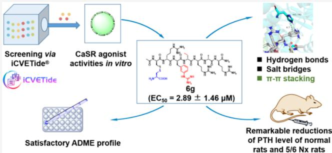
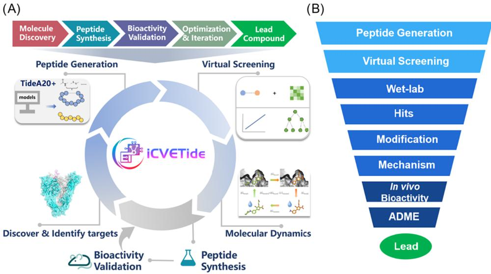
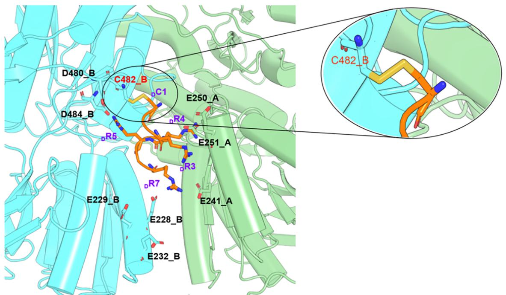
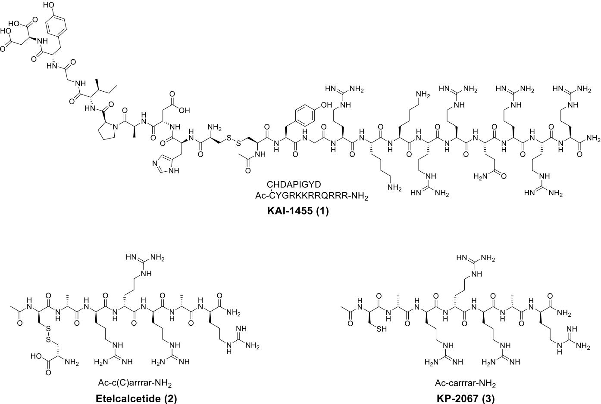
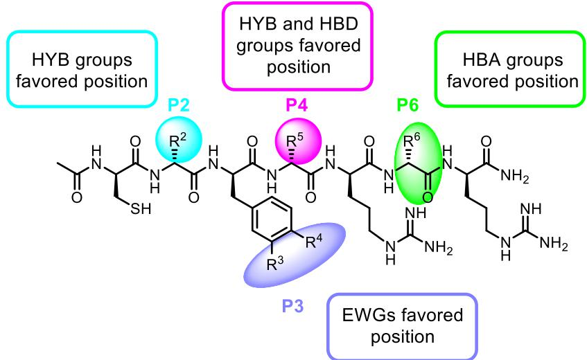
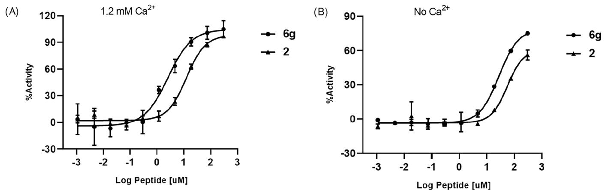
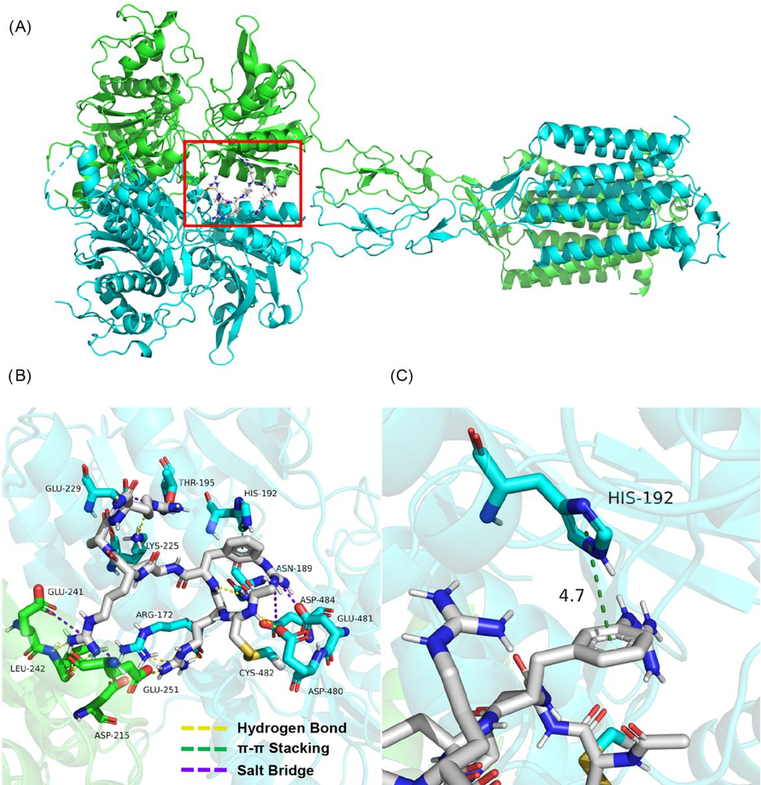
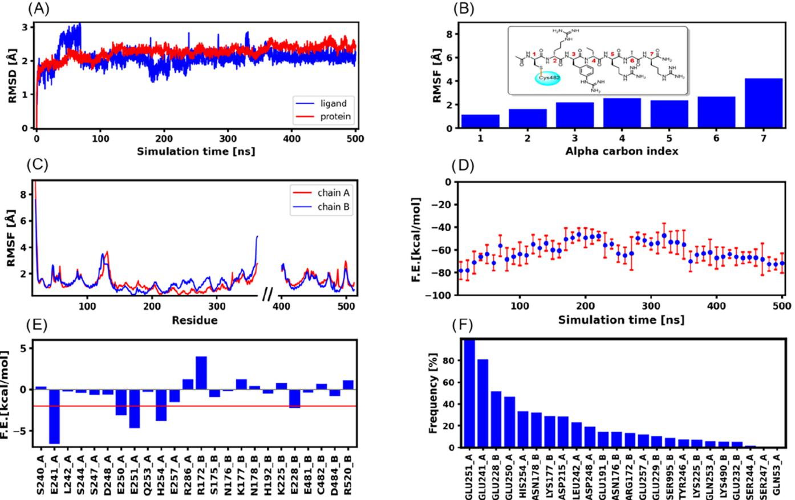
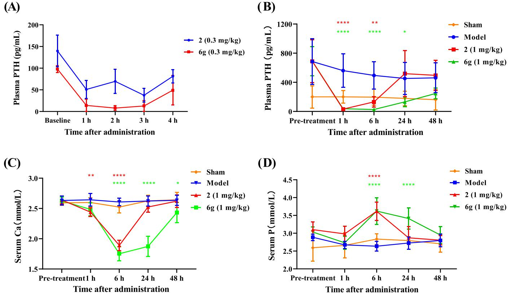

# Discovery of CaSR Peptide Agonists via Multistage Screening: In Silico Design, In Vitro Validation,and In Vivo Efficacy

Published as part of Journal of Medicinal Chemistry special issue “Peptide Therapeutics." Yu Yuan, Yuqing Guan, Lin Zhou, Bo Huang, Haixia Liu, Xiaobin Qin, Xuan Tang, Guangpeng Xue, Binbin Xu, Yinghao Pan, Xiaomin Liu, Zhen Shi, Lan Zhang,\* Guangpeng Meng,\* and Yuanbo Li\*

Cite This: https://doi.org/10.1021/acs.jmedchem.5c01119

# Read Online

# ACCESS |

l Metrics&More

# 回Article Recommendations

ABSTRACT: Human calcium-sensing receptor (CaSR) is a class C G protein-coupled receptor (GPCR） that directly regulates parathyroid hormone release and maintains calcium homeostasis. The discovery of potent CaSR agonists with computer-aided drug design (CADD） has been appealing. Herein， we report the discovery of a series of new CaSR agonists by enhancing the molecular binding affinity through the replacement of key residues via the iCVETide platform. $\mathrm { \bar { A } c - _ { D } - C y \bar { s } ( \bar { \Omega } _ { L } - C y s ) _ { \bar { - } D } - A r g _ { \bar { - } D } } .$ (3-Gu)- Phe- $\mathrm { D }$ $\mathrm { \partial _ { \mathrm { J } } \mathrm { - A b u _ { \mathrm { - D } } \mathrm { - A r g _ { \mathrm { - D } } \mathrm { - A l a _ { \mathrm { - D } } \mathrm { - A r g _ { \mathrm { - } N H _ { 2 } } } } } } }$ (compound $\mathbf { 6 9 }$ ）with an outstanding activity and a satisfactory ADME profile is discovered, and the interaction mode between ${ \bf 6 9 }$ and CaSR is elucidated through

SI Supporting Information

molecular docking and molecular dynamics simulations,showing hydrogenbonds，salt bridges,and $\pi - \pi$ stacking. In addition, ${ \bf 6 9 }$ is capableof activating human CaSR as acalcimimetic positivealosteric modulator. Our results provide a viable alternative to approved calcimimetics and a novel protocol for the discovery of CaSR agonists.

# INTRODUCTION

Chronic kidney disease (CKD） disrupts mineral balance, characterized by dysregulated calcium and phosphorus metabolism. One of its representative complications is secondary hyperparathyroidism,(SHPT).1 The parathyroid gland constantly secretes excessive parathyroid hormone (PTH) in SHPT to normalize the reduced level of blood calcium,leading to the elevated level of PTH, which is linked to dysregulation of serum Ca, P,and fibroblast growth factor 23 (FGF-23).² SHPTcauses cardiovascular disease,immunodeficiency, glucose intolerance, muscle weakness,and abnormalities ofhematopoietic system, all of which might influence the length and quality oflife.’ Thus, the discovery of novel potent drugs for the treatment of SHPT is of great importance. Calcium-sensing receptor (CaSR),a potential therapeutic target for SHPT,is a G protein-coupled receptor (GPCR）expressed abundantly in parathyroid glands and is crucial for sustaining calcium homeostasis through regulation of PTH secretion and stimulation of renal calcium reabsorption.4- 6 Currently, four calcimimetic positive allosteric modulators (PAMs)of CaSR, cinacalcet, etelcalcetide,evocalcet, and upacicalcet,are clinically used for the treatment of SHPT.7,8 Among them, the binding site of upacicalcet has been identified on the interdomain cleft of the VFT domain, similar to the binding site of L-Trp,while cinacalcet and evocalce have been shown to interact with residue E837 on the seven-transmembrane-helix domain （7TM）of $\mathrm { C a S R } ^ { 8 - 1 1 }$ Of note, the binding between Etelcalcetide (Figure 3,peptide 2) and C482 ontheextracedomaseepreeol launched peptide drug,Etelcalcetide has distinct advantages. For instance，Etelcalcetide has no obvious impact on cytochrome P45o (CYPs),while cinacalcet is a strong inhibitor of CYP2D6.Moreover，Etelcalcetide offers better patient compliance with intravenous administration three times per week, compared with the daily oral regimen for cinacalcet and evocalcet.Last but not least,Etelcalcetide has better clinical efficacy in lowering PTH concentrations in SHPT patients receivinghemodialysis7416Inspiredbythesafetyadecacy of Etelcalcetide,the development of novel peptides has attracted more and more attention.

Traditional discovery method for lead compound is highly accidental and one-sided, with heavy research workload, long cycle,and high cost, while the success rate of clinical candidate compounds is lower than 15%.17-20 Owing to advancements in computational chemistry, computer-aided drug design (CADD) brings new opportunities for drug discovery. Although great advancements have been made in CADD,vast databases such as the ZINC database,the PubChem database,and the BindingDB database are still needed for the drug discovery of small molecules.21-24 Contrast to small molecules, structure-based CADD methods like molecular docking are full of the “fold and dock”challenge for peptides，since they may adopt specific conformations prior to binding.25 It is interesting to employ the molecular docking score to help the discovery of a lead compound. However, there has been no report of the discovery of a CaSR agonist via CADD in the literature.

  
Figure1.(A)Closed-loop workflowof theiCVETide platform. (B)WorkflowofCaSRagonistdiscoveryusing theiCVETideplatfor

  
Figure 2.Interactions between Etelcalcetide and active-state human CaSR (PDB ID:7M3G). Chain A and chain Bof $\mathrm { C a S R } ,$ represented in a cartoon, arecoloredbydbueespectielyindingresidustatiterctithEelalcetideaelbeledsmiocidbreviationsiedex chain name.”Etelcalcetide shown by stick is colored orange.D-amino acids are denoted by prefixes.

Computational techniques have revolutionized drug design, aimed at increasing the accuracy of simulation, developing new algorithms,creating diverse databases, improving the generalization ability of models,and building more reliable scoring functions.The iCVETide platform integrates five functionalities for drug design, from Molecule Discovery to Lead Compound, seamlessly integrating computational and wet-lab approaches (Figure 1A).Specifically,the workflow for the designated target begins with molecular generation using the function TideA ${ \mathcal { 2 } } 0 +$ followed by induced-fit docking to predict binding modes and affinities. Selected peptides were subjected to molecular dynamics (MD） simulations to investigate their stabilities and reveal their binding modes at the atomic level. Candidates demonstrating high affinity and stability are prioritized for synthesis and experimental validation in wet-lab assays.The wetlab results are fed back into the modification stage,and refined molecules are re-evaluated through MD simulations. This iterative process forms a closed-loop optimization cycle, until the desired molecules are achieved. The iCVETide platform covers the entire lead compound discovery process from molecular screening and molecular synthesis to bioactivity validation, providing a one-stop solution for drug discovery.

  
Figure3.ChemicalsructuresofK-455(1),Etelcacetide(2),andK7(3).One-leteramnocidbbreviatio:owe ${ \bf \tau } = { \bf D }$ -amino acids: uppercase $=$ L-amino acids.

Herein, a series of peptides was discovered by using the CADD-based iCVETideplatform to explore novel CaSR agonists.The goal of this study is to discover a lead peptide with superior agonist activity and druggability and elucidate the molecular mechanism of the peptide CaSR agonist. Various peptides with modified backbones were explored through molecular docking and agonist activity screening.Preferred peptides with disulfide bonds were evaluated in vitro.Eventually, peptide 6g, a positive allosteric modulator, exhibits promising agonist activity in vitro and an excellent effect of PTH reduction in vivo compared with Etelcalcetide.

# RESULTS AND DISCUSSION

Design and Chemistry.The crystal structure of active-state CaSR complex bound with Evocalcet and Etelcalcetide (PDB ID code:7M3G)13 reveals a covalent interaction between Etelcalcetide and C482 on the extracellular domain of CaSR by exchanging out the $\mathrm { L }$ -cysteine,as shown in Figure 2.Meanwhile, residues ${ } _ { \mathrm { \Omega } \mathrm { { D } } ^ { - } } \mathrm { { A r g } } 3$ $\scriptstyle \mathrm { p } ^ { - \mathbf { A r g 4 } }$ $\scriptstyle \mathrm { p } ^ { - \mathbf { A r g } 5 }$ ,and $\mathrm { p } { \cdot } \mathrm { A r g } 7 $ ）form salt bridges with acidic residues (D215,E228,E241,E251,E481,D480,and D484) on the extracelular domain.13The discovery and development of Etelcalcetide (Figure 3，peptide 2） started with a cysteine-containing polycationic peptide KAI-1455 (Figure 3, peptide1),26timized withdoublealain containing peptide Ac-carrrar $\mathrm { { N H } } _ { 2 }$ (Figure 3,KP-2067, peptide 3).27 Consequently， peptide design was implemented using peptide 3 as a template through functionalities of the iCVETide platform.As shown in Figure 1B，the designed peptides underwent a molecular docking and ranking procedure (virtual screening).Peptides exhibiting lower binding free energies than the template peptide were further evaluated through wet-lab experiments. Hit candidates were then selected and structurally optimized for improved druggability. With the superior peptide in hand, molecular simulations were performed to elucidate the binding mechanism. Finally,the lead compound was obtained by evaluation of bioactivity in vivo and ADME.

Initially, we modified peptides based on peptide 3 at position 3 by inserting aromatic groups to the arginine side chain (modifed peptides can be seen in Table 1). Peptides featuring different aromatic groups at the arginine residue (position 3) might offer increased opportunities for $\pi - \pi$ or $\pi { - } \mathrm { H }$ interactions,which would facilitate protein-ligand interactions. The designed peptides were screened through MM/GBSA score,as previous work investigating molecular docking suggests that Schrodinger MM/GBSA scores yielded a Pearson's correlation coefficient $( R )$ of 0.67 against the $\operatorname { E C } _ { 5 0 }$ fold derived from the in vitro $\mathrm { E C } _ { 5 0 }$ activity.28 Subsequently， positions 2, 4, and 6 were explored with steric residues,valine (Val),and 2- aminobutyric acid (Abu).Additionally，investigations were carried out on selected peptide backbones with disulfide bonds.

Linear peptide sequences were assembled using conventional Fmoc-based SPPS on Rink amide resin， followed by resin cleavage with TFA and preparative high-performance liquid chromatography (HPLC） purification，as illustrated in the $^ { a } \mathrm { E C } _ { 5 0 }$ values are mean $\pm \nobreakspace \mathrm { S D }$ $\left( n = 2 \right)$ ）

Table 1. CaSR Agonist Activities and MM/GBSA Scores of Peptides 4a-4e with Modifications at Position $3 ^ { a }$   

<table><tr><td colspan="4">HO O H 1 H O X3- H H H NH2 0 0 0 SH NHO NH NH2 H NH2 H</td></tr><tr><td>Peptides</td><td>X3</td><td>EC50 (μM)</td><td>Score (kcal/mol)</td></tr><tr><td>3</td><td>NH NH2</td><td>2.03</td><td>-55.10</td></tr><tr><td>4a</td><td>NN</td><td>1.23</td><td></td></tr><tr><td>4b</td><td>双 L HN</td><td>0.27</td><td></td></tr><tr><td>4c</td><td>美 HN HN</td><td>2.09</td><td>-63.53</td></tr><tr><td>4d</td><td>HNNH HN</td><td>1.65</td><td>-58.01</td></tr><tr><td>4e</td><td>HN, =NH H2N</td><td>0.59</td><td>-69.74</td></tr></table>

Experimental Section. The target peptides were afforded in 51- $7 6 \%$ yield.

Structure-Activity Relationships (SARs) of Peptides. Based on the MM/GBSA scores derived from molecular docking, the scores for designed peptides with SH are lower than those of peptide 3 (Tables 1, 2,and S3). Subsequently, the peptides were selected for synthesis and wet-lab evaluation.To enhance the druggability of the screened candidates,we further modified the SH residue using capping groups to form disulfide bonds, resulting in peptide derivatives (Tables 3 and S3).

To evaluate CaSR activation of score-qualified peptides, we measured IP1 accumulation in CaSR-HEK cells using the HTRF IP1 assay.29.30The wet-lab $\mathrm { E C } _ { 5 0 }$ results are shown in Tables 1-3, S3, and S4. Ac $\mathrm { \Delta T }$ -Cys- $\mathrm { \Delta D ^ { - A l a - } D }$ (4-Gu)-Phe $\mathrm { \Delta T }$ -Arg-D-Arg-D$\mathrm { \cal A l a _ { \mathrm { - } D } { - } A r g { - } N H _ { 2 } }$ (Table 1,compound 4a) and $\mathsf { A c } _ { \mathrm { - D } } \mathrm { - C y s _ { \mathrm { - D } } \mathrm { - A l a _ { \mathrm { - D } } \mathrm { - } } }$ (3-Gu)-Phe $\mathrm { \partial _ { D } \mathrm { - A r g _ { \mathrm { - D } } \mathrm { - A r g _ { \mathrm { - D } } \mathrm { - A l a _ { \mathrm { - D } } \mathrm { - A r g _ { \mathrm { - N H _ { 2 } } } } } } } }$ (compound 4b), which contain a guanidine $\left( \mathrm { G u } \right)$ group at para and meta positions of the benzene ring, showed improved agonist activity with $\operatorname { E C } _ { 5 0 }$ values of 1.23 and $0 . 2 7 \ \mu \mathrm { M }$ , respectively. However, when a Gu group was fixed at the meta position of the benzene ring, $\mathrm { E C } _ { 5 0 }$ values of Ac- $\mathrm { \Delta T }$ -Cys- $\mathrm { \Delta D ^ { - A l a - } D }$ (3-Gu-4-R)-Phe $\mathrm { \Delta T }$ -Arg-D$\mathrm { A r g \mathrm { - } _ { D } \mathrm { - } A l a \mathrm { - } _ { D } \mathrm { - } A r g \mathrm { - } N H _ { 2 } }$ $\left( 4 \mathbf { c } \mathbf { - } 4 \mathbf { e } \right)$ with various substituents $\mathbf { \tau } ( \mathbf { R } )$ at the para position of the benzene ring, such as methyl, Cl,and F, were between 0.59 and $2 . 0 9 \mu \mathrm { M }$ , suggesting that the presence of electron-withdrawing groups (EWGs) would be favorable.With modifications at position 3 in hand, Ac- $\mathrm { \Delta } ^ { \mathrm { \cdot } } \mathrm { D }$ -Cys- $\mathbf { \cdot X } _ { 2 ^ { \mathrm { - D } ^ { \prime } } }$ (3-Gu)-Phe$\mathrm { \bf X _ { 4 ^ { - } D ^ { - } } A r g { - } } \mathrm { \bf X _ { 6 ^ { - } D ^ { - } } A r g { - } } \mathrm { \bf N H } _ { 2 }$ (Table 2,5a-5d) with bulkier side chains at positions 2,4,and 6 exhibited advantageous agonist activities than peptide 3,while slightly less than 4b.Ac $\mathrm { \Delta \cdot _ { D } }$ -Cys$\mathrm { X _ { 2 ^ { - } D ^ { - } } ( 3 \mathrm { - G u ) \mathrm { { \mathrm { - } P h e \mathrm { { - } } X _ { 4 ^ { - } D } \mathrm { { - } A r g \mathrm { { - } _ { D } \mathrm { { - } A l a \mathrm { { - } _ { D } \mathrm { { - } A r g \mathrm { { - } \mathrm { { N H } _ { 2 } } } } } } } } } } } }$ $\left( 5 \mathbf { e } { - } 5 \mathbf { h } \right)$ showed similar agonist activities，indicating that heterocyclic or noncyclic replacement at positions 2,4,and 6 had relatively little effect of the agonist activity. On the other hand, $\mathsf { A c } _ { \mathrm { ^ - D } } .$ $\mathrm { C y s ( X _ { 8 } ) _ { \mathrm { \overline { { ~ } } D } } \mathrm { - A l a _ { \mathrm { \overline { { ~ } D } } } } }$ -(3-Gu)-Phe- $\mathrm { \Delta _ { D } { ^ { - A r g - } D ^ { - A r g - } D ^ { - A l a - } D ^ { - A r g - N H _ { 2 } } } }$ (Table 3,6a-6c) based on 4b with disulfide bonds showed varied agonist activities.The agonist activity of peptide 6a with $^ { a } \mathrm { E C } _ { 5 0 }$ values are mean ± SD ${ ( n = 2 ) }$ ）

Table 2.CaSR Agonist Activities and MM/GBSA Scores of Peptides 5a-5h with Modifications at Positions 2,4,and ${ \pmb 6 } ^ { a }$   

<table><tr><td></td><td>X O SH</td><td>H H H HN</td><td>X4 NH HN</td><td>X NH NH2 N</td><td>NH2 NH N NH2</td><td></td><td></td></tr><tr><td>Peptides</td><td>X</td><td></td><td>X4 HNNH</td><td></td><td>X6</td><td>EC50 (μM)</td><td>Score (kcal/mol)</td></tr><tr><td>4b</td><td>的</td><td></td><td>N</td><td>的</td><td></td><td>0.27</td><td>-68.61</td></tr><tr><td>5a</td><td>H2NNH NH 的</td><td></td><td>新</td><td>有</td><td></td><td>0.30</td><td>-71.70</td></tr><tr><td>5b</td><td>HzNNH NH 的</td><td></td><td>Y</td><td>的</td><td></td><td>0.41</td><td>-60.55</td></tr><tr><td>5c</td><td>的</td><td></td><td>HNNH NH Y</td><td></td><td></td><td>0.53</td><td>-77.59</td></tr><tr><td>5d</td><td>H2NNH NH 品</td><td>3</td><td>X</td><td>HO 茶</td><td></td><td>0.71</td><td>-78.45</td></tr><tr><td>5e</td><td>H2NNH NH</td><td></td><td>m</td><td>的</td><td></td><td>0.50</td><td>-65.52</td></tr><tr><td>5f</td><td>都 HzNNH _NH </td><td>8</td><td>名</td><td>的</td><td></td><td>0.44</td><td>-70.44</td></tr><tr><td>5g</td><td>H2NNH N</td><td></td><td>福</td><td>的</td><td></td><td>0.89</td><td>-66.32</td></tr><tr><td>5h</td><td>有 茶</td><td></td><td>HNNH N 武 Y</td><td>的</td><td>1.17</td><td></td><td></td></tr></table>

$\mathrm { ~  ~ \cal ~ L ~ } ^ { \prime }$ -cysteine was remarkably superior to those of 6b and 6c. Additionally，several prominent backbones were selected to connect with $\mathrm { ~ L ~ }$ -cysteine.As expected, $\mathrm { A c \mathrm { - } _ { D } \mathrm { - } C y s ( \mathrm { _ { L } \mathrm { - } C y s ) \mathrm { - } \mathrm { X _ { 2 } \mathrm { - } _ { D } \mathrm { + } } } }$ (3- Gu)-Phe $\mathrm { \cdot X _ { 4 ^ { - } D ^ { - } } A r g _ { \mathrm { - D ^ { - } } } A l a _ { \mathrm { - D ^ { - } } } A r g _ { \mathrm { - } } N H _ { 2 } }$ $\bf ( 6 d - 6 g )$ all maintained high agonist activities and showed better $\operatorname { E C } _ { 5 0 }$ values than peptide 2. Among this class, peptide ${ \bf 6 9 }$ stood out with an $\operatorname { E C } _ { 5 0 }$ value of $1 . 4 5 ~ \mu \mathrm { M } ,$ ，which showed 8.8-fold more potency than peptide 2.Furthermore，based on three-dimensional (3D)

QSAR (Figures S1 and S2)，the SARs of peptides are summarized in Scheme 1,indicating that position 2 favored hydrophobic (HYB）groups，position 3 advocated EWGs, position 4 preferred HYB and hydrogen bond donor (HBD) groups, and position 6 favored hydrogen bond acceptor (HBA) groups.

Principal Component Analysis (PCA). Figure 4 displays the clustering of all peptides in this study using PCA. Peptides $^ { a } \mathrm { E C } _ { 5 0 }$ values are mean ± SD ${ ( n = 2 ) }$ with modifications at the same position cluster tightly within distinct groups.2 (Etelcalcetide） exhibits a unique structural profile in the clustering and thus forms an independent group. Peptides modified at position 3 (4a-4e） exhibit structural similarity to peptide 3 and therefore cluster closely together, with the exception of 4b,which falls within the cluster containing Sa-Sh. 5a-5h,which have modifications at positions2,4,and 6,form two closely related clusters in the PCA analysis. ${ \bf 6 a - 6 g }$ exhibit significant variability in their affinities despite their structural similarity,suggesting that even

Table 3. CaSR Agonist Activities and MM/GBSA Scores of Peptides ${ \bf 6 a - 6 g }$ with Disulfide Bondsa   

<table><tr><td>Peptides</td><td>Structures</td><td>EC50 (μM)</td><td>Score (kcal/mol)</td></tr><tr><td>2</td><td>NH H H H NH2 H 1 N 0 H 0 ！ s N NH NH NH2 COOH H2NNH H H2N</td><td>12.75</td><td>-43.86</td></tr><tr><td>6a</td><td>。 H H H H N 0 H H2N COOH HN =NH H2N</td><td>H 1 NH2 2.91 N NH2 NH2</td><td>-36.50</td></tr><tr><td>6b</td><td>H2NNH H 。 H N ！ 4 8 6 H2N HN COOH NH H2N</td><td>H N NH2 NH2 N</td><td>9.61 -34.48</td></tr><tr><td>6c</td><td>H2NNH H H i N N N ！ N H COOH HN, =NH H2N</td><td>H 员 NH2 42.43 N NH2 N NH2</td><td>-34.02</td></tr><tr><td>6d</td><td>HNNH NH H 0 H H N H H 0 0 0 s N H2N COOH HN. NH NH2</td><td>H NH2 NH2 N NH2</td><td>2.36 -40.37</td></tr><tr><td>6e</td><td>H2NNH NH H N i H H N N N 0 0 0 S−s NH2 N H2N COOH NH</td><td>1 NH2 6.26 N</td><td>-48.11</td></tr><tr><td>6f</td><td>HNNH NH H H H N H s W NH2 H2N COOH HN、 NH NH</td><td>H NH2 1.60 N NH2</td><td>-49.85</td></tr><tr><td>6g</td><td>N H NH2 N NH2 N HNCOOH NH NH2</td><td>1.45 NH2</td><td>-59.38</td></tr></table>

Scheme 1.ARs ofPeptides.P2,P3,P4andP6RepresentPositions2,3,4,and6,Respectively.HBA: Hydrogen BondAccetor HYB: Hydrophobic; HBD: Hydrogen Bond Donor; EWGs: Electron-Withdrawing Groups

  
Figure 4.PCA clustering analysis of all peptides,where each peptide is colored according to its $\mathrm { E C } _ { 5 0 }$ value,utilizing the top two principal components (PC1 and PC2).PC1 and PC2 are annotated with their respective variance ratios,and each peptide is identified by its specific code.

minor modifications involving disulfide bonds can lead to substantial differences in $\mathrm { E C } _ { 5 0 }$ .As for the mechanism of the agonist, we wondered whether ${ \bf 6 9 }$ could allosterically modulate CaSR. Therefore, we performed the following agonist activity experiment in vitro with and without exogenous calcium.

Evaluation of 6g for Agonist Activity In Vitro with and without Supplemental Calcium.Dose-response experiments in HEK-293T cells expressing human CaSR demonstrated that ${ \bf 6 9 }$ induced IP1 accumulation in a concentrationdependent manner, exhibiting an $\operatorname { E C } _ { 5 0 }$ of $2 . 8 9 \pm 1 . 4 6 \mu \mathrm { M }$ at 1.2 $\mathrm { m } \bar { \bf M } { \bf C } \mathsf { a } ^ { 2 + }$ (Figure SA, Table 3, S3,and S4).As shown in Figure 5, the CaSR agonist activity of ${ \bf 6 9 }$ was also detected in the absence of calcium, while the potency $( \mathrm { E C } _ { 5 0 } )$ of ${ \bf 6 9 }$ was approximately 10-foldlower than that observed in the presence of $\bar { 1 . 2 } \mathrm { m M } \mathrm { C a } ^ { 2 + }$ That is, ${ \bf 6 9 }$ and Etelcalcetide had similar modes of CaSR activation,31,32 indicating that ${ \bf 6 9 }$ isa positive allosteric modulator for CaSR.

Molecular Docking. To explain the potency of $\mathbf { 6 9 } ,$ molecular docking was conducted based on the previous studies. Interestingly, 6g bound to the same binding site of CaSR (PDB ID: 7M3G)13 with Etelcalcetide (Figure 6A). The result of analyzing interactions between CaSR and ${ \bf 6 9 }$ showed that many hydrogen bonds were formed between them, which are the main driving forces for binding(Figure 6B).As forbinding free energy of ligand and CaSR, ${ \bf 6 9 }$ showed its score was $- 5 9 . 3 8 \mathrm { k c a l / m o l } ,$ relatively lower than calculated Etelcalcetide's score $( - 4 3 . 8 6 $ $\mathbf { k c a l / m o l } )$ ,indicating a stronger interaction between CaSR and 6g. Specifically,hydrogen bonds were formed between ${ \bf 6 9 }$ and Lys225, $\mathrm { G l u 4 8 1 }$ of chain $\mathbf { A } ,$ and Asp215,Leu242，Arg172, Asn189,and Thr195 of chain B. The guanidyl groups of ${ \bf 6 9 }$ formed salt bridges with $\mathrm { G l u } 2 4 1$ and $\mathrm { G l u } 2 5 1$ of chain A,and $\mathrm { G l u } 2 2 9$ ，Asp480,and Asp484 of chain B.Interestingly，the phenyl group of ${ \bf 6 9 }$ formed $\pi - \pi$ stacking interaction with the aromatic group of His192 of CaSR chain B (Figure 6C).And a disulfide bond was formed between S of the ${ \bf 6 9 }$ side chain and $\mathrm { C y s 4 8 2 }$ of chain B of CaSR.

  
Figure 5. (A) In the presence of $1 . 2 \mathrm { m M } \mathrm { C a } ^ { 2 + }$ $n = 5 .$ Data are mean $\pm \ : \mathrm { S D }$ $\mathrm { E C } _ { 5 0 } \left( 2 \right) = 1 2 . 5 9 \pm 1 . 3 7 \mu \mathrm { M } ,$ $\mathrm { E C } _ { 5 0 } \left( 6 \mathrm { g } \right) = 2 . 8 9 \pm 1 . 4 6 \mu \mathrm { M } .$ (B)No ${ \mathrm { C a } } ^ { 2 + }$ $n =$ 3. Data are mean $\pm \mathrm { \ S D }$ $\begin{array} { r } { \mathrm { E C } _ { 5 0 } \left( 2 \right) = 5 7 . 5 2 \pm 1 2 . 6 9 \mu \mathrm { M } , } \end{array}$ $\mathrm { E C } _ { 5 0 } \left( 6 \mathbf { g } \right) = 2 7 . 7 0 \pm 1 . 7 2 \mu \mathrm { M }$

  
Figure 6.Interactions are shown between CaSR (PDB ID: 7M3G) and 6g.The residues that interacted with ${ \bf 6 9 }$ and the entire structures of chain Aand chain B of CaSR are shown in stick and cartoon representations with greenand blue colors,respectively.The structure of ${ \bf 6 9 }$ is shown in the stick representation with the color gray. (A) Overview of the binding structure of $\mathrm { C a S R }$ and $\mathbf { 6 9 } ,$ where ${ \bf 6 9 }$ is shown in a red rectangular box. (B） The interactions of the binding mode of ${ \bf 6 9 }$ to CaSR were based on molecular docking.Yellow dotted lines,hydrogen bonds of side chain; green dotted lines, $\pi - \pi$ stacking betweenthe phenyl ring and the aromatic group; purple doted lines,salt bridges. (C) $\pi - \pi$ stacking interaction is shown between the phenyl ring of ${ \bf 6 9 }$ and the aromatic group of His192 of CaSR chain B.

Molecular Dynamics (MD) Simulations.To further investigate the binding stability of the CaSR-6g complex obtained by molecular docking, MD simulation was performed. The root-mean-square deviations (RMSDs）of both CaSR (PDB ID: 7M3G)13 and ${ \bf 6 9 }$ were evaluated through a $5 0 0 ~ \mathrm { n s }$

MD simulation (Figure 7A). The mean values of RMSDs of CaSR and ${ \bf 6 9 }$ are all under $2 . 5 \mathring { \mathrm { A } } ,$ where the RMSD of CaSR is slightly higher, indicating a reasonably stable binding,which further validates the docking process.Additionally,the MM/ GBSA binding free energy of ${ \bf 6 9 }$ $\left( - 6 1 . 6 \mathrm { \ k c a l / m o l } \right)$ obtained from 500 ns MD simulation is comparable to the result of the docking procedure (Table S3, $- 5 9 . 3 8 \mathrm { \ k c a l / m o l } _ { , }$ ). The rootmean-square fluctuations (RMSFs) of both CaSR and peptide ${ \bf 6 9 }$ were further examined,as shown in Figure 7B,C.The RMSF of ${ \bf 6 9 }$ was overall under $4 \mathring { \mathrm { A } }$ ,except $\alpha$ carbon on the C-terminal at position 7 with a slightly high fluctuation around $4 . 2 5 \mathring { \mathrm { A } } .$ RMSFs of two chains of CaSR,chains Aand B,were measured within the extracellular domain (ECD,PDB residue index 20-362 and 391-512),13 the domain forming a binding pocket for peptides. Residues from these two chains displayed reasonable stability along Soo ns MD production, with residue indices within $^ { 1 5 0 - }$

  
Figure 7. (A) RMSDs of CaSR (PDB ID: 7M3G) and peptide 6g; (B) RMSFs of peptide 6g using $\alpha$ carbons of backbone; (C) RMSFs of CaSR ECD, including chain Aand chain B (PDB residue index $2 0 - 3 6 2$ and 391-512); (D) binding free energy (F.E.) convergence of peptide ${ \bf 6 9 }$ through 500 ns MDproducti;ofeals $\mathbf { k c a l / m o l } ;$ ： (F) hydrogen bond analysis between CaSR and peptide ${ \bf 6 9 }$ displaying frequency through 500 ns MD production.

320 showing remarkable stability under $1 . 5 \mathring \mathrm { A }$ The notable high values of RMSF in the beginning of Figure 7C (from left to right）are of the N-terminal of $\mathrm { C a S R } ,$ which is without any restraints and far away from the binding pocket.

The convergence and per-residue decomposition of the binding free energy are presented in Figure 7D,E.The total MMGBSA binding free energy stabilized around $- 7 0 \mathrm { k c a l / m o l }$ after simulation for approximately 400 ns of simulation. Although a slight decrease was observed during the final 1oO ns, the overall free energy profile indicates convergence by the end of the trajectory (Figure 7D). The per-residue decomposition of peptide 6g's binding free energy is shown in Figure 7E. Key residues contributing significantly to the binding include E241, E250,E251,H254,and E228,which are largely consistent with the hydrogen bond analysis (Figure 7F). Key binding residues E241,E251,and E228 form salt bridges with peptide ${ \bf 6 9 }$ with frequencies of 81, 99,and $5 2 \%$ ,respectively;whereas, residues E250 and H2S4 form hydrogen bonds with occurrences of 47 and $3 3 \%$ ,respectively.Residue C482, which is known to form a covalent bond based on experimental evidence (crystal structure PDB ID: 7M3G), is essential for the binding of the peptide.13 In our MD simulations, we assumed a covalent bond between ${ \bf 6 9 }$ and C482 to approximate the real binding mode in vivo. However, due to computational limitations,we did not explicitly quantify the energetic contribution of the covalent interaction. The introduction of an aromatic ring into the arginine at position 3 of peptide ${ \bf 6 9 }$ might enhance the stability of ligand binding through the formation of a $\pi - \pi$ interaction with residue

H192 in chain B.Compared with interactions of the crystal structure (PDB ID: 7M3G),13 the interactionsof ${ \bf 6 9 }$ and CaSR featured salt bridges,additional hydrogen stacking,and lower MM/GBSA binding free energy,which supported the excellent potency of ${ \bf 6 9 }$ in vitro. With these expected results,we were inclined to further evaluate the potency in vivo.

Evaluation of 6g for PTH Level in Normal Rats. Singledose administration of ${ \bf 6 9 }$ $\left( 0 . 3 \mathrm { \ m g / k g } \right)$ for PTH levels was evaluated in normal rats.The relative plasma PTH levels were significantly reduced versus the Etelcalcetide group at $^ { 1 \mathrm { ~ h ~ } }$ postdose (Figure 8A and Table S9).Plasma PTH concentration in the ${ \bf 6 8 } \left( 0 . 3 \mathrm { m g / k g } \right)$ group continued to decrease before rising at $^ \textrm { \scriptsize 4 b }$ postdose. Notably, ${ \bf 6 9 }$ demonstrated a greater PTHlowering efficacy than Etelcalcetide at the equivalent dose (0.3 $\mathrm { { m g / k g } ) }$ ：

Evaluation of 6g for PTH Level in 5/6 Nephrectomized Rats (5/6-Nx Rats).To further demonstrate the in vivo potency, 5/6-Nx rats were selected as an animal model of SHPT.The 5/ 6-Nx model has been found to produce serum creatinine levels and PTH levels which are significantly different than control animals. Remarkably,hyperparathyroidism is a feature of this model.33 Before administration of 6g,PTH, creatinine,andurea nitrogen of model animals were higher than those of normal rats. Among, the mean plasma PTH concentration was approximately $7 0 0 ~ \mathrm { p g / m L } ,$ ，3.5 times higher than that in normal rats. Therefore，the ${ 5 / 6 } –  { \mathrm { N } } _ { \mathbf { X } }$ model was established as a valid pathological representation of CKD with SHPT.We evaluated the pharmacodynamic effects of single doses of ${ \bf 6 9 }$ in this model under high $\mathrm { P }$ dietary conditions (baseline characteristics in Tables S10-S12). Single-dose administration of ${ \bf 6 9 }$ $\left( 1 ~ \mathrm { m g / k g } \right)$ produced significant and sustained biochemical changes: Marked PTH reductions at 1 and $^ { 6 \mathrm { ~ h ~ } }$ postdose (Figure 8B and Table S1O),with effects persisting for $2 4 \ \mathrm { h } ,$ substantially longer than equivalent-dose Etelcalcetide (6 h duration); significant serum Ca reductions at $1 \mathrm { { h } }$ postdose,maintained for $4 8 \mathrm { { h } }$ (Figure 8C and Table S11); biphasic responses of serum P concentration (Figure 8D and Table S12). These findings align with prior reports in which the effect of $3 \mathrm { m g / k g }$ Etelcalcetide decreased PTHand Calevels,and modulatedPlevels in ${ 5 / 6 } –  { \mathrm { N } } _ { \mathbf { X } }$ rats.34 Based on complex P regulation involving both bone and renal mechanisms,5 serum $\mathrm { P }$ decreased at $^ { 1 \mathrm { ~ h ~ } }$ postdose likely due to inhibited P mobilization from bone,and subsequently increased at $^ { 6 \mathrm { ~ h ~ } }$ postdose presumably from enhanced renal reabsorption following PTH suppression.The prolonged PTH suppression by ${ \bf 6 9 }$ $\mathrm { ( 1 ~ m g / k g ) }$ versus Etelcalcetide at the same dose indicates enhanced inhibition of bone-derived calcium release and more durable PTH suppression.

  
Figure 8. (A) Effects of ${ \bf 6 9 }$ （号 $( 0 . 3 \mathrm { m g / k g } )$ and Etelcalcetide onPTHconcentrations in normal rats; (B) effects of ${ \bf 6 9 }$ $\bf { \Omega } _ { 1 } \mathrm { m g / k g } )$ on plasma PTH levels in ${ 5 / 6 } –  { \mathrm { N } } _ { \mathbf { X } }$ SHPT model under high Pdietary conditions; (C) effects of ${ \bf 6 9 }$ $\mathrm { ( 1 m g / k g ) }$ on serum calcium levels in ${ 5 / 6 } –  { \mathrm { N x } }$ rats maintained on a high $\mathrm { P }$ diet; (D) effets of ${ \bf 6 9 }$ 0 $\bf { \Omega } _ { 1 } \arg / k g )$ on serum P levels in ${ 5 / 6 } –  { \mathrm { N x } }$ SHPT model with high dietary Pintake. \*， $^ { * * }$ $^ { \ast \ast \ast }$ $^ { \ast } { ^ { \ast } \ast \ast \ast }$ $P < 0 . 0 5$ ,0.01,0.001,0001 vs model.

Evaluation of 6g for CYP Inhibition in Human Liver Microsomes (HLMs)，Metabolic Stability，and Plasma Stability.Based on the results of agonist effect in vitro and in vivo，we next assessed the CYP inhibition in human liver microsomes,metabolic stability,and plasma stability of 6g. In human liver microsomes (HLMs),6g showed $\mathrm { I C } _ { 5 0 }$ values ${ > } 5 0$ $\mu \mathbf { M }$ against CYP1A2, 2C9,2C19, 2D6,and 3A4 (Table S6), indicating that no apparent inhibition of these CYP enzymes was observed.In addition,the inhibitory potential of Etelcalcetide was consistent with the historical values.36 Then,metabolic stability studies in HLMs and rat liver microsomes (RLMs) at 5 $\mu \mathbf { M }$ revealed comparable stability between ${ \bf 6 9 }$ and Etelcalcetide (Table S7). The remaining concentrations of ${ \bf 6 9 }$ at $6 0 \mathrm { { m i n } }$ were around $3 5 \%$ in HLMs and RLMs regardless of NADPH supplementation.And as a control, the acidification of HLMs or RLMs incubations with $0 . 5 \%$ formic acid completely inhibited the disappearance of both compounds.In addition, interspecies plasma stability across mouse,rat, dog,monkey,and human models of ${ \pmb 6 } { \bf g }$ and Etelcalcetide was evaluated (Table S8). There was no significant difference between both compounds in different species, implying a desirable performance in vivo.

As demonstrated herein, single-dose administration of ${ \bf 6 9 }$ induced rapid and prolonged suppression of plasma PTH levels with effects persisting for $2 4 \mathrm { h }$ .Compared with Etelcalcetide in vitro and in vivo for use as the comparative drug, ${ \bf 6 9 }$ appears to be more effective at the same dose and good druggability. Furthermore,long-term treatment with Etelcalcetide elicited a sustained suppression of plasma PTH in rat SHPT models, preventing vascular calcification alongside preserving bone structure_and strength，which was reported in previous research,.738We hoethat ${ \bf 6 9 }$ might provideaneffective alternative for Etelcalcetide.

# CONCLUSIONS

In conclusion， the in vitro findings，molecular docking,and molecular dynamics simulations revealed that ${ \bf 6 9 }$ is a positive allosteric agonist for CaSR with a higher potency than Etelcalcetide. The pharmacological activities in vitro and in vivo supported the viability of ${ \pmb 6 } { \bf g }$ as a safe and effective candidate for the treatment of SHPT.As a potential treatment alternative, ${ \bf 6 9 }$ is anticipated to provide therapeutic advantages for SHPT patients on hemodialysis.

# EXPERIMENTALSECTION

Peptide Synthesis.Allpeptides used in this study were synthesized by Fmoc-based SPPS at $3 5 ^ { \circ } \mathrm { C }$ The coupling reactions were performed for $^ { 2 \mathrm { ~ h ~ } }$ in dimethylformamide (DMF),employing amino acid (3.0 equiv),HOBt (3.0 equiv),and DIC (3.0 equiv),unless otherwise stated.Fmoc deprotection reactions were achieved by treatment with $2 0 \% \ : \mathrm { ( v / v ) }$ piperidine/DMF for $1 0 \mathrm { { m i n } }$ .At the end of peptide synthesis, the resin uses DCMfor the last washing and dried under a vacuum.Add TFA cocktail (TFA/phenol $\mathrm { \langle H _ { 2 } O / T I S = 9 1 / 3 / 3 / 3 , v / v / v / v , 2 - 3 \ m L }$ per $1 0 0 ~ \mathrm { m g }$ of resin）to the dried resin,and stir for $^ { 2 - 3 \mathrm { ~ h ~ } }$ at $3 5 ~ ^ { \circ } \mathrm { C }$ Remove the TFA by bubbling nitrogen until the volume of the solution is less than $5 \mathrm { m L }$ .Add ice ether to the above solution to obtain the crude peptide.When 2 and ${ \bf 6 a - 6 g }$ were synthesized, TFA cocktails (TFA/ phenol $\mathrm { / H _ { 2 } O / T I S } = 9 1 / 3 / 3 / 3 , \mathrm { v / v / v / v } , 2 - 3 \ \mathrm { m L }$ per $1 0 0 ~ \mathrm { m g }$ of resin, and $^ { 2 , 2 ^ { \prime } }$ -dithiodipyridine (6.O equiv)） were added to the dried resins, and finally $\mathrm { ~ L ~ }$ cysteine or its analogues (1.2 equiv) were coupled to synthesize disulfide bonds by $0 . 1 \%$ TFA aqueous solution. The crude mixture was purified.The purity of the peptides was determined to be ${ > } 9 5 \%$ byanalytical HPLC(Tables S1 and S2).The molecular weight of the peptides was confirmed by liquid chromatography-mass spectrometry (Waters, Acquity QDa).

Screening by CADD.A 3D crystal structure (PDB ID: $7 \mathrm { M } 3 \mathrm { G } ^ { 1 3 }$ of the CaSR bound with Etelcalcetide was selected as the template in the docking process.Carbohydrates and ions were removed from the structure.The protein structure was prepared by the Protein Preparation Wizard module9 in Schrodinger 2021-2.The sites of Etelcalcetide in the structure were considered as the binding sites,which were used to generate the grid box of the protein for docking.The peptide molecules (Tables 1 and S3) were processed by LigPrep module4 and then docked into the binding site of the prepared protein by the Glide's ligand docking module.4Y The binding free energy of each complex was scored and ranked by the Prime MM-GBSA module.42 Based on the binding energies of the peptides and Etelcalcetide,a representative pose for the peptides was selected.

Prime MM-GBSA Analysis.Prime MM-GBSA analysis (version $3 . 0 ^ { 4 3 }$ ）calculated therelative binding energyby

$$
\Delta G _ { \mathrm { b i n d } } = \Delta E _ { \mathrm { M M } } + \Delta G _ { \mathrm { s o l } } + \Delta G _ { \mathrm { S A } }
$$

where $\Delta E _ { \mathrm { M M } } , \ \Delta G _ { \mathrm { s o l } } ,$ and $\Delta G _ { \mathrm { S A } }$ are the difference of the sum of the internal energy,thevan der Waals energy,and the electrostatic energy the GBSA solvation energy，and surface area energy between the complex and the unbound CaSR and peptide, respectively.

Covalent Docking.The peptide molecules (Tables 3 and S3) were applied to covalent docking through CovDock44 of Schrodinger $2 0 2 1 -$ 2. The protein (PDB ID: $7 \mathbf { \bar { M } } 3 \mathbf { G } ^ { 1 3 }$ and ligand structures were prepared by the Protein Preparation Wizard module39 and LigPrep module40 in Schrodinger $2 0 2 1 - 2$ ，respectively. Etelcalcetide was retained to generate the grid box.“Disulfide Formation”was selected as the reaction type to ensure the formation of a disulfide bond between the ligand (S-H） and protein (Cys482).The docking procedure was performed by Glide's ligand docking module.41 The Prime MMGBSA4² was calculated and used to filter the poses.

Molecular Dynamics Simulation. The complex structure of $\mathrm { C a S R - 6 g }$ was constructed by covalent docking. The MD simulations were performed with the Amber2O software package and PMEMD CUDA (version 20.0).The force felds of ff19SB,45 the TIP3P water model,4and the General Amber Force Field247were adopted for the protein,water,and peptide modeling, respectively. The structure was subjected to a minimization procedure,applying the steepest descent for 800 steps and conjugate gradient for another 2Oo steps.Afterward, the system was heated to $3 0 0 ~ \mathrm { K }$ using a 1 fs time step under the NVT ensemble for $1 0 \ { \mathrm { p s } } ,$ followed by a 1 ns NPT simulation to relax the system pressure and density with a time step of2 fs.Finally,up to 200 ns of NVT production running with a 2 fs time step was performed at the same temperature.

MM/GBSA Calculation. MM/GBSA binding energy $\left( \Delta G _ { \mathrm { M M / G B S A } } \right)$ was calculated using the MMPBSA.py48module in the Amber20 software package. $\Delta G _ { \mathrm { M M / G B S A } }$ was defined in this study as

$$
\begin{array} { r l } { \Delta G _ { \mathrm { M M / G B S A } } = G _ { \mathrm { c o m p l e x } } - ( G _ { \mathrm { p r o t e i n } } + G _ { \mathrm { l i g a n d } } ) ~ } & { } \\ { \approx \Delta E _ { \mathrm { e l e } } + \Delta E _ { \mathrm { v d w } } + \Delta E _ { \mathrm { G B } } + \Delta E _ { \mathrm { s u r f } } } \end{array}
$$

where $G _ { \mathrm { c o m p l e x } } , G _ { \mathrm { p r o t e i n } } ,$ and $G _ { \mathrm { l i g a n d } }$ represent the binding free energy of the protein-ligand complex, the protein,and the ligand, respectively. $\Delta E _ { \mathrm { e l e } } , \Delta E _ { \mathrm { v d w } } , \Delta E _ { \mathrm { G B } } ,$ and $\Delta E _ { \mathrm { s u r f } }$ are the electrostatic, van der Waals, polar，and nonpolar solvation energies，respectively.The entropy contribution was not considered in this study,as adding the entropy contribution might lead to additional errors.

Root-Mean-Square Deviations (RMSDs).RMSDs of protein and peptide ${ \bf 6 9 }$ were calculated for the backbone atoms using the initial frame of the production run as the reference.

Root-Mean-Square Fluctuations (RMSFs). RMSFs were computed with respect to the average structure of the ECD in the production run.

Hydrogen Bond Analysis.The MDAnalysis software was utilized to analyze hydrogen bonds between the target protein and ligands.49 A cutoff distance of $3 \mathrm { ~ \AA ~ }$ and an angle of $\bar { 1 3 5 ^ { \circ } }$ were adopted for the hydrogen bond criteria.

Principal Component Analysis (PCA).PCA analysis of all peptides in this study was performed using molecular representations with extended-connectivity fingerprints (ECFPs).The ECFPs of each peptide were calculated from its simplified molecular input line entry system (SMILES).

CaSR Agonist Activities In Vitro.The Flp-In-HEK293-CASR cell line was cultured in complete growth medium and maintained at $3 7 ^ { \circ } \mathrm { C }$ in a $5 \% \mathrm { C O } _ { 2 }$ incubator until reaching $7 0 - 9 0 \%$ confluence. Following trypsinization with TrypLE，cells were resuspended in a seeding medium, plated onto 384-well cell culture plates at a density of 10,000 cells per well, and incubated overnight at $3 7 \ ^ { \circ } \mathrm { C } ,$ $5 \% \mathrm { C O } _ { 2 }$ .The assay buffer was diluted to $1 \times$ with $\mathrm { \ d d H } _ { 2 } \mathrm { O }$ ,containing Hepes $1 0 \mathrm { m M }$ $\mathrm { { M g C l } } _ { 2 }$ $0 . 5 ~ \mathrm { m M }$ ,KCl $4 . 2 ~ \mathrm { m M }$ ,NaCl $1 4 6 ~ \mathrm { m M }$ ，glucose $5 . 5 ~ \mathrm { m M }$ ,and LiCl 50 mM,and adjusted toapHof 7.4.Concurrently,a $1 \times$ Stimulation Buffer was prepared with the addition of $2 . 4 \ : \mathrm { m M } \ : \mathrm { C a C l } _ { 2 }$ .Working solutions of the reference and test compounds were formulated at $2 \times$ concentrations.The cell culture plates were then retrieved and subjected to a brief centrifugation at $2 0 0 g$ for $3 \mathrm { - } 5 \mathrm { ~ s ~ }$ at room temperature $\bf ( r t )$ to invert the plate,the rapid addition of $7 \mu \mathrm { L }$ of $1 \times$ Stimulation Buffer without $\mathrm { C a C l } _ { 2 }$ to each well,and a subsequent centrifugation at $2 0 0 g$ for $_ { 3 - 5 }$ sat rt. Thereafter, $7 ~ \mu \mathrm { L }$ of $2 \times$ test compound (both with and without calcium） was aliquoted into the respective experimental wells, centrifuged at $2 0 0 g$ for $_ { 3 - 5 \ s }$ at rt,and incubated for $6 0 \ \mathrm { m i n }$ at 37 $^ \circ \mathrm { C }$ The $2 0 \times$ IP1-Ab and IP1-d2 were diluted to $1 \times$ working concentration using Lysis $\&$ Detection Buffer 5.Postincubation, $3 \mu \mathrm { L }$ of $1 \times \mathrm { I P 1 - d } 2$ was delivered to the experimental wells, followed by the addition of $3 \mu \mathrm { L }$ of IP1-Ab to all wells, centrifuged at $2 0 0 g$ for $3 0 s$ at rt, and allowed to stand for $6 0 \ \mathrm { m i n }$ at rt.Data acquisition was performed utilizing the Envision HTRF Detector.

CYP Inhibition in Human Liver Microsomes (HLMs).Initially, $2 0 \mu \mathrm { L }$ of the substrate solutions was added to the corresponding wells, while $2 0 \mu \mathrm { L }$ of potassium phosphate buffer (PB) was added to the blank wells. Subsequently, $2 \ \mu \mathrm { L }$ of the test compounds and positive control working solution were dispensed into the respective wells.For the noinhibitor wells and blank wells, $2 \mu \mathrm { L }$ of the solvent was added.The next step involved adding $1 5 8 ~ \mu \mathrm { L }$ of the human liver microsome (HLM) working solution to all wells in the incubation plate.The plate was then prewarmed in a $3 7 ^ { \circ } \mathrm { C }$ water bath for approximately $1 0 \mathrm { { m i n } }$ .Following this, $2 0 \mu \mathrm { L }$ of the NADPHcofactor was introduced into all incubation wells.The mixture was thoroughly mixed and incubated for $1 0 \ \mathrm { m i n }$ at $3 7 ^ { \circ } \mathrm { C }$ in the water bath to facilitate the activity of the cytochrome P450 enzymes (CYPs).At the designated time point, the reaction was terminated by adding $4 0 0 \mu \mathrm { L }$ of a cold stop solution. The samples were subsequently centrifuged at $4 0 0 0 ~ \mathrm { r p m }$ for $2 0 \ \mathrm { m i n }$ to precipitate the proteins.The supernatant $( 2 0 0 \mu \mathrm { L } )$ was carefully transferred to a new tube containing $1 0 0 ~ \mu \mathrm { L }$ of HPLC water and shaken for $1 0 \ \mathrm { m i n }$ The prepared sampleswere then ready forLC/MS/MS analysis.

Metabolic Stability. Two separated experiments comprised (a) Microsomes ( $\mathrm { ( 0 . 5 ~ m g / m L }$ final concentration） with $2 5 ~ \mu \mathrm { L }$ of $1 0 ~ \mathrm { m M }$ NADPH( $\mathbf { \Gamma } _ { 1 \mathrm { m M } }$ final concentration) and (b) Microsomes $\left( 0 . 5 \mathrm { m g / m L } \right)$

final concentration） with phosphate buffer $( 2 5 \mu \mathrm { L } )$ . The mixture was prewarmed at $3 7 ~ ^ { \circ } \mathrm { C }$ for $1 0 \ \mathrm { m i n }$ .The reactions were started with the addition of $2 . 5 ~ \mu \mathrm { L }$ of $5 0 0 ~ \mu \mathrm { M } ~ { } ^ { \prime }$ 2(positive control） and ${ \mathfrak { 6 } } { \mathfrak { g } } .$ The final concentrations of test compounds were $5 \mu \mathbf { M } .$ The incubation solution was incubated inawater bath at $3 7 ~ ^ { \circ } \mathrm { C } .$ Aliquots of $3 0 ~ \mu \mathrm { L }$ were taken from the reaction solution at 0.5,5,15,0,and $6 0 \mathrm { { m i n } }$ .The reaction was stopped by the addition of 5 volumes of $5 0 \% \mathrm { H } _ { 2 } \mathrm { O }$ and $5 0 \%$ cold ( $9 5 \%$ methanol $+ ~ 5 \%$ formic acid) with IS( $1 0 0 \ \mathrm { n M }$ alprazolam, $2 0 0 \ \mathrm { n M }$ caffeine, and $1 0 0 { \mathrm { n M } }$ tolbutamide). Samples were centrifuged at $3 2 2 0 g$ for $4 0 \mathrm { { m i n } }$ . Aliquot of $1 2 0 \mu \mathrm { L }$ of the supernatant was then used for LCMS/MS analysis.

Plasma Stability. The pooled frozen plasma was thawed by using a $3 7 ^ { \circ } \mathrm { C }$ water bath before processing. It was then centrifuged at $4 0 0 0 \mathrm { r p m }$ for $5 ~ \mathrm { \ m i n }$ to remove any clots.Using an Apricot automation workstation, $9 8 ~ \mu \mathrm { L }$ of blank plasma was dispensed into each well of 96-well reaction plates designated for Blank, To,T1o,T30, T60,and T120 time points.An Apricot automation workstation was also employed to add $2 \mu \mathrm { L }$ of a working solution $( 1 0 0 \mu \mathbf { M } )$ to each well of the reaction plates, except for the Blank wells.The compound-plasma mixtures in the reaction plates were incubated at $3 7 ^ { \circ } \mathrm { C }$ in a water bath. The incubation timer was initiated.At the end of the specified incubation periods, $1 0 0 \mu \mathrm { L }$ of $4 \% \mathrm { H } _ { 3 } \mathrm { P O } _ { 4 }$ was mixed with $1 0 0 \mu \mathrm { L }$ of the spiked plasma samples. Subsequently, $8 0 0 ~ \mu \mathrm { L }$ of stop solution( $( 0 . 1 \%$ formic acid in $\mathbf { M e O H }$ ,containing $2 0 0 ~ \mathrm { n g / m L }$ Nadolol and $2 0 0 ~ \mathrm { n g / m L }$ Metformin） was added to precipitate the proteins. The mixture was thoroughly combined.The plates were sealed, shaken for $2 0 ~ \mathrm { m i n }$ ,and centrifuged at $4 0 0 0 \mathrm { r p m }$ and $4 ^ { \circ } \mathrm { C }$ for $2 0 \mathrm { { m i n } }$ . Following centrifugation, an Apricot automation workstation was used to transfer $1 5 0 ~ \mu \mathrm { L }$ of supernatant from each reaction plate to its corresponding bioanalysis plate.Each bioanalysis plate was then sealed and shaken for $1 0 \ \mathrm { m i n }$ prior to LC-MS/MS analysis.

PTH Level of Normal Rats.The animal study was reviewed and approved by XPS-IACUC (Approval ID: XPS-IACUC-20240430-01). Ten male Sprague-Dawley rats,weighing between 200 and ${ 2 2 0 } { \bf g } ,$ were divided into two groups,each consisting of five rats.The animals were administered a single tail vein injection of the test compound at a dose of $0 . 3 \mathrm { \ m g / k g . }$ Blood samples were collected from the orbital venous plexus at preadministration and at 1,2,3,and $^ { 4 \mathrm { h } }$ postadministration. Plasma was separated by centrifugation,and the plasma parathyroid hormone (PTH） concentration was measured using the rat PTH ELISA kit from QUIDEL.

PTH Level of 5/6 Nephrectomized Rats. The animal study was conducted in accordance with relevant guidelines and regulations and was approved by PSWX IACUC (Approval ID:P08230309AN1). Forty-eight male Sprague-Dawley rats were randomly divided into two groups based on their body weight: the sham-operated group $\left( n = 8 \right)$ and the model group $( n = 4 0 )$ ).The model group underwent $5 / 6$ nephrectomy surgery. One week postsurgery, the rats were fed a highphosphorus diet ( $\left( 1 . 0 \% \mathrm { ~ P ~ , ~ } 0 . 9 \% \mathrm { ~ C ~ } \right)$ Ca）for 4 weeks.Venous blood was collected to measure serum creatinine,blood urea nitrogen (BUN), calcium (Ca),phosphorus (P),and PTH levels.Based on PTH levels, the model group was further divided into three groups,each consisting of 8 rats, including the model group and the test compound administration groups.The animals were administered a single tail vein injection of the test compound at a dose of $1 \mathrm { m g / k g }$ Blood samples were collected at four time points postadministration:1,6,24,and $4 8 \mathrm { { h } }$ The levels of Ca,P,and PTH were measured in the blood samples.

# ASSOCIATED CONTENT

# Data Availability Statement

The docking results for all peptides are available in the GitHub repository: https://github.com/GPXue/Data-of-CaSR.

# $\bullet$ Supporting Information

The Supporting Information is available free of charge at https://pubs.acs.org/doi/10.1021/acs.jmedchem.Sc01119.

MS spectra and HPLC analysis of all compounds; materials and methods; 3D QSAR models for all peptides (PDF)

Molecular formula strings of peptides with their CaSR   
agonist activities and binding free energies (CSV)   
Model-CaSR-6g (PDB)   
Model-CaSR-Etelcalcetide (7M3G) (PDB)   
CaSR bound with 6g (MP4)

# AUTHOR INFORMATION

Corresponding Authors Lan Zhang - School of Pharmacy, Chengdu Medical College, Chengdu 61050o, China; Key Laboratory of Structure-Based Drug Design &Discovery of the Ministry of Education, Shenyang Pharmaceutical University, Shenyang 110016, China; Email: zhangl0107@126.com Guangpeng Meng - Innovative Medicine Department, Chengdu Sintanovo Biotechnology Co.,Ltd., Chengdu 610000, China; 0 orcid.org/0009-0003-6916-9138; Email: mengguangpeng@sintanovo.com Yuanbo Li- Innovative Medicine Department, Chengdu Sintanovo Biotechnology Co., Ltd., Chengdu 6100o0, China; @ orcid.org/0009-0002-1118-2869; Email: liyuanbo $@$ sintanovo.com

# Authors

Yu Yuan- Innovative Medicine Department, Chengdu Sintanovo Biotechnology Co.,Ltd., Chengdu 61oooo, China   
Yuqing Guan - Innovative Medicine Department, Chengdu Sintanovo Biotechnology Co., Ltd., Chengdu 6l00oo, China; $\circledcirc$ orcid.org/0009-0001-8096-5464   
Lin Zhou - Chengdu Institute For Drug Control, Chengdu 610045, China   
Bo Huang- Innovative Medicine Department, Chengdu Sintanovo Biotechnology Co.,Ltd., Chengdu 610oo0, China   
Haixia Liu- Innovative Medicine Department, Chengdu Sintanovo Biotechnology Co.,Ltd., Chengdu 61oooo, China   
Xiaobin Qin- Innovative Medicine Department, Chengdu Sintanovo Biotechnology Co.,Ltd., Chengdu 61oooo, China   
Xuan Tang- Innovative Medicine Department, Chengdu Sintanovo Biotechnology Co., Ltd., Chengdu 610ooo, China   
Guangpeng Xue - Innovative Medicine Department, Chengdu Sintanovo Biotechnology Co., Ltd., Chengdu 6100o0, China; $\circledcirc$ orcid.org/0009-0008-0012-4915   
Binbin Xu - Innovative Medicine Department, Chengdu Sintanovo Biotechnology Co., Ltd., Chengdu 610o0o, China   
Yinghao Pan - Innovative Medicine Department, Chengdu Sintanovo Biotechnology Co.,Ltd., Chengdu 610ooo, China   
Xiaomin Liu- Innovative Medicine Department, Chengdu Sintanovo Biotechnology Co.,Ltd., Chengdu 61o0oo, China   
Zhen Shi - Innovative Medicine Department, Chengdu Sintanovo Biotechnology Co., Ltd., Chengdu 6100o0, China

Complete contact information is available at: https://pubs.acs.org/10.1021/acs.jmedchem.5c01119

# Author Contributions

$^ { \perp } \mathrm { Y . Y }$ ，Y.G.，and L.Z. contributed equally to this work. All authors discussed the results and commented on the manuscript. Design of the study: Y.Y., Y.G., X.T., B.X., B.H., L.Z., G.M., and Y.L.; project management: H.L.and X.Q.; design and synthesis of peptides: Y.G.， H.L.，and Y.P；ADMET profiling and biological evaluation:Y.Y.，Y.G.， L.Z.， X.Q, X.L.，and Z.S.; molecular simulations and analysis: X.T., G.X., B.X.,and L.Z.; writing the manuscript: Y.Y., Y.G., L.Z., X.T., G.X., H.L, B.X., ${ \mathrm { X . Q . } } ,$ Y.P., X.L., Z.S., B.H., L.Z., G.M., and Y.L.

# Notes

The authors declare no competing financial interest.

# ACKNOWLEDGMENTS

We acknowledge the support from the Chengdu Science and Technology Project (Key Project), 2024-YF08-00009-GX.

# ABBREVIATIONSUSED

5/6-Nx, 5/6 nephrectomized; 7TM， seven-transmembranehelix domain; CaSR, calcium-sensing receptor; C.D., covalent docking;ECFPs，extended-connectivity fingerprints；EWGs, electron-withdrawing groups； F.E., free energy; Gu, guanidyl; HLMs,human liver microsomes; HYB, hydrophobic; IP-1, Dmyo-inositol 1-phosphate (also IP1); PB,potassium phosphate buffer; RLMs, rat liver microsomes; RMSF,root-mean-square fluctuation； SD,standard deviation; SHPT,secondary hyperparathyroidism; SMILES, simplified molecular input line entry systems; SPPS,solid phase peptide synthesis

# REFERENCES

(1) Uchiyama, T.; Tatsumi, N.; Kamejima, S.; Waku, T.; Ohkido,I; Yokoyama,K.; Yokoo,T.; Okabe,M.Hypermethylation of the CaSR and VDR genes in the parathyroid glands in chronic kidney disease rats with high-phosphate diet.Hum. Cell2016,29 (4),155-161.   
(2）Cunningham, J.；Locatell， F.；Rodriguez，M. Secondary Hyperparathyroidism. Clin.J.Am. Soc.Nephrol.2011,6 (4), 913-921. (3)Duque,E.J.; Elias,R.M.; Moysés,R M.A.Parathyroid Hormone: A Uremic Toxin. Toxins 2020,12 (3),No.189.   
(4)Hannan,F.M.; Kallay,E.; Chang, W.; Brandi,M.L.; Thakker,R. V. The calcium-sensing receptor in physiology and in calcitropic and noncalcitropic diseases.Nat.Rev. Endocrinol. 2019,15 (1),33-51. (S)Uhlmann,L.; Wagner, U. Advances in calcium-sensing receptor modulation: biased signaling and therapeutic potential. Signal Transduction Targeted Ther.2024,9,No. 362.   
(6)Geng,Y.; Mosyak,L.; Kurinov,L; Zuo,H.; Sturchler,E.; Cheng,T. C.; Subramanyam,P.; Brown, A.P.; Brennan, S.C.; Mun,H.-c.; Bush, M.； Chen,Y.； Nguyen,T.X.； Cao,B.； Chang, D. D.； Quick,M; Conigrave,A.D.; Colecraft,H.M.; McDonald,P.; Fan, Q.R. Structural mechanism of ligand activation in human calcium-sensing receptor. eLife 2016,5, No. e13662.   
(7) Zhang,L. X; Zhang,B.; Liu,X.Y.; Wang, Z. M.; Qi, P.; Zhang, T. Y.； Zhang, $\mathrm { Q } .$ Advances in the treatment of secondary and tertiary hyperparathyroidism.Front. Endocrinol. 2022,13,No.1059828. (8) Sato,H.; Murakami, S.;Horii,Y.; Nishimura, G.; Iwai,R;Goto, M.； Takahashi, N. Upacicalcet Is a Novel Secondary Hyperparathyroidism Drug that Targets the Amino Acid Binding Site of CalciumSensing Receptor. Mol. Pharmacol.2022,102 (4),183-195.   
(9)Leach,K;goryK.J;Kufrev,L;ehaliE.;CoE; Abagyan，R.； Conigrave,A.D.； Sexton，P. M.； Christopoulos，A. Towards a structural understanding of allosteric drugs at the human calcium-sensing receptor. Cell Res. 2016,26 (5),574-592.   
(10）Miyazaki,H.; Ikeda, Y.； Sakurai, O.； Miyake,T.；Tsubota,R; Okabe,J.; Kuroda,M.; Hisada,Y.; Yanagida,T.; Yoneda,H.; Tsukumo Y.； Tokunaga， S.； Kawata, T.； Ohashi, R； Fukuda,H.； Kojima， K.; Kannami,A.；Kifuji，T.； Sato，N.；Idei，A.；Iguchi，T.；Sakairi，T.; Moritani,Y. Discovery of evocalcet,a next-generationcalcium-sensing receptor agonist for the treatment ofhyperparathyroidism. Bioorg.Med. Chem.Lett 2018,28 (11),2055-2060.   
(11) Ling,S.; Meng, X.; Zhang, Y.; Xia, Z.; Zhou,Y.; Yang,F.; Shi,P.; Shi, C.; Tian,C. Structural insights into asymmetric activation of the calcium-sensing receptor-Gq complex. Cell Res. 2023, 0,169-172. (12)Alexander,S.T.; Hunter,T.;Walter,S.; Dong,J.; Maclean,D.; Baruch，A.； Subramanian，R.；Tomlinson, J.E. Critical Cysteine Residues in Both the Calcium-Sensing Receptor and the Allosteric Activator AMG 416 Underlie the Mechanism of Action.Mol. Pharmacol.2015,88 (5),853-865. (1J) J·, ug, (.,   
Meyerowitz,J. G.;PanovaO.;Hannan,F.M.; Thakker,RV.; Brauer   
Osborne, H.; Mathiesen,J. M.； Skiniotis, G.Asymmetric activationof   
the calcium-sensing receptor homodimer. Nature 2021, 595 (7867),   
455-459. (14) Padhi, D.; Harris,R. Clinical Pharmacokinetic and Pharmacody  
namic Profile of Cinacalcet Hydrochloride. Clin.Pharmacokinet.2009,   
48 (5),303-311. (15）Mizobuchi， M.； Ogata，H.；Koiwa，F. Secondary Hyper  
parathyroidism: Pathogenesis and Latest Treatment. Ther.Apheresis   
Dial. 2019,23 (4), 309-318.   
(16) Block， G.A.； Bushinsky，D.A.；Cheng, S.； Cunningham,J.;   
Dehmel,B.;rueke,.B.;Keelr,.;ewlniR; riKJ;   
Moe,S.M.; Patel, U.D.; Silver,J.; Sun, Y.; Wang,H.; Chertow, G. M.   
Effect of Etelcalcetide vs Cinacalcet on Serum Parathyroid Hormone in   
Patients Receiving Hemodialysis With Secondary Hyperparathyroid  
ism. JAMA 2017,317 (2),156-164. (17) Muratov,E.N.; Amaro,R; Andrade,C.H.; Brown,N.;Ekins,S.;   
Fourches,D.; Isayev,O.; Kozakov,D.; Medina-Franco,J.L.; Merz,K.   
M.; Oprea, T.1.; Poroikov, V.; Schneider, G.; Todd, M. H.; Varnek,A.;   
Winkler,D.A.; Zakharov,A.V.; Cherkasov,A.； Tropsha,A.A critical   
overviewofcomputationalappoachesemployedforCOVID-19drug   
discovery. Chem. Soc. Rev.2021,50 (16),9121-9151. (18) Sabe,V. T.; Ntombela, T.; Jhamba, L.A.; Maguire, G.E. M.;   
Govender, T.; Naicker,T.; Kruger, H.G. Current trends in computer   
aided drug design and a highlight of drugs discovered via computational   
techniques:A review.Eur.J.Med. Chem.2021,224,No.113705. (19)Chang,Y.; Hawkins,B.A.; Du,J.J.; Groundwater,P.W.; Hibb,   
D.E.; Lai,F.A Guide to In Silico Drug Design.Pharmaceutics 2023,15   
(1), No. 49. (20) Nascimento,I.J. d. S.; de Aquino,T.M.; da Silva-Junior,E.F.   
The New Eraof Drug Discovery: The Power of Computer-aided Drug   
Design (CADD).Lett. Drug Des. Discovery 2022,19 (11),951-955. (21) Muratov,E.N.; Amaro,R; Andrade,C.H.; Brown,N.; Ekins, S.;   
Fourches,D.; Isayev, O.; Kozakov, D.; Medina-Franco,J. L.; Merz, K.   
M.; Oprea, T.1.; Poroikov, V.; Schneider, G.; Todd, M.H.; Varnek,A.;   
Winkler,D.A.; Zakharov,A.V.; Cherkasov,A.; Tropsha,A.A critical   
overviewofcomputationalapproaches employedfor COVID-19drug   
discovery. Chem. Soc. Rev.2021, 50 (16), 9121-9151. (22） Sabe,V. T.； Ntombela, T.; Jhamba,L.A.； Maguire, G.E. M.;   
Govender, T.; Naicker, T.; Kruger, H. G. Current trends in computer   
aided drug design and a highlight of drugs discovered via computational   
techniques: A review.Eur.J. Med. Chem.2021,224,No.113705.   
(23)Chang,Y.; Hawkins,B.A.; Du,J.J.; Groundwater,P.W.; Hibbs,   
D.E.; Lai,F.AGuide toIn Silico Drug Design.Pharmaceutics 2023,15   
(1), No. 49. (24) Nascimento,I.J.d. S.；de Aquino,T.M.;da Silva-Junior,E.F.   
The New Era of Drug Discovery: The Power of Computer-aided Drug   
Design (CADD).Lett.Drug Des.Discovery 2022,19 (11),951-955. (25)Moura,A.S.；Halder,A.K.； Cordeiro,M. N.D. S. From   
Biomedicinal to In Silico Models and Back to Therapeutics: A Review   
on the Advancement of Peptidic Modeling.Future Med. Chem.2019,11   
(17),2313-2331. (26) Bell,G.; Walter, S.; Karim,F.Polycationic Calcium Modulator   
Peptides for the Treatment of Hyperparathyroidism and Hyper  
calcemic Disorders. U.S. Patent US8,987,200B2,2015. (27）Baruch，A.； Maclean,D.Discovery of etelcalcetide for the   
treatment of secondary hyperparathyroidism in patients with chronic   
kidneydiseaseIefugoryted.; ey   
GmbH& Co.KGaA,2019. (28）Li,Y.； Guan,Y.；Meng, G.； Yuan,Y.； Huang,B.； Luo,W.   
Construction method andappication ofa lead compoundscreening   
model. C.N. Patent CN115,631,785B[. (29）Thomsen,A.R； Smajilovic, S.； Bräuner-Osborne,H.Novel   
strategies in drug discovery of the calcium-sensing receptor based on   
biased signaling. Curr.Drug Targets 2012,13,1324-1335. (30）Norskov-Lauritsen, L.； Thomsen,A.； Bräuner-Osborne,H.G   
Protein-Coupled Receptor Signaling Analysis Using Homogenous nology. Int.J. Mol. Sci.2014,15 (2),2554-2572.   
(31)Walter, S.; Baruch,A.; Dong,J.; Tomlinson, J. E.; Alexander, S. T.;Janes,J.; HunterT;nQ; acleanD.;BelG.;endel.B; Johnson,R.M.; Karim,F.Pharmacology of AMG 416 (Velcalcetide),a novel peptide agonist ofthe calcium-sensing receptor,for the treatment of secondary hyperparathyroidism in hemodialysis patients. J. Pharmacol.Exp. Ther.2013,46 (2),229-240.   
(32) Goto,M.; Nishimura, G.; Sato,H.; Yamaguchi,Y.; Morimoto,N.; Hashimoto,H.; Takahashi, N.Pharmacological profile of upacicalcet, a novel positive allosteric modulator of calcium-sensing receptor, in vitro and in vivo.Eur.J.Pharmacol. 2023,956,No.175936.   
(33) Shobeiri,N.; Adams,M.A.; Holden,R.M.Vascular Calcification in Animal Models of CKD: A Review. Am. J. Nephrol.2010,31 (6), 471-481.   
(34）Harada,K.；Fujioka,A.；Konno,M.； Inoue,A.；Yamada,H.; Hirota, Y.Pharmacology of Parsabiv (etelcalcetide, ONO-5163/AMG 416),a novel alosteric modulator of thecalcium-sensing receptor, for secondary hyperparathyroidism in hemodialysis patients.Eur.J. Pharmacol. 2019,842,139-145.   
(35) Nagano,N.; Ando,T.; Ito,K; Ando,Y.Cinacalcethydrochloride and phosphate metabolism. Clin. Calcium 2012,22,1567-1576. (36）Parsabiv (etelcalcetide） Injection FDA.Pharmacology Review(s). https://www.accessdata.fda.gov/drugsatfda_docs/nda/ 2017/208325Orig1s000TOC.cfm.   
(37) Yu, L.; Tomlinson,J.E.; Alexander, S.T.; Hensley,K.; Han, C.- Y.; Dwyer,D.; Stolina,M.; Dean,C.; Goodman,W.G.; Richards,W. G.; Li，X.Etelcalcetide，A Novel Calcimimetic，Prevents Vascular Calcification in A Rat Model of Renal Insufciency with Secondary Hyperparathyroidism.Calcif.Tsue Int.2017,101 (6),641-653. (38) Li， X; ${ \mathrm { Y } } { \mathrm { u } } ,$ L;Asuncion,F.;GrsantiM.;lexaderS.;Hsly K; Han, C.-Y.; Niu,Q-T.; Dwyer,D.; Villsenor,K.; Stolina,M.; Dean, C.； Ominsky.S.；Ke,H. Z.；Tomlinson, J.E.；Richards,W.G. Etelcalcetide (AMG 416),a peptideagonist of the calcium-sensing receptor， preserved cortical bone structure and bone strength in subtotal nephrectomizedrats with established secondary hyperparathyroidism. Bone 2017,105,163-172.   
(39) Sastry，G. M.； Adzhigirey，M.；Day，T.；Annabhimoju，R; Sherman, W. Protein and ligand preparation: Parameters,protocols, and influence on virtual screening enrichments. J. Comput. - Aided Mol. Des. 2013,27 (3),221-234.   
(40) Schrodinger Release 2021-2: LigPrep; Schrodinger,LLC: New York, NY; 2021.   
(41)Yang,Y.; Yao,K;Repasky,M.P.; Leswing,K; Abel,R;Soichet, B. K; Jerome,S.V.Eficient explorationofchemicalspacewith docking and deep learning.J.Chem. Theory Comput.2021,17(11),7106-7119. (42) Jianing,L.; Robert,A.; Kai,Z.; Yixiang,C.; Suwen,Z.; Richard,A. F. The VSGB 2.0 model: a next generation energy model for high resolution protein structure modeling. Proteins:Struct., Funct., Bioinf. 2011, 79 (10),2794-2812.   
(43) Jacobson,.P.; Pincus,D.L; Rapp,C.S.; Day,T.JF.;Honig B.； Shaw, D.E.;Friesner,R A.Ahierarchical approach toall-atom protein loop prediction.Proteins: Struct., Funct., Bioinf. 20o4, 55,351- 367.   
(44) Zhu, K;Borrell, K.W.; Greenwood,J.R;DayT.;Abel,R; Farid,R. S.; Harder,E.Dockingcovalent inhibitors:A parameter free approach to pose prediction and scoring. J. Chem.Inf. Model. 2014, 54, 1932-1940.   
(45)Tian,C.; Ksj,K;BenKA.A;RgueeL;Huang H.; Migues,A.N.; Bickel,J.; Wang,Y.; Pincay,J.; Wu,Q; Simrling C.ff19SB:Amino-Acid-Specific Protein Backbone Parameters Trained against Quantum Mechanics Energy Surfaces in Solution. J. Chem. Theory Comput. 2020,16 (1),528-552.   
(46)Price,D.J.; Brooks, C.L.,3rd.A modified TIP3P water potential for simulation withEwaldsummation.J.Chem.Phys.20421 (0), 10096-10103.   
(47)Wang,J.; Wolf, RM.; Caldwel,J.W.; Kollman,P.A.; Case,D.A. Development and testing of a general amber force field. J. Comput. Chem. 2004,25 (9),1157-1174.

(48) Miller,B.R., 3rd; McGee,T.D.,Jr; Swails,J. M.; Homeyer, N.; Gohlke,H.； Roitberg,A.E.MMPBSA.py:An Efficient Program for End-State Free Energy Calculations.J. Chem. Theory Comput. 2012, 8 (9),3314-3321. (49)Michaud-Agrawal,N.; Denning,E.J.; Woolf, T.B.; Beckstein,O. MDAnalysis:a toolkit for the analysis of molecular dynamics simulations.J. Comput. Chem. 2011,32,2319-2327.

CAS BIOFINDER DISCOVERY PLATFORMTM

# BRIDGE BIOLOGY AND CHEMISTRYFOR FASTER ANSWERS

Analyze target relationships, compound effects,and disease pathways

Explore the platform