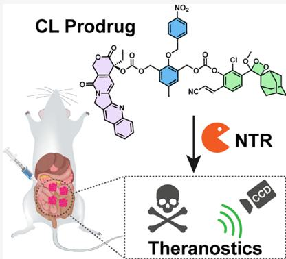
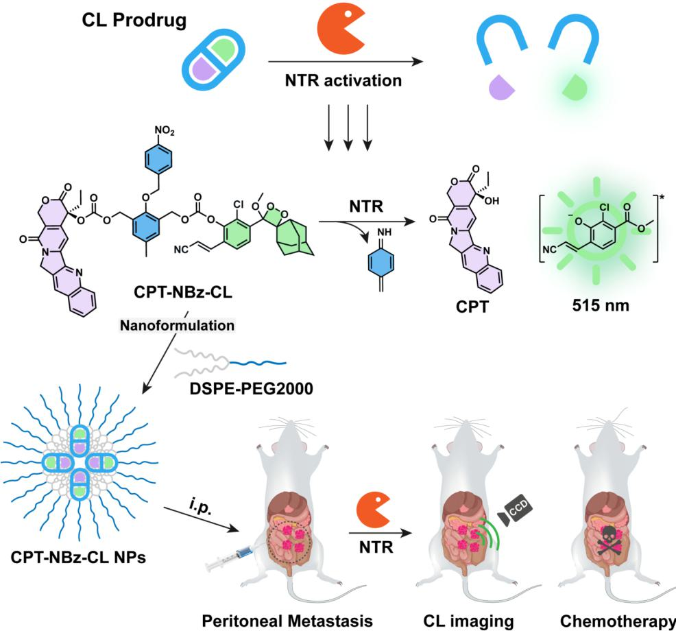
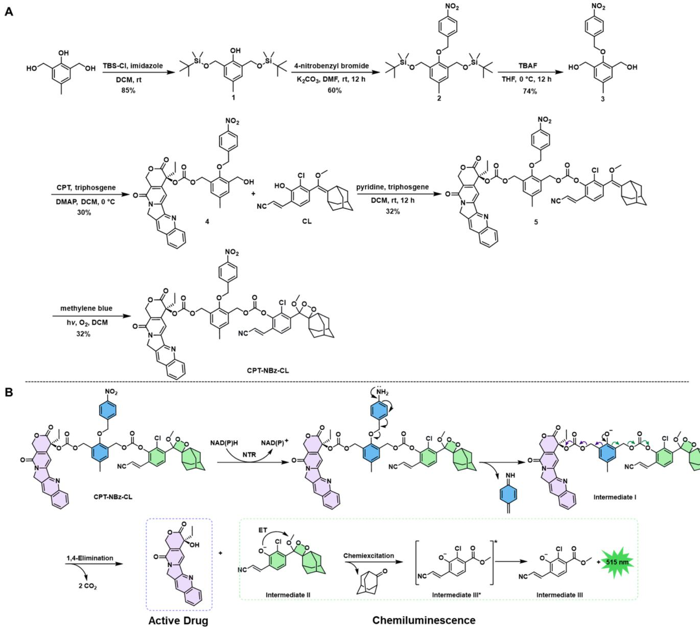
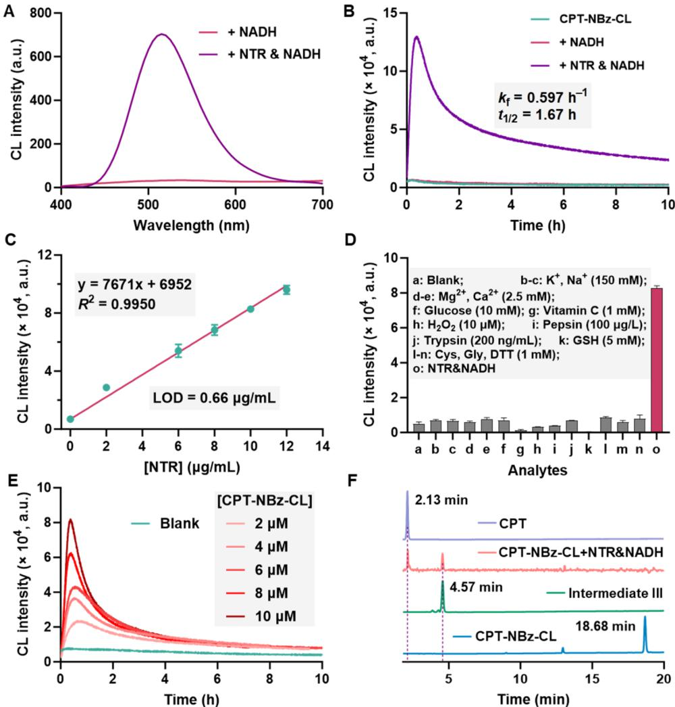
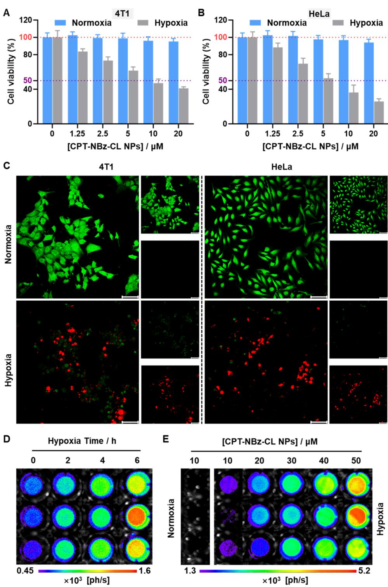
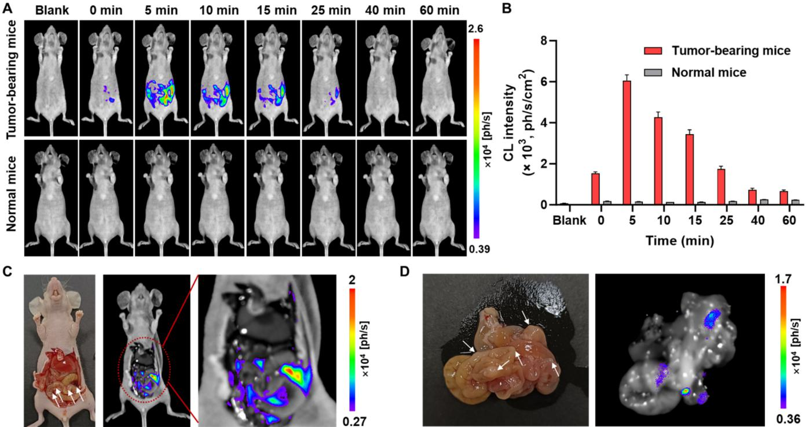
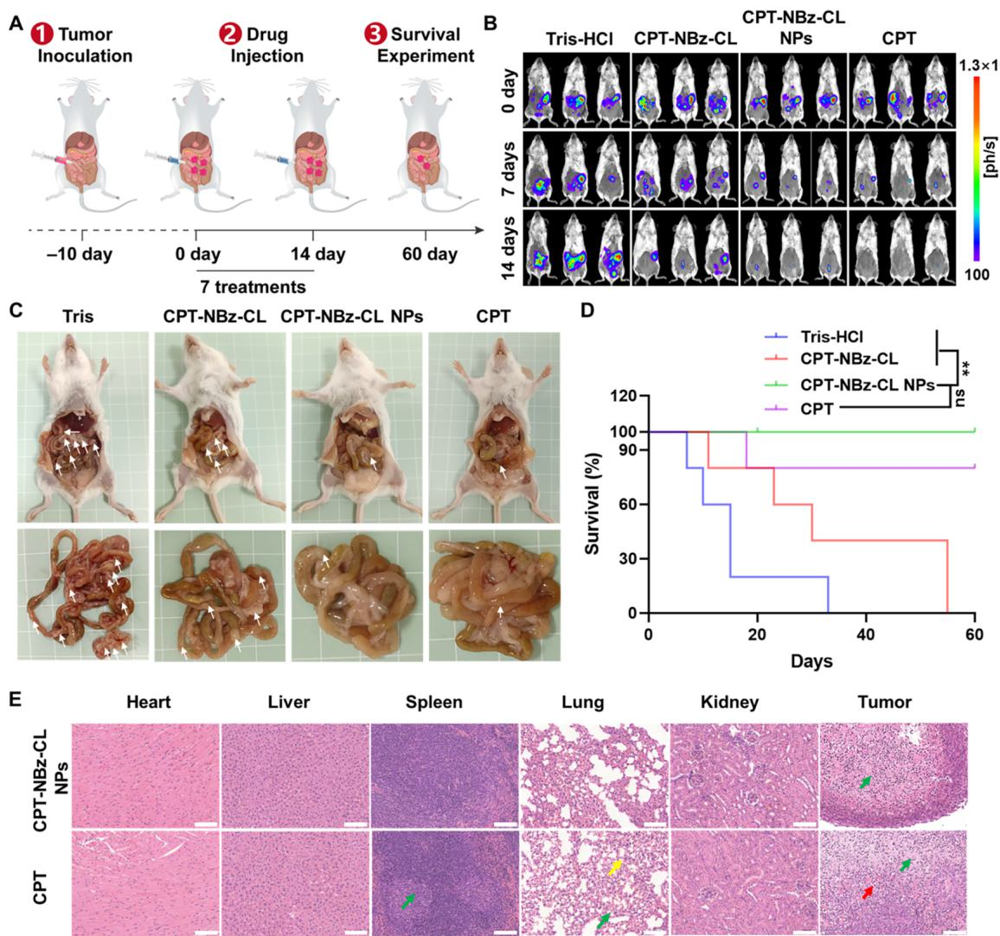

# A Nitroreductase-Activated Chemiluminescent Prodrug for RealTime Monitoring of Camptothecin Release in Peritoneal Metastasis Theranostics

Lianzhu Wei,§ Yumei Wu,§ Yanhan Zhou, Maocheng Yang, Hongyu Li, Wen-Chao Geng,\* Zeli Yuan,\* and Jie Gao\*

Cite This: https://doi.org/10.1021/acs.jmedchem.5c01674

# ACCESS I

ll Metrics & More 回Article Recommendations

④ Supporting Information

ABSTRACT: While most theranostic_prodrugs utilize fluorescence for reporting, chemiluminescence ofers superior signal-to-noise ratios. However， chemiluminescencebased prodrug systems remain relatively scarce. Herein, we report the development of CPT-NBz- $\mathbf { C L } ,$ a novel hypoxia-responsive theranostic prodrug activated by nitroreductase (NTR) via a self-immolative linker mechanism. This activation concomitantly releases a potent chemotherapeutic camptothecin (CPT） and generates a robust chemiluminescence signal for reporting. Encapsulation of CPT-NBz-CL into nanoparticles (CPT-NBz-CL NPs） facilitated in vivo application. In vitro studies demonstrated hypoxia-selective cytotoxicity and chemiluminescence generation. In a murine 4T1-Luc1 peritoneal metastasis model, CPT-NB $\mathbf { Z }$ CL NPs delineated hypoxic tumor regions through in vivo chemiluminescence imaging, reflecting the endogenous NTR activity. Crucially, CPT-NBzCL NPs showed antitumor efcacy comparable to free CPT while significantly mitigating the parent drug's systemic toxicity. This work validates an NTR-triggered, self-immolative hemilumieseepatosprosingstatfoegatigigsivitigingihoenttargeednra offering an improved safety profile.

# 1.INTRODUCTION

Achieving precise spatiotemporal control over drug activity remains a fundamental challenge in chemotherapy，often limiting therapeutic efficacy and resulting in dose-limiting systemic toxicity. Prodrugs-therapeutic agents chemically masked to be activated by specific physiological stimuli-have emerged as a powerful strategy to address these limitations, facilitating targeted delivery and enhancing bioavailability. 9

In cancer therapy， prodrug activation can be triggered by endogenous stimuli， such as $\mathrm { p H } _ { \cdot }$ ，reactive oxygen species, glutathione,and enzymes，or exogenous stimuli， including magnetic fields，light，X-rays，ultrasound，and electrical pulses.10-19 By exploiting these endogenous and exogenous cues, prodrugs promise to maximize therapeutic concentrations at the disease site while minimizing systemic exposure and offtarget toxicity.However, there is an urgent need for robust and reliable approaches for monitoring the activation and release profiles of prodrugs within living systems to understand and harness their clinical potential.

Real-time visualization of prodrug activation and subsequent drug release offers invaluable insights for evaluating therapeutic targeting and optimizing treatment regimens.While fluorescence imaging is commonly utilized for this purpose,20-24 its application in vivo is often limited by tissue autofluorescence and light scattering,which reduce sensitivity and penetration depth.25 Chemiluminescence offrs several advantages over fluorescence as a reporting mode for in vivo imaging. Unlike fluorescence,which requires external excitation light,chemiluminescence generates photons through a chemical reaction, resulting in a minimal background signal and enhanced sensitivity. This is particularly crucial for deep-tissue imaging, where the excitation light used in fluorescence can be scattered and absorbed by biological tissues，leading to reduced penetration depth and increased background noise.2627 Chemiluminescence has been widely used in various biomedical applications,including highly sensitive bioassays and in vivo imaging.2 g.28-32 Among chemiluminescent systems, Schaap's 1,2-dioxetanes (adamantylideneadamantane-1,2-dioxetane）are notable for their versatility，as they can be engineered to emit light upon the cleavage of a specific trigger moiety，typically generatingaphenolateanion3343 Shabat and co-workers have demonstrated the elegant mechanism and utilized it to monitor $\beta$ galactosidase-triggered prodrug activation.44Despitetheseadvancements，chemilumines

Scheme 1.Schematic Illustration of the NTR Activation Mechanism of Chemiluminescent Prodrug CPT-NBz-CL and Its Nanoformulation for Real-Time Monitoring of CPT Release in Peritoneal Metastasis Theranostics (i.p., Intraperitoneal)

cence-reporting prodrug systems triggered by enzymes for delivering chemotherapeutic agents remain a significant, yet underexplored, research area.

Nitroreductases (NTRs） have emerged as promising and selective biomarkers for tumor targeting due to their marked isticofanolidtumldithsct upregulation within the hypoxic microenvironments characterthis work details the synthesis and characterization of CPT${ \mathrm { N B z } } { \mathrm { - C L } } ,$ a novel theranostic prodrug. CPT-NBz-CL incorporates an NTR-cleavable 4-nitrobenzyl (NBz） trigger, which is connected via a self-immolative spacer to both the potent anticancer agent camptothecin (CPT） and a Schaap-type dioxetane chemiluminescent reporter (Scheme 1). NTRmediated reduction of the NBz moiety would initiate an electronic cascade through a self-immolative linker， thereby simultaneously releasing active CPT and generating a chemiluminescence signal proportional to the enzyme activity. In vitro studies demonstrated that CPT-NBz-CL was selectively activated by NTR，resulting in concurrent CPT release and chemiluminescence emission. Furthermore， formulation into DSPE-PEG2000 nanoparticles (CPT-NBz-CL NPs）enabled in vivo applications，providing real-time chemiluminescent visualization of prodrug activation within hypoxic peritoneal metastases of breast cancer. Notably, this formulation exhibited significant therapeutic efficacy comparable to that of free CPT while markedly reducing systemic toxicity. Overall， this work substantiates NTR-triggered chemiluminescence as a robust strategy for advanced theranostic agents， enabling simultaneous targeted therapy and noninvasive monitoring of drug release.

# 2.RESULTS AND DISCUSSION

2.1.Design and Synthesis of the NTR-Activated Theranostic Prodrug. To develop a system capable of simultaneous therapeutic action and real-time monitoring through chemiluminescence，we designed and synthesized the NTR-activated theranostic prodrug, CPT-NBz-CL. This molecule integrates three critical functional units linked via a self-immolative linker derived from 2,6-hydroxymethyl $p$ cresol: (i) an NBz group functioning as the NTR-specific trigger, (ii) the potent chemotherapeutic agent CPT serving as the cytotoxic payload，and (ii) a Schaap-type phenoxydioxetane moiety acting as the chemiluminescent reporter (Scheme 2). For comparative analysis，we synthesized a control probe, $\mathrm { C L \mathrm { - } N B z \mathrm { - } C L , }$ which lacks the CPT payload but retains the NTR response and reporter functionalities (Scheme S1).CPT-NBz-CL was efficiently prepared in six steps by utilizing commercially available substrates (Scheme 2A). The detailed synthetic procedures are provided in Section 4.3, and full characterization data (nuclear magnetic resonance (NMR) and high-resolution mass spectrometry (HRMS)）for all intermediates and the final product are available in the Supporting Information (Figures S1-S22). The purity of the final prodrug CPT-NBz-CL was determined to be ${ > } 9 8 \%$ by high-performance liquid chromatography (HPLC） analysis.

A key feature of our design is the enzyme-triggered cascade reaction，which facilitates the simultaneous drug release and

Scheme 2.(A) Synthetic Route for the NTR-Activatable Chemiluminescent Prodrug CPT-NBz-CL and (B) Proposed Activation MechanismofCPT-NBz-CL,Ilustrating theEnzyme-Triggered Releaseof the TherapeuticAgent Camptothecin (CPT)and the Generation of a Chemiluminescence Signal (the Activation Cascade Is Specificall Initiated by NTR-Mediated Reduction of the Nitroaromatic Trigger Unit; ET, electron transfer)

chemiluminescence signal generation (Scheme 2B). In its intact prodrug form，the phenolic oxygen necessary for dioxetane activation is masked by the NBz-functionalized self-immolative linker， thereby effectively silencing both the cytotoxicity of CPT and the luminescence of the reporter. Upon exposure to elevated levels of NTR in hypoxic tumor environments,the NBz moiety undergoes selective reduction to form the aminobenzyl group.This reduction initiates spontaneous 1,4-elimination via the self-immolative linker, liberating active CPT and generating the transient phenoxidedioxetane intermediate II. Subsequent intramolecular electron transfer within intermediate I,likely occurring via a chemically initiated electron exchange luminescence (CIEEL） mechanism, induces fragmentation of the dioxetane ring，producing an electronically excited benzoate derivative $( \mathrm { I I I ^ { * } } )$ ). The relaxation of $\operatorname { I I I } ^ { * }$ to its ground state results in the emission of green light （ ${ \sim } 5 2 0 ~ \mathrm { n m } ,$ ). This integrated design allows the chemiluminescence signal to directly report on the NTR-mediated activation cascade that releases the therapeutic payload.To the best of our knowledge，CPT-NBz-CL represents the first NTRactivated theranostic prodrug enabling chemiluminescent monitoring correlated with drug liberation.

2.2.NTR-Triggered Activation with Chemiluminescent Response and CPT Release. To validate the activation mechanism triggered by NTR, we investigated the response of CPT-NBz-CL ${ \bf \left( 1 0 \mu M \right) }$ to NTR $\left( 2 0 \ \mu \mathbf { g } / \mathrm { m L } \right)$ in the presence of the cofactor nicotinamide adenine dinucleotide (NADH, 0.2 $\mathrm { m } \mathbf { M } _ { \astrosun }$ ）under conditions that mimic the physiological environment (PBS buffer, $\mathrm { p H } 7 . 4 , 3 7 ^ { \circ } \mathrm { C } )$ . Upon addition of NTR and NADH, the absorbance at around $4 2 0 ~ \mathrm { n m }$ increased, which is likely indicative of the formation of intermediate III (Figure S23A).Incubation with NTR and NADH generated a pronounced chemiluminescence signal centered at approximately $5 1 5 ~ \mathrm { \ n m }$ ，representing an approximately 19-fold increase compared with the background signal from the prodrug alone (Figure lA). Control experiments confirmed that NADH alone did not induce chemiluminescent emission. Concomitantly,a significant fluorescence enhancement ( $( \sim 1 8 -$ fold) was observed, with emission centered at $5 2 1 ~ \mathrm { { n m } }$ (Figure S23B)，consistent with the formation of fluorescent intermediate II. The control probe CL-NBz-CL,which lacks the CPT moiety，exhibited similar NTR-dependent chemiluminescence and fluorescence activation (Figure S24), supporting the observation that the observed signals originate from the NTR-triggered cleavage and the subsequent CIEEL cascade of the reporter unit.

  
Figure1.Characterizationof NTR-activatedchemiluminescenceandCPTreleasefromCPT-NBz-CL.(A）Chemiluminescencespectraofthe CPT-NBz-CLprodruginthepresenceorabsenceofNT. (B)Time-dependentchemiluminescenceintensityofCPT-NBz-CLwithNADHaloe NTRwithNADH,ornoaddition.(C)CalibratiocurveofthechemluminesenceintensityversusNTRcocentrationforCPT-N-CL(ean $\pm$ SD, $n = 3$ ). (D) Chemiluminescence response of CPT-NBz-CL $\left( 1 0 \mu \mathbf { M } \right)$ in the presence of potential interfering substances $\left( \mathrm { m e a n } \pm \mathrm { S D } , n = 3 \right)$ ： (E)Chemiluminescence kineticsofCPT-NBz-CLatvariousconcentrations,withandwithout NTRandNADH. (F）HPLCchromatograms showing CPT,ureactedCPT-NBz-CLprodrugintermediate I,andtheproductsofCPT-NBz-CLincubationwithNTRandNADH.

The kinetics of chemiluminescent emission from CPT-NBzCL activation by NTR were characterized (Figure 1B). The signal intensity increased rapidly，reaching a peak at approximately $2 2 \ \mathrm { m i n } ,$ ，followed by a gradual decay with an apparent first-order rate constant $\left( k _ { \mathrm { f } } \right)$ of $0 . { \overset { \cdot } { 5 } } 9 7 \ \mathrm { \ h } ^ { - 1 }$ corresponding to a calculated half-life $\left( t _ { 1 / 2 } \right)$ of approximately $1 . 6 7 \mathrm { h }$ This sustained emission profile is well-suited for in vivo imaging applications that require prolonged monitoring windows.A similar kinetic behavior was observed for the control CL-NBz-CL (Figure S24C). The sensitivity of CPTNBz-CL toward NTR was evaluated by measuring the CL response across a range of enzyme concentrations $( 0 - 1 2 ~ \mu \mathbf { g } / $ mL).A distinct NTR dose-dependent increase in chemiluminescent intensity was observed，demonstrating a linear correlation between the integrated chemiluminescence signal and the NTR concentration within this range (Figure 1C).The limit of detection (LOD） for NTR was calculated to be 0.66 $\mu { \bf { g } } / { \bf { m } } \mathrm { , }$ underscoring the prodrug's sensitivity. The control CL-NBz-CL exhibited a similar dose-response profile (Figure S25).

The selectivity of CPT-NBz-CL was evaluated against a panel of biologically relevant species，including metal ions $( \mathrm { N a } ^ { + } , \mathrm { ~ K ^ { + } ~ }$ ， $\mathbf { M g } ^ { \mathbf { \bar { 2 } + } }$ ， $\dot { \mathrm { C a } } ^ { 2 + }$ ）， glucose， reactive oxygen species $\left( \mathrm { H } _ { 2 } \mathrm { O } _ { 2 } \right)$ , other enzymes (pepsin, trypsin),reductants (vitamin $\mathrm { C } ,$ glutathione (GSH),dithiothreitol (DTT)),and amino acids (cysteine (Cys)，glycine (Gly)). The chemiluminescence response was minimal in the presence of these potential interferents at relevant concentrations,whereas NTR elicited a strong signal, demonstrating the high selectivity of the prodrug for the intended enzymatic trigger (Figure 1D). The temporal profile of light emission for varying concentrations of prodrug CPT-NBz-CL following NTR addition， showing a rapid increase and subsequent gradual decay, was also corroborated (Figure 1E).

  
Figure2 InvitrootoxicitdhilmisceneimaingofCN-CLNs.Cellviablitof(A)4ndB)HeLacelstatedwih varying concentrations of CPT-NBz-CL NPs under normoxic and hypoxic conditions $( \mathrm { m e a n } \pm \mathrm { S D } , n = 6 )$ . (C) Representative Calcein-AM (green)andPI(ed)costaingforesenceimagsof4adeacelflowingdienttreaments.Tpgreenchanel;ote channel. Scale bar: $1 0 0 \ \mu \mathrm { m }$ (green channel: Calcein-AM, $\lambda _ { \mathrm { e x } } = 4 8 8 ~ \mathrm { n m }$ $\lambda _ { \mathrm { e m } } = 5 0 0 { - } 5 3 0 ~ \mathrm { n m } ;$ red channel: PI, $\lambda _ { \mathrm { e x } } = 5 4 0 ~ \mathrm { n m }$ $\lambda _ { \mathrm { e m } } = 5 7 2 { - } 6 7 2 \ \mathrm { n m } )$ Chemiluminescenceimagingof 4T1cels treated withCPT-NBz-CLNPs.(D）Time-dependentchemiluminescenceunder hypoxiaand (E) concentration-dependent chemiluminescence under normoxic and hypoxic conditions $\left( n = 3 \right)$ ).Exposure time: ${ \boldsymbol { 6 0 \ s } } .$

To directly confirm that NTR activation leads to the release of the CPT payload, the reaction mixture of CPT-NBz-CL incubated with NTR/NADH was analyzed using HPLC (Figure 1F).Comparison with authentic standards identified the retention times $\left( t _ { R } \right)$ for intact CPT-NBz-CL $\left( 1 8 . 6 8 \mathrm { \ m i n } \right)$ ， free CPT $\left( 4 . 5 7 \ : \ : \mathrm { \ m i n } \right)$ ，and chemiluminescent emitter intermediate III $( 2 . 1 3 ~ \mathrm { \ m i n } )$ ).Following incubation with NTR/NADH, the HPLC chromatogram exhibited complete consumption of the CPT-NBz-CL peak and the concomitant appearance of two new peaks with $t _ { \mathrm { R } }$ values of 4.58 and 2.16 min，corresponding to free CPT and intermediate III, respectively. Furthermore, the results from mass spectrometry (Figure S26) also confirmed the above findings.This analysis provides direct evidence for the NTR-mediated release of CPT,concurrent with the generation of the chemiluminescent reporter.

Collectively， CPT-NBz-CL was demonstrated as a highly sensitive and selective probe for NTR.Its activation by the enzyme triggers a cascade reaction, leading to simultaneous chemiluminescent emission and release of the cytotoxic payload CPT, thereby validating its_potential for monitoring NTR activity and visualizing drug release.

2.3. Preparation and Characterization of Nanoformulations. To enhance aqueous solubility and potentially improve in vivo delivery characteristics，the hydrophobic prodrug CPT-NBz-CL and the control compound CL-NBz-CL were formulated into nanoparticles (CPT-NBz-CL NPs and CL-NBz-CL NPs,respectively） using the thin-film hydration method with the amphiphilic lipid-polymer conjugate DSPEPEG2000. Dynamic light scattering revealed average hydrodynamic diameters $( D _ { \mathrm { h } } )$ of $9 1 . 3 \ \mathrm { n m }$ for CPT-NBz-CL NPs and $4 6 . 1 \ \mathrm { n m }$ for CL-NBz-CL NPs (Figures S27A and S28).Both nanoformulations exhibited relatively narrow size distributions, with polydispersity indices below 0.3, indicating good particle homogeneity. Transmission electron microscopy confirmed the discrete，generally spherical morphology of both formulations.Furthermore，CPT-NBz-CL NPs maintained their size distribution in PBS buffer at $4 ~ ^ { \circ } \mathrm { C }$ for a minimum of 7 days (Figure S27B)，suggesting sufficient stability for subsequent biological experiments. In contrast, when stored at higher temperatures of 25 and $3 7 ^ { \circ } \mathrm { C } ,$ the nanoparticles exhibited aggregation，with their hydrodynamic diameter increasing by approximately $5 0 ~ \mathrm { \ n m }$ over 7 days (Figure S29).This observation suggests that the nanoparticles should be stored at $4 ~ { } ^ { \circ } \mathrm { C }$ for optimal stability.For this study, however, all nanoparticle formulations were freshly prepared immediately before use to ensure consistent performance in subsequent biological experiments.

2.4.Hypoxia-Selective Cytotoxicity and Chemiluminescence Imaging of Cellular Hypoxia. To evaluate the therapeutic potential and activation-dependent cytotoxicity of the prodrug system, the viability of HeLa and 4T1 cancer cells was assessed using the methyl thiazolyl tetrazolium (MTT) assay following treatment with free CPT, CPT-NBz-CL, CPT$\mathrm { N B z }$ -CL NPs,or the control CL-NBz-CL NPs under both normoxic and hypoxic conditions.A cellular hypoxia model was established by treating cells with cobalt chloride $\left( \mathbf { C o C l } _ { 2 } \right)$ following a previously reported protocol.49 The $\mathrm { C o C l } _ { 2 }$ concentrations used,which were confirmed to be within nontoxic limits for each cell line (Figure S3O),were $3 0 0 ~ \mu \mathrm { M }$ for 4T1 cells and $4 5 0 ~ \mu \mathrm { M }$ for HeLa cells.Under normoxic conditions, free CPT exhibited potent cytotoxicity against both HeLa and 4T1 cells,with half-maximal inhibitory concentrations $\left( \mathrm { I C } _ { 5 0 } \right)$ of 2.13 and $4 . 3 4 \mu \mathrm { M }$ ,respectively (Figure S31). In contrast, the prodrug CPT-NBz-CL,its nanoformulation CPT-NBz-CL NPs,and the control formulation CL-NBz-CL NPs displayed negligible effects on cell viability in the tested concentration range (Figures 2A,B and S32). The cytotoxicity of CPT was effectively masked within the intact prodrug formulations,demonstrating their biocompatibility prior to activation. When incubated under hypoxic conditions that favor NTR upregulation and activity，CPT-NBz-CL NPs induced significant, dose-dependent cytotoxicity in both HeLa $\left( \mathrm { I C } _ { 5 0 } = 6 . 0 7 ~ \mu \mathrm { M } \right)$ and 4T1 cells $\left( \mathrm { I C } _ { 5 0 } = 1 0 . 1 8 ~ \mu \mathrm { M } \right)$ ）(Figures 2A,B and S33). The nonformulated prodrug CPT-NBz-CL also demonstrated hypoxia-dependent cytotoxicity,albeit with slightly reduced potency compared to the nanoparticle formulation (Figures S32 and S33)，potentially reflecting differences in celllar uptake or stability. Importantly， the control formulation CL-NBz-CL NPs remained nontoxic even under hypoxia (Figures S32 and S33)，confirming that the cytotoxicity stems specifically from the NTR-triggered release of CPT.As expected, free CPT retained its high cytotoxic potency under hypoxic conditions_ (Figure S34). The $\mathrm { I C } _ { 5 0 }$ values for the activated prodrug (CPT-NBz-CL and CPT-NBzCL NPs）under hypoxia were higher than those for free CPT under either condition.The lower potency is anticipated for enzyme-activated prodrugs,as cytotoxicity relies on the rate of enzymatic conversion and the intracellular accumulation of the active payload over the duration of the assay,rather than the immediateavailability of free CPT.20 The hypoxia-selective activation of CPT-NBz-CL and CPT-NBz-CL NPs, leading to targeted CPT release and cancer cell inhibition,validated the design rationale of the theranostic system.

To investigate the cellular uptake time of CPT-NBz-CL and CPT-NBz-CL NPs under hypoxic conditions，we performed cell imaging using confocal microscopy (Figures S35-S38). Since CPT-NBz-CL can decompose into CPT (blue fluorescence） and intermediate III (green fluorescence) under hypoxic conditions，the results showed that the fluorescence intensities of CPT and intermediate III from CPT-NBz-CL NPs reached a maximum at $6 \mathrm { { h } }$ ,which was later than CPT-NBz-CL,whose fluorescence intensities of CPT and intermediate III reached a maximum at $^ { 2 \mathrm { ~ h ~ } }$ ，To visualize the selective cytotoxicity from the MTT assays,HeLa and 4T1 cells treated with CPT-NBz-CL NPs were costained with Calcein-AM (green for viable cells) and propidium iodide (PI, red for dead/damaged cells）and imaged by fluorescence microscopy (Figure 2C).Under normoxic conditions, CPTNBz-CL NP-treated cells exhibited strong green Calcein-AM fluorescence with minimal PI red fluorescence, indicating high cell viability consistent with the inactive state of the prodrug. In contrast, both cell lines showed a marked increase in red PI fluorescence and a concomitant decrease in green Calcein-AM fluorescence after incubation with CPT-NBz-CL NPs under hypoxic conditions，demonstrating the hypoxia-specific cell death.These microscopic observations visually confirmed the quantitative cytotoxicity data and further validated the hypoxia-selective activation of CPT-NBz-CL NPs for releasing cytotoxic CPT.

Subsequently，the potential of CPT-NBz-CL NPs for chemiluminescent visualization of cellular hypoxia levels was evaluated in the 4T1 and HeLa cells. Cells were exposed to hypoxia for 2,4,or $^ { 6 \mathrm { ~ h ~ } }$ before incubation with CPT-NBz-CL NPs. The chemiluminescence signal intensity increased progressively with the duration of hypoxic preincubation, reaching a maximum after $^ { 6 \mathrm { ~ h ~ } }$ of hypoxia (Figures 2D and S39).Furthermore， the effect of the CPT-NBz-CL NP concentration on the chemiluminescence signal in hypoxic cells was evaluated. Increasing concentrations of CPT-NBz-CL NPs led to a gradual enhancement in intracelllar chemiluminescence intensity (Figures 2E and S40). The chemiluminescence signal from CPT-NBz-CL NPs correlates strongly with both the degree of cellular hypoxia (reflected by NTR activity） and the nanoparticle concentration, suggesting its potential for visualizing hypoxic regions and in situ drug concentration reporting.

  
Figure3.Chemiluminescenceimagingof4tumor-bearingandoalmicefterCNz-CLNPjection.(A)Chemlnesceceig of tumor-bearing and normal mice at diferent time points following i.p. injection of CPT-NBz-CL NPs ( $. 1 0 0 \ \mu \mathrm { M }$ $2 5 0 ~ \mu \mathrm { L }$ per mouse). Exposure time: ${ \boldsymbol { 6 0 } } \ s .$ (B) Chemiluminescence intensities measured from the same region of each mouse over time (mean $\pm \ : \mathrm { S D }$ $n = 6$ ).(C) Photographs and chemiluminescence images of the anatomy of tumor-bearing mice $5 ~ \mathrm { m i n }$ post-i.p. injection of CPT-NBz-CL NPs $1 0 0 \ \mu \mathrm { M } _ { \cdot }$ $2 5 0 ~ \mu \mathrm { L }$ per mouse). (D)Photograpsdhmimieseceimagesoftetestiefotetumorbgmcesoin(C).Witearosicateoodules that are visible to the naked eye.

2.5.In Vivo Chemiluminescence Imaging of Tumor Hypoxia.With the hypoxia-selective activation and cytotoxicity established in vitro,we next evaluated CPT-NBz-CL NPs for chemiluminescent reporting of NTR activity within tumors in vivo.A 4T1-Lucl luciferase-expressing murine peritoneal metastasis model was used. After intraperitoneal (i.p.) administration of CPT-NBz-CL NPs to tumor-bearing mice, whole-body chemiluminescent imaging revealed a peritoneallocalized signal that peaked at $\sim 5 \ \mathrm { m i n }$ postinjection and then decayed gradually over time (Figure 3A,B).Notably, negligible chemiluminescence signal was detected in healthy mice given the same dose (Figure 3A,B)， indicating selective prodrug activation within the hypoxic tumor microenvironment. Additionally，we observed the tissue distribution of CPT$\mathrm { N B z }$ CL NPs in model mice and normal mice following injection (Figure S4l). The intestines of the model mice exhibited a strong chemiluminescence signal，whereas the other major organs (including the heart, liver，spleen, lungs, and kidneys） showed very weak luminescence intensity. This indicates that CPT-NBz-CL NPs are primarily distributed in the intestine.In contrast,under the same conditions， no chemiluminescence signal was observed in normal mice, which is attributable to the lack of a hypoxic environment.

To correlate the chemiluminescence signal with the overall tumor burden, bioluminescence imaging (BLI) was performed $^ { 2 4 \mathrm { ~ h ~ } }$ postinjection of CPT-NBz-CL NPs (after chemiluminescence signal decay) through administration of the luciferase substrate diphenylterazine. Comparison of the BLI signal, which delineates all luciferase-expressing tumor cells, with the earlier chemiluminescence signal revealed a partial spatial overlap (Figure S42). This observation is consistent with chemiluminescence originating specifically from hypoxic, NTR-active regions within the tumor mass, while BLI maps the entire tumor regardless of oxygenation status or NTR activity. This indicates that CPT-NBz-CL NPs can specifically highlight hypoxic niches in tumors.

To confirm the tumor localization of the chemiluminescence signal, mice were euthanized 5 min postinjection of CPT-NBzCL NPs (at the peak chemiluminescence signal). In situ imaging during dissection revealed a strong chemiluminescence emission from visible tumor nodules on the intestinal serosa (Figure 3C). Subsequent ex vivo imaging of the excised intestines bearing these nodules confirmed the specific and persistent localization of the chemiluminescence signal to tumor lesions (Figure 3D). The control formulation CL-NBzCL NPs produced similar tumor-localized chemiluminescence signals (Figure S43),reinforcing that the luminescence arises from NTR-dependent activation within the tumor and serves as a reliable reporter for hypoxia independent of therapeutic payload. Collectively, the CPT-NBz-CL NP probe selectively visualizes hypoxic tumor regions in vivo.

2.6.In Vivo Antitumor Eficacy and Safety Evaluation. Building upon the promising in vivo imaging results of tumorselective activation,we evaluated the therapeutic efficacy and systemic toxicity of CPT-NBz-CL NPs in the 4T1-Lucl peritoneal metastasis mouse model. Tumor-bearing mice were randomized ( ${ \mathit { n } } = { \mathit { s } }$ per group）and treated via i.p.injection every 2 days (seven doses）with （1） Tris-HCl buffer (control),(2） free prodrug CPT-NBz-CL,(3) CPT-NBz-CL $\mathrm { N P s }$ ，or (4) free CPT (Figure 4A). Dosing was normalized to equivalent CPT contents for groups 2，3，and 4. Tumor progression was quantitatively monitored by BLI on days O,7, and 14 (Figure 4B).As expected, the control group exhibited rapid tumor growth, evidenced by a significant increase in BLI signal intensity over 14 days.In contrast, free CPT treatment caused potent tumor suppression.Notably, CPT-NBz-CL and CPT-NBz-CL NPs showed efficacy comparable to free CPT, significantly inhibiting tumor growth versus the control group $P < 0 . 0 0 1$ ,Figure S44). Gross pathological examination at the study end point revealed markedly reduced peritoneal tumor nodule number and size in mice treated with CPT-NBz-CL NPs or free CPT compared to the control and free prodrug groups (Figure 4C). The free prodrug CPT-NBz-CL showed modest antitumor activity, likely due to solubility or cellular uptake limitations compared with the nanoparticle formulation. Consistent with tumor burden results, both CPT-NBz-CL NPs and free CPT significantly prolonged median mouse survival versus the control group (Figure 4D).

  
Figure4EfcacyofCPT-NB-CLNsinaabdomialmetastaticbreasttumorodel.(A)Shematicdiagaofthabdominalmetastatic4 tumormodeladteaentsedule.()Loficefollongdifnttreaents.(C)acosocexaatioofprigastrindstec tumornodules14dayspost-treatment.Whitearrows indicatetumornodules. (D)Kaplan-Meiersurvivalcurves foreach treatment group $\displaystyle ( n = 5 ,$ $\mathbf { n } \mathbf { s } =$ not significant, $^ { * * } P < 0 . 0 1 .$ ). (E)Histopathological analysis of major organs and tumors following treatment with CPT-NBz-CL NPs or CPT. Epithelialcellnecrosis (geenarrows)，ongestion (yellowrrows),andhemorrhage(redarrows)areighlightedcalebar: $1 0 0 \ \mu \mathrm { m }$ ，

Throughout the treatment period, all groups showed no significant body weight loss，indicating a general tolerance (Figure S45).However, histological analysis (hematoxylin and eosin (H&E） staining)of major organs (heart, liver, spleen, lungs，kidneys）collected at the end point revealed crucial differences (Figures 4E and S46).While control mice displayed some organ changes attributable to tumor progression， mice treated with free CPT exhibited noticeable histopathological damage, particularly in the spleen and lung. In contrast,organs from CPT-NBz-CL NP-treated mice appeared largely normal, indicating substantially reduced systemic toxicity compared to that of free CPT,further supported by serum biochemical markers (Figure S47).Histological examination of excised tumor tissues revealed the treatment effects at the cellular level (Figures 4E and S48). Tumors from control and free prodrug (CPT-NBz-CL） groups primarily consisted of densely packed viable cancer cells with minimal necrosis.Conversely, tumors from CPT-NB $\mathbf { \Omega } _ { z }$ -CL NP- or free CPT-treated mice showed extensive necrotic regions characterized by hallmarks of cell death，including cytoplasmic eosinophilia， pyknosis,karyorrhexis,and karyolysis.

Collectively, formulating CPT as hypoxia-activated prodrug nanoparticles(CPT-NBz-CL NPs） harnesses the potent anticancer activity of the parent drug in the tumor microenvironment, with effcacy comparable to free CPT. Crucially, this targeted activation strategy significantly reduces the systemic toxicity of conventional CPT administration， highlighting its potential for safer and more effective cancer therapy.

# 3.CONCLUSIONS

In summary, we have developed and validated CPT-NBz-CL, a novel hypoxia-responsive theranostic prodrug，using a selfimmolative linker. The prodrug is selectively activated by $\mathrm { { N T R } , }$ an enzyme frequently overexpressed in hypoxic tumor microenvironments，concomitantly releasing the potent chemotherapeutic CPT and generating a chemiluminescence signal.This feature is paramount,as abdominal metastasis often occurs in hypoxic environments，where traditional therapies struggle.By targeting NTR specifically,our approach not only enhances therapeutic efficacy but also reduces the collateral damage to healthy tissues，which is a significant concern in metastatic cancer treatment. In clinical settings, monitoring NTR activity through chemiluminescence could lead to timely interventions,making our prodrug a valuable candidate for future theranostic applications in peritoneal carcinomatosis.In vitro studies confirmed hypoxia-selective activation and cytotoxicity. Subsequent formulation into CPT$\mathrm { N B z }$ CL NPs enabled an effective in vivo application. Using a peritoneal metastasis mouse model，CPT-NBz-CL NPs visualized hypoxic tumor regions via chemiluminescence imaging，reporting endogenous NTR activity. Crucially, therapeutic evaluation showed that CPT-NBz-CL NPs achieved antitumor efficacy comparable to free CPT while significantly reducing the dose-limiting systemic toxicity.

This work demonstrates the utility of NTR-triggered selfimmolative platforms for integrating diagnostic and therapeutic action within a single molecular entity. The chemiluminescent reporters offer distinct advantages，including high sensitivity and favorable signal-to-background ratios over fluorescencebased approaches, yet they remain underutilized in theranostic design. This study not only expands the limited repertoire of chemiluminescence-based theranostic agents but also provides insights into designing next-generation hypoxia-targeted systems. Ultimately, this strategy holds promise for advancing safer and more precise cancer therapies through real-time monitoring of drug activation within the hypoxic niche, alongside potent and localized therapeutic intervention.

# 4.EXPERIMENTAL SECTION

4.1.Reagents and Instruments.All of the chemicals and reagents were purchased from commercial suppliers and used as received,without the need for additional purification steps.The absorbance measurements were performed by using a Shimadzu UV2600 spectrophotometer. Fluorescence and kinetic spectral data were captured with an Agilent Cary Eclipse spectrophotometer and a SuPerMax 310o plate reader, respectively. $\bar { ^ { 1 } \mathrm { H } }$ and ${ \mathrm { { \hat { \Pi } } ^ { 1 3 } C } }$ NMR analyses were performed by using an Agilent 40o DD2 NMR spectrometer. Electrospray ionization mass spectrometry (ESI-MS) data were acquired using an Agilent 65So Q-TOF instrument. High-performance liquid chromatography (HPLC） data were acquired using an Agilent Technologies 1260 Infinity system.Furthermore,all luminescence imaging for both in vitro and in vivo studies was conducted on a Berthold NightOWL II LB983 imaging system designed for small animals.

4.2.HPLC Methods.Two distinct HPLC methods were employed for analytical purposes: method A was used for compound purity determination,and method B was used for drug release studies. The chromatographic conditions are detailed as follows:

Method A(compound purity analysis):column $=$ ZORBAX SBC18 $\mathrm { [ 1 5 0 \times 4 . 6 ~ m \bar { m } ^ { 2 } }$ $3 . 5 \mu \mathrm { { m } ; }$ mobile phase $\mathrm { A } = 0 . 1 \%$ trifluoroacetic acid in $\mathrm { C H } _ { 3 } \mathrm { C N }$ mobile phase $\mathrm { B } = 0 . 1 \%$ trifluoroacetic acid in $\mathrm { H } _ { 2 } \mathrm { O } ;$ $8 5 \%$ Aand $1 5 \%$ B；run time $= 1 2 \ \mathrm { m i n }$ ：(flowrate $= 1 . 0 \ \mathrm { m L / m i n }$ ).

Method B (in vitro drug release analysis):column $=$ Extend-C18 $\left[ 1 5 0 \times 4 . 6 ~ \mathrm { m m } ^ { 2 } \right]$ $3 . 5 \ \mu \mathrm { { m } ; }$ mobile phase $\mathrm { A } = 0 . 1 \%$ trifluoroacetic acid in $\mathrm { C H } _ { 3 } \mathrm { C N }$ mobile phase $\mathrm { B } = 0 . 1 \%$ trifluoroacetic acid in $\mathrm { H } _ { 2 } \mathrm { O } _ { \cdot }$ $4 0 \%$ A for $2 \mathrm { m i n }$ ,then $4 0 \%$ A to $8 0 \%$ A for $1 0 \mathrm { m i n }$ ,and finally $8 0 \%$ A to $9 5 \%$ A for $1 0 \ \mathrm { m i n }$ ；run time $= 2 2 ~ \mathrm { m i n }$ ； (flowrate $= 1 . 0 \ \mathrm { m L / m i n }$ ).

4.3.Synthesis.4.3.1. Synthesis of Compound ${ \cal C L }$ . Compound CL was prepared as a light yellow solid following a procedure reported in the literature.50 $\mathrm { \check { H } }$ NMR $4 0 0 \ \mathrm { M H z } ,$ $\mathrm { C D C l } _ { 3 }$ ） $\bar { \delta 7 . 5 7 }$ $\left( \mathrm { d } , J \right.$ $= 1 6 . 7 \ \mathrm { H z } , \ 1 \mathrm { H }$ ),7.28 (s,1H),6.89 ( $\mathrm { d } , J = 7 . 9 ~ \mathrm { H z } , 1 \mathrm { H } ,$ ,6.18 $( \mathrm { d } , J =$ $^ { 1 6 . 8 \ \mathrm { H z } , }$ 1H),3.31 (s,4H),2.10 (s, 1H),1.98-1.69 $\left( \mathbf { m } , \ 1 2 \mathrm { H } \right)$ ） $^ { 1 3 } \mathrm { C }$ NMR (101 $\mathrm { M H z }$ $\mathrm { C D C l } _ { 3 }$ ） $\delta$ 150.6,145.4, 145.4, 139.2,137.6,133.6, 123.9,121.8,121.1,118.7, 98.8, 57.5, 37.1,33.0, 29.9,29.8.

4.3.2.SynthesisofCompound1.First,26-bis(hydroxymethyl) $\boldsymbol { p }$ cresol $\left( 1 . 0 ~ \mathrm { g } , 5 . 9 1 ~ \mathrm { m m o l } \right)$ and imidazole ( $8 0 5 ~ \mathrm { m g } , 1 1 . 8 2 ~ \mathrm { m m o l } )$ were dissolved in $2 0 ~ \mathrm { m L }$ of dichloromethane.Then, tert-butyldimethylsilyl chloride( $\left( 1 . 7 8 2 \textrm { g } , \ 1 1 . 8 2 \textrm { m m o l } \right)$ was added,and the reaction was allowed to proceed at room temperature for approximately $^ { \mathrm { ~ 1 ~ h , ~ } }$ monitoring the reaction using TLC.After completion of the reaction, the reaction mixture was washed with deionized water to remove imidazole.The organic phase was dried over anhydrous ${ \mathrm { N a } } _ { 2 } { \mathrm { S O } } _ { 4 } ,$ and the solvent was removed under reduced pressure.The product was purified using silica gel column chromatography,eluting with a mobile phase of petroleum ether:ethyl acetate $( \mathbf { v } { : } \mathbf { v } ) \ = \ 2 5 { : } 1$ ，yieldinga colorless oily compound 1 $( 2 . 0 \ \mathrm { g } , \ 8 5 \%$ yield). $\mathrm { ^ { 1 } H  N M R }$ $\bf { \Psi } ^ { \prime } 4 0 0 \ M H z ,$ $\mathrm { C D C l } _ { 3 . }$ ） $\delta 8 . 0 6$ (s,1H),6.93 (s,2H),4.84 (s,4H),2.28 (s,3H),0.96 (s,18H),0.14 (s,12H). $^ { 1 3 } \mathrm { C }$ NMR (101 MHz, $\mathrm { C D C l } _ { 3 }$ ）） $\delta$ 151.0, 128.4, 126.3,125.9,63.1, 26.0,20.8, 18.4, $- 5 . 3$ ：

4.3.3. Synthesis of Compound 2. Compound 1 $( 3 9 6 . 7 2 \ \mathrm { m g } , \ 1 . 0 $ mmol）and potassium carbonate $\left( 2 7 6 . 4 2 \ \mathrm { \ m g } , \ 2 . 0 \ \mathrm { \ m m o l } \right)$ were dissolved in $\textsf { S } \bmod$ of DMF.The reaction was conducted under nitrogen at $0 ~ ^ { \circ } \mathrm { C }$ for $1 0 \ \mathrm { m i n }$ .Then,4-nitrophenyl bromide ( $3 2 4 { \mathrm { ~ m g } } ,$ $1 . 5 \ \mathrm { m m o l }$ ）was dissolved in $3 ~ \mathrm { m L }$ of DMF and slowly added to the reaction mixture,followed by stirring at room temperature overnight. After the completion of the reaction, the mixture was diluted with deionized water and the product was extracted with ethyl acetate. The organic layer was separated，dried over anhydrous ${ \mathrm { N a } } _ { 2 } S { \mathrm { O } } _ { 4 } ,$ and concentrated under reduced pressure to remove the solvent. The product was purified using silica gel column chromatography, eluting with a mobile phase of petroleum ether:ethyl acetate $\left( \mathbf { \bar { v } } { : } \mathbf { \bar { v } } \right) \bar { = } \ 5 0 { : } 1$ ,to obtain a white solid compound 2 $( 0 . 3 2 1 \mathrm { g } , 6 0 \%$ yield). $^ 1 \mathrm { H }$ NMR (400 MHz, $\mathrm { C D C l } _ { 3 }$ ） $\delta 8 . 2 7$ （ $\mathrm { 1 , ~ } J = 8 . 8 ~ \mathrm { H z , 2 H ) }$ ，7.62 ( $\mathrm { d } , J = 8 . 8 ~ \mathrm { H z } ,$ 2H), 7.17 (s,2H),5.05 (s,2H),4.69 (s,4H),2.35 (s,3H),0.89 (s,18H), 0.05 (s,12H). $^ { 1 3 } \mathrm { C }$ NMR (101 $\mathbf { M H z }$ $\mathrm { C D C l } _ { 3 }$ ） $\delta$ 151.5, 147.5, 145.6, 134.3,133.7,128.9,127.6,123.9,60.6,26.1, 21.3,18.5, $- 5 . 1$ ：

4.3.4.Synthesis of Compound 3. Compound 2 $\left( 5 3 2 \ m g , \ 1 . 0 \right.$ mmol） was dissolved in $2 0 ~ \mathrm { m L }$ of tetrahydrofuran (THF),and the solution was cooled to $0 ~ ^ { \circ } \mathrm { C }$ under nitrogen protection. Then, $2 ~ \mathrm { m L }$ of tetrabutylammonium fluoride ( $\mathbf { \epsilon } _ { 1 . 0 \mathbf { M } }$ in THF) was slowly added and reacted at $0 ~ ^ { \circ } \mathrm { C }$ for $1 5 ~ \mathrm { m i n }$ .After that, the mixture was transferred to room temperature,and the reaction was monitored using TLC.Upon the completion of the reaction,it was diluted with $5 0 ~ \mathrm { m L }$ of ethyl acetate and quenched with $1 5 ~ \mathrm { m L }$ of deionized water,and the organic layer was extracted with $3 5 ~ \mathrm { m L }$ of saturated sodium chloride solution. The organic phase was dried over anhydrous ${ \mathrm { N a } } _ { 2 } { \mathrm { S O } } _ { 4 }$ and concentrated under reduced pressure to remove the solvent. The product was purified using silica gel column chromatography, eluting with a mobile phase of petroleum ether:ethyl acetate $\bar { \left( \mathbf { v } { : } \mathbf { v } \right) } = 1 { : } 1$ ，to obtain a white solid compound 3 (223 mg, $7 4 \%$ yield). $\mathrm { ^ { 1 } H N M R }$ (400 $\mathrm { M H z } ,$ $\mathrm { C D C l } _ { 3 }$ ） $\delta \ 8 . 2 5$ $\mathrm { 1 , ~ } J = 8 . 8 ~ \mathrm { H z , ~ 2 H } ,$ ，7.73 (d, $J = 8 . 7 \ \mathrm { H z } ,$ 2H), 7.22 (s,2H),5.06 (s,2H),4.63 (s,4H),2.34 (s,3H). $^ { 1 3 } \mathrm { C }$ NMR (101 $\mathrm { M H z }$ ：， $\mathrm { C D C l } _ { 3 }$ ）S:153.4，148.8，146.7，135.4，135.2，130.4，129.1, 124.6, 76.3,60.2,21.0.

4.3.5. Synthesis of Compound 4.CPT $\mathrm { ( 1 7 4 ~ m g , 0 . 5 ~ m m o l ) }$ was dissolved in $1 0 ~ \mathrm { m L }$ of dichloromethane,and the solution was cooled to $0 ~ ^ { \circ } \mathrm { C } .$ A dichloromethane solution containing DMAP ( $\cdot 1 8 3 \ \mathrm { m g } , 1 . 5$ mmol) was quickly added to the solution and then slowly dropped in a dichloromethane solution containing triphosgene $( 4 7 \ \mathrm { \ m g } , \ 0 . 1 6$ mmol).The reaction was allowed to proceed for $1 0 \ \mathrm { m i n }$ ； then, the mixture was transferred to room temperature.Next,a dichloromethane solution of compound 3 ( $\cdot 1 5 2 \mathrm { ~ m g } , 0 . 5 \mathrm { ~ m m o l } \rangle$ ）wasadded dropwise to the reaction mixture,and the reaction was monitored using TLC.Upon the completion of the reaction, it was diluted with DCM，washed with deionized water，and dried over anhydrous ${ \mathrm { N a } } _ { 2 } S { \mathrm { O } } _ { 4 }$ ，The mixture was concentrated under reduced pressure to remove the solvent.The product was purified using silica gel column chromatography, eluting with a mobile phase of DCM:methanol (v:v) $= 5 0 { : } 1$ ，to obtain a light yellow solid compound 4 $( 1 0 2 \mathrm { ~ m g } , \ 3 0 \%$ yield). $^ 1 \mathrm { H }$ NMR $( 4 0 0 \ \mathrm { M H z } , \mathrm { C D C l } _ { 3 }$ ） $\delta 8 . 3 3$ (s,1H),8.10 (d, $J = 8 . 6$ $\mathrm { H z } , \mathrm { 1 H } )$ ,7.96-7.90 $( \mathrm { m } , 3 \mathrm { H } )$ ,7.81 $( \mathbf { t } , J = 7 . 7 \mathrm { { H z } , }$ 1H), 7.66 $\left( \mathrm { t } , J = 7 . 5 \right.$ $\mathrm { H z } , \mathrm { 1 H } ,$ ,7.46 $\left( \mathrm { d } , J = 8 . 6 \mathrm { H z } , 2 \mathrm { H } \right)$ ),7.24 (s,1H),7.20 (s,1H),7.12 (s, 1H), 5.68-5.55 $\left( \mathbf { m } , \ 1 \mathrm { H } \right)$ ,5.38-5.27 $\left( \mathbf { m } , \ \mathrm { 1 H } \right)$ ，5.19 (d, ${ \cal J } = 4 . 3 ~ \mathrm { H z } ,$ 2H), 5.13 $\left( \mathrm { d } , J = 4 . 4 ~ \mathrm { H z } , 2 \mathrm { H } \right)$ ),4.91 (s,2H),4.63 (s2H), $2 . 2 5 \substack { - 2 . 0 7 }$ $\left( \mathbf { m } , { \cal 5 } \mathrm { H } \right)$ ，0.94 $\mathrm { ^ t } , J = 7 . 5 \mathrm { H z } , 3 \mathrm { H }$ ） $^ { 1 3 } \mathrm { C }$ NMR (101 MHz, $\mathrm { C D C l } _ { 3 }$ ） $\delta$ 167.4,157.3,153.3,153.0,152.0,148.7,147.4,146.5,145.7,144.0, 135.0,134.2,131.5,131.3,131.3,130.9,129.5,128.4,128.4,128.3, 128.3,128.2,127.4, 123.6,120.2,96.0, 78.1, 67.1,66.0,60.4, 50.1, 32.1, 20.8, 7.7.

4.3.6. Synthesis of Compound 5. Compound CL $( 2 6 ~ \mathrm { m g } , \ 0 . 0 7 4$ mmol) and triphosgene were added to anhydrous dichloromethane (S mL)and cooled to $0 ~ ^ { \circ } \mathrm { C }$ Then,pyridine was added dropwise,and the reaction was allowed to proceed at $0 ~ ^ { \circ } \mathrm { C }$ for $1 \ \mathrm { h } ,$ before transferring the mixture to room temperature for an additional $^ { 2 \mathrm { ~ h ~ } }$ 、The solvent was removed under reduced pressure at room temperature. Compound 4 $( 5 0 ~ \mathrm { m g } , \ 0 . 0 7 4 ~ \mathrm { m m o l } )$ was dissolved in DCM $( 5 ~ \mathrm { m L } )$ and slowly added to the reaction mixture.The reaction was continued at room temperature for $3 . 5 \mathrm { h } ,$ followed by monitoring by TLC.Upon the completion of the reaction,the reaction mixture was diluted with DCM and washed with deionized water.The organic phase was dried over anhydrous ${ \mathrm { N a } } _ { 2 } { \mathrm { S O } } _ { 4 }$ and concentrated under reduced pressure to remove the solvent.The product was purified using silica gel column chromatography,eluting with a mobile phase of DCM:methanol (v:v) $= 5 0 { : } 1$ ,to obtain a light yellow solid compound 5( $2 0 ~ \mathrm { m g } ,$ $3 2 \%$ yield). $^ { 1 } \mathrm { H }$ NMR ${ \bf \Psi } ^ { \prime } 4 0 0 ~ \mathrm { M H z }$ $\mathrm { C D C l } _ { 3 }$ ） $\delta 8 . 2 6$ $\mathrm { ( d , } J = 8 . 7 \ \mathrm { H z , 2 H ) }$ ,7.70 $( \mathrm { d } , J =$ $8 . 6 \mathrm { H z } , 2 \mathrm { H } ,$ ,7.49-7.40 $\left( \mathrm { m } , 6 \mathrm { H } \right)$ ，7.26 (d $J = 8 . 1 \ \mathrm { H z } , 2 \mathrm { H }$ ,5.97 $\left( \mathrm { d } , J \right.$ $= 1 6 . 7 \mathrm { H z } , 2 \mathrm { H } )$ ,5.42 (s, 4H), 5.16 $( s , 2 \mathrm { H } )$ ,3.30 (s,8H),2.43 (s,3H), 2.05 (s,2H),1.98-1.73 $\mathrm { ( m , 2 4 H ) }$ $^ { 1 3 } \mathrm { C }$ NMR(101 MHz, $\mathrm { C D C l } _ { 3 }$ ) $\delta$ 153.8,151.9,147.8,145.5,143.8,143.2,143.0,139.2,138.5,135.5, 134.0,133.0,132.9,130.2,130.0,129.4,128.1,128.1,128.0,127.7, 124.6,124.4,124.0, 123.9,117.6,100.4,100.2, 66.7,66.6, 66.5, 57.6, 57.5,39.1,38.6,36.9,33.0,33.0,29.9,29.8,28.3,28.1,21.0,20.9. HRMS: $m / z$ $\mathrm { C _ { 5 9 } H _ { 5 1 } C l N _ { 4 } N a O _ { 1 3 } } ^ { + }$ calcd 1081.3033；found $[ \textbf { M } +$ $\mathrm { N a } ] ^ { + } , 1 0 8 1 . 3 0 3 5$ ：

4.3.7. Synthesis of Compound CPT-NBz-CL. Compound 5 (200 $\mathrm { m g , 0 . 1 9 ~ m m o l } _ { \mathrm { \ell } }$ ）was dissolved in $2 0 ~ \mathrm { m L }$ of dichloromethane,and a small amount of methylene blue was added.While introducing $\mathrm { O } _ { 2 } ,$ the mixture was irradiated with red light for $^ { \textrm { 1 h } , }$ followed by monitoring the reaction using TLC.Upon the completion of the reaction, the mixture was concentrated under reduced pressure to remove the solvent. Silica gel column chromatography was used to separate and remove methylene blue.Finally, the product was purified using highperformance liquid chromatography (HPLC),eluting with a mobile phase of acetonitrile:water $\begin{array} { r } { \left( \bar { \bf { v } } { : } { \bf { v } } \right) \ = \ 9 0 { : } 1 0 , } \end{array}$ to obtain a white solid compound CPT-NBz-CL（ $6 6 ~ \mathrm { m g } , ~ 3 2 \%$ yield). $^ 1 \mathrm { H }$ NMR $( 4 0 0 ~ \mathrm { M H z } ,$ $\mathrm { C D C l } _ { 3 }$ ） $\delta 8 . 4 0 $ (s,1H),8.14 ( $\mathrm { 1 , } J = 8 . 4 \ \mathrm { H z , 1 H }$ ),8.10-8.02 $( \mathrm { m } , 3 \mathrm { H } )$ 7.95 (d, $J = 8 . 5 \ \mathrm { H z } ,$ 1H), $7 . 8 5 { - } 7 . 8 0$ $\mathrm { ( m , ~ 1 H ) }$ ,7.71-7.66 $\left( \mathbf { m } , \ 1 \mathbf { H } \right)$ 7.56 (d, $J = 8 . 6 ~ \mathrm { H z } , 2 \mathrm { H } ,$ ,7.42 $\mathrm { ( d , ~ } J = 1 6 . 7 ~ \mathrm { H z , ~ } 1 \mathrm { \Omega }$ H), 7.34-7.28( ${ \bf \Pi } _ { \bf m } ,$ 4H), 6.01 (d, $J = 1 6 . 7 ~ \mathrm { H z } ,$ 1H), 5.37-5.19 $\left( \mathbf { m } , ~ 8 \mathrm { H } \right)$ ,5.02 (s, 2H), 3.17 (s,3H),2.99 (s,1H),2.33 (s,5H),1.92 (s,1H),1.64 (s,H), 0.98 (d, $J = 7 . 4 ~ \mathrm { H z } ,$ 3H). $^ { 1 3 } \mathrm { C }$ NMR（ $\bf { 1 0 0 ~ M H z } ,$ $\mathrm { C D C l } _ { 3 }$ 8167.5, 157.4,153.7,152.3,148.9,147.6,146.6,146.1,145.6,143.7,142.7, 136.5,135.5,133.2,132.6,131.4,131.3,131.0,129.6,128.5,128.5, 128.5,128.4,128.3,128.1,127.6,127.4,124.7,123.8,123.7,120.4, 117.3,111.4, 101.7, 96.5, 95.9, 78.2, 76.4, 67.3, 66.8,65.7,50.1, 49.9, 36.5,33.7,32.5,32.2,32.1, 31.6,26.1,25.8,20.9,7.8. HRMS: $m / z$ $\mathrm { C _ { 5 9 } H _ { 5 1 } C l N _ { 4 } N a O _ { 1 5 } } ^ { + }$ calcd 1113.2932； found $[ \mathbf { M } + \mathbf { N a } ] ^ { + } .$ ，1113.2931. HPLC purity ${ > } 9 5 \%$

4.4.Chemiluminescence Kinetic Analysis. CPT-NBz-CL（10 $\mu \mathbf { M } )$ in Tris-HCl buffer ( $\mathbf { \Gamma } _ { 1 0 \mathrm { ~ m M } }$ $\mathrm { p H } = 7 . 4$ ，containing $1 \%$ DMSO) was added to a 96-well plate, followed by the addition of NTR (final concentration of $2 0 \mu \mathrm { g / m L } )$ ．The time-dependent changes in chemiluminescence intensity over an $^ \mathrm { ~ 8 ~ h ~ }$ period at $3 7 ~ ^ { \circ } \mathrm { C }$ were monitored using a multifunctional microplate reader. A control group without the addition of NTR was used as a blank control.

The chemiluminescence behavior exhibited two distinct phases:an ascending phase and a descending phase,both of which could be fitted with first-order kinetics. Since the ascending rate was significantly faster than the descending rate,the rate constant (k) was obtained by fiting the major portion of the reaction curve using exponential decay analysis: $I ( t ) = \mathbf { \hat { { I } } _ { { \mathrm { m a x } } } } \exp ( - k t )$ ：

4.5.Cell Culture.Human cervical cancer cells (HeLa, RRID: CVCL_0030）and mouse breast cancer cells (4T1，RRID: CVCL_O125）were purchased from Jiangsu KeyGEN BioTECH Co., Ltd. (Nanjing, China) in March 2024.Luciferase-labeled murine mammary carcinoma cells (4T1-Lucl，no RRID available）were purchased from Zhejiang Meisen Cell Technology Co.,Ltd.in March 2024.According to the suppliers’statements，all cell lines were authenticated and confirmed to be free of mycoplasma contamination before delivery. Cells were cultured according to the suppliers' instructions and used within 6 months after resuscitation.

The cells were cultured in DMEM supplemented with $1 0 \%$ fetal bovine serum(FBS） and $1 \%$ antibiotics.The culture dishes were maintained in an incubator at $3 7 ~ ^ { \circ } \mathrm { C }$ with $5 \% \mathrm { C O } _ { 2 }$ and $9 6 \%$ humidity. Cells in the logarithmic growth phase were selected for the experiments.

4.6.Cell Viability.4T1 and HeLa cells in the logarithmic growth phase were seeded in 96-well plates at a density of $\bar { 5 } \times 1 0 ^ { 5 } ~ \mathrm { c e l l s / m L }$ After 24 or $^ \mathrm { ~ 1 6 ~ h ~ }$ of incubation, cobalt chloride was added and incubated foran additional $^ \textrm { \scriptsize 8 h }$ to establish hypoxic conditions.The culture medium was then replaced with fresh medium containing various concentrations $\left( 0 , 1 . 2 5 , 2 . 5 , 5 , 1 0 , 2 0 \mu \mathrm { M } \right)$ of CPT-NBz $\mathbf { \Gamma } . \mathbf { C L } ,$ CL-NBz-CL NPs,or CPT-NBz-CL NPsand incubated for another 24 h. Subsequently, the old medium was removed, and $2 0 ~ \mu \mathrm { L }$ of MTT solution $( 5 \ \mathrm { m g / m L } ,$ equivalent to $0 . 5 \%$ MTT）was added to each well, followed by $^ { 4 \mathrm { ~ h ~ } }$ of additional incubation.After terminating the culture, the medium was carefully removed,and $1 0 0 ~ \mu \mathrm { L }$ of DMSO was added to each well. The optical density (OD）values were measured at $4 9 0 \ \mathrm { n m }$ using an enzyme-linked immunosorbent assay (ELISA）reader.Cell viability was calculated using the following formula:

$$
\begin{array} { r l r } & { } & { \mathrm { C e l l \ v i a b i l i t y } \big ( \% \big ) = \mathrm { [ O D ( e x p e r i m e n t a l \mathrm { g r o u p } ) - O D ( b l a n k ) ] } } \\ & { } & { \mathrm { ~ } / \mathrm { [ O D ( c o n t r o l ) - O D ( b l a n k ) ] } \times 1 0 0 \% } \end{array}
$$

4.7.Screening of Cobalt Chloride Concentration.4T1 and HeLa cells in the logarithmic growth phase were seeded in 96-well plates ata density of $\zeta \times 1 0 ^ { 5 }$ cells/mL.After $^ { 1 6 \mathrm { ~ h ~ } }$ of incubation, the medium was replaced with fresh medium containing various concentrations of cobalt chloride $\left( 0 - 1 0 5 0 ~ \mu \mathbf { M } \right)$ and incubated for $^ \textrm { \scriptsize 8 h }$ to establish hypoxic conditions.The medium was then replaced with fresh culture medium and incubated for another $^ { 2 4 \ \mathrm { ~ h ~ } }$ Subsequently,the old medium was removed,and $2 0 ~ \mu \mathrm { L }$ of MTT solution $( 5 \ \mathrm { m g / m L } ,$ equivalent to $0 . 5 \%$ MTT）was added to each well, followed by $^ { 4 \mathrm { ~ h ~ } }$ of additional incubation.After terminating the culture, the medium was carefully removed,and $1 0 0 ~ \mu \mathrm { L }$ of DMSO was added to each well. The optical density (OD）values were measured at $4 9 0 \ \mathrm { n m }$ using an enzyme-linked immunosorbent assay (ELISA）reader.Cell viability was calculated to determine the appropriate cobalt chloride concentration.

4.8. Live/Dead Cell Costaining. Approximately $1 \times 1 0 ^ { 5 } 4 \mathrm { T } 1$ and HeLa cells were seeded in confocal dishes and incubated at $3 7 ~ ^ { \circ } \mathrm { C }$ with $5 \% \mathrm { C O } _ { 2 }$ for either 24 or $^ { 1 6 \mathrm { ~ h ~ } }$ .Cobalt chloride was then added and incubated for an additional $^ \textrm { \scriptsize 8 h }$ to establish hypoxic conditions. The old culture medium was removed,and cells were washed twice with PBS before adding fresh medium containing CPT-NBz-CL NPs.

After $^ { 1 2 \mathrm { ~ h ~ } }$ of incubation, the drug-containing medium was removed, and cells were stained with Calcein acetoxymethyl ester/propidium iodide (Calcein-AM/PI） $\left( \mathbf { v } { : } \mathbf { v } \ = \ 1 { : } 1 \right) .$ ）for $3 0 \ \mathrm { m i n }$ .The intracellular fluorescence was then detected and imaged using a confocal laser scanning microscope (CLSM). Imaging conditions: Calcein-AM: $\lambda _ { \mathrm { e x } }$ $= \ 4 8 8 \ \mathrm { ~ n m }$ ，collection range $= \ 5 0 0 { - } 5 3 0 \ \mathrm { \ n m }$ PI: $\lambda _ { \mathrm { e x } } = 5 4 0 \ \mathrm { n m } ,$ collection range $= 5 7 2 { - } 6 7 \dot { 2 } \ \mathrm { n m }$

4.9.Cellular Uptake Assay.To evaluate cellular uptake,4T1 and HeLa cells were seeded into confocal dishes at a density of $1 \times 1 0 ^ { 5 }$ cells/dish and cultured overnight to allow for adherence.A hypoxic environment was then induced by treating the cells with $\mathrm { C o C l } _ { 2 }$ (300 $\mu \mathbf { M }$ for 4T1, $4 5 0 ~ \mu \mathrm { M }$ for HeLa) for $^ { 8 \mathrm { ~ h ~ } }$ Following this pretreatment, the medium was replaced with fresh medium containing CPT-NBzCL NPs ( $1 0 ~ \mu \mathbf { M }$ CPT equivalent concentration). The cells were subsequently incubated at $3 7 ~ ^ { \circ } \mathrm { C }$ for various time points $( 0 , 0 . 5 , 2 , 4 ,$ 6,and $^ \textrm { \scriptsize 8 h }$ ).At the end of each incubation period,the cells were washed twice with PBS $\mathrm { ( p H 7 . 4 ) }$ and imaged by using a confocal laser scanning microscope to monitor the changes in intracellular fluorescence intensity.

4.10.In Vitro Cell Chemiluminescence Imaging.4T1 and HeLa cells in the logarithmic growth phase were seeded in 96-well plates at a density of 5,ooo cells/well and incubated for $2 4 \mathrm { h }$ After the old medium was removed,cells were either incubated with fresh medium for $^ { 6 \mathrm { ~ h ~ } }$ or with $\mathrm { C o C l } _ { 2 }$ -containing medium for $2 , 4 ,$ or $^ { 6 \mathrm { ~ h ~ } }$ to establish hypoxic cell models.The old medium was then removed, and cells were washed twice with PBS before adding fresh medium containing CPT-NBz-CL NPs $( 2 0 ~ \mu \mathrm { M } )$ . After $^ { 2 \mathrm { ~ h ~ } }$ of incubation, the drug-containing medium was removed，and chemiluminescence imaging was performed using an in vivo small animal imaging system. Exposure time: $_ { 6 0 \mathrm { ~ } s }$

4.11.Preparation of the Breast Cancer Peritoneal Metastasis Model.The Animal Ethics Committee of Zunyi Medical University approved all animal studies conducted in this research project (ZMU21-2403-047）in accordance with the guidelines governing the care and use of laboratory animals.Female BALB/cnu mice (5-6 weeks old, $_ { 1 6 - 2 2 ~ \mathrm { g } ) }$ and female BALB/c mice $( 5 - 6$ weeks old, $1 6 - 2 2 { \mathrm { ~ g } } )$ were purchased from Beijing Viewsolid Biotech (SPF grade, license number: $\operatorname { S C X K } ( \operatorname { J i n g } ) 2 0 \overset { \cdot } { 2 } 3 \ – 0 0 0 4 )$ and the Laboratory Animal Center of Zunyi Medical University (SPF grade, license number: SCXK(Qian, 2021-0002)),respectively.All animals were acclimatized for 1 week in a well-ventilated room with constant temperature $\left( 2 3 \pm 1 { } ^ { \circ } \mathbf { C } \right)$ and constant humidity( $\zeta 5 \pm 5 \%$ for $^ { 1 2 \mathrm { ~ h ~ } }$ day/night.

The breast cancer peritoneal metastasis mouse model was established by ip injection of $2 0 0 ~ \mu \mathrm { L }$ of 4T1-Lucl cells at a concentration of $\bar { 1 } \times \mathrm { i } 0 ^ { 7 }$ cells/mL.Following tumor cell inoculation, tumor dissemination and growth in the peritoneal cavity were monitored using a small animal imaging system after i.p.injection of Lucl substrate diphenylterazine.Further experiments were conducted once the bioluminescence intensity reached about $1 0 ^ { 6 }$

4.12.In Vivo Chemiluminescence Imaging.Mice with peritoneal metastatic breast cancer were randomly selected and received i.p.injections of either CPT-NBz-CL NPs $\left( 1 0 0 \mu \mathbf { M } , 2 5 0 \mu \mathbf { L } \right)$ or CPT-NBz-CL NPs $\mathit { \Omega } ^ { ' } 1 0 0 \mu \mathrm { M } , 2 5 0 \mu \mathrm { L } )$ .Chemiluminescence imaging was performed by using a small animal imaging system (bioluminescence mode） with an exposure time of $_ { 6 0 \mathrm { ~ } s }$

4.13.In Vivo Antitumor. Fifty 4T1-Lucl tumor-bearing BALB/c mice were randomly selected and divided into five experimental groups ( ${ \bf \rho } _ { n } = 1 0$ per group):Tris-HCl, CL-NBz-CL NPs,CL-NBzCPT,CL-NBz-CPT NPs,and CPT.Initial body weights of the mice in each group were measured.Mice received i.p. injections of their respective treatments $\left( 1 0 0 \ \mu \mathrm { M } , \ 2 5 0 \ \mu \mathrm { L } \right)$ every 2 days for 14 days, totaling seven administrations.Body weights were recorded at each dosing time point. Chemiluminescence imaging was performed using a small animal imaging system to compare the therapeutic effects of Tris-HCl, CPT-NBz-CL,CPT-NBz-CL NPs,and CPT.

After the 14 day treatment period, five mice from each group were randomly selected for dissection and biosafety evaluation.The remaining five mice per group were monitored for a 6O day survival analysis to further assess the antitumor efficacy.

4.14. Histological Analysis.After treatment, blood samples were collected from the orbital sinus to prepare serum samples for testing liver function indicators, including aspartate transaminase (AST) and alanine transaminase (ALT)，and kidney function indicators, including creatinine (CREA)，urea (UREA)，and urine creatinine (UCREA),which were compared with the control group $\left( n = 3 \right)$ ）

Simultaneously,heart, liver, spleen, lung,kidney,and tumor tissues were collected and fixed in $4 \%$ paraformaldehyde,followed by paraffin embedding and sectioning.H&E staining was performed to examine tissue and organ damage in comparison with the control group (one group per compound, $n = 2$ per group).

4.15.Statistics.Quantitative data were expressed as means (standard deviation).One-way ANOVA and Student's t-test were utilized for statistical analyses. Survival data was plotted via KaplanMeier curves and analyzed with the Gehan-Breslow-Wilcoxon test. Throughout the figures,asterisks were used to denote varying levels of statistical significance ( $^ { * } P < 0 . 0 5$ $^ { * * } P < 0 . 0 1$ ， $\ast \ast \ast P < 0 . 0 0 1$ ).

# ASSOCIATED CONTENT

# $\bullet$ Supporting Information

The Supporting Information is available free of charge at https://pubs.acs.org/doi/10.1021/acs.jmedchem.5c01674.

Additional synthetic procedures; $^ 1 \mathrm { H }$ NMR, $^ { 1 3 } \mathrm { C } \ \mathrm { N M R } ,$ and HRMS spectra of intermediates and compounds; characterization data; cell viability data; imaging data in vitro and in vivo; H&E staining;and serum biochemical analysis (PDF)   
Molecular formula strings (CSV)

# AUTHOR INFORMATION

# Corresponding Authors

Wen-Chao Geng - Colege of Life Science and Technology, Beijing University of Chemical Technology,Beijing 100029, China; Email: wchgeng@buct.edu.cn

Zeli Yuan - School of Pharmacy， Key Laboratory of Basic Pharmacologyof Ministry of Educationand Joint International Research Laboratory of Ethnomedicine of Ministry ofEducation,Zunyi Medical,Guizhou International Science & Technology Cooperation Base of Medical Optical Theranostics Research, Zunyi Medical University, Zunyi 563003 Guizhou, China; @ orcid.org/0000-0001-5354- 769X; Email: zlyuan@zmu.edu.cn

Jie Gao - School of Pharmacy, Key Laboratory of Basic Pharmacology of Ministry of Education and Joint International Research Laboratory of Ethnomedicine of Ministry ofEducation, Zunyi Medical, Guizhou International Science & Technology Cooperation Base of Medical Optical Theranostics Research, Zunyi Medical University, Zunyi 563003 Guizhou, China; ① orcid.org/0000-0002-6143- 6284; Email: jiegao@zmu.edu.cn

# Authors

Lianzhu Wei - School of Pharmacy，Key Laboratory of Basic Pharmacology of Ministry of Education and Joint International Research Laboratory of Ethnomedicine of Ministry ofEducation, Zunyi Medical, Guizhou International Science & Technology Cooperation Base of Medical Optical Theranostics Research, Zunyi Medical University, Zunyi 563003 Guizhou, China Yumei Wu- School of Pharmacy， Key Laboratory of Basic Pharmacology of Ministry of Education and Joint International Research Laboratory of Ethnomedicine of Ministry ofEducation, Zunyi Medical, Guizhou International Science & Technology Cooperation Base of Medical Optical

Theranostics Research, Zunyi Medical University, Zunyi 563003 Guizhou, China   
Yanhan Zhou - School of Pharmacy, Key Laboratory of Basic Pharmacology of Ministry of Education and Joint International Research Laboratory of Ethnomedicine of Ministry of Education, Zunyi Medical, Guizhou International Science & Technology Cooperation Base of Medical Optical Theranostics Research, Zunyi Medical University, Zunyi 563003 Guizhou, China   
Maocheng Yang - School of Pharmacy, Key Laboratory of Basic Pharmacology of Ministry of Education and Joint International Research Laboratory of Ethnomedicine of Ministry ofEducation,Zunyi Medical, Guizhou International Science & Technology Cooperation Base of Medical Optical Theranostics Research, Zunyi Medical University, Zunyi 563003 Guizhou, China   
Hongyu Li- School of Pharmacy,Key Laboratory of Basic Pharmacology of Ministry of Education and Joint International Research Laboratory of Ethnomedicine of Ministry ofEducation,Zunyi Medical, Guizhou International Science & Technology Cooperation Base of Medical Optical Theranostics Research, Zunyi Medical University, Zunyi 563003 Guizhou, China

Complete contact information is available at: https://pubs.acs.org/10.1021/acs.jmedchem.5c01674

# Author Contributions

$^ { \ S } \mathrm { L . W } .$ and Y.W. contributed equally.

# Notes

The authors declare no competing financial interest.

# ACKNOWLEDGMENTS

This work was supported by the National Natural Science Foundation of China (Grant Nos. 22161057，22001273, 22471137，62565019)，Science and Technology Innovation Team of Higher Education of Guizhou Provincial Education Department (Qianjiaoji [2023]073),Excellent Youth Scientifc and Technological Talents of Guizhou Province (Qiankehe platform talents [2021]5638),Guizhou Provincial Science and Technology Projects (No. QKHJC[2024]Youth321),Guizhou Provincial Basic Research Program (Natural Science）(No. Qiankehe Basic MS(2025)353)，and Zunyi Science and Technology Plan Project (Zunshi Keren Platform [2023]2).

# ABBREVIATIONSUSED

4T1, mouse breast cancer cells; BLI, bioluminescence imaging; $k ,$ rate constant; CIEEL, chemically initiated electron exchange luminescence; $\mathrm { C o C l } _ { 2 } ,$ cobalt chloride；CPT，camptothecin; Cys，cysteine; $D _ { \mathrm { h } } ,$ hydrodynamic diameter;DMEM,Dulbecco's modified Eagle's medium；DTT，dithiothreitol；ET, electron transfer；FBS，fetal bovine serum；Gly，glycine; GSH，glutathione；H&E staining,hematoxylin and eosin staining;HeLa，human cervical cancer cells；HPLC,highperformance liquid chromatography；HRMS,high-resolution mass spectrometry; $\mathrm { I C } _ { 5 0 } ,$ half-maximal inhibitory concentrations； i.p.,intraperitoneal; $k _ { \mathrm { f } }$ first-order rate constant; LOD, limit of detection;MTT，3-(4,5-dimethyl-2-thiazolyl)-2,5- diphenyl-2H-tetrazolium bromide；NADH,nicotinamide adenine dinucleotide; $\mathrm { N B z } ,$ 4-nitrobenzyl； NMR，nuclear magnetic resonance；NTR，nitroreductase; $t _ { 1 / 2 } ,$ half-life; TLC,thin-layer chromatography; $t _ { \mathrm { R } } ,$ retention time

REFERENCES (1）Cheetham，A.G.； Chakroun,R. W.；Ma,W.； Cui, H. Selfassembling prodrugs. Chem. Soc. Rev.2017, 46 (21), 6638-6663. (2）Fralish，Z.；Chen，A.；Khan，S.；Zhou，P.；Reker，D.The landscape of small-molecule prodrugs. Nat. Rev. Drug Discovery 2024, 23 (5),365-380. (3）Fu, $\mathrm { Q . ; }$ Shen, S.； Sun, P.； Gu, Z.； Bai,Y.； Wang,X.； Liu,Z. Bioorthogonal chemistry for prodrug activation in vivo.Chem. Soc. Rev. 2023,52 (22),7737-7772. (4) Geng, J.; Zhang,Y.; Gao, Q.; Neumann, K.; Dong,H.; Porter, H.；Potter，M.；Ren，H.；Argyle，D.；Bradley，M.Switching on prodrugs using radiotherapy. Nat. Chem. 2021,13 (8),805-810. (5) Geng, W.-C.; Sesser, J.L.; Guo, D.-S. Supramolecular prodrugs based on host-guest interactions. Chem. Soc. Rev. 2020,49 (8), 2303-2315. (6）Jarlstad Olesen，M.T.；Walther，R.；Poier，P.P.；DagnæsHansen,F.； Zelikin, A.N.Molecular，macromolecular， andsupramolecular glucuronide prodrugs: Lead identified for anticancer prodrug monotherapy. Angew. Chem., Int.Ed. 2020, 59 (19),7390- 7396. (7）Martin,H.； Lazaro,L.R； Gunnlaugsson, T.； Scanlan, E. M. Glycosidase activated prodrugs for targeted cancer therapy. Chem. Soc. Rev. 2022,51 (23),9694-9716. (8) Brown, D. G.; Park, H. Curent and emerging prodrug strategies. J.Med.Chem.2025,68(12),12369-12391. (9) Haque, E.; Georg, G. 1. Medoxomil prodrug strategies. J. Med. Chem. 2025,68 (9),9025-9036. (10) Dong, Y.； Tu, Y.; Wang, K; Xu, C.; Yuan,Y.; Wang, J. A general strategyformacrotheranosticprodrugactivation:Synergy between the acidic tumor microenvironment and bioorthogonal chemistry. Angew. Chem., Int. Ed.2020,59 (18),7168-7172. (11) Liu,L.; Liu,F.; Liu,D.; Yuan,W.; Zhang,M.; Wei,P.; Yi,T.A smart theranostic prodrug system activated by reactive oxygen species for regional chemotherapy of metastatic cancer. Angew. Chem., Int. Ed. 2022,61 (12),No.e202116807. (12)Shi,X-H.;Fu,D.-D.;Wang,J.-M.; Li,J; Ye, $\mathrm { Q . - Q . } ;$ Wang, Z.- G.; Pang, D.W.; LiuS.-L. G-resposive prodrug-based aug foraugmenting chemo-photodynamic synergistic therapyagainst tumors.Nano Today 2024,S7,No.102368. (13)Legigan, T.; Clarhaut, J.; Tranoy-Opalinski, L;Monvoisin,A; Renoux, B.; Thomas,M.; Le Pape,A.;Lerondel,S. Papot,S.Te first generation of $\beta$ -galactosidase-responsive prodrugs designed for the selective treatment of solid tumors in prodrug monotherapy. Angew. Chem., Int.Ed.2012,51 (46),11606-11610. (14)Han,H.-H; Wang,H-M;Jangili,P.; LiM.;Wu,L; Zang Y.; Sedgwick,A.C.; L,J.; He, X.-P.;James,T.D.; Kim,J.S.Theesign of small-molecule prodrugs and activatable phototherapeutics for cancer therapy. Chem. Soc.Rev.2023,52(3),879-920. (15)Liu, G.; Zhang, Y.; Yao,H.; Deng, Z.; Chen,S.; Wang, Y.; Peng, W.； Sun, G.； Tse,M.-K.；Chen,X.et al.An ultrasound-activatable platinum prodrug for sono-sensitized chemotherapy. Sci. Adv.2023,9 (25), No. eadg5964. (16)Li, S.； Pang, J.； Sun, Y.； Zhang, Y.; Long, Y. $\mathrm { Q } .$ Conditional relayactivation of theranostic prodrug by pretargeting bioorthogonal trigger and fluorescence-guided visible light irradiation.Angew. Chem., Int.Ed.2025,64(12),No.e202422023. (17) Zhang,N.; Li, T.; Zhong,P.; Fu,T.; Li,L.; Peng, M.; Wang, Y.; Lu,Y.; Yao,M.Design and synthesis of a NTR-sensitive fluorescent $\mathrm { H } _ { 2 } S$ donor as a potential therapeutic agent for myocardial ischemiareperfusion injury. J. Med. Chem. 2025,68 (14),14981-14994. (18) Zhang X; Ye,M.; Ge,Y.; Xiao, C.; Cu,K; You $\mathrm { Q . } ;$ Jiang, Z.; Guo，X.A spatiotemporally controlled and mitochondria-targeted prodrug of hydrogen sulfide enables mild mitochondrial uncoupling for the prevention of lipid deposition. J. Med. Chem. 2024, 67 (21), 19188-19199. (19)Wang,H.; Li, K.; Zhang, L.; Han, T.; Mu, S.; Song, Y.; Han, Z.; Zhao，H.； Liu,X.； Zhang,H. Novel HOCl-responsive theranostic prodrug for the early diagnosis and therapy of ischemic stroke. J. Med. Chpm 2.02.5.68(4).4951-4960

prodrug nanosystem capable of releasing a drug and a NIR reporter for in vivo imagingand therapy.Biomaterials2017,139,139-150. (21）Sufian,A.；Bhattacherjee,D.；Barman，P.；Srivastava，A.; Thummer, R. P.； Bhabak, K. P. Stimuli-responsive prodrug of nonsteroidal anti-inflammatory drug_ diclofenac:self-immolative drug release with turn-on near-infrared fluorescence. Chem. Commun. 2022, 58 (56), 7833-7836.   
(22)Zhao,X-b.; Ha,W.;Gao,K;Shi,Y-p.Precisely traceable drug deliveryofazoreductaseresponsiveprodrugforcolontargetingvia multimodal imaging. Anal.Chem.2020,92 (13), 9039-9047.   
(23) Xiao,M.；Sun,W.;Fan,J.; Cao,J.; Li,Y.； Shao,K.;Li.;Li, X.； Kang, Y.；Zhang,W.； et al. Aminopeptidase-N-activated theranostic prodrug for NIR trackingof local tumor chemotherapy. Adv.Funct. Mater.2018,28 (47),No.1805128.   
(24) Kim,E.-J.; Bhuniya,S.; Lee,H.; Kim,H.M.; Cheong, C.; Maiti, S.; Hong, K. S.; Kim,J. S.An activatable prodrug for the treatment of metastatic tumors.J.Am. Chem. Soc.2014,136 (39),13888-13894. (25) Jiang,Y.; Pu,K.Molecularprobes forautofluorescence-free optical imaging.Chem.Rev.2021,121 (21),13086-13131.   
(26)Lin,Y.； Huang, J.； Pu, K.Near-infrared chemiluminescent theranostics.Angew. Chem., Int.Ed. 2025, 64,No.e202501681. (27）Blau，R.； Shelef,O.；Shabat，D.；Satchi-Fainaro，R. Chemiluminescent probes in cancer biology. Nat. Rev. Bioeng. 2023, 1 (9),648-664.   
(28) Shi, M.; Zhang,Y.; Chen,J. X.; Wu,Y.; Wang, Z.; Shi,P.F.;Jin X.; Wang, X. $\mathrm { Q } .$ A bicyclic dioxetane chemiluminescence nanoprobe for peroxynitrite imaging in vivo. Anal. Chem. 2024,96 (48),19109- 19116.   
(29） Shang, $\mathrm { Q . ; }$ Li, S. H.; He, Y. T.; Zhang, Y.;Fu, T.; Han, S. S.; Huang, W.; Wang, X. $\mathrm { Q . } ;$ Xu,J.H. Highcontrast bioimaging oftumor and inflammation with a bicyclic dioxetane chemiluminescent probe. Anal. Chem. 2024, 96 (6),2286-2291.   
(30) Li, S.H.; Zhang, G. R; He, Y. T.; Yang,L.; LiH. L.; Long, C. Y.；Cui, Y.； Wang,X. $\mathrm { Q } .$ Emission wavelength-tunable bicyclic dioxetane chemiluminescent probes for precise in vitro and in vivo imaging. Anal. Chem.2023,95 (35),13191-13200.   
(31) Ruan,B.;Deng,W.; Che, J.; Yi,S.; Liu, J.; Xu,W.; Jiang, Y.; Zhou，Y.；Xie,P.；Zhang,H.；et al. Unimolecular near-infrared chemiluminescent reporterforcascaded multipleximaging of ischemia-reperfusion injury in the liver-kidney axis.Nat. Commun. 2025,16 (1), No. 7743.   
(32) Yang,J.; Yang Y.; Wang,H.; Liang,S.H.; Ran, C. Molecular afterglowoflophinebasedluminophoreand itsimagingapiations. Angew. Chem., Int.Ed. 2025,No. e202507174.   
(33)Haris，U.； Lippert, A. R. Exploring the structural space of chemiluminescent 1,2-dioxetanes.ACS Sens. 2023,8 (1),3-11. (34) Lu, Y.; Zhang, Y.; Wu, X.; Pu, R; Yan, C.; Liu, W.; Liu, X.; Guo,Z; ZhuW.-H.Adenovozwiterionicstrategyofultra-table chemiluminescent probes: highly selective sensing of singlet oxygen in FDA-approved phototherapy.Chem.Sci2024,15(31)，12431- 12441.   
(35）David,M.；Gutkin,S.； Nithun,R.V.; Jbara,M.； Shabat,D. Unprecedented photoinduced-electron-transfer probe with a turn-on chemiluminescence mode-of-action. Angew. Chem., Int.Ed. 2024,64 (6), No. e202417924.   
(36) David, M.; Leirikh, T.; Shelef, O.;Gutkin,S.; Kopp,T.； Zhou, $\mathrm { Q . ; }$ Ma,P.； Fridman,M.；Houk,K.N.； Shabat,D.Chemiexcitation acceleration of 1,2-dioxetanes by spiro-fused six-member rings with electron-withdrawing motifs.Angew.Chem.， Int.Ed.2024, 63 (46), No.e202410057.   
(37)Huang,J.; Zhang,C.; Wang, X; Wei, X.; Pu,K. Near-infrared photodynamic chemiluminescent probes for_cancer therapy and metastasis detection. Angew. Chem.， Int.Ed. 2023，62 (24), No.e202303982.   
(38) Chen, Z.; Li, $\mathrm { Q . ; }$ Wu, Y.; Liu,J.; Liu, L.; Su,L.; Wu,R; Song,J. Molecular engineering of direct activated NIR-II chemiluminescence platforforinvieinesencefurescencedupexging. Nat. Commun. 2025,16 (1),No.2437. (39)Lv,C.; Li,Z.; Liu,W.; Yang,M.; Zhang,H.; Fan,J.; Peng, X. An activatable chemiluminescent self-reporting sulfur dioxide donor for inflammatory response and regulation of gaseous vasodilation. ACS Sens. 2025,10 (2), 1147-1154.   
(40) Zhang,Y.； He,Y.-T.；He, X; HuangS.； Wang, ${ \mathrm { X . ^ { - } C . } }$ LongTerm and Highly Sensitive detection of singlet oxygen in vivo with a single methylenecyclobutane afterglow probe. CCS Chem.2025. (41) Shi,M.; Zhang, Y.; Chen,J.-X.; Wu,Y.; Wang,Z.; Shi, P.-F.; Jin, X.;Wang, X.-Q.A bicyclic dioxetane chemiluminescence nanoprobe for peroxynitrite imaging in vivo.Anal. Chem.2024,96 (48),19109- 19116.   
(42) Gong,Y.; Yang,M.; Lv,J.; Li,H.； Gao,J.; Yuan, Z.A1,2- Dioxetane-based chemiluminescent probe for highly selective and sensitive detection of superoxide anions in vitro and in vivo. ChemPlusChem 2022,87 (4),No. e202200054.   
(43)Wei, L.； Chen,L.; Li, Y.; Yang,M.； Yang,M.； Geng,W. C.; Yuan,Z.; Gao, J.A Chemiluminescent hydrogen sulfide probe with multimodal validation for inflammation diagnosis in vivo. Chem.- Asian J. 2025,20,No.e202401909.   
(44) Gnaim, S.; Scomparin,A.; Das,S.; Blau, R; Satchi-Fainaro, ${ \mathrm { R } } { } _ { \mathrm { { + } } }$ Shabat， D. Direct real-time monitoring_of prodrug activation by chemiluminescence.Angew. Chem.， Int.Ed. 2018, 57 (29)，9033- 9037.   
(45)Wilson, W. R; Hay,M. P.Targeting hypoxia in cancer therapy. Nat. Rev.Cancer 2011,i1 (6),393-410.   
(46) Karan, S.; Cho,M.Y.; Lee,H.; Kim,H.M.; Park,H.S.; Han,E. H.； Sessler, J.L.； Hong,K. S.Hypoxia-directed and self-immolative theranostic agent: imaging and treatment of cancer and bacterial infections.J.Med.Chem.2023,66 (20),14175-14187.   
(47)Yin,J.; Huang,L;Wu,L.;Li,J; James,T.D.; Lin,W.Small molecule based fluorescent chemosensors for imaging the microenvironment within specific celllar regions. Chem. Soc. Rev. 2021, 50 (21),12098-12150.   
(48） Sharma,A.；Arambula, J.F.； Koo, S.；Kumar,R； Singh,H.; Sessler,J. L.； Kim, J. S.Hypoxia-targeted drug delivery. Chem.Soc. Rev. 2019,48 (3),771-813.   
(49）Wu,D.;Yotnda,P. Induction and testing of hypoxia in cell culture.J.Vis. Exp. 2011,54, 2899.   
(50）Green, O.; Eilon,T.；Hananya,N.； Gutkin,S.； Bauer, C. ${ \mathrm { R } } { } _ { \mathrm { { + } } }$ Shabat,D. Openinga gateway for chemiluminescence cellimaging: Distinctive methodology for design of bright chemiluminescent dioxetane probes.ACS Cent. Sci. 2017,3 (4),349-358.