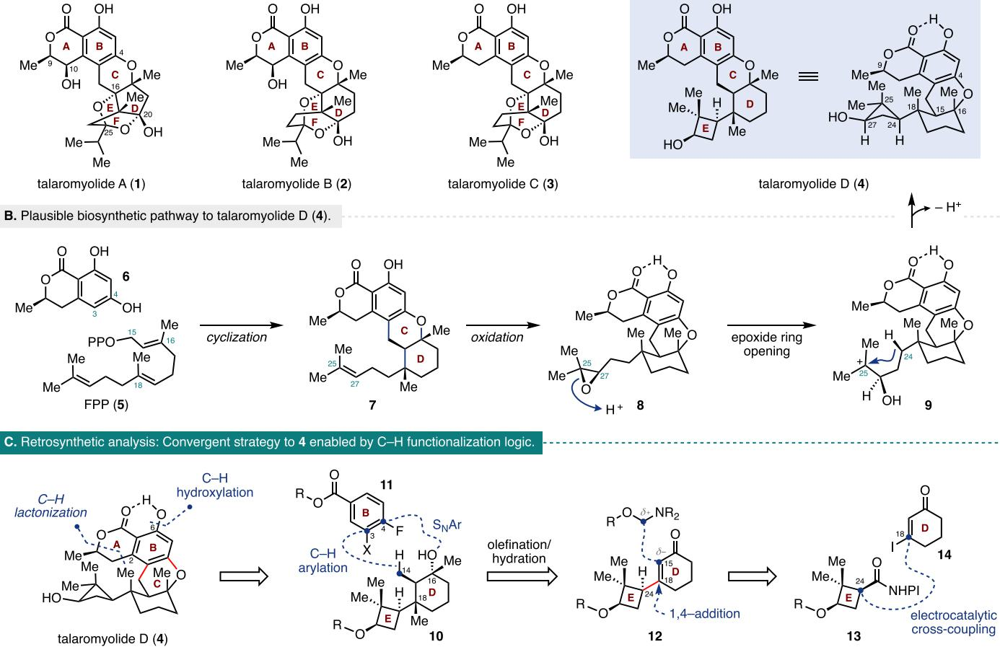
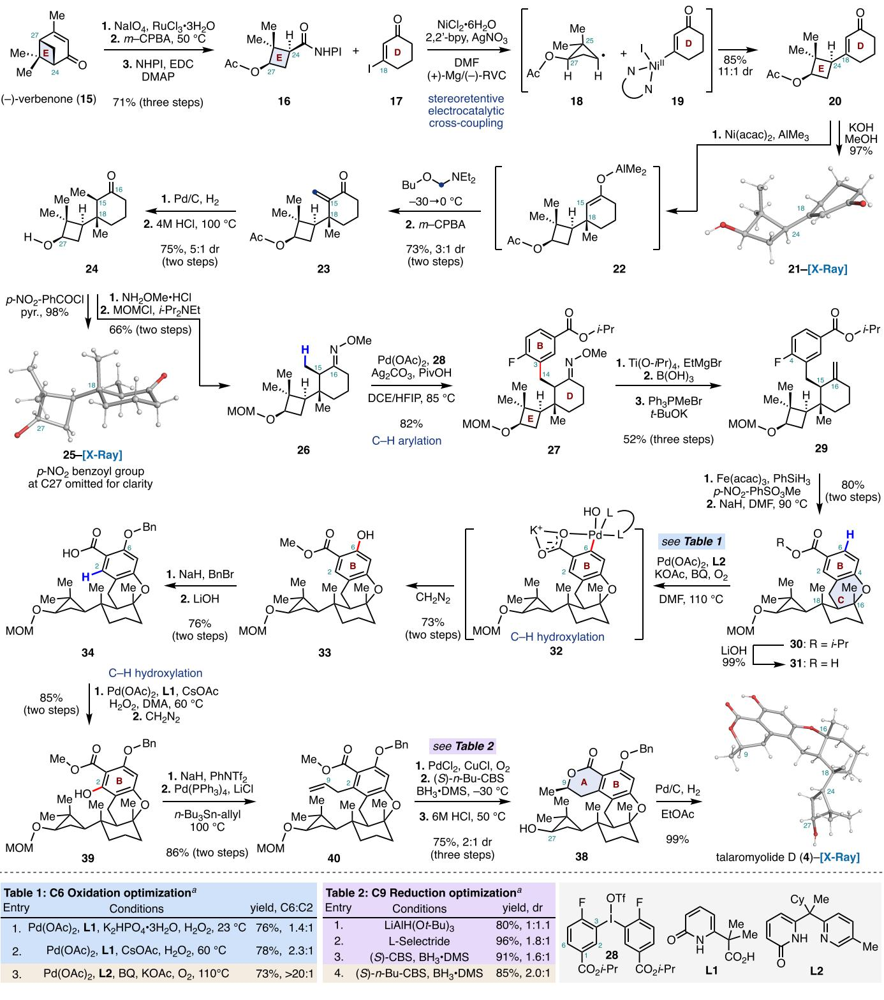

# Total Synthesis of the Nominal Structure of $( + )$ -Talaromyolide D

Bo Qin, Alex Szyperek, and Martin Tomanik\*

Cite This: J. Am. Chem. Soc.2025,147, 31221-31227

# ACCESS I

ll Metrics & More 圖Article Recommendations

ABSTRACT: We describe a convergent and stereoselective total synthesis of the nominal structure of $\left( + \right)$ -talaromyolide D (4)，a recently isolated secondary metabolite. This meroterpenoid features a unique pentacyclic skeleton distinguished by a fused 6/ $6 / 6$ dihydroisocoumarin core and an unusual pendant dimethylcyclobutanol embedded within a sequence of four contiguous stereocenters. Our synthetic strategy was enabled by a stereoretentive, nickel-catalyzed electrochemical $\mathsf { s p } ^ { 2 } \mathrm { - } \mathsf { s p } ^ { 3 }$ decarboxylative cross-coupling, a two-fold bidirectional stitching sequence comprised of an oxime-directed $\beta { \cdot } C ( \mathsf { s p } ^ { 3 } ) { \ - } \mathrm { H }$ arylation and $\mathrm { S _ { N } A r }$ to establish the central ring system of the target as well as a series of

H C-H_hydroxylation 6 C2 and C6 HO H 2 B E SNAr 3 O C-H arylation X H HMe Me A B Me.. Me 24 14 180 16 HO1 Me Me D Mo E Me H H HO\ electrocatalytic (+)-talaromyolideD cross-coupling (nominal structure)

two late-stage carboxylic-acid-directed $\mathrm { C } ( \mathrm { s p } ^ { 2 } ) \mathrm { - H }$ oxidation reactions to ultimately access the isocoumarin lactone substructure. This asymmetric synthesis provides thefirst accesstothereported structure of talaromyolide D(4). Comparison ofthe spectral data showed thatthe structureofthis natural product hadbeen misasigned,andourstrategy may present anopportunityforfurther structural elucidation of the talaromyolide family isolates.

# INTRODUCTION

The talaromyolide meroterpenoids $\mathrm { A - D }$ (1-4, Figure lA) are a small family of natural products isolated from the marine fungus Talaromyces sp. CXi1 by Wu and co-workers in 2019.1 Structurally, the talaromyolides share a common $6 / 6 / 6$ fused dihydroisocoumarin core and are structurally distinguished by the remaining $\mathrm { D - E }$ ring system. Characterization of the bioactivity of $\mathbf { 1 - 4 }$ determined that talaromyolide D (4) was uniquely active among the family members and displayed antiviral activity against pseudorabies virus (PRV)with a halfmaximal cytotoxic concentration $( \mathrm { C C } _ { 5 0 } )$ of $3 . 3 5 \mu \mathrm { M } . ^ { 1 }$ Notably, talaromyolide D features a rare dimethylcyclobutanol subunit as an equatorial substituent at the C18 position of the D ring, which may contribute to its distinct bioactivity compared to other family members.This substructure is part of a series of four contiguous stereocenters, two of which are quaternary and feature 1,3-diaxial methyl groups locked in a contrathermodynamic orientation. The proposed biosynthesis of 4 is depicted in Figure 1B.1,2 Specifically，a phenyltransferase-mediated electrophilic aromatic substitution between farnesyl diphosphate (FPP,5) and 6-hydroxymellein (6) followed by an acidcatalyzed terpene cyclization was proposed to establish the $\mathrm { C } -$ D ring system and provide the tetracyclic intermediate 7. Oxidation of the pendant C25-C27 alkene residue would provide the epoxide 8,which upon a regioselective epoxide ring-opening may generate the carbocation intermediate 9. Trapping of carbocation 9 with concomitant loss of a proton was proposed to form the cyclobutane of the target.

The distinctive skeletal features and stereochemical complexity found in talaromyolide D (4） make it an attractive target for chemical synthesis，offering significant value for structural confirmation and further biological evaluation. To date,no synthesis of any talaromyolide family member has been reported. A synthesis of the structurally related chrodrimanin C was recently disclosed by Renata, featuring a $6 \pi$ electrocyclization/aromatization sequence to construct the dihydroisocoumarin subunit.4 From a retrosynthetic perspective，we recognized that talaromyolide D (4）provides an opportunity to apply powerful and simplifying $\mathrm { C - H }$ activation logic to streamline access to this molecule. Such disconnections can greatly simplify the preparation of key synthetic intermediates by leveraging innate functional group handles to modify otherwise unreactive or inaccessible $\mathrm { C - H }$ positions.6 In our retrosynthetic analysis (Figure 1C)，we identified a carboxylic acid residue embedded within the A-ring of the lactone that could serve as a directing handle for two separate $\mathrm { C - H }$ activation steps.In doing so,we could take advantage of the distinct steric environments to differentiate between the two positions and first perform an ortho $\mathrm { { . C { - H } } }$ hydroxylation at the more accessible C6 position, followed by a second ortho$\mathrm { C - H }$ lactonization reaction at the C2 position of compound 4. Disconnecting the C-ring at the $_ { \mathrm { C 3 - C 1 4 } }$ bond and the ${ \mathrm { C } } 4 { - } \mathrm { O }$ bond maximizes the convergence of the route and reveals bifunctional fragments 10 and 11, which could be sequentially stitched together via a $\beta { \cdot } \mathbf { C } ( \mathsf { s p } ^ { 3 } ) { \ - } \mathbf { H }$ arylation and an intramolecular $\mathrm { S _ { N } A r }$ cyclization strategy. The fragment 10 possessing four contiguous stereocenters could be accessed from the $\mathrm { E - D }$ bicycle12 via a series of carefully orchestrated transformations that include an olefination-hydration sequence and a tandem 1,4-addition and enolate trapping. Importantly,we recognized that the critical $_ { \mathrm { C 1 8 - C 2 4 } }$ bond joining the E and $\mathrm { D }$ ring system could be formed via a nickelcatalyzed electrochemical decarboxylative $\mathsf { s p } ^ { 2 } \mathrm { - } \mathsf { s p } ^ { 3 }$ crosscoupling between the redox-active ester located on the cyclobutane ring of 13 and $\beta$ -iodoenone 14. The stereochemical outcome of this radical coupling could potentialy be derived from the conformational bias of the cyclobutane ring.

  
Figure 1. (A) Structures of talaromyolides A-D (1-4). (B) Plausible biosynthesis of 4.(C) Retrosynthetic analysis of 4.

# RESULTS AND DISCUSSION

The synthesis of talaromyolide D (4） began with the preparation of the cis-substituted cyclobutane fragment 16. This fragment was prepared in three steps on a decagram scale from $( - )$ -verbenone (15) (Scheme 1). Oxidative cleavageof the alkene residue (ruthenium trichloride,sodium periodate) and subsequent treatment of the unpurified reaction mixture with meta-chloroperoxybenzoic acid （ $m$ -CPBA）provided the expected C27 Baeyer-Villiger oxidation product (not shown). The resulting C24 carboxylic residue was then converted to the redox-active $N .$ -hydroxyphthalimide (NHPI） ester 16by coupling with $N$ -hydroxyphthalimide mediated by l-ethyl-3- (3-(dimethylamino)propyl)carbodiimide (EDC; $7 1 \%$ from

15).With ample quantities of fragment 16，we next investigated the key cross-coupling between 16 and vinyl iodide 17. To this end, we found that Baran's nickel catalyzed decarboxylative electrochemical cross-coupling enabled by silver nanoparticle-modified electrodes provided the desired $\mathrm { E - D }$ bicycle 20 in $8 5 \%$ yield and in 11:1 dr at the C24 position. The stereochemistry of the cross-coupled product was established by conversion of 20 to the crystalline alcohol 21 (potassium hydroxide，methanol, $9 7 \%$ .This $\mathsf { s p } ^ { 2 } \mathrm { - } \mathsf { s p } ^ { 3 }$ radical cross-coupling reaction takes place in the absence of any chiral ligands at the nickel center and delivers the desired coupled product with excellent stereocontrol. We hypothesize that the high level of stereocontrol observed during the coupling reflects the favorable conformation of the cyclobutane radical，as depicted in structure 18. This conformation minimizes nonbonding interactions between the acetate and the C25 methyl group while maximizing overlap between the radical SOMO and the adjacent $\mathrm { C - C }$ bond. Recent work by Diao and co-workers demonstrated that the binding of a secondary radical to a nickel $( \mathrm { I I } ) -$ aryl species isa relatively slow process $\left( k = 1 0 ^ { 6 } \mathrm { ~ M ~ } ^ { - 1 } \mathrm { ~ s ~ } ^ { - 1 } \right)$ and is also sensitive to the steric environment surrounding the nickel catalyst.10 This implies that free radical racemization (picosecond time scale) should outcompete nickel-mediated radical capture in the absence of any substrate-conferred stability.1l To verify our hypothesis，we prepared redox-active ester 16 and its C24- epimer as a 1:1.4 mixture via an alternative ring contraction strategy (see Supporting Information). Exposure of this aYields were determined by $\mathrm { ^ { 1 } H  N M R }$ analysis using $\mathrm { C H } _ { 2 } \mathrm { B r } _ { 2 }$ as an internal standard.

  
Scheme 1. Total Synthesis of the Nominal Structure of $\left( + \right)$ -Talaromyolide D (4)

mixture of diastereomers to the standard reaction conditions provided the $\mathrm { E - D }$ bicycle 20 in $8 3 \%$ yield with an identical 11:1 dr at C24 (Scheme 2A).This result indicates that the secondary radical 18 preferentially reacts via the more accessible convex face of the $\operatorname { N i } ( \operatorname { I I } )$ species 19, through either a stereoretentive stepwise or concerted inner-sphere mechanismtodeliverthedesiredenone20.210Thisfour-step sequence provides expedient access to the $\mathrm { E - D }$ rings systems of 4 in three steps and $6 0 \%$ overall yield from commercial reagents.

The bicycle 20 was elaborated by a three-component protocol starting first with a diastereoselective nickel-catalyzed conjugate addition of trimethylaluminum to the sterically hindered C18 position of the $\alpha { , } \beta$ -unsaturated ketone ( $2 0 $ 22).13 In situ trapping of the resulting aluminum enolate 22 with $N .$ (methoxymethyl)-diethylamine,14 followed by oxida

A 2.2byANO Me NHPHI + D ACM D   
Ac E 24 (+)-MDM-)-RVC 16/C24-epi-16 17 $8 3 \%$ ,11:1 dr 20 1:1.4 dr   
B 0 0-Bn 0-Bn HO Me 35 。 2 B Pd(OAc)2 Me A B Me HMe Meo Ac-t-Leu-OH Me Me Meo Me KOAc, HFIP Me   
MOM MOM 34 36 90% then,EtNH (COCI）2 0 0-Bn 0 0-Bn N en5 MeM M Me 2.2M HCI,80°C Me / HO 27   
MOM $8 \%$ 37 (two steps) 38   
C. O OH + AE=>4 ppm OH C · AE = 0-4 ppm A B A B C 22 22 H H D 25 E 24 23 synth. E HO7 NOE HO Synthetic 4 vs Isolated Sample Synthetic 4 vs Calculated Shifts RMSD=3.5ppm RMSD=2.1ppm

aRoot-mean-square deviation (RMSD).

tive elimination of tertiary diethyl amine group （ $m$ -CPBA) provided the exocyclic $\alpha { , } \beta$ -unsaturated ketone 23 in $7 3 \%$ yield as a 3:1 ratio of diastereomers at the C18 position $\mathrm { ^ { \circ } H \ N M R }$ analysis).The configuration of the newly formed stereocenter was established by X-ray analysis of benzoate 25 (vide infra). Efforts to improve the stereoselectivity by using copper salts and chiral phosphoramidite ligands were ineffective (see the Supporting Information). Fortunately， the diastereomeric mixture was separated by flash-column chromatography on preparative scales.Reduction of the alkene residue (palladium on carbon,dihydrogen） and exposure of the reaction mixture to hydrogen chloride at elevated temperatures $( 1 0 0 ~ ^ { \circ } \mathrm { C } )$ provided the cis-dimethyl ketone 24 with S:1 diastereoselectivity at the C15 position in $7 5 \%$ yield ( $\mathrm { \mathrm { ~ } ^ { \prime } \mathrm { { H } \ N M R } }$ analysis). Notably,the acidic treatment was critical to achieve high levels of diastereoselectivity,as upon enolization of the $\alpha$ proton the reprotonation occurs so that the C15 methyl group is oriented anti to the steric bulk of the cyclobutane moiety. The stereochemistry of 24 was confrmed by acylation of the C27 alcohol residue with para-nitrobenzoyl chloride,which provided the crystalline 25 with the desired cis-dimethyl groups.

The next stages of our synthesis focused on the formation of the central C-ring of talaromyolide D (4).We envisioned achieving this via a bidirectional stitching of an aromatic subunit to bicycle 24 at C14 and C16. To this end, condensation of O-methylhydroxylamine with the C15 carbonyl and protection of the C27 alcohol (methoxymethyl chloride, Hiinig's base）delivered the oxime ether 26 in $6 6 \%$ yield over two steps. The aromatic group was then introduced to our substrate via efficient $\mathrm { C } ( \mathrm { s p } ^ { 3 } ) \mathrm { - } \hat { \mathrm { H } }$ arylation of the C15 methyl group directed by the proximal oxime ether group. 5 Specifically,exposure of 26 to diaryliodonium salt 28 in the presence of palladium acetate，silver carbonate，and substoichiometric amounts of pivalic acid smoothly delivered the $\beta$ -arylated product 27 in $8 2 \%$ yield.

We next attmpted to remove the oxime ether directing group under acidic conditions，but this resulted in the unwanted epimerization of the stereochemistry at the C15 position.Similarly，efforts to perform selective oxidative cleavage of the oxime ether with photoexcited nitroarenes or with ozone were inefficient (see the Supporting Information).16 To overcome this,we employed low-valent titanium (titanium isopropoxide,ethylmagnesium bromide） to reductively cleave the $_ { \mathrm { { N - O } } }$ bond of the oxime ether and furnish the corresponding imine,which could be hydrolyzed to the desired ketone by the addition of boric acid.17 Subsequent Witig olefination (potassium tert-butoxide,methyl triphenylphosphonium bromide）delivered the expected alkene product 29 $( 5 2 \% )$ ，three steps). Next, a two-step sequence comprising a diastereoselective iron-catalyzed Mukaiyama-type alkene hydration1& and intramolecular $\mathrm { S } _ { \mathrm { N } } \mathrm { A r }$ (sodium hydride）of the generated tertiary alcohol with the pendant aryl-fluoride constructed the C-ring of the target and provided the tetracycle 30 in $8 0 \%$ yield over two steps.The Mukaiyama hydration provided the desired C16 tertiary alcohol asa single detectable diastereomer ( $^ { 1 } \mathrm { H }$ NMR analysis） and the diastereoselectivity was determined by strong NOE correlations between the C16 and C18 methyl groups in the annulated product 31.

Having completed four of the five rings present in talaromyolide D，our efforts focused on 2-fold $\mathrm { C - H }$ functionalization of the aromatic B ring of 30. To this end, we first hydrolyzed the iso-propyl ester to reveal the corresponding carboxylic acid residue，which we envisioned could direct $\mathrm { { \dot { C } } { - } H }$ activation preferentially at the less hindered C6 position, followed by a second $\mathrm { C - H }$ activation reaction at the more sterically hindered ortho-C2 site to systematically functionalize the B-ring. Our initial attempts to affect a palladium catalyzed $\mathrm { C - H }$ hydroxylation at the C6 position focused on employing hydrogen peroxide as the “oxygen” source in combination with Yu's CarboxPyridone ligand L1 (Table 1, Entry 1 and 2).19 While these conditions were able tosuccessfully oxidize our aromatic ring， the selectivity between the two ortho-positions was only modest， favoring the desired C6 oxidation. However，employing molecular oxygen along with the tautomeric pyridine-pyridone ligand L2 and 1,4-benzoquinone at elevated reaction temperate furnished the desired C6 hydroxylated methyl ester 33 after treatment with diazomethane as the C6 exclusive regioisomer in $7 3 \%$ yield.20 Elaboration of 33 via protection of the phenol residue (sodium hydride,benzyl bromide)and hydrolysis of the ester gave acid 34 ( $7 6 \%$ over two steps).We then envisioned constructing the final lactone ring of 4 via a C-H alkylationlactonization sequence (Scheme 2B).21 However, our attempts to perform a palladium-catalyzed alkylation at the C2 position with epoxide 35 were unsuccessful. In all cases,the reaction only returned unreacted starting material or we observed decomposition of 34 at elevated reaction temperatures.A strategy based on directed lithiation was also explored but this approach delivered only_limited quantities of the desired lactone 38 (Scheme 2B).22

To address this difficult challenge of introducing the desired carbon-carbon bond at the C2 position, we pursued a crosscoupling-based approach (Scheme 1).First, we performed a second $\mathrm { C - H }$ hydroxylation to arrive at the C2 hydroxylated species 39 $( 8 5 \% )$ .19 This was followed by a triflation (sodium hydride and phenyl triflimide） and a Stille cross-coupling with allyltributylstannane to provide the C2 allyl product 40 in $8 6 \%$ yield over two steps.Wacker-Tsuji oxidation (palladium dichloride,copper(I) chloride,oxygen） delivered a C9 methyl ketone (not shown)，which was reduced to the requisite secondary alcohol with 2:1 diastereoselectivity ( $^ \mathrm { { \Delta ^ { - 1 } H } }$ NMR analysis） utilizing a Corey-Bakshi-Shibata reduction ((S)-2- butyl-CBS-oxazaborolidine, borane dimethyl sulfide, 2:i dr at C9).23 Notably，while performing this reduction，we first identified that bulky hydride-reducing agents $\left( \mathrm { L i A l H } ( \mathbf { O } t \mathbf { - B u } ) _ { 3 } \right.$ orL-selectride） favored the desired secondary alcohol diastereomer (Scheme 1, Table 2). In our attempts to improve the diastereoselectivity， we sought to explore a reagentcontrolled reductions with CBS catalysts.

As seen in Table 2，we found that the larger 2-butyl containing oxazaborolidine provided improved selectivity.As the secondary alcohol product was found to undergo a partial translactonization, the unpurified reaction mixture was directly treated with hydrogen chloride to complete the formation of the lactone ring and simultaneously remove the C27 methoxymethyl ether， providing the lactone 38（ $7 5 \%$ over three steps). Finally, cleavage of the benzyl protecting group (palladium on carbon and dihydrogen） delivered synthetic talaromyolide D （4）in $9 9 \%$ yield. X-ray crystallographic analysis of 4 served to confirm its structure as well as all of the established stereoselectivity.

Surprisingly, NMR spectroscopic data of synthetic 4 were not in agreement with the reported spectrum for the isolated sample (see the Supporting Information). Close inspection of the $\mathrm { \hat { \Delta } } ^ { 1 3 } \mathrm { C }$ NMR spectra identified a total of five carbons with large discrepancies (absolute error $\mathrm { { ( A E ) = > 4 \ p p m , } }$ Scheme 2C).The chemical shifts in_question are proximal to one another and are located around or as part of the cyclobutane Ering.Additionally,our synthetic sample,as expected, displayed strong NOE correlations between the two diaxial methyl substituents at C16 and C18 that are noticeably absent in the reported ROESY experiment performed on the isolated sample. This data strongly suggest that one or more stereocenters in the isolated sample are misassigned.We attempted to investigate the stereochemical asignment using the NMR calculation protocol reported by Hehre.24 First, we calculated the $^ { 1 3 } \mathrm { C }$ chemical shifts for the reported structure and compared it with our synthetic sample (Scheme 2C).We found that all shifts are in good agreement with a root-meansquare deviation (RMSD） of $2 . 1 \ \mathrm { p p m }$ except fora sole- $\mathrm { C H } _ { 3 }$ carbon with A $\mathrm { E } > 4 ~ \mathrm { p p m }$ . Next,we evaluated a total of 33 structures by systematically altering one stereocenter at a time around the $\mathrm { D - E }$ ring system in hopes of identifying a stereochemical arrangement that would be in good agreement with the reported spectrum (see the Supporting Information).

However, in all cases, there were five or more discrepancies (absolute error ${ \tt > } 4 { \tt \ p p m } ,$ ）between the calculated and reported $\mathrm { } ^ { 1 3 } \mathrm { C }$ NMR spectra. While this method ispowerful for supporting bond connectivity assignments,the subtle diferences in NMR shifts typically exhibited by diastereomers limits the ability to make definitive stereochemical assignments.25 Nevertheless, the numerous large deviations observed in our calculations suggest that multiple stereocenters may be misassigned and that further revisions to the proposed bond connectivity may be necessary to correctly identify the structure of the isolated compound.

# CONCLUSION

In summary,we have described the first synthetic route to the nominal structure of pentacyclic meroterpenoid talaromyolide D (4). Key features of our convergent synthetic strategy include three palladium-catalyzed $\mathrm { C - H }$ activation reactions,a stereoretentive nickel-catalyzed electrochemical decarboxylative cross-coupling,a highly diastereoselective iron-catalyzed Mukaiyama-type alkene hydration,and an intramolecular Oarylation via an $\mathrm { S } _ { \mathrm { N } } \mathrm { A r }$ reaction to construct the central ring system. Spectroscopic data revealed that the structure of this natural product had been misassigned during isolation,and our $^ { 1 3 } \mathrm { C }$ NMR calculations suggest that a substantial revision of the proposed structures may be necessary to determine the correct structure of the talaromyolide D isolate.

# ASSOCIATED CONTENT

# $\bullet$ Supporting Information

The Supporting Information is available free of charge at https://pubs.acs.org/doi/10.1021/jacs.5c10325.

General information, experimental procedures, substrate structures; characterization of substrates and products; crystallographic analysis of 21,25 and 4; catalogue of $^ 1 \mathrm { H }$ NMR and $^ { 1 3 } \mathrm { C }$ NMR spectra (PDF)

# Accession Codes

Deposition Numbers 2450768-2450770 contain the supplementary crystallographic data for this paper. These data can be obtained free of charge via the joint Cambridge Crystallographic Data Centre (CCDC）and Fachinformationszentrum Karlsruhe Access Structures service.

# AUTHOR INFORMATION

Corresponding Author Martin Tomanik - Department of Chemistry,New York University,New York, New York 10003,United States; $\circledcirc$ orcid.org/0000-0003-0285-9663; Email: martin.tomanik@nyu.edu

Authors Bo Qin - Department of Chemistry，New York University, New York,New York 10003,United States Alex Szyperek -Department of Chemistry,New York University,New York,New York 10003,United States

Complete contact information is available at: https://pubs.acs.0rg/10.1021/jacs.5c10325

# Author Contributions

The manuscript was written through contributions of all authors.All authors have given approval to the final version of the manuscript.

# Notes

The authors declare no competing financial interest.

# ACKNOWLEDGMENTS

Financial support from New York University is gratefully acknowledged.We acknowledge A. Shtukenberg (NYU) for Xray analysis.

# REFERENCES

(1）Cao，X.；Shi,Y.；Wu, X.；Wang, K.；Huang,S.； Sun，H.; Dickschat,J. S.；Wu，B. Talaromyolides A-D and Talaromytin: Polycyclic Meroterpenoids from the Fungus Talaromyces sp. CX11. Org.Lett.2019,21, 6539-6542.   
(2) Awakawa, T.Biosynthesis of unique natural product scafflds by Fe(II)/aKG-dependent oxygenases. J Nat. Med. 2025,79,303-313. (3)(a） Matsuda,Y.; Abe, I. Biosynthesis of fungal meroterpenoids. Natural Product Reports 2016,33,26-53. (b) Bai, T.; Quan,Z.; Zhai, R.；Awakawa, T.; Matsuda, Y.; Abe,I. Elucidation and Heterologous Reconstitution of Chrodrimanin B Biosynthesis. Org. Lett 2018, 20, 7504-7508.   
(4)Li, F.; Renata, H.A Chiral-Pool-Based Strategy to Access transsyn-Fused Drimane Meroterpenoids: Chemoenzymatic Total Syntheses of Polysin,N-Acetyl-polyveoline and the Chrodrimanins. J.Am. Chem. Soc.2021,143,18280-18286.   
(S）(a) Gutekunst, W.R; Baran, P.S. C-H functionalization logic in total synthesis.Chem. Soc.Rev.2011,40,1976-1991. (b) Lam, N. Y. S.; Wu,K.; Yu, J.-Q. Advancing the Logic of Chemical Synthesis: $\mathrm { C - H }$ Activation as Strategic and Tactical Disconnections for ${ \mathrm { C } } { \mathrm { - } } { \mathrm { C } }$ Bond Construction. Angew. Chem., Int.Ed. 2021,60,15767-15790. (c) Zhang, Y.； Szostak,M. Synthesis of Natural Products by C-H Functionalization of Heterocycless.Chem.- Eur. J.2022，28, No.e202104278.(d) Bakanas,I.； Lusi, R.F.；Wiesler, S.；Hayward Cooke,J.； Sarpong，R. Strategic application of $\mathrm { C - H }$ oxidation in natural product total synthesis.Nat. Rev. Chem. 2023,7,783-799. (6) (a) Gutekunst,W.R.; Baran, P.S.Total Synthesis and Structural Revision of the Piperarborenines via Sequential Cyclobutane $\mathrm { C - H }$ Arylation.J.Am.Chem. Soc.2011,133,19076-19079.(b) Ting, C. P.；Maimone，T.J.C-H Bond Arylation in the Synthesis of Aryltetralin Lignans:A Short Total Synthesis of Podophyllotoxin. Angew.Chem.,Int.Ed.2014,S3,3115-3119.(c) Wang,Y.; Chen,B.; He,X.；Gui,J.Bioinspired Synthesis of Nortriterpenoid Propindilactone G.J. Am. Chem. Soc. 2020,142,5007-5012.(d) Bosse,A. T.; Hunt,L.R; Suarez, C.A.; Casselman, T.D.; Goldstein,E.L.; Wright, A. C.; Park,H.;Virgil,S.C.; Yu,J. $\mathbf { \nabla } \cdot \mathbf { Q } . \mathbf { j }$ Stoltz, B. M.; Davies, H. M. L. Total synthesis of $( - )$ -cylindrocyclophane A facilitated by C-H functionalization. Science 2024,386,641-646.(e) Jin,Y.；Hok,S.; Bacsa，J.；DaiM. Convergent and Effcient Total Synthesisof $\left( + \right)$ -Heilonine Enabled by C-HFunctionalizations.J.Am. Chem. Soc. 2024,146, 1825-1831.   
(7)(a) Tercio,J.; Ferreira,B.; Cruz,W. O.; Vieira,P.C.; Yonashiro, M.Carbon-carbon double bond cleavage using solid-supported potassium permanaganate on silica_ gel. J. Org. Chem. 1987， 52, 3698-3699.(b）Passaro，L.C.；Webster，F.X.Synthesis of the Female Sex Pheromone of the Citrus Mealybug, Planococcus citri. J. Agric.Fo0d Chem. 2004,52,2896-2899.   
(8) Harwood,S.J; Pakowitz,M.D.; Gannet, C.N.; Perez,P.; Yao Z.； Sun,L.； Abruna,H.D.；Anderson, S.L.； Baran, P. S.Modular terpene synthesis enabled by mild electrochemical couplings. Science 2022, 375, 745-752.   
(9)(a) Cremer,D.Ab initio calculations of the equilibrium structure of cyclobutane.J. Am. Chem.Soc.1977，99，1307-1309. (b) Glendening,E.D.；Halpern，A.M. Ab Initio Studyof Cyclobutane:Molecular Structure，Ring-Puckering Potential，and Origin of the Inversion Barrier.J.Phys. Chem.A 2005,109,635-642. (c) Ouelltte，R J.；Rawn, J.D.4 - Alkanes and Cycloalkanes: Structures and Reactions. Organic Chemistry 2018,87-133. Mechanism. J. Am. Chem. Soc.2025, 147, 19632-19642.   
(11) (a) Johnston,L.J.; Ingold,K. U.Kinetics of cyclopropylradical reactions. 2. Studies on the inversion of cyclopropyl and 1- methylcyclopropyl radicalsand on the kinetics of some addition and abstraction reactions of 1-methylcyclopropyl and 1-methoxycyclopropyl radicals. J. Am. Chem. Soc. 1986,108,2343-2348. (b)Al Zubaydi, S.；Waske, S.；Akyildiz,V.； Starbuck,H.F.； Majumder,M.; Moore,C.E.;Kalni,D;evC.Redctivealkyolig from isolable nickel-alkyl complexes.Nature 2024, 634,585-591. (c) Sun,J.;He,J；MassaroL.; CaganD.A.；Tsien,J.;Wang,Y; Attard,F.C.； Smith,J.E.；Lee,J.S.；Kawamata，Y.；Baran, P.S. Stereoretentive radical cross-coupling. Nature 2025, 642, 85-91. (12) Lin, $\mathrm { Q . } ;$ Spielvogel,E.H.；Diao,T. Carbon-centeredradical capture at nickel(I1） complexes: Spectroscopic evidence, rates， and selectivity. Chem.2023,9,1295-1308.   
(13)Flemming, S.; Kabbara,J.; Nickisch, K.; Neh, H.; Westermann, J.Nickel-Catalysed Conjugate Addition of Trimethylaluminum to Sterically Hindered $\alpha { , } \beta$ Unsaturated Ketones.Synthesis 1995,1995, 317-320.   
(14）Bleschke，C.；Tissot，M.；Müller，D.；Alexakis，A.Direct Trapping of Sterically Encumbered Aluminum Enolates. Org. Lett. 2013,15,2152-2155.   
(15) Peng,J,; Chen,C.； Xi, C. $\beta$ Arylation of oxime ethers using diaryliodonium salts through activation of inert $\mathrm { C } ( \mathsf { s p } ^ { 3 } ) \mathrm { - H }$ bonds using a palladium catalyst. Chem. Sci. 2016,7, 1383-1387.   
(16) Gotemann, L. T.; Wiesler, S.; Sarpong, R. Oxidative cleavage of ketoximes to ketones using photoexcited nitroarenes. Chem. Sci. 2023,15,213-219.   
(17)(a)CoreyE.J;NmuraK.；KonishiY.；HashotoS; Hamada, Y. A new synthetic route to prostaglandins. Tetrahedron Lett. 1986，27，2199-2202.(b） Churykau，D.H.；Zinovich，V.G.; Kulinkovich, O.G.A Convenient and Chemoselective Method for the Reductive Ring Cleavage of Isoxazoles and Isoxazolines with EtMgBr/ $\mathrm { T i } ( \mathrm { O } i { \mathrm { - } } \mathrm { P r } ) _ { 4 }$ Reagent.Synlett 2004,2004,1949-1952.   
(18）Bhunia,A.；Bergander，K.；Daniliuc,C.G.； Studer，A.FeCatalyzed Anaerobic Mukaiyama-Type Hydrationof Alkenes using Nitroarenes.Angew.Chem., Int.Ed.2021, 60,8313-8320.   
(19)Li, Z.; Park,H. S.; Qiao, J. X.; Yeung,K.-S.; Yu, $\operatorname { J . - Q . }$ LigandEnabled $\mathrm { C - H }$ Hydroxylation with Aqueous $\mathrm { H } _ { 2 } \mathrm { O } _ { 2 }$ at Room Temperature.J.Am. Chem. Soc. 2022,144, 18109-18116.   
(20) Li, Z.; Wang,Z.; Chekshin,N.; Qian,S.; Qiao,J. X; Cheng,P. T.; Yeung,K.-S.; Ewing,W.R.; Yu,J.-Q.A tautomeric ligand enables directed C-H hydroxylation with molecular oxygen. Science 2021, 372, 1452-1457.   
(21) ChengG.; Li,T.-J.; Yu,J-QPractical $\operatorname { P d } ( \operatorname { I I } )$ -Catalyzed $\mathrm { C - H }$ Alkylation with Epoxides: One-Step Syntheses of 3,4-Dihydroisocoumarins.J.Am.Chem. Soc.2015,137, 10950-10953.   
(22）(a） Shankaran，K.；Snieckus，V.Directed ortho metalationinduced epoxy cyclialkylation.Regiospecific 5-exo-tet and 6-exo-tet routes to benzofurans and -pyrans. J. Org. Chem. 1984,49,5022- 5023.(b) Tanoue,Y.; Terada,A.A Formation of a Fusarubin Carbon Skeleton.Bull.Chem.Soc.Jpn.1992, 65,2854-2856.(c) Clayden, J; Stimson，C.C.；Helliwell，M.；Keenan，M.Addition of Lithiated Tertiary Aromatic Amides to Epoxides and Aziridines:Asymmetric Synthesis of (S) $^ { ( + ) }$ -Mellein. Synlett 2006,2006,873-876.   
(23） Corey,E.J.；Helal, C.J. Reduction of Carbonyl Compounds with Chiral Oxazaborolidine Catalysts: A New Paradigm for Enantioselective Catalysis and a Powerful New Synthetic Method. Angew. Chem.,Int.Ed.1998,37,1986-2012.   
(24）Hehre，W.；Klunzinger，P.；Deppmeier，B.；Driessen，A.; Uchida,N.;Hashimoto,M.; Fukushi,E.; Takata,Y.EfficientProtocol for Accurately Calculating $^ { 1 3 } \mathrm { C }$ Chemical Shifts of Conformationally Flexible Natural Products: Scope,Assessment,and Limitations.J Nat. Prod. 2019,82,2299-2306.   
(25)Lodewyk,M.W.; Siebert,M.R.; Tantillo,D.J. Computational Dendictian nf $^ 1 \mathrm { H }$ $^ { 1 3 } \mathrm { C }$ Chomical Chift. A IInafl Taal f Na1 Product,Mechanistic,and Synthetic Organic Chemistry. Chem. Rev.   
2012,112, 1839-1862.

CASBIOFINDERDISCOVERY PLATFORMTM

# PRECISION DATA FOR FASTER DRUG DISCOVERY

CAS BioFinder helps you identify targets,ksd

Unlock insights